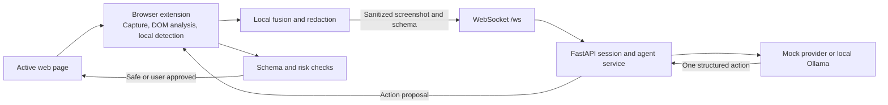

# AEGIS

AEGIS is a Chromium browser agent that helps you complete multi-step web tasks while reducing exposure of personal data.
It analyzes and sanitizes page context in the extension before sending it to a reasoning service, then validates proposed browser actions before execution.

## Features

- Capture the active tab and extract page structure for agent reasoning.
- Detect sensitive content with DOM rules, text pattern checks, visual signals, and face detection.
- Redact page context locally before transmitting it to the backend.
- Run the reasoning backend with a deterministic mock provider or a local Ollama vision-language model.
- Limit model output to a defined set of browser actions and apply client-side risk checks.
- Pause for user confirmation when an action needs approval.
- Inspect privacy-safe session metadata through read-only server endpoints.

## Tech stack

- TypeScript, pnpm workspaces, and Vite build the shared packages and Manifest V3 extension.
- Chrome Extension APIs provide tab capture, the background service worker, offscreen processing, and page interaction.
- ONNX Runtime Web and MediaPipe support local visual processing in the extension.
- Python 3.11+, FastAPI, Pydantic, and Uvicorn implement the WebSocket backend and HTTP status views.
- Ollama provides optional local vision-language inference. The mock provider supports development without a model.
- Vitest, pytest, and Playwright cover package, server, and browser flows.

## Architecture



The extension is the privacy boundary. The backend receives sanitized context and returns an action proposal. The extension checks that proposal and performs approved actions on the live page.

## Project structure

```text
extension/       Manifest V3 extension, popup, capture, sanitization, and execution
packages/core/   Detection, fusion, sanitization, and risk logic
packages/protocol/ Shared client/server message schemas
packages/shared/ Common constants and logging helpers
server/          FastAPI WebSocket service, sessions, providers, and audit views
eval/            Evaluation harness and wire-tap analysis tools
ml/              Model training, dataset generation, benchmarking, and ONNX export
scripts/         Verification and runtime check scripts
fixtures/        Test and demo page fixtures
scratch/         Experimental prompt optimization script
tests/           Browser end-to-end tests
docs/            Product, architecture, protocol, security, and evaluation specs
demo/            Local Ollama launch, preflight, and reset scripts
```

## Installation and setup

### Prerequisites

- Node.js 20 or newer and pnpm 9 or newer.
- Python 3.11 or newer.
- Chrome or Edge with Manifest V3 support.
- Optional: Ollama with a vision-language model such as `qwen3-vl:4b` pulled locally.

Install JavaScript dependencies from the repository root:

```powershell
corepack enable
pnpm install
pnpm build
```

The commands below use PowerShell. For Linux or macOS, use these backend setup commands instead:

```bash
python3 -m venv .venv
source .venv/bin/activate
python -m pip install -e ".[dev]"
VLM_PROVIDER=mock python -m uvicorn aegis_server.main:app --app-dir server --host 127.0.0.1 --port 8765
```

Set up and start the Python service in a second terminal:

```powershell
py -3.11 -m venv .venv
.\.venv\Scripts\Activate.ps1
python -m pip install -e ".[dev]"
$env:VLM_PROVIDER = "mock"
python -m uvicorn aegis_server.main:app --app-dir server --host 127.0.0.1 --port 8765
```

`pyproject.toml` defines the server package and development dependencies. The root `requirements.txt` is a pinned dependency snapshot, including additional ML runtime packages. Use the editable install above for server development.

The mock provider is the default and needs no model or API key. For local Ollama inference, start Ollama and set these variables before starting Uvicorn:

```powershell
$env:VLM_PROVIDER = "ollama"
$env:OLLAMA_BASE_URL = "http://127.0.0.1:11434"
$env:OLLAMA_MODEL = "qwen3-vl:4b"
```

`OLLAMA_BASE_URL`, `OLLAMA_MODEL`, and `OLLAMA_TIMEOUT_SECONDS` configure the Ollama provider. `AEGIS_AUTH_TOKEN` optionally enables token checking for WebSocket connections. Without it, the service skips authentication, so keep the service bound to localhost for development. The cloud provider is a stub and does not implement remote inference.

Download the configured model once before starting the backend:

```sh
ollama pull qwen3-vl:4b
```

On Linux or macOS, set the provider variables with `export`, then start Uvicorn from the activated virtual environment:

```sh
export VLM_PROVIDER=ollama
export OLLAMA_BASE_URL=http://127.0.0.1:11434
export OLLAMA_MODEL=qwen3-vl:4b
python -m uvicorn aegis_server.main:app --app-dir server --host 127.0.0.1 --port 8765
```

The extension connects to `ws://127.0.0.1:8765/ws`. Build it, then load `extension/dist` as an unpacked extension from `chrome://extensions` or `edge://extensions`. If the build reports missing model assets, check the assets referenced in `extension/vite.config.ts`; the build copies them when present.

## Usage

1. Start the backend and confirm `http://127.0.0.1:8765/health` returns `{ "status": "ok", ... }`.
2. Load the unpacked extension and open a supported web page in the active tab.
3. Open the AEGIS popup, enter a task goal, and start the agent.
4. Review and approve any action that the risk checks flag for confirmation.
5. Stop or cancel the run from the extension popup.

The mock provider is intended for development and scripted flows. Use Ollama for model-driven task reasoning.

## Screenshots and demo

There are no screenshots or public demo URL in this repository yet. The `demo/` directory contains PowerShell scripts for an Ollama launch and preflight checks. `docs/DEMO_FLOW.md` describes the planned demonstration flow.

## API

The backend exposes a WebSocket protocol and read-only HTTP endpoints. Messages use JSON envelopes with `type`, `timestamp`, `protocol_version` (`1.0`), and `payload` fields. Full message schemas are in [`docs/API_SPEC.md`](docs/API_SPEC.md).

| Method and path | Purpose | Access |
| --- | --- | --- |
| `GET /health` | Returns service status and protocol version. | No authentication |
| `WS /ws?token=<token>` | Starts a session, exchanges sanitized page context, and returns action proposals. | Token checked when `AEGIS_AUTH_TOKEN` is set |
| `GET /view/sessions` | Lists current session summaries. | No authentication |
| `GET /view/sessions/{session_id}` | Returns privacy-safe session details and action history. | No authentication |
| `GET /view/sessions/{session_id}/latest-context` | Returns metadata for the latest sanitized context, without image data. | No authentication |

The WebSocket flow starts with `session_init` and then exchanges `context_update`, `action`, and result or session messages. Proposed action types are `click`, `type`, `scroll`, `select`, `hover`, `wait`, `done`, and `fail`. See [`docs/API_SPEC.md`](docs/API_SPEC.md) for payload fields and examples.

## Engineering decisions

- Keep capture, detection, and redaction in the extension so raw page context stays on the user device before transmission.
- Send both a sanitized screenshot and a sanitized structured page schema. The screenshot preserves visual layout; the schema exposes labels and interactive elements.
- Use a WebSocket for the repeated perception and action loop, while keeping health and session inspection as HTTP endpoints.
- Keep the reasoning provider replaceable. The mock provider simplifies development; Ollama enables local model inference.
- Validate actions and apply risk rules in the extension, where page actions execute.
- Treat this repository as a prototype. The optional token check and unauthenticated inspection routes do not constitute production access control.

## Testing

Run the JavaScript unit suite and browser flows from the repository root:

```powershell
pnpm test
pnpm test:e2e
pnpm typecheck
```

Run the Python server suite after installing the development extras:

```powershell
python -m pytest server/tests server/test_agent.py server/test_generate.py server/test_ollama.py
```

The explicit file paths include three server tests stored outside `server/tests/`. Pytest's configured default test path is `server/tests`, so those files are not included by that default. The repository also includes evaluation tooling under `eval/` and fixture-based end-to-end cases under `tests/e2e/`.

The ML scripts under `ml/` (training, benchmarking, dataset generation, ONNX export) are run independently and are not covered by the test suites above.

## Limitations and next steps

- AEGIS currently targets Chromium browsers and the active tab. It does not handle multi-tab workflows.
- Detection is imperfect. Canvas-rendered text, unusual layouts, and pages designed to evade detection can defeat current checks.
- The cloud provider is only a stub. Remote inference is not implemented.
- The mock provider does not provide general-purpose reasoning.
- Production deployment, hardened authentication, and broader threat testing remain future work.
- Add verified screenshots and measured evaluation results so readers can assess the interface and privacy performance.

## Future Roadmap

The long-term vision for AEGIS goes beyond a single extension to become the foundational safety layer for all browser-based AI agents.

- **Phase 1: Robust Local Inference & Expanded Heuristics**
  - Implement full local vision models via WebGPU.
  - Enhance zero-shot PII detection for varied languages and layouts.
- **Phase 2: Agentic Sandbox Environment**
  - Introduce an isolated runtime execution environment (sandbox) where potentially risky scripts can be simulated.
  - Granular control over form submissions and API calls initiated by the agent.
- **Phase 3: Cross-Tab & Multi-Step Reasoning**
  - Safely pass context across tabs without compromising redaction boundaries.
  - Long-horizon planning with persistent memory safely encrypted on disk.
- **Phase 4: Enterprise Policy Management**
  - Support managed device policies to enforce global redaction lists (e.g. internal IP ranges, proprietary terms).
  - Centralized audit logs for SOC2 compliance.

## Further reading

- [System architecture](docs/SYSTEM_ARCHITECTURE.md)
- [Technical specification](docs/TECHNICAL_SPEC.md)
- [Product requirements](docs/PRD.md)
- [Browser agent specification](docs/BROWSER_AGENT_SPEC.md)
- [API specification](docs/API_SPEC.md)
- [Security and privacy](docs/SECURITY_PRIVACY.md)
- [Database schema](docs/DATABASE_SCHEMA.md)
- [AI/ML pipeline](docs/AI_ML_PIPELINE.md)
- [Evaluation plan](docs/EVALUATION_PLAN.md)
- [Demo flow](docs/DEMO_FLOW.md)
- [Implementation plan](docs/IMPLEMENTATION_PLAN.md)

## Contributing

The repository does not include contribution guidelines yet. If you plan to contribute, open an issue or pull request with a clear description of the change and the checks you ran.

## License

This repository does not include a license file. No reuse or redistribution terms are specified.
