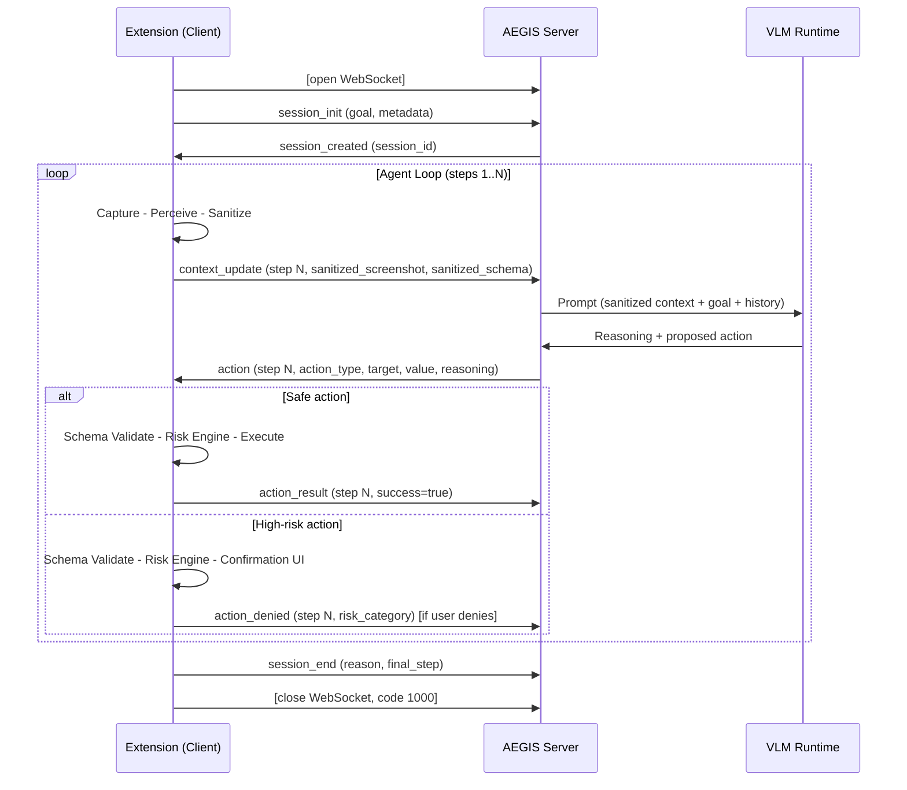
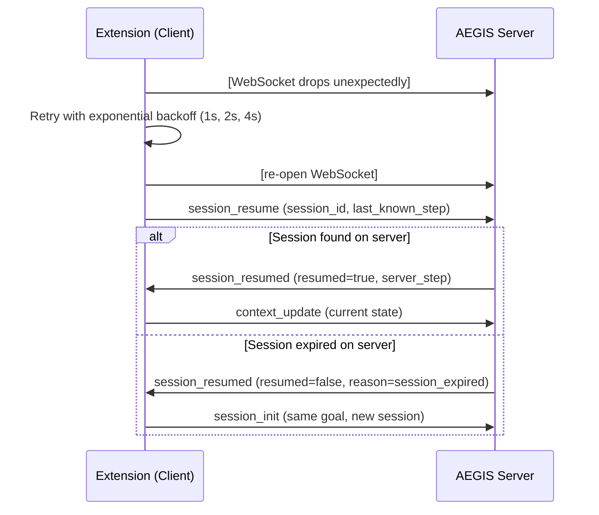
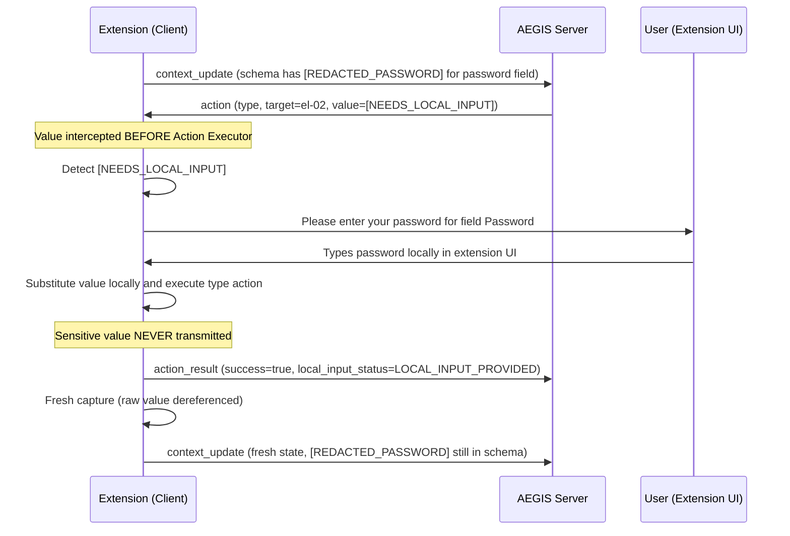

# AEGIS - API Specification

## 1. Document Information

| Field | Value |
|-------|-------|
| Document | API Specification |
| Project | AEGIS - Agentic Engine for Guarded Intelligent Surfing |
| Problem Statement | SIH 2026 - PS 26171 |
| Version | 1.0 |
| Status | Final Draft |
| Last Updated | 2026-09-19 |
| Source Documents | PRD.md v1.1, SYSTEM_ARCHITECTURE.md v1.0, TECHNICAL_SPEC.md v1.0, AI_ML_PIPELINE.md v1.0, SECURITY_PRIVACY.md v1.0, BROWSER_AGENT_SPEC.md v1.0 |
| Intended Audience | Development team, technical reviewers, SIH evaluators |

---

## 2. Document Scope

### 2.1 What This Document Owns

This document is the **authoritative communication contract** for the AEGIS system. It defines:

- The WebSocket transport protocol and connection lifecycle.
- All message types exchanged between the Browser Extension (client) and the AEGIS Server.
- The precise field names, types, constraints, and examples for every message payload.
- The encoding, framing, and size constraints for each payload.
- The privacy boundary contract: which data fields are permitted to cross the network, and which are absolutely prohibited.
- Error and status message schemas.
- Extension-internal message types (popup to background, background to content script).
- Protocol versioning and backward-compatibility strategy.
- Open API decisions that remain unresolved.

### 2.2 What This Document Does NOT Own

| Concern | Owner Document |
|---------|---------------|
| Product requirements, feature scope | PRD.md |
| System-level component architecture, trust boundaries | SYSTEM_ARCHITECTURE.md |
| Module interfaces, runtime lifecycle, execution models | TECHNICAL_SPEC.md |
| ML model selection, inference pipeline, perception accuracy | AI_ML_PIPELINE.md |
| Threat model, privacy invariants, security controls | SECURITY_PRIVACY.md |
| VLM prompt engineering, action vocabulary semantics, risk categories | BROWSER_AGENT_SPEC.md |
| Testing methodology, SIH evaluation metrics | EVALUATION_PLAN.md (planned) |
| SIH demonstration script | DEMO_FLOW.md (planned) |

### 2.3 Authoritative Role

> [!IMPORTANT]
> This document is the single source of truth for field names and wire-level payload schemas.
> TECHNICAL_SPEC.md Section 11 (Sanitized Context Contract) and Section 22 (WebSocket Technical Behavior)
> delegate the authoritative wire-level definition to this document. Any conflict between this document
> and TECHNICAL_SPEC.md on payload field names or types must be resolved by updating this document.

---

## 3. Transport Layer

### 3.1 Protocol

| Property | Value |
|----------|-------|
| **Transport** | WebSocket (RFC 6455) |
| **Security** | WSS (TLS 1.2+) for non-localhost deployments. WS (plain) permitted for localhost-only SIH demo (TECHNICAL_SPEC Section 22, SECURITY_PRIVACY Section TB-03). |
| **Message framing** | Text frames. All messages are UTF-8 encoded JSON strings. The `sanitized_screenshot` field is embedded as a Base64-encoded string within the JSON text frame, not as a raw binary frame. |
| **Direction** | Bidirectional. Client sends context; server sends actions and status. |

### 3.2 WebSocket Endpoint

| Property | Value |
|----------|-------|
| **Default endpoint** | `ws://localhost:8000/ws` (TECHNICAL_SPEC Section 25.1 `server_endpoint` default) |
| **Path** | `/ws` |
| **Protocol upgrade** | Standard HTTP to WebSocket upgrade. |
| **Authentication** | TBD - see Open API Decision OAD-01. Token-based authentication on connection is required by PRD SE-04 but the mechanism is not yet designed. |

> [!WARNING]
> **Open Decision OAD-01:** The client-server authentication mechanism is TBD. PRD SE-04 requires
> authenticated WebSocket connections. The implementation must resolve this before deployment.

### 3.3 Server Identification

| Header | Proposed Value | Status |
|--------|---------------|--------|
| `Sec-WebSocket-Protocol` | `aegis-v1` | PROPOSED |

### 3.4 Connection URL Parameters

No query parameters are defined for the MVP endpoint. All session parameters are exchanged via the `session_init` message after connection.

---

## 4. Privacy Boundary Contract

> [!CAUTION]
> This section defines the hard architectural boundary enforced by every implementation.
> Violation of this contract is a privacy defect, not a configuration choice.

### 4.1 Permitted Outbound Data (Client to Server)

The following are the **only** data types permitted to cross from the client to the server:

| Field | Type | Description |
|-------|------|-------------|
| `sanitized_screenshot` | Base64-encoded image string | Screenshot with all sensitive visual regions visually destroyed (blurred or masked). |
| `sanitized_schema` | JSON object | Structured DOM representation with all PII text replaced by typed placeholders. |
| `goal` | String | User's stated task goal. MUST NOT intentionally contain raw PII, passwords, OTPs, authentication tokens, or other secrets. |
| `step_number` | Integer | Current step index in the agent loop. |
| `session_id` | String | Opaque session identifier. |
| `previous_action_result` | Object | Non-sensitive status of the last executed action. |
| `agent_state` | String | Current agent state (e.g., `"running"`, `"paused"`). |
| `protocol_version` | String | API version identifier (e.g., `"1.0"`). |
| `client_metadata` | Object | Non-sensitive extension metadata (version, browser). |

### 4.2 Absolutely Prohibited Outbound Data

The following data types MUST NEVER appear in any WebSocket message from the client to the server:

| Prohibited Data | Invariant | Notes |
|----------------|-----------|-------|
| Raw screenshots (unredacted bitmap data) | PI-01 | Even as a debug payload. Never under any condition. |
| Raw PII text values (Aadhaar, PAN, card numbers) | PI-02 | Must be replaced by `[REDACTED_*]` placeholders. |
| Passwords or OTPs (as field values or in any string) | PI-02 | Must be replaced by `[REDACTED_PASSWORD]` or `[REDACTED_OTP]`. |
| Face image data (raw pixel regions) | PI-01 | Faces must be blurred/masked in the sanitized screenshot. |
| `[NEEDS_LOCAL_INPUT]` (the control token itself) | BROWSER_AGENT_SPEC Section 6.3 | Resolved locally. Must never appear in a client-to-server WebSocket payload. |
| Actual sensitive values resolved from `[NEEDS_LOCAL_INPUT]` | PI-02 | The resolved value stays on-device. Only `LOCAL_INPUT_PROVIDED` status crosses the boundary. |
| Browser cookies | PI-06 | Not collected, not transmitted. |
| Authentication tokens or session secrets | PI-06 | Not transmitted in any field. |
| Browsing history | PI-06 | Not collected, not transmitted. |
| `localStorage` / `sessionStorage` contents | TECHNICAL_SPEC Section 11.2 | Not required for agent reasoning. |
| SensitivityMap (raw perception output) | TECHNICAL_SPEC Section 11.2 | Used locally for sanitization. Never transmitted. |
| Content from non-active tabs | TECHNICAL_SPEC Section 11.2 | Active-tab scope constraint. |

### 4.3 Sensitivity Placeholder Vocabulary

These are the only typed placeholder strings that replace raw PII in the sanitized schema:

| Placeholder | Replaces | Source |
|-------------|----------|--------|
| `[REDACTED_PASSWORD]` | Password field values | TECHNICAL_SPEC Section 10.2 |
| `[REDACTED_OTP]` | OTP field values | TECHNICAL_SPEC Section 10.2 |
| `[REDACTED_AADHAAR]` | Aadhaar number text | TECHNICAL_SPEC Section 10.2 |
| `[REDACTED_PAN]` | PAN number text | TECHNICAL_SPEC Section 10.2 |
| `[REDACTED_CARD]` | Credit/debit card number text | TECHNICAL_SPEC Section 10.2 |
| `[REDACTED_EMAIL]` | Email address text | TECHNICAL_SPEC Section 10.2 |
| `[REDACTED_PHONE]` | Phone number text | TECHNICAL_SPEC Section 10.2 |
| `[REDACTED_FACE_REGION]` | Face-containing visual regions (schema marker) | BROWSER_AGENT_SPEC Section 4.2 |
| `[REDACTED]` | Generic PII (category not specifically classified) | TECHNICAL_SPEC Section 10.2 |
| `[SANITIZATION_ERROR]` | Field where sanitization encountered an error | TECHNICAL_SPEC Section 10.4 |

> [!IMPORTANT]
> `[NEEDS_LOCAL_INPUT]` is a **control token** used only in the server-to-client action response.
> It signals that a sensitive field requires local user input. It MUST NEVER appear in any
> client-to-server WebSocket payload or in the `sanitized_schema`. The resolved sensitive value
> NEVER leaves the device. Only the status `LOCAL_INPUT_PROVIDED` is transmitted back.

---

## 5. Message Envelope

### 5.1 Envelope Schema

Every WebSocket message (in both directions) MUST conform to this envelope:

```json
{
  "type": "<message_type>",
  "session_id": "<opaque session identifier>",
  "timestamp": "<ISO 8601 UTC timestamp>",
  "protocol_version": "1.0",
  "payload": {}
}
```

| Field | Type | Required | Description |
|-------|------|----------|-------------|
| `type` | String | Yes | Message type identifier. See Section 6 for the complete type list. |
| `session_id` | String | Yes (after session init) | Opaque session identifier. Must be present on all messages after `session_init`. |
| `timestamp` | String (ISO 8601) | Yes | Message generation time in UTC. Format: `"2026-09-19T10:30:00.000Z"`. |
| `protocol_version` | String | Yes | API version. Current value: `"1.0"`. |
| `payload` | Object | Yes | Message-specific payload. Schema defined per message type in Sections 7-12. |

### 5.2 Envelope Constraints

- All messages are UTF-8 encoded JSON text frames.
- The `type` field MUST be present and non-empty in all messages.
- The `session_id` MUST be present on all messages except the initial `session_init`.
- Unknown `type` values MUST be silently discarded by the receiving side. A warning MAY be logged without including raw message content.

---

## 6. Message Type Registry

### 6.1 Client to Server Messages

| Type | Description | Section |
|------|-------------|---------|
| `session_init` | Initiate a new agent session with a user goal. | 7.1 |
| `context_update` | Transmit sanitized context (screenshot + schema) for VLM reasoning. | 7.2 |
| `session_resume` | Resume a previously disconnected session by session ID. | 7.3 |
| `session_end` | Terminate the current session cleanly. | 7.4 |
| `action_denied` | Report that a high-risk action was denied by the user or blocked by the Risk Engine. | 7.5 |
| `action_result` | Report the outcome of an executed action to the server. | 7.6 |
| `ping` | Keepalive heartbeat. | 7.7 |

### 6.2 Server to Client Messages

| Type | Description | Section |
|------|-------------|---------|
| `session_created` | Acknowledge session initialization and assign session ID. | 8.1 |
| `action` | Propose a single structured browser action. | 8.2 |
| `session_error` | Report a server-side session error. | 8.3 |
| `session_resumed` | Acknowledge a session resume request. | 8.4 |
| `pong` | Keepalive heartbeat response. | 8.5 |

---

## 7. Client to Server Message Schemas

### 7.1 `session_init`

Sent by the client immediately after the WebSocket connection is established (`onopen`). Establishes a new agent session.

```json
{
  "type": "session_init",
  "session_id": null,
  "timestamp": "2026-09-19T10:30:00.000Z",
  "protocol_version": "1.0",
  "payload": {
    "goal": "Book a train from Mumbai to Delhi for 2 passengers on October 5th",
    "client_metadata": {
      "extension_version": "1.0.0",
      "browser": "chrome",
      "browser_version": "128.0.0.0",
      "max_steps": 30
    }
  }
}
```

**Payload field definitions:**

| Field | Type | Required | Constraints | Description |
|-------|------|----------|-------------|-------------|
| `goal` | String | Yes | Non-empty. Max 1000 chars. MUST NOT intentionally contain raw PII, passwords, OTPs, authentication tokens, or other secrets. | The user's natural-language task goal. |
| `client_metadata` | Object | Yes | | Non-sensitive extension and browser information. |
| `client_metadata.extension_version` | String | Yes | Semantic version string. | AEGIS extension version. |
| `client_metadata.browser` | String | Yes | One of: `"chrome"`, `"edge"`. | Target browser. |
| `client_metadata.browser_version` | String | Yes | Browser version string. | Used for compatibility logging. |
| `client_metadata.max_steps` | Integer | Yes | 1-100. Default: 30 (BROWSER_AGENT_SPEC Section 9.2). | Maximum agent steps the client will enforce. |

**Notes:**
- `session_id` in the envelope is `null` on `session_init` since the server has not yet assigned an ID.
- The server responds with `session_created` containing the assigned `session_id`.

---

### 7.2 `context_update`

The primary message of the agent loop. Sent by the client after each perception-sanitization cycle. Carries the sanitized screenshot and sanitized schema for VLM reasoning.

> [!IMPORTANT]
> This is the most privacy-sensitive message. The Privacy Boundary Contract (Section 4) applies in full.
> All fields in `sanitized_schema` containing PII MUST be replaced with `[REDACTED_*]` placeholders.
> The `sanitized_screenshot` MUST have all sensitive visual regions destroyed before transmission.

```json
{
  "type": "context_update",
  "session_id": "sess-abc123",
  "timestamp": "2026-09-19T10:30:05.123Z",
  "protocol_version": "1.0",
  "payload": {
    "step_number": 3,
    "agent_state": "running",
    "sanitized_screenshot": "<Base64-encoded compressed image string>",
    "screenshot_format": "webp",
    "sanitized_schema": {
      "url": "https://www.irctc.co.in/booking",
      "title": "IRCTC Train Booking",
      "elements": [
        {
          "id": "el-01",
          "tagName": "input",
          "type": "text",
          "role": null,
          "label": "From Station",
          "text": null,
          "value": "Mumbai CST",
          "boundingBox": {"x": 120, "y": 200, "width": 280, "height": 36},
          "isVisible": true,
          "isDisabled": false,
          "isReadOnly": false,
          "isInteractive": true,
          "parentFormId": "form-booking",
          "attributes": {"name": "fromStation", "placeholder": "Enter station name", "autocomplete": "off"}
        },
        {
          "id": "el-02",
          "tagName": "input",
          "type": "password",
          "role": null,
          "label": "Password",
          "text": null,
          "value": "[REDACTED_PASSWORD]",
          "boundingBox": {"x": 120, "y": 300, "width": 280, "height": 36},
          "isVisible": true,
          "isDisabled": false,
          "isReadOnly": false,
          "isInteractive": true,
          "parentFormId": "form-login",
          "attributes": {"name": "password", "autocomplete": "current-password"}
        },
        {
          "id": "el-03",
          "tagName": "button",
          "type": "submit",
          "role": "button",
          "label": "Search Trains",
          "text": "Search Trains",
          "value": null,
          "boundingBox": {"x": 200, "y": 420, "width": 120, "height": 40},
          "isVisible": true,
          "isDisabled": false,
          "isReadOnly": false,
          "isInteractive": true,
          "parentFormId": "form-booking",
          "attributes": {"name": "searchBtn"}
        }
      ],
      "forms": [
        {
          "id": "form-booking",
          "action": "/booking/search",
          "method": "POST",
          "elementIds": ["el-01", "el-03"]
        }
      ]
    },
    "previous_action_result": {
      "action_type": "click",
      "target_element_id": "el-07",
      "success": true,
      "error_code": null,
      "error_message": null,
      "local_input_status": null
    }
  }
}
```

**Payload field definitions:**

| Field | Type | Required | Constraints | Description |
|-------|------|----------|-------------|-------------|
| `step_number` | Integer | Yes | >= 1. Monotonically increasing. | Current step in the agent loop. Used for message correlation (TECHNICAL_SPEC Section 22.5). |
| `agent_state` | String | Yes | One of: `"running"`, `"paused"`, `"confirming"` | Current agent loop state. |
| `sanitized_screenshot` | String | Yes | Base64-encoded. Max size per Section 13.2. | Compressed sanitized screenshot. Sensitive regions blurred/masked. |
| `screenshot_format` | String | Yes | One of: `"webp"`, `"jpeg"` | Image format of the encoded screenshot. |
| `sanitized_schema` | Object | Yes | Must pass privacy boundary check. No raw PII. | Structured DOM representation with PII replaced by typed placeholders. |
| `sanitized_schema.url` | String | Yes | Sanitized origin/path. Query strings, fragments, and embedded secrets MUST NOT be transmitted by default. Exact normalization policy TBD. | Active tab URL. |
| `sanitized_schema.title` | String | Yes | | Page title. |
| `sanitized_schema.elements` | Array | Yes | Array of element objects. May be empty. | Interactive and structurally significant elements. |
| `sanitized_schema.forms` | Array | No | | Forms present on the page. |
| `previous_action_result` | Object or null | Yes | Null on the first `context_update` of a session. | Result of the last executed action. See Section 10.2. |

**`sanitized_schema.elements[]` field definitions:**

| Field | Type | Required | Description |
|-------|------|----------|-------------|
| `id` | String | Yes | Locally assigned element identifier (e.g., `"el-01"`). Unique within the current schema snapshot. |
| `tagName` | String | Yes | HTML tag name (lowercase), e.g., `"button"`, `"input"`, `"a"`, `"select"`. |
| `type` | String or null | No | Input `type` attribute for `<input>` elements (e.g., `"text"`, `"password"`, `"email"`, `"submit"`). |
| `role` | String or null | No | ARIA role. |
| `label` | String or null | No | Human-readable label. MUST NOT contain raw PII. |
| `text` | String or null | No | Visible text content. MUST be `[REDACTED_*]` if text contains detected PII. |
| `value` | String or null | No | Current field value. MUST be `[REDACTED_*]` if the field is flagged as sensitive. |
| `boundingBox` | Object | Yes | `{"x": number, "y": number, "width": number, "height": number}`. CSS pixels relative to viewport. |
| `isVisible` | Boolean | Yes | Whether the element is currently visible. |
| `isDisabled` | Boolean | Yes | Whether the element is disabled. |
| `isReadOnly` | Boolean | Yes | Whether the element is read-only. |
| `isInteractive` | Boolean | Yes | Whether the element can be interacted with. |
| `parentFormId` | String or null | No | ID of the containing `<form>` element, if any. |
| `attributes` | Object | No | Selected non-sensitive HTML attributes. MUST NOT include attribute values containing raw PII. |

**`sanitized_schema.forms[]` field definitions:**

| Field | Type | Required | Description |
|-------|------|----------|-------------|
| `id` | String | Yes | Form element ID (e.g., `"form-booking"`). |
| `action` | String or null | No | Form `action` attribute (submit URL path). |
| `method` | String | No | `"GET"` or `"POST"`. |
| `elementIds` | Array of String | Yes | IDs of elements within this form. |

---

### 7.3 `session_resume`

Sent by the client ONLY for reconnecting to an active/in-memory session after a temporary WebSocket disconnect. Active session state may be retained temporarily in server memory solely for reconnect handling. It is not persisted after `session_end` and is not persisted across server restart.

```json
{
  "type": "session_resume",
  "session_id": "sess-abc123",
  "timestamp": "2026-09-19T10:31:00.000Z",
  "protocol_version": "1.0",
  "payload": {
    "last_known_step": 7
  }
}
```

| Field | Type | Required | Description |
|-------|------|----------|-------------|
| `last_known_step` | Integer | Yes | The last `step_number` the client successfully transmitted before disconnection. |

**Server response:** `session_resumed` (Section 8.4) if the session exists, or `session_error` (Section 8.3) if expired.

---

### 7.4 `session_end`

Sent by the client when the agent terminates. Allows the server to clean up session state.

```json
{
  "type": "session_end",
  "session_id": "sess-abc123",
  "timestamp": "2026-09-19T10:35:00.000Z",
  "protocol_version": "1.0",
  "payload": {
    "reason": "goal_achieved",
    "final_step": 12
  }
}
```

| Field | Type | Required | Description |
|-------|------|----------|-------------|
| `reason` | String | Yes | One of: `"goal_achieved"`, `"agent_failed"`, `"user_cancelled"`, `"max_steps_reached"`, `"stuck_detected"`, `"repeated_failures"`, `"connection_error"`. |
| `final_step` | Integer | Yes | The step number at which the session ended. |

After sending `session_end`, the client closes the WebSocket with code `1000` (normal closure) per TECHNICAL_SPEC Section 22.7.

---

### 7.5 `action_denied`

Sent by the client when a high-risk action is denied by the user or blocked by the Risk Engine (covering both `"user"` and `"risk_engine_blocked"` denial sources). Informs the server so the VLM can re-plan.

```json
{
  "type": "action_denied",
  "session_id": "sess-abc123",
  "timestamp": "2026-09-19T10:32:00.000Z",
  "protocol_version": "1.0",
  "payload": {
    "step_number": 9,
    "denied_action_type": "click",
    "risk_category": "HR-01",
    "denial_source": "user"
  }
}
```

| Field | Type | Required | Description |
|-------|------|----------|-------------|
| `step_number` | Integer | Yes | The step number of the denied action. |
| `denied_action_type` | String | Yes | The `action_type` of the denied action. |
| `risk_category` | String | Yes | The Risk Engine category that triggered confirmation. See BROWSER_AGENT_SPEC Section 7.3. |
| `denial_source` | String | Yes | One of: `"user"` (user explicitly denied), `"risk_engine_blocked"` (action blocked outright). |

> [!NOTE]
> The `action_denied` message does NOT include the element ID, label, or value of the target element.
> This prevents PII leakage through denial messages. Only the risk category and action type are transmitted.

---

### 7.6 `action_result`

Sent by the client after an action has been executed (or attempted).

```json
{
  "type": "action_result",
  "session_id": "sess-abc123",
  "timestamp": "2026-09-19T10:32:05.000Z",
  "protocol_version": "1.0",
  "payload": {
    "step_number": 8,
    "action_type": "click",
    "success": true,
    "error_code": null,
    "error_message": null,
    "local_input_status": null
  }
}
```

| Field | Type | Required | Description |
|-------|------|----------|-------------|
| `step_number` | Integer | Yes | The step number of the executed action. |
| `action_type` | String | Yes | The action type that was executed. |
| `success` | Boolean | Yes | `true` if executed without error. `false` if failed. |
| `error_code` | String or null | No | Error category code from TECHNICAL_SPEC Section 27.1 (e.g., `"E-EXEC-01"`). Present only on failure. |
| `error_message` | String or null | No | Human-readable error description. MUST NOT contain raw PII, element values, or sensitive data. |
| `local_input_status` | String or null | No | One of: `"LOCAL_INPUT_PROVIDED"`, `"LOCAL_INPUT_CANCELLED"`. Never includes the actual value. |

> [!CAUTION]
> The `error_message` field MUST NEVER contain raw field values, passwords, PII text, or partial sensitive values.
>
> Correct: `"Element el-17 (type=password) not interactable"`
> Prohibited: `"Could not type into element el-17 with value [actual password]"`

> [!IMPORTANT]
> The `action_result` message is typically followed immediately by a `context_update` containing fresh
> sanitized context. The server should not generate a new action based solely on `action_result`;
> it awaits the next `context_update`.

---

### 7.7 `ping`

Keepalive heartbeat sent by the client every 30 seconds (TECHNICAL_SPEC Section 22.4).

```json
{
  "type": "ping",
  "session_id": "sess-abc123",
  "timestamp": "2026-09-19T10:33:00.000Z",
  "protocol_version": "1.0",
  "payload": {}
}
```

The server responds with `pong` (Section 8.5) within 10 seconds. If no `pong` is received, the connection is considered dead and reconnection is triggered.

---

## 8. Server to Client Message Schemas

### 8.1 `session_created`

Sent by the server in response to a successful `session_init`.

```json
{
  "type": "session_created",
  "session_id": "sess-abc123",
  "timestamp": "2026-09-19T10:30:01.000Z",
  "protocol_version": "1.0",
  "payload": {
    "server_max_steps": 30
  }
}
```

| Field | Type | Required | Description |
|-------|------|----------|-------------|
| `server_max_steps` | Integer | Yes | Maximum step count enforced by the server (TECHNICAL_SPEC Section 25.2). |

---

### 8.2 `action`

The primary server-to-client message. Proposes exactly one structured browser action.

```json
{
  "type": "action",
  "session_id": "sess-abc123",
  "timestamp": "2026-09-19T10:30:08.000Z",
  "protocol_version": "1.0",
  "payload": {
    "step_number": 3,
    "action": {
      "action_type": "type",
      "target": "el-01",
      "value": "Mumbai CST",
      "reasoning": "The From Station field is empty. I will type the departure station."
    }
  }
}
```

**Payload field definitions:**

| Field | Type | Required | Description |
|-------|------|----------|-------------|
| `step_number` | Integer | Yes | Must match the `step_number` from the `context_update` this responds to. Used for stale-action detection (TECHNICAL_SPEC Section 22.5). |
| `action` | Object | Yes | The proposed action. See action object schema below. |

**`action` object field definitions:**

| Field | Type | Required | Constraints | Description |
|-------|------|----------|-------------|-------------|
| `action_type` | String | Yes | One of: `"click"`, `"type"`, `"scroll"`, `"select"`, `"hover"`, `"wait"`, `"done"`, `"fail"`. | The action to perform. Closed vocabulary (TECHNICAL_SPEC Section 17.2). |
| `target` | String or null | Conditional | Required for `click`, `type`, `select`, `hover`. Must be an element ID from the current `sanitized_schema`. | Target element identifier. |
| `value` | String or null | Conditional | Required for `type`, `select`, `scroll`. Max 500 characters. | Text to type, option to select, or scroll direction (`"up"` or `"down"`). |
| `reasoning` | String or null | No | Max 1000 characters. MUST NOT contain raw PII or sensitive values. | VLM explanation of why this action advances the goal. |

> [!WARNING]
> **`value` field privacy rule for `type` actions:**
> The VLM operates on sanitized context only. If the VLM determines a sensitive field must be filled,
> it MUST use the value `"[NEEDS_LOCAL_INPUT]"` - never a guessed PII value.
> The extension intercepts `[NEEDS_LOCAL_INPUT]` BEFORE the Action Executor, resolves it locally
> via user prompt, and the sensitive value NEVER returns to the server.
> See BROWSER_AGENT_SPEC Section 6 for the complete resolution flow.

**Action type constraints reference:**

| Action Type | `target` | `value` |
|-------------|----------|---------|
| `click` | Element ID | null |
| `type` | Element ID | Non-sensitive text or `"[NEEDS_LOCAL_INPUT]"` |
| `scroll` | null | `"up"` or `"down"` |
| `select` | Element ID | Option text or value |
| `hover` | Element ID | null |
| `wait` | null | null |
| `done` | null | null |
| `fail` | null | null |

**Stale action handling:**

If the client receives an `action` where `step_number` does not match the most recently sent `context_update`'s `step_number`, the action is **discarded**. The client logs a warning and re-sends the current sanitized context (TECHNICAL_SPEC Section 22.5).

---

### 8.3 `session_error`

Sent by the server to report an error condition the client must handle.

```json
{
  "type": "session_error",
  "session_id": "sess-abc123",
  "timestamp": "2026-09-19T10:30:02.000Z",
  "protocol_version": "1.0",
  "payload": {
    "error_code": "E-SRV-01",
    "error_message": "VLM inference timeout. Please retry.",
    "recoverable": true,
    "suggested_action": "retry"
  }
}
```

| Field | Type | Required | Description |
|-------|------|----------|-------------|
| `error_code` | String | Yes | Server error code. See Section 12. |
| `error_message` | String | Yes | Human-readable description. MUST NOT contain user data or schema content. |
| `recoverable` | Boolean | Yes | `true` if the client can re-send context and continue. `false` if the session must terminate. |
| `suggested_action` | String | No | One of: `"retry"`, `"reconnect"`, `"terminate"`. |

---

### 8.4 `session_resumed`

Sent by the server in response to `session_resume`.

```json
{
  "type": "session_resumed",
  "session_id": "sess-abc123",
  "timestamp": "2026-09-19T10:31:01.000Z",
  "protocol_version": "1.0",
  "payload": {
    "resumed": true,
    "server_step": 7,
    "reason": null
  }
}
```

| Field | Type | Required | Description |
|-------|------|----------|-------------|
| `resumed` | Boolean | Yes | `true` if session was found and resumed. `false` if session expired. |
| `server_step` | Integer | No | Server's last known step. Present if `resumed` is `true`. |
| `reason` | String or null | No | If `resumed` is `false`, the reason (e.g., `"session_expired"`). |

If `resumed` is `false`, the client must start a new session with `session_init`.

---

### 8.5 `pong`

Response to a client `ping`.

```json
{
  "type": "pong",
  "session_id": "sess-abc123",
  "timestamp": "2026-09-19T10:33:00.100Z",
  "protocol_version": "1.0",
  "payload": {}
}
```

---

## 9. Full Message Flow Diagrams

### 9.1 Normal Session Flow



### 9.2 Reconnection Flow



### 9.3 Sensitive Field [NEEDS_LOCAL_INPUT] Flow



---

## 10. Shared Data Structures

### 10.1 Action Object

The closed-vocabulary action object used in the `action` message (Section 8.2):

```
ActionObject:
  action_type:  string    // Required. One of 8 allowed types.
  target:       string    // Required for click, type, select, hover. Null otherwise.
  value:        string    // Required for type, select, scroll. Null otherwise.
  reasoning:    string    // Optional. VLM explanation. Null if not provided.
```

### 10.2 ActionResult Object

`ActionResult` is a shared/internal structure, while the network `action_result` message uses a privacy-minimized representation:
- `ActionResult` may contain `target_element_id` internally and may be used in `context_update.payload.previous_action_result`.
- The network `action_result` payload MUST NOT include or transmit `target_element_id`.

```
ActionResult:
  action_type:          string           // Action type that was executed.
  target_element_id:    string | null    // Element ID targeted. Null for non-targeted actions.
  success:              boolean          // true = executed without error.
  error_code:           string | null    // Error category code. Null on success.
  error_message:        string | null    // Non-sensitive description. Null on success.
  local_input_status:   string | null    // LOCAL_INPUT_PROVIDED | LOCAL_INPUT_CANCELLED | null.
```

**Privacy rules:**
- `target_element_id` MUST be an opaque, non-semantic identifier and MUST NOT encode labels, values, DOM text, or sensitive information.
- `error_message` MUST NOT contain raw PII, raw field values, or sensitive content (TECHNICAL_SPEC Section 21.4).
- `local_input_status` is the only field that reflects sensitive field interaction. The actual value is never present.

### 10.3 BoundingBox Object

```
BoundingBox:
  x:       number  // Left edge, CSS pixels from viewport left.
  y:       number  // Top edge, CSS pixels from viewport top.
  width:   number  // Width in CSS pixels.
  height:  number  // Height in CSS pixels.
```

---

## 11. Extension-Internal Message Protocol

These messages are extension-internal implementation messages. They are NOT part of the Browser Extension ↔ AEGIS Server network wire contract and do NOT cross the network. Documented here to ensure consistent naming across the implementation.

### 11.1 Popup to Background

| Message Type | Payload | Description |
|-------------|---------|-------------|
| `START_AGENT` | `{ goal: string }` | User submitted a goal. Start the agent loop. |
| `CANCEL_AGENT` | `{}` | User clicked Cancel. Stop the agent immediately. |
| `CONFIRM_ACTION` | `{ step_number: integer }` | User approved a high-risk action. |
| `DENY_ACTION` | `{ step_number: integer }` | User denied a high-risk action. |

### 11.2 Background to Popup

| Message Type | Payload | Description |
|-------------|---------|-------------|
| `STATUS_UPDATE` | `{ state: string, step: integer, max_steps: integer, message: string }` | Periodic status. `message` is non-sensitive and human-readable. |
| `REQUEST_CONFIRMATION` | `{ step_number: integer, action_type: string, element_label: string, risk_category: string, risk_reason: string, vlm_reasoning: string or null }` | Request user confirmation for a high-risk action. MUST NOT include raw PII. |
| `LOCAL_INPUT_NEEDED` | `{ step_number: integer, element_label: string, sensitivity_category: string }` | Request local user input for a [NEEDS_LOCAL_INPUT] type action. `sensitivity_category` describes the field type (e.g., `"PASSWORD"`), never the actual value. |
| `AGENT_TERMINATED` | `{ reason: string, final_step: integer, message: string }` | Agent has stopped. |

### 11.3 Background to Content Script

| Message Type | Payload | Description |
|-------------|---------|-------------|
| `EXTRACT_DOM` | `{ sessionStep: integer }` | Request DOM extraction for current step. |
| `EXECUTE_ACTION` | `{ action: ActionObject, sessionStep: integer }` | Execute the cleared action on the real page. |

### 11.4 Content Script to Background

| Message Type | Payload | Description |
|-------------|---------|-------------|
| `DOM_DATA` | `{ elements: [...], forms: [...], sessionStep: integer }` | Extracted DOM data for the current cycle. |
| `MUTATION_DETECTED` | `{}` | Debounced MutationObserver event. Signals a meaningful page change. |
| `PAGE_READY` | `{ url: string }` | New page loaded (after navigation). Background should re-initiate capture. |
| `ACTION_RESULT` | ActionResult object | Execution result. `error_message` MUST NOT contain raw PII. |

---

## 12. Error Code Taxonomy

### 12.1 Server-Side Error Codes

Used in `session_error.payload.error_code`:

| Code | Category | Description | Recoverable? |
|------|----------|-------------|--------------|
| `E-SRV-01` | VLM | VLM inference timeout | Yes - client should re-send context |
| `E-SRV-02` | VLM | VLM returned unparseable output | Yes - server retried; re-send context |
| `E-SRV-03` | VLM | VLM returned an invalid action type | Yes - server returned `fail` action instead |
| `E-SRV-04` | Session | Session not found (resume attempt for expired session) | Partial - new `session_init` required |
| `E-SRV-05` | Session | Max server-side step count exceeded | No - session must terminate |
| `E-SRV-06` | Payload | Context payload failed server-side validation | Yes - client should correct and re-send |
| `E-SRV-07` | Payload | Context payload exceeded maximum permitted size | Yes - client should reduce payload size |
| `E-SRV-08` | Auth | Authentication failure (when OAD-01 is resolved) | No - reconnect with valid credentials |
| `E-SRV-09` | Server | Internal server error | Yes - client may retry once |

### 12.2 Client-Side Error Codes

Used in `action_result.payload.error_code` (from TECHNICAL_SPEC Section 27.1):

| Code | Category | Description |
|------|----------|-------------|
| `E-CAP-01` | Capture | `captureVisibleTab` failed |
| `E-CAP-02` | Capture | Tab not accessible |
| `E-DOM-01` | DOM | Content script communication failure |
| `E-DOM-02` | DOM | DOM extraction timeout |
| `E-PER-01` | Perception | Visual ML model failed to load |
| `E-PER-02` | Perception | Visual ML inference failed |
| `E-PER-03` | Perception | MediaPipe face detection failed |
| `E-SAN-01` | Sanitization | Screenshot sanitization failed (transmission blocked) |
| `E-WS-01` | WebSocket | Connection refused |
| `E-WS-02` | WebSocket | Connection dropped during session |
| `E-VLM-01` | VLM | VLM timeout (server-side) |
| `E-VLM-02` | VLM | VLM output unparseable (server-side) |
| `E-VAL-01` | Validation | Action failed schema validation |
| `E-RISK-01` | Risk | Action blocked by Risk Engine |
| `E-CONF-01` | Confirmation | User denied high-risk action |
| `E-EXEC-01` | Execution | Target element not found |
| `E-EXEC-02` | Execution | Target element not interactable |
| `E-EXEC-03` | Execution | Page navigated during execution |
| `E-GEN-01` | General | Unsupported page type |
| `E-GEN-02` | General | Cross-origin iframe limitation |
| `E-GEN-03` | General | Max steps reached (client-enforced) |

---

## 13. Payload Size and Encoding Constraints

### 13.1 Sanitized Screenshot Encoding

| Property | Value | Source |
|----------|-------|--------|
| **Format** | WebP (preferred) or JPEG | TECHNICAL_SPEC Section 6.3, Section 11.3 |
| **Compression quality** | 70-85% (proposed) | TECHNICAL_SPEC Section 11.3 |
| **Encoding** | Base64-encoded string in the JSON `sanitized_screenshot` field | This document Section 5.1 |
| **Downscaling** | Optional optimization. Not required for MVP. | TECHNICAL_SPEC Section 6.4 |

### 13.2 Maximum Payload Size

| Property | Value | Status |
|----------|-------|--------|
| **Default maximum payload size** | ~2MB per `context_update` message | PROPOSED (TECHNICAL_SPEC Section 11.3) |
| **Screenshot component** | ~500KB-1MB (post-compression) | PROPOSED |
| **Schema component** | ~50-200KB | PROPOSED |
| **Rate limiting** | TBD - see SECURITY_PRIVACY OSD-08 | TBD |
| **Connection limits** | TBD - see SECURITY_PRIVACY OSD-08 | TBD |

> [!NOTE]
> **Open Decision OAD-02 (SECURITY_PRIVACY OSD-08):** Rate limits, payload size limits, and connection
> limits are not yet specified. These must be defined to prevent resource exhaustion.

### 13.3 Schema Size Guidance

From TECHNICAL_SPEC Section 11.3:
- Exclude elements with `isVisible: false` where unlikely to be relevant (deeply hidden decorative elements).
- Exclude `<script>`, `<style>`, `<meta>` nodes.
- Truncate very long `text` and `label` values (proposed maximum: 500 characters per field).
- No hard cap on total elements, but schemas with >200 elements should be reviewed.

---

## 14. WebSocket Connection Lifecycle

### 14.1 Connection States

| State | Description | Client Behavior |
|-------|-------------|-----------------|
| `CONNECTING` | WebSocket connection attempt in progress | Agent waits. UI shows "Connecting..." |
| `OPEN` | Connection established. `session_init` sent. `session_created` received. | Agent loop active. |
| `CLOSING` | Graceful shutdown (`session_end` sent, WebSocket closing). | Agent is terminating. |
| `CLOSED` | Disconnected. | Agent is idle. |

### 14.2 Connection Establishment

1. Background service worker constructs WebSocket URL from `chrome.storage.local` `server_endpoint`.
2. Opens WebSocket connection.
3. On `open` event: sends `session_init` immediately.
4. On `error` or connection refused: retry with exponential backoff.

### 14.3 Exponential Backoff Parameters

| Attempt | Wait Before Retry |
|---------|------------------|
| 1st retry | 1 second |
| 2nd retry | 2 seconds |
| 3rd retry | 4 seconds |
| Max retries | 3 (then inform user) |

Source: TECHNICAL_SPEC Section 22.1.

### 14.4 Keepalive / Heartbeat

| Property | Value | Source |
|----------|-------|--------|
| **Client ping interval** | Every 30 seconds | TECHNICAL_SPEC Section 22.4 |
| **Server pong timeout** | 10 seconds (from ping) | TECHNICAL_SPEC Section 22.4 |
| **On missed pong** | Connection considered dead. Reconnection triggered. | TECHNICAL_SPEC Section 22.4 |

### 14.5 Clean Shutdown Sequence

1. Client sends `session_end` with termination `reason` and `final_step`.
2. Client closes WebSocket with code `1000` (normal closure).
3. Server cleans up session state. Active session state may be retained temporarily in server memory solely for reconnect handling; it is not persisted after `session_end` and is not persisted across server restart (PI-06).

---

## 15. Protocol Versioning

### 15.1 Current Version

| Property | Value |
|----------|-------|
| **Current protocol version** | `"1.0"` |
| **Version field location** | `protocol_version` in the message envelope (Section 5.1) |

### 15.2 Version Negotiation

For the MVP (SIH demo), version negotiation is not implemented. Both client and server MUST use `"1.0"`.

> [!NOTE]
> **PROPOSED future:** If the server receives a `protocol_version` it does not support, it sends a
> `session_error` with a version-incompatibility error code (TBD) and closes the connection.

### 15.3 Backward-Compatibility Rules

- New **optional** fields may be added to existing message payloads without a version bump.
- New **required** fields or changes to existing field semantics require a version bump.
- Receivers MUST ignore unknown fields they do not recognize (forward compatibility).

---

## 16. Security Constraints on the API Layer

| Constraint | Enforcement |
|-----------|-------------|
| **No raw data in any WebSocket payload** | Privacy Boundary Contract (Section 4). All client-to-server messages carry only sanitized data. |
| **Step-number correlation prevents stale actions** | `step_number` in `action` must match `context_update`. Mismatched actions are discarded (TECHNICAL_SPEC Section 22.5). |
| **Schema Validator treats server as untrusted** | Client validates all server `action` messages before execution. (SECURITY_PRIVACY Sections SP-08, SP-09). |
| **Closed-vocabulary action schema** | Server cannot instruct client to execute arbitrary code. Only 8 defined action types (TECHNICAL_SPEC Section 17.2). |
| **Malformed message handling** | Client: cannot parse JSON or unknown type - log, discard, continue. Client MUST NOT crash (TECHNICAL_SPEC Section 22.6). |
| **WSS/TLS for non-localhost** | PRD NFR-03. SECURITY_PRIVACY Section SEC-07. |
| **No secrets in client-side code** | API keys for cloud VLM reside on the server only (PRD SE-07). |
| **No sensitive data in error messages** | `error_message` in `action_result` and `session_error` MUST follow safe logging policy (TECHNICAL_SPEC Section 28). |
| **Payload size validation** | Server validates incoming payload size. Oversized payloads rejected with `E-SRV-07`. |

---

## 17. Validation Rules

### 17.1 Client-Side Incoming Message Validation

The client MUST validate all incoming messages before processing:

| Check | On Failure |
|-------|-----------|
| Message is valid JSON | Discard. Log error (no message content in log). |
| Envelope `type` field present | Discard. Log warning. |
| `protocol_version` is `"1.0"` | Reject message. Both client and server MUST use `"1.0"` for MVP; unsupported protocol versions are rejected (version-incompatibility error code TBD per Section 15.2). |
| `action` message: `action_type` is in the closed vocabulary | Reject action. Report `E-VAL-01` to server. |
| `action` message: required fields present for `action_type` | Reject action. Report `E-VAL-01`. |
| `action` message: `target` references an ID in the current `sanitized_schema` | Reject action. Report `E-VAL-01` (target not found). |
| `action` message: `step_number` matches last sent `context_update.step_number` | Discard as stale. Re-send current context. |
| `action` message: `scroll.value` is `"up"` or `"down"` | Reject action. Report `E-VAL-01`. |
| `action` message: `value` does not contain `javascript:`, `<script`, `eval(`, `onclick=` | Reject. Report `E-RISK-01`. |

### 17.2 Server-Side Incoming Message Validation

The server MUST validate all incoming client messages:

| Check | On Failure |
|-------|-----------|
| Message is valid JSON | Discard. Log (no message content). |
| Envelope `type` field present and recognized | Discard unknown types. |
| `protocol_version` is `"1.0"` | Reject with `session_error` (version-incompatibility error code TBD per Section 15.2) and close connection. |
| `context_update`: `sanitized_screenshot` is non-empty | Return `session_error` (`E-SRV-06`). |
| `context_update`: `sanitized_schema` is valid JSON object | Return `session_error` (`E-SRV-06`). |
| `context_update`: `step_number` is expected (monotonic) | PROPOSED: Log warning and accept, updating server counter. |
| `context_update`: payload size within limits | Return `session_error` (`E-SRV-07`). |
| `session_resume`: `session_id` is empty or missing | Reject with `session_error` (`E-SRV-06`). Do not use `session_resumed(resumed=false)` for malformed input. |
| `session_resume`: valid `session_id` but no active session | Return `session_error` (`E-SRV-04`). |
| `session_resume`: valid `session_id` with active session | Return `session_resumed` (`resumed=true`). |

---

## 18. Example: Complete Single-Cycle Exchange

This example shows one full agent loop cycle - from context transmission to action execution reporting.

**Step 5 - Client sends context:**

```json
{
  "type": "context_update",
  "session_id": "sess-abc123",
  "timestamp": "2026-09-19T10:30:20.000Z",
  "protocol_version": "1.0",
  "payload": {
    "step_number": 5,
    "agent_state": "running",
    "sanitized_screenshot": "<base64-webp>",
    "screenshot_format": "webp",
    "sanitized_schema": {
      "url": "https://www.irctc.co.in/booking/passengers",
      "title": "Passenger Details - IRCTC",
      "elements": [
        {
          "id": "el-10",
          "tagName": "input",
          "type": "text",
          "role": null,
          "label": "Passenger Name",
          "text": null,
          "value": "",
          "boundingBox": {"x": 100, "y": 180, "width": 300, "height": 36},
          "isVisible": true,
          "isDisabled": false,
          "isReadOnly": false,
          "isInteractive": true,
          "parentFormId": "form-passengers",
          "attributes": {"name": "passengerName", "placeholder": "Full name as on ID"}
        },
        {
          "id": "el-11",
          "tagName": "input",
          "type": "text",
          "role": null,
          "label": "Aadhaar Number",
          "text": null,
          "value": "[REDACTED_AADHAAR]",
          "boundingBox": {"x": 100, "y": 240, "width": 300, "height": 36},
          "isVisible": true,
          "isDisabled": false,
          "isReadOnly": false,
          "isInteractive": true,
          "parentFormId": "form-passengers",
          "attributes": {"name": "aadhaar", "placeholder": "12-digit Aadhaar"}
        },
        {
          "id": "el-12",
          "tagName": "button",
          "type": "submit",
          "role": "button",
          "label": "Continue to Payment",
          "text": "Continue to Payment",
          "value": null,
          "boundingBox": {"x": 200, "y": 400, "width": 180, "height": 44},
          "isVisible": true,
          "isDisabled": false,
          "isReadOnly": false,
          "isInteractive": true,
          "parentFormId": "form-passengers",
          "attributes": {"name": "continueBtn"}
        }
      ],
      "forms": [
        {
          "id": "form-passengers",
          "action": "/booking/payment",
          "method": "POST",
          "elementIds": ["el-10", "el-11", "el-12"]
        }
      ]
    },
    "previous_action_result": {
      "action_type": "select",
      "target_element_id": "el-08",
      "success": true,
      "error_code": null,
      "error_message": null,
      "local_input_status": null
    }
  }
}
```

**Step 5 - Server responds with action:**

```json
{
  "type": "action",
  "session_id": "sess-abc123",
  "timestamp": "2026-09-19T10:30:23.500Z",
  "protocol_version": "1.0",
  "payload": {
    "step_number": 5,
    "action": {
      "action_type": "type",
      "target": "el-10",
      "value": "Rahul Sharma",
      "reasoning": "The Passenger Name field is empty. I will type the name. The Aadhaar field already has a value (redacted) and does not need to be filled."
    }
  }
}
```

**Step 5 - Client executes and reports result:**

```json
{
  "type": "action_result",
  "session_id": "sess-abc123",
  "timestamp": "2026-09-19T10:30:24.100Z",
  "protocol_version": "1.0",
  "payload": {
    "step_number": 5,
    "action_type": "type",
    "success": true,
    "error_code": null,
    "error_message": null,
    "local_input_status": null
  }
}
```

---

## 19. Open API Decisions

| ID | Decision | Current State | Impact |
|----|----------|--------------|--------|
| **OAD-01** | Client-server authentication mechanism | TBD. PRD SE-04 requires authenticated connections. Mechanism not designed. | WebSocket connection security. Session binding. |
| **OAD-02** | Maximum payload size limits and rate limits | PROPOSED ~2MB. Not finalized. | Server resource protection (SECURITY_PRIVACY OSD-08). |
| **OAD-03** | Sanitized screenshot compression format | PROPOSED: WebP preferred, JPEG fallback. Not finalized. | Payload size, image library requirements. |
| **OAD-04** | `Sec-WebSocket-Protocol` header | PROPOSED `aegis-v1`. Not implemented for MVP. | Future multi-version support. |
| **OAD-05** | `step_number` mismatch handling on server (accept vs. reject) | PROPOSED: accept with warning. Not finalized. | Session state consistency. |

---

## 20. Consistency Requirements

This document must remain consistent with the following source documents. Changes to these documents that affect the API contract must be reflected here:

| Source Document | API-Relevant Sections |
|----------------|----------------------|
| TECHNICAL_SPEC.md | Section 11 (Sanitized Context Contract), Section 17 (Action Schema), Section 18 (Action Validation), Section 22 (WebSocket Technical Behavior), Section 25 (Configuration), Section 27 (Error Model), Section 28 (Logging) |
| SYSTEM_ARCHITECTURE.md | Section 4 (Component Architecture), Section 5 (Component specifications), Section 6 (Data Flow) |
| SECURITY_PRIVACY.md | Section 4 (Trust Boundaries), Section 8 (Privacy Invariants), Section 19 (Sensitive Value Lifecycle), Section 20 (Logging Policy), Section 30 (Open Security Decisions) |
| BROWSER_AGENT_SPEC.md | Section 6 (NEEDS_LOCAL_INPUT handling), Section 7 (Risk Categories), Section 9 (Termination Conditions) |
| PRD.md | PV-01 through PV-08 (Privacy requirements), SE-01 through SE-07 (Security requirements) |
