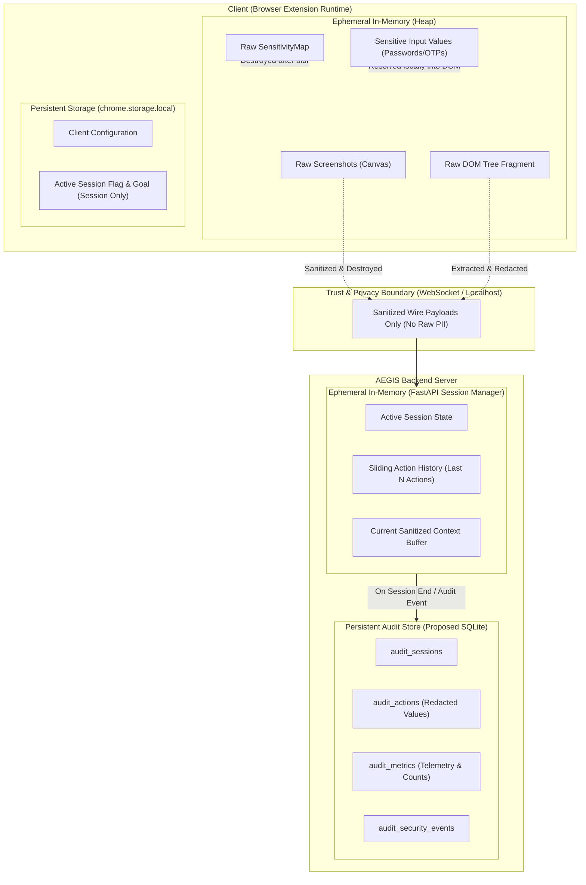
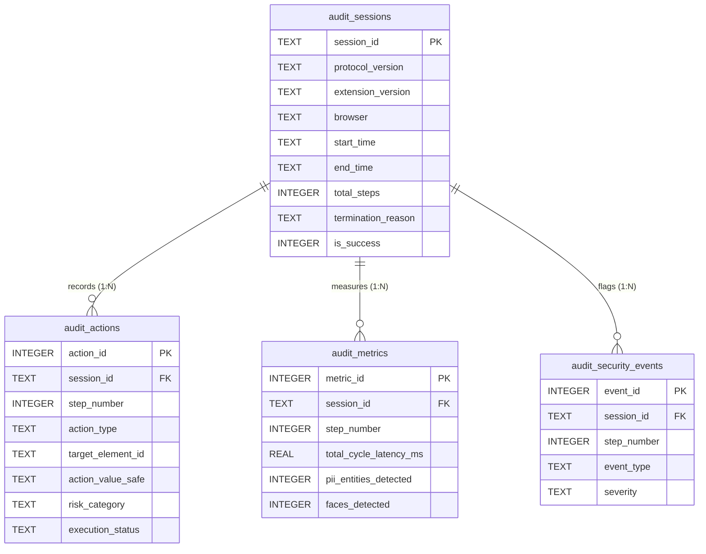
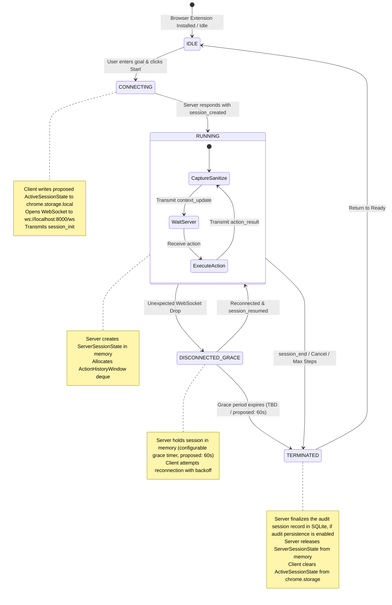
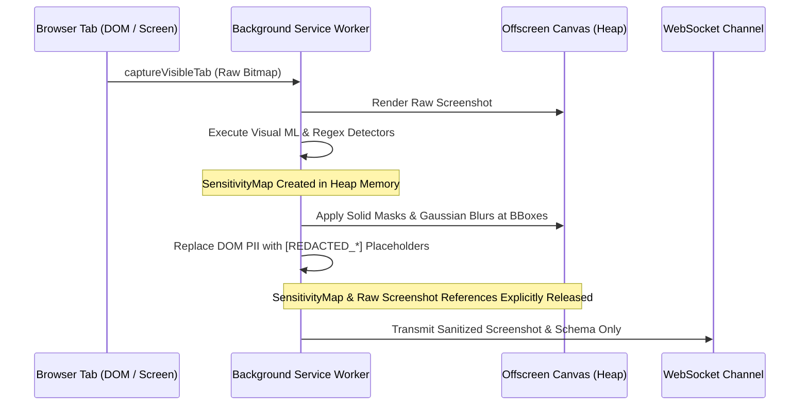
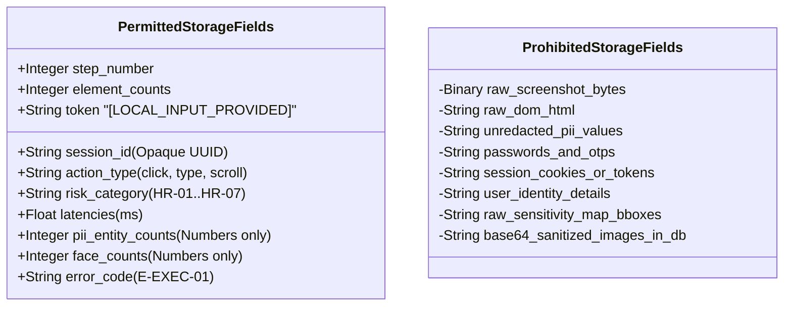
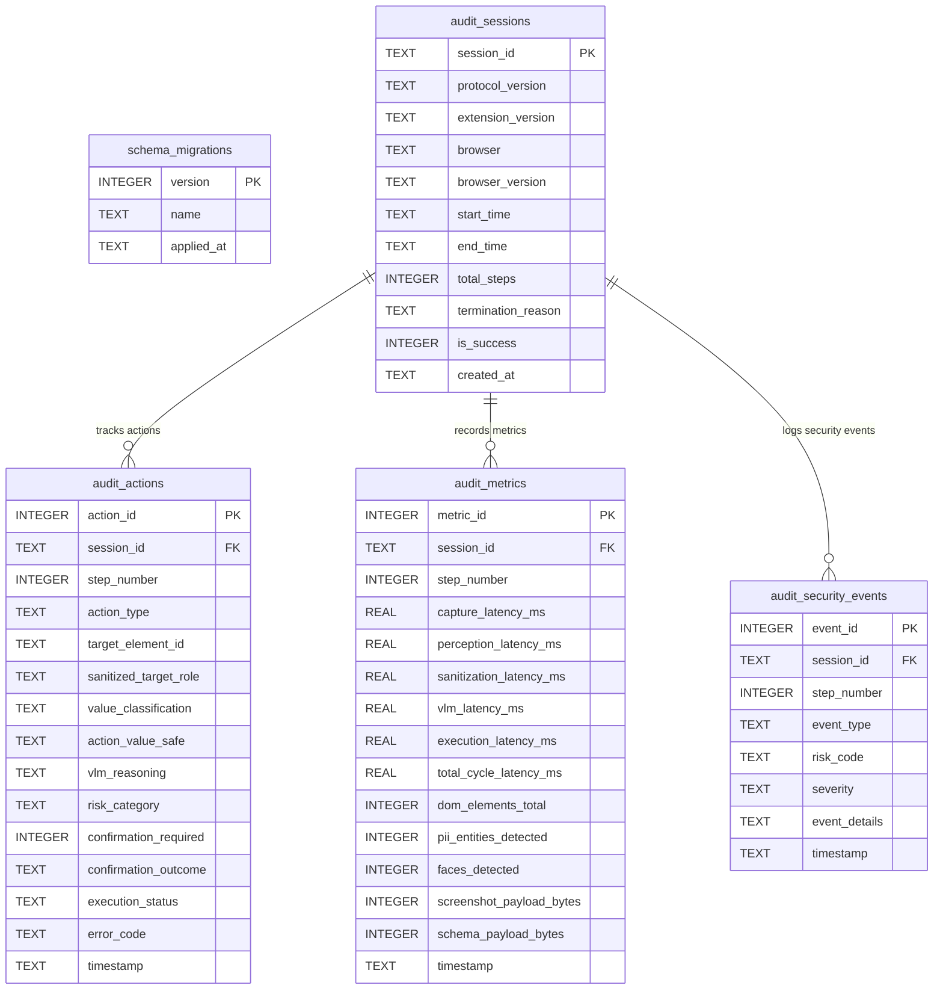
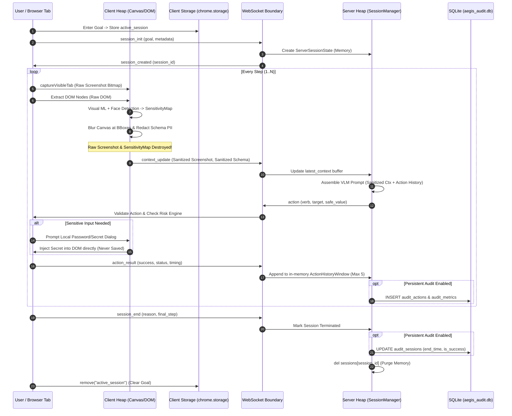

# AEGIS — Database Schema & Data Model Specification

## 1. Document Information

| Field | Value |
|-------|-------|
| Document | Database Schema & Data Model Specification |
| Project | AEGIS — Agentic Engine for Guarded Intelligent Surfing |
| Problem Statement | SIH 2026 — PS 26171 ("On-device Visual Perception for Light-weight Browser Agents") |
| Version | 1.0 |
| Status | Final Draft |
| Last Updated | 2026-09-20 |
| Source Documents | PRD.md v1.1, SYSTEM_ARCHITECTURE.md v1.0, TECHNICAL_SPEC.md v1.0, AI_ML_PIPELINE.md v1.0, SECURITY_PRIVACY.md v1.0, BROWSER_AGENT_SPEC.md v1.0, API_SPEC.md v1.0 |
| Intended Audience | Development team, security reviewers, technical architects, SIH evaluators |

---

## 2. Document Scope & Ownership

### 2.1 What This Document Owns

This document serves as the **authoritative database contract and data persistence specification** for the AEGIS system across both client and server boundaries. It defines:

1. **Storage Tiering & Taxonomy:** The precise classification of persistent vs. ephemeral vs. strictly prohibited data across the browser extension and backend server.
2. **Client-Side Storage Contract:** The structured schemas and key definitions for browser extension persistent storage (`chrome.storage.local`).
3. **Client-Side In-Memory Model:** The lifecycle, structure, and disposal contract for volatile perception buffers, DOM fragments, sensitivity maps, and local input values.
4. **Server-Side In-Memory State:** The session manager state model, reconnection grace store, and sliding action history window schemas.
5. **Server-Side Persistent Database Schema (Proposed SQLite):** The complete relational entity schemas, data types, constraints, defaults, primary keys, foreign keys, and indexes for privacy-minimized audit logging, execution telemetry, and evaluation metrics.
6. **Data Lifecycle, Retention & Deletion:** Strict retention limits, automatic purge schedules, and memory dereferencing contracts.
7. **Privacy-Sensitive Storage Invariants:** The non-negotiable zero-storage guarantees enforced to ensure zero leaks of raw screenshots, raw PII, passwords, OTPs, or web credentials.
8. **Traceability & Open Decisions:** Traceability to all authoritative source documents and an explicit register of proposed vs. TBD database decisions.

### 2.2 What This Document Does NOT Own

| Concern | Owner Document |
|---------|---------------|
| Product requirements, user stories, success criteria | `PRD.md` |
| System architecture, component topology, trust boundaries | `SYSTEM_ARCHITECTURE.md` |
| Module interfaces, runtime loops, execution flow | `TECHNICAL_SPEC.md` |
| Visual ML models, on-device inference, perception pipeline | `AI_ML_PIPELINE.md` |
| Security threat model, privacy invariants, risk mitigation | `SECURITY_PRIVACY.md` |
| VLM prompt templates, action vocabulary, risk categories | `BROWSER_AGENT_SPEC.md` |
| Network protocol, WebSocket message wire schemas, envelopes | `API_SPEC.md` |

---

## 3. Persistence Model & Storage Taxonomy

AEGIS operates under a strict **privacy-first, ephemeral-by-default storage architecture**. State is minimized, localized, and separated across three operational boundaries: Client In-Memory, Client Storage, and Server Storage.



### 3.1 Three-Tier Data Taxonomy

| Data Category | Definition | Allowed Storage Medium | Lifetime / Disposal |
|---------------|------------|------------------------|---------------------|
| **Persistent Data** | Non-sensitive system configuration, user preferences, and optional privacy-minimized audit/telemetry records required across restarts. | `chrome.storage.local` (Client); Embedded SQLite (Server, Optional / Proposed). | Persists until explicitly updated, purged by retention policy, or extension uninstalled. |
| **Temporary / In-Memory Data** | Active operational state needed to coordinate the current perception-action cycle or maintain connection continuity. | Extension Service Worker Heap (Client); FastAPI Session Manager Memory (Server). | Ephemeral. Client buffers dereferenced per cycle. Server session state is destroyed on `session_end`, reconnect-grace expiry, or unrecoverable session termination. A temporary WebSocket disconnect may retain the active session state in server memory for the configured reconnect grace period. |
| **Prohibited Data** | Raw visual captures, unredacted PII, authentication credentials, web storage, and user secrets. | **NONE.** Writing to disk, database, Web Storage, or long-lived variables is strictly prohibited. | Zero persistent storage. Instantaneous in-memory processing only; references explicitly released after redaction. |

### 3.2 What Data Is Persistent

1. **Client Configuration (`chrome.storage.local`):**
   - Non-secret extension preferences: `server_endpoint`, `max_steps`, `debug_mode`, and proposed local telemetry preferences.
2. **Proposed Ephemeral Active Session Record (`chrome.storage.local`):**
   - **Proposed Continuity Mechanism:** Storing active session metadata in `chrome.storage.local` is an implementation-level convenience used only if needed for popup and service worker continuity across service worker suspension. It is NOT a required core architectural persistence mechanism and is NOT mandatory for the core agent loop.
   - Retained *only* while an agent session is actively executing: non-sensitive session metadata (`session_id`, `current_step`, target `tab_id`, and `goal`).
   - Must never contain sensitive values, raw screenshots, raw DOM, credentials, raw PII, or SensitivityMap data.
   - **Crucial Rule:** Cleared immediately upon session termination (`session_end`, completion, cancellation, or fatal error).
3. **Server-Side Audit & Evaluation Records (Optional / Proposed SQLite):**
   - SQLite is an **optional** persistent audit/evaluation store. It is NOT required for the core AEGIS execution loop.
   - When audit persistence is enabled: stores opaque session identifiers, timestamps, step numbers, action types, risk codes, element structural roles, latency metrics, and detection counts.
   - When audit persistence is disabled: the agent operates normally purely in memory, no persistent audit records are created, and no SQLite database is required.
   - No raw user content or sensitive user data is persisted. If optional audit persistence is enabled, only explicitly permitted privacy-minimized operational metadata may be retained according to the configured retention policy.

### 3.3 What Data Is Temporary / In-Memory (Ephemeral)

1. **Client-Side Ephemeral State:**
   - **Raw Screenshots:** Captured via `chrome.tabs.captureVisibleTab` into an in-memory `HTMLCanvasElement` or `ImageData` buffer. Held only for the duration of the visual ML / face detection inference cycle.
   - **Raw DOM Nodes:** Extracted DOM node references and attributes. Held only while constructing the structural layout.
   - **Raw SensitivityMap:** Bounding boxes, entity classifications, and confidence scores. Used solely to guide canvas blurring and schema placeholder replacement, then discarded.
   - **Local Input Buffer:** Plaintext passwords, OTPs, or user secrets entered into the extension confirmation prompt. Held in memory only long enough to dispatch a synthetic input event directly into the target DOM input element.
2. **Server-Side Ephemeral State:**
   - **Active Session Objects:** The Python session dictionary/dataclass holding the active WebSocket reference, goal text, current step count, and client metadata.
   - **Sliding Action History:** FIFO queue of the last $N$ actions (default $N=5$, proposed range 3–10) required to populate the VLM conversational prompt.
   - **Active Step Context:** The latest Base64-encoded sanitized screenshot and sanitized JSON schema. Replaced on every `context_update` and purged on session close.

### 3.4 What Data MUST NOT Be Persisted (Hard Zero-Storage Invariants)

Per `PRD.md` (PV-01, PV-04, PV-06, PV-07), `TECHNICAL_SPEC.md` (§7.6, PI-01..PI-07), and `SECURITY_PRIVACY.md` (§19.2, §21), the following data types **MUST NEVER** be serialized into `chrome.storage`, `IndexedDB`, `localStorage`, SQLite, log files, or persistent disk:

> [!CAUTION]
> **STRICT PROHIBITION (ZERO-STORAGE INVARIANTS):**
> 1. **Raw Screenshots:** Absolute prohibition against saving unredacted screen images to disk, database, or cache.
> 2. **Raw PII Values:** Aadhaar numbers, PAN cards, passport numbers, credit/debit card numbers, CVVs, phone numbers, email addresses, and full street addresses.
> 3. **Authentication Credentials:** Passwords, PINs, OTPs, security answers, 2FA tokens, session cookies, and bearer tokens.
> 4. **Raw SensitivityMap:** Bounding boxes paired with raw unredacted text values or raw face coordinates.
> 5. **Inactive-Tab Information, Browsing History, Cookies & Web Storage:** URLs or page contents of inactive tabs, full browsing history, HTTP session cookies, authentication tokens, `localStorage`/`sessionStorage` contents, and any unrelated-tab information. These MUST NOT be persisted or collected as part of AEGIS (PRD PV-07, SE-02).
> 6. **Full Raw DOM Tree:** Unredacted page markup, hidden inputs, `<script>` payloads, or inner HTML containing sensitive fields.
> 7. **Sanitized Context Post-Session:** Even redacted screenshots and schemas must be purged from server memory upon session termination (PRD PV-06).
> 8. **Sensitive Local Input Values:** User passwords, OTPs, or secrets entered into the local extension input dialog; these are dispatched directly to the DOM and must never be serialized or stored.

---

## 4. Database Technology & System Assumptions

### 4.1 Storage Technology Selection

The AEGIS storage model balances the lightweight, rapid-deployment demands of the Smart India Hackathon (SIH 2026) prototype with enterprise-grade privacy and zero-footprint operation.

| Component | Technology | Rationale & Trade-offs | Status |
|-----------|------------|------------------------|--------|
| **Client Storage** | `chrome.storage.local` | Standard Manifest V3 asynchronous storage API. Sandboxed to the extension origin, persists across service worker terminations, requires no background database process. Quota: 10 MB. | **Finalized** |
| **Server Core Runtime** | **In-Memory Only** (Python Dict / Dataclass) | As mandated by `TECHNICAL_SPEC.md` §2.3 and §23.2: the core agent reasoning loop requires no database. Server session state is destroyed on `session_end`, reconnect-grace expiry, or unrecoverable session termination. A temporary WebSocket disconnect may retain the active session state in server memory for the configured reconnect grace period (PRD PV-06). | **Finalized** |
| **Server Audit & Telemetry Store** | **SQLite 3** (`server/data/aegis_audit.db`) | Embedded, zero-configuration, single-file relational database. Shipped with Python standard library (`sqlite3`). Requires no external daemon, incurs zero network overhead, and supports full ACID compliance with WAL mode. Ideal for local audit trails and SIH evaluation benchmarks. **Strictly optional:** if disabled, core agent functions without any database. | **Proposed (Optional)** |

### 4.2 Excluded Technologies & Architectural Rationale

To maintain consistency with the authoritative source documents, the following technologies are **explicitly excluded**:

- **No PostgreSQL / MySQL:** Requires heavy external server daemons, environment configuration, credentials management, and network ports. Contradicts the lightweight, self-contained SIH prototype constraint.
- **No Redis:** In-memory caching is handled directly within the FastAPI process heap (`asyncio` state). Introducing Redis adds unnecessary operational overhead.
- **No MongoDB / Document Stores:** The audit log schema is structured and relational (sessions $\to$ actions $\to$ metrics). JSON-based schema-less engines offer no benefit and complicate strict constraint enforcement.
- **No Blockchain / Web3 Decentralized Storage:** Cryptographic tamper-proofing and decentralized audit trails are explicitly marked as future scope (`PRD.md` Section 22).

### 4.3 Development and SIH Demo Assumptions

1. **Deployment Footprint (Proposed):** Single workstation or local area network (LAN). Browser extension runs in Chrome/Edge (Proposed baseline: Chrome/Edge 116+ per TECHNICAL_SPEC §2.2); server runs locally on Python 3.11+ / FastAPI at `http://localhost:8000`.
2. **Database File Location:** If enabled, SQLite database resides at `server/data/aegis_audit.db`. The `server/data/` folder is excluded from version control via `.gitignore`.
3. **Execution Concurrency (Proposed):** Single-user / demo environment (Proposed assumption: 1 to 5 concurrent agent sessions for SIH demo). SQLite configured in WAL (Write-Ahead Logging) mode to prevent concurrency locks between async HTTP/WebSocket handlers and background logging writes.
4. **Zero-Database Baseline:** SQLite is strictly an OPTIONAL audit and evaluation store. It is NOT required for the core AEGIS execution loop. When audit persistence is disabled (e.g., `AUDIT_DB_ENABLED=false`):
   - The agent operates normally with complete functionality.
   - Session execution remains entirely in memory.
   - No persistent audit records are created.
   - No SQLite database file is created or required.

---

## 5. Entity / Table Overview

### 5.1 Storage Layer Categorization

The data model is segregated into three functional layers:

1. **Client Persistent & State Store (`chrome.storage.local`):** Extension configuration and proposed temporary active goal tracking.
2. **Server Ephemeral Session Store (FastAPI In-Memory):** Transient WebSocket connection state, VLM sliding history, and active cycle buffers.
3. **Server Persistent Audit Database (Optional / Proposed SQLite):** Privacy-minimized execution records, performance telemetry, and security event logs.

### 5.2 Entity Summary Matrix

| Entity / Table Name | Storage Layer | Mechanism | Primary Identifier | Purpose | Cardinality |
|---------------------|---------------|-----------|--------------------|---------|-------------|
| `ClientConfig` | Client Persistent | `chrome.storage.local` | Object Key | Extension settings and communication endpoints | 1 record per browser profile |
| `ActiveSessionState` | Client Ephemeral (Proposed) | `chrome.storage.local` | `session_id` | Proposed ephemeral task state for UI continuity during active session | 0 or 1 active record |
| `ServerSessionState` | Server Ephemeral | In-Memory (Dict) | `session_id` | Server-side runtime state and WebSocket connection reference | 1 per active connection |
| `ActionHistoryWindow`| Server Ephemeral | In-Memory (Deque)| `session_id` + `step` | Sliding window of recent actions for VLM prompt assembly | 1 to $N$ per active session |
| `audit_sessions` | Server Persistent (Optional) | SQLite Table | `session_id` | High-level session metadata, timing, and completion status | 1 row per agent run |
| `audit_actions` | Server Persistent (Optional) | SQLite Table | `action_id` (Auto) | Privacy-safe log of proposed/executed browser actions | $1..M$ rows per session |
| `audit_metrics` | Server Persistent (Optional) | SQLite Table | `metric_id` (Auto) | End-to-end timing, latency, and entity detection counts | $1..M$ rows per session |
| `audit_security_events`| Server Persistent (Optional)| SQLite Table | `event_id` (Auto) | Risk engine interventions, user confirmations, and denials | $0..K$ rows per session |
| `schema_migrations` | Server Persistent (Optional) | SQLite Table | `version` | Database migration version tracking | 1 row per applied migration |

---

## 6. Detailed Schema for Every Required Entity

### 6.1 Client Persistent Entity: `ClientConfig`

Stored as serialized JSON objects in `chrome.storage.local`. Managed by the extension options/popup UI.

| Field Name | Data Type | Required | Default | Constraints / Validations | Description |
|------------|-----------|----------|---------|---------------------------|-------------|
| `server_endpoint` | `String` | Yes | `"ws://localhost:8000/ws"`| Valid WebSocket URL (`ws://` or `wss://`). | Backend server WebSocket endpoint. |
| `max_steps` | `Integer` | Yes | `30` | Range: $1 \le \text{max\_steps} \le 100$. | Client-enforced limit on agent execution steps per session. |
| `debug_mode` | `Boolean` | Yes | `false` | Must be `false` in production/eval. | Enables verbose console logs and local sanitized context preview. |
| `telemetry_enabled`| `Boolean` | No | `true` | Proposed / implementation-specific. | Toggles transmission of non-sensitive performance metrics. |
| `pii_confidence_threshold` | `Number` | No | `0.5` | Proposed / implementation-specific. | Hardcoded default in TECHNICAL_SPEC §25.1; configurable only in dev mode; not a user-facing product requirement. Range: $0.0 \le \text{val} \le 1.0$. |
| `face_confidence_threshold`| `Number` | No | `0.5` | Proposed / implementation-specific. | Hardcoded default in TECHNICAL_SPEC §25.1; configurable only in dev mode; not a user-facing product requirement. Range: $0.0 \le \text{val} \le 1.0$. |

### 6.2 Client Ephemeral Entity: `ActiveSessionState` (Proposed)

Stored under the key `"active_session"` in `chrome.storage.local`. Written upon `START_AGENT` and removed upon session termination.

> [!NOTE]
> **Proposed Implementation Mechanism:** Storing `ActiveSessionState` in `chrome.storage.local` is a proposed continuity mechanism for handling popup reopening and service-worker lifecycle events. It is NOT a required core architectural persistence mechanism and is not mandatory for the core agent loop. It contains exclusively non-sensitive session metadata and MUST be removed at session termination. It must never contain sensitive values, raw screenshots, raw DOM, credentials, raw PII, or SensitivityMap data.

| Field Name | Data Type | Required | Default | Constraints / Validations | Description |
|------------|-----------|----------|---------|---------------------------|-------------|
| `is_active` | `Boolean` | Yes | `false` | `true` only when agent loop is running. | Master flag indicating an active task. |
| `session_id` | `String` | No | `null` | Format: `sess-[a-zA-Z0-9_-]+`. | Server-assigned opaque session ID. |
| `goal` | `String` | No | `""` | Max 1000 characters. No raw PII. | User-entered natural language task goal. Cleared on session end. |
| `current_step` | `Integer` | Yes | `0` | Range: $0 \le \text{step} \le 100$. | Latest completed or active execution step. |
| `target_tab_id` | `Integer` | No | `null` | Valid Chrome tab identifier. | The tab on which the agent is operating. |
| `status` | `String` | Yes | `"IDLE"` | Enum: `IDLE`, `CONNECTING`, `RUNNING`, `AWAITING_CONFIRMATION`, `AWAITING_LOCAL_INPUT`, `TERMINATED`. | Current lifecycle status of the agent. |
| `start_timestamp`| `String` | No | `null` | ISO 8601 UTC string. | Time when user initiated the session. |

### 6.3 Client In-Memory Buffers: `PerceptionCycleBuffer` & `LocalSensitiveInputStore`

Transient structures within the background service worker / offscreen document JavaScript heap.

#### Buffer A: `PerceptionCycleBuffer`
- **`raw_screenshot_canvas`:** `HTMLCanvasElement` / `ImageBitmap`. Lifecycle: Ephemeral (proposed engineering cycle estimate: $< 300\text{ms}$; not a guaranteed memory reclamation limit). References are explicitly released after processing; no intentional persistent copy is created, and runtime memory reclamation is managed by the browser engine.
- **`extracted_dom_tree`:** Array of DOM nodes with bounding boxes. Lifecycle: Ephemeral (proposed engineering cycle estimate: $< 200\text{ms}$; not a guaranteed memory reclamation limit). Filtered into `SanitizedSchema`, then references are explicitly released.
- **`raw_sensitivity_map`:** Array of `{ bbox: [x, y, w, h], category: string, confidence: number }`. Lifecycle: Ephemeral (proposed engineering cycle estimate: $< 150\text{ms}$; not a guaranteed memory reclamation limit). Used to render black/blurred boxes on canvas and replace text with placeholders, then references are explicitly released.

#### Buffer B: `LocalSensitiveInputStore`
- **`pending_input_value`:** In-memory string (e.g., user-typed password or OTP).
- **Scope:** Maintained solely in closure memory of the background script while dispatching `EXECUTE_ACTION` to the content script.
- **Contract:** **NEVER** serialized, **NEVER** written to `chrome.storage`, **NEVER** sent over WebSocket. Retained only for the minimum duration required to complete local input dispatch, then explicitly cleared/released (set to `null`).

### 6.4 Server In-Memory Entity: `ServerSessionState`

Maintained inside the FastAPI `SessionManager` in-memory dictionary (`dict[str, ServerSessionState]`).

| Field Name | Data Type | Required | Description |
|------------|-----------|----------|-------------|
| `session_id` | `str` | Yes | Unique opaque session key (UUID or random string). |
| `websocket` | `WebSocket` | Yes | Active WebSocket connection instance. |
| `goal` | `str` | Yes | Non-sensitive task goal string received in `session_init`. |
| `protocol_version` | `str` | Yes | Client protocol version (e.g., `"1.0"`). |
| `client_metadata` | `dict` | Yes | `{ extension_version, browser, browser_version, max_steps }`. |
| `current_step` | `int` | Yes | Integer step counter, incremented per `context_update`. |
| `server_max_steps` | `int` | Yes | Configured server cap (default 30). |
| `action_history` | `deque` | Yes | FIFO buffer holding `ActionHistoryItem` objects (max length $N$). |
| `latest_context` | `dict` | No | Holds latest sanitized screenshot (Base64) and sanitized schema for active step. |
| `created_at` | `float` | Yes | UNIX epoch timestamp of session creation. |
| `last_heartbeat` | `float` | Yes | UNIX epoch timestamp of most recent `ping`. |
| `state` | `str` | Yes | Enum: `INIT`, `ACTIVE`, `WAITING_CONTEXT`, `INFERRING`, `DISCONNECTED_GRACE`, `TERMINATED`. |
| `disconnect_time` | `float \| None`| No | Timestamp of unexpected disconnect; used to measure reconnection grace timeout (TBD / configurable; proposed example: 60s). |

### 6.5 Server In-Memory Entity: `ActionHistoryWindow`

Elements contained within `ServerSessionState.action_history`.

| Field Name | Data Type | Description |
|------------|-----------|-------------|
| `step_number` | `int` | Execution step number. |
| `action_type` | `str` | Closed vocabulary: `click`, `type`, `scroll`, `select`, `hover`, `wait`, `done`, `fail`. |
| `target` | `str \| None` | Sanitized element ID (e.g., `"el-01"`). |
| `value` | `str \| None` | Safe text value or scroll direction. If sensitive, strictly set to `"[LOCAL_INPUT_PROVIDED]"`. |
| `reasoning` | `str \| None` | VLM reasoning summary string (privacy-minimized, max 1000 chars). |
| `execution_success`| `bool` | Boolean flag from client `action_result`. |
| `error_code` | `str \| None` | Error code if execution failed (e.g., `"E-EXEC-01"`). |

---

### 6.6 Server Persistent Table: `audit_sessions` (SQLite - Proposed)

Stores non-sensitive session metadata. One record per agent session.

```sql
CREATE TABLE IF NOT EXISTS audit_sessions (
    session_id          TEXT PRIMARY KEY,
    protocol_version    TEXT NOT NULL,
    extension_version   TEXT NOT NULL,
    browser             TEXT NOT NULL CHECK (browser IN ('chrome', 'edge')),
    browser_version     TEXT NOT NULL,
    start_time          TEXT NOT NULL,
    end_time            TEXT,
    total_steps         INTEGER NOT NULL DEFAULT 0 CHECK (total_steps >= 0),
    termination_reason  TEXT CHECK (termination_reason IN (
                            'goal_achieved', 'agent_failed', 'user_cancelled',
                            'max_steps_reached', 'stuck_detected',
                            'repeated_failures', 'connection_error',
                            'session_timeout', 'unknown'
                        )),
    is_success          INTEGER NOT NULL DEFAULT 0 CHECK (is_success IN (0, 1)),
    created_at          TEXT NOT NULL DEFAULT (CURRENT_TIMESTAMP)
);
```

| Field Name | Data Type | Required | Default | Constraints | Description |
|------------|-----------|----------|---------|-------------|-------------|
| `session_id` | `TEXT` | Yes | None | `PRIMARY KEY`. Format: `sess-[a-zA-Z0-9_-]+`. | Unique opaque session identifier assigned at `session_init`. |
| `protocol_version`| `TEXT` | Yes | `"1.0"` | Max 16 chars. | Protocol version negotiated for the session. |
| `extension_version`| `TEXT`| Yes | None | Semantic version (e.g., `"1.0.0"`). | Version of the AEGIS client extension. |
| `browser` | `TEXT` | Yes | None | `CHECK (browser IN ('chrome', 'edge'))`. | Client browser platform. |
| `browser_version` | `TEXT` | Yes | None | Max 32 chars. | Browser release version string. |
| `start_time` | `TEXT` | Yes | None | ISO 8601 UTC (`YYYY-MM-DDTHH:MM:SS.SSSZ`). | Session initialization timestamp. |
| `end_time` | `TEXT` | No | `NULL` | ISO 8601 UTC. | Session termination timestamp. |
| `total_steps` | `INTEGER` | Yes | `0` | $\text{total\_steps} \ge 0$. | Total execution cycles completed. |
| `termination_reason`| `TEXT`| No | `NULL` | Enum of 9 valid termination reasons. | Final exit reason reported via `session_end`. |
| `is_success` | `INTEGER` | Yes | `0` | Binary flag (`0` or `1`). | Set to `1` if `termination_reason == 'goal_achieved'`. |
| `created_at` | `TEXT` | Yes | `CURRENT_TIMESTAMP` | SQLite auto-timestamp. | Database insertion timestamp. |

> [!NOTE]
> **Goal Text Storage Policy:** Per `PRD.md` PV-06, user data shall not be persisted beyond the session. `audit_sessions` **does NOT store the raw goal text by default**. In evaluation/debug mode, an optional SHA-256 hash of the goal or a classified task category may be stored if approved under Open Decision ODD-03.

---

### 6.7 Server Persistent Table: `audit_actions` (SQLite - Proposed)

Stores records of individual proposed and executed actions.

```sql
CREATE TABLE IF NOT EXISTS audit_actions (
    action_id               INTEGER PRIMARY KEY AUTOINCREMENT,
    session_id              TEXT NOT NULL REFERENCES audit_sessions(session_id) ON DELETE CASCADE,
    step_number             INTEGER NOT NULL CHECK (step_number >= 1),
    action_type             TEXT NOT NULL CHECK (action_type IN (
                                'click', 'type', 'scroll', 'select',
                                'hover', 'wait', 'done', 'fail'
                            )),
    target_element_id       TEXT,
    sanitized_target_role   TEXT,
    value_classification    TEXT NOT NULL DEFAULT 'NON_SENSITIVE' CHECK (value_classification IN (
                                'NON_SENSITIVE', 'LOCAL_INPUT_PROVIDED', 'LOCAL_INPUT_CANCELLED',
                                'NONE', 'SCROLL_DIRECTION', 'SELECT_OPTION'
                            )),
    action_value_safe       TEXT,
    vlm_reasoning           TEXT,
    risk_category           TEXT,
    confirmation_required   INTEGER NOT NULL DEFAULT 0 CHECK (confirmation_required IN (0, 1)),
    confirmation_outcome    TEXT CHECK (confirmation_outcome IN (
                                'APPROVED', 'DENIED_USER', 'DENIED_RISK_ENGINE', 'NOT_REQUIRED'
                            )),
    execution_status        TEXT NOT NULL CHECK (execution_status IN (
                                'SUCCESS', 'FAILED', 'BLOCKED', 'SKIPPED'
                            )),
    error_code              TEXT,
    timestamp               TEXT NOT NULL,
    UNIQUE (session_id, step_number)
);
```

| Field Name | Data Type | Required | Default | Constraints | Description |
|------------|-----------|----------|---------|-------------|-------------|
| `action_id` | `INTEGER` | Yes | Auto | `PRIMARY KEY AUTOINCREMENT`. | Synthetic primary key. |
| `session_id` | `TEXT` | Yes | None | `FOREIGN KEY` $\to$ `audit_sessions(session_id)`. | Associated session. |
| `step_number` | `INTEGER` | Yes | None | $\text{step\_number} \ge 1$. | Sequence step number. |
| `action_type` | `TEXT` | Yes | None | 8-verb closed vocabulary. | Action verb decided by VLM. |
| `target_element_id`| `TEXT`| No | `NULL` | Max 64 chars. Internal/audit representation only. | Sanitized element ID (e.g., `"el-04"`). Internal representation only: MUST NOT contain semantic user data, PII, field values, credentials, or raw URLs. **API Contract Distinction:** The presence of `target_element_id` in `audit_actions` does NOT alter the network API contract defined in `API_SPEC.md` Section 7.6 / 10.2; network `action_result` remains privacy-minimized and MUST NOT transmit `target_element_id`. |
| `sanitized_target_role`| `TEXT`| No | `NULL`| Max 32 chars. | Structural tag or role (e.g., `"button"`, `"input:text"`). |
| `value_classification`| `TEXT`| Yes | `'NON_SENSITIVE'`| Enum check. | Categorization of the action parameter. `[NEEDS_LOCAL_INPUT]` is a server-to-client control token; it MUST NOT be persisted and MUST NOT appear in client-to-server payloads. When local input occurs, status is recorded as `'LOCAL_INPUT_PROVIDED'` or `'LOCAL_INPUT_CANCELLED'`. |
| `action_value_safe`| `TEXT` | No | `NULL` | Max 500 chars. **NO SECRETS/PII.** | Non-sensitive text or scroll direction. Set to `"[LOCAL_INPUT_PROVIDED]"` or `"[LOCAL_INPUT_CANCELLED]"` for sensitive inputs. The actual sensitive value MUST NEVER be stored, logged, or transmitted. |
| `vlm_reasoning` | `TEXT` | No | `NULL` | Max 1000 chars. Untrusted metadata. | VLM explanation. Classified as untrusted metadata. MUST NOT contain passwords, OTPs, authentication tokens, raw PII, sensitive field values, or secrets. It is non-executable and must never be interpreted as executable instructions by the audit/database layer. |
| `risk_category` | `TEXT` | No | `NULL` | Format: `HR-01` .. `HR-07` or `SAFE`. | Risk Engine classification code. |
| `confirmation_required`| `INTEGER`| Yes| `0` | Binary flag (`0` or `1`). | Indicates if Risk Engine triggered user prompt. |
| `confirmation_outcome`| `TEXT` | No | `NULL` | Enum check. | User or risk engine decision. |
| `execution_status`| `TEXT` | Yes | None | Enum: `SUCCESS`, `FAILED`, `BLOCKED`, `SKIPPED`.| Execution result on browser page. |
| `error_code` | `TEXT` | No | `NULL` | Category code (e.g., `"E-EXEC-01"`). | Machine-readable error code if failed. |
| `timestamp` | `TEXT` | Yes | None | ISO 8601 UTC. | Execution timestamp. |

> [!NOTE]
> **Single Action per Step Rationale:** At most one `audit_actions` row exists per session step (enforced via `UNIQUE (session_id, step_number)`). Additional lifecycle events for that step, such as confirmation requests, user denial, or risk-engine blocking, are represented in `audit_security_events` rather than by creating multiple `audit_actions` rows.

---

### 6.8 Server Persistent Table: `audit_metrics` (SQLite - Proposed)

Stores latency, payload size, and detection count telemetry for performance evaluation.

```sql
CREATE TABLE IF NOT EXISTS audit_metrics (
    metric_id                   INTEGER PRIMARY KEY AUTOINCREMENT,
    session_id                  TEXT NOT NULL REFERENCES audit_sessions(session_id) ON DELETE CASCADE,
    step_number                 INTEGER NOT NULL CHECK (step_number >= 1),
    capture_latency_ms          REAL,
    perception_latency_ms       REAL,
    sanitization_latency_ms     REAL,
    vlm_latency_ms              REAL,
    execution_latency_ms        REAL,
    total_cycle_latency_ms      REAL,
    dom_elements_total          INTEGER,
    pii_entities_detected       INTEGER,
    faces_detected              INTEGER,
    screenshot_payload_bytes    INTEGER,
    schema_payload_bytes        INTEGER,
    timestamp                   TEXT NOT NULL,
    UNIQUE (session_id, step_number)
);
```

| Field Name | Data Type | Required | Default | Constraints | Description |
|------------|-----------|----------|---------|-------------|-------------|
| `metric_id` | `INTEGER` | Yes | Auto | `PRIMARY KEY AUTOINCREMENT`. | Synthetic primary key. |
| `session_id` | `TEXT` | Yes | None | `FOREIGN KEY` $\to$ `audit_sessions(session_id)`. | Associated session. |
| `step_number` | `INTEGER` | Yes | None | $\text{step\_number} \ge 1$. | Sequence step number. |
| `capture_latency_ms` | `REAL` | No | `NULL` | Non-negative float. | Tab capture duration (ms). |
| `perception_latency_ms`| `REAL`| No | `NULL` | Non-negative float. | Visual ML inference duration (ms). |
| `sanitization_latency_ms`| `REAL`| No | `NULL` | Non-negative float. | Redaction & placeholder substitution duration (ms). |
| `vlm_latency_ms` | `REAL` | No | `NULL` | Non-negative float. | Server VLM reasoning inference duration (ms). |
| `execution_latency_ms` | `REAL` | No | `NULL` | Non-negative float. | Content script DOM execution duration (ms). |
| `total_cycle_latency_ms`| `REAL`| No | `NULL` | Non-negative float. | End-to-end perception-action loop latency (ms). |
| `dom_elements_total` | `INTEGER` | No | `NULL` | $\ge 0$. | Count of DOM elements in sanitized schema. |
| `pii_entities_detected`| `INTEGER`| No | `NULL` | $\ge 0$. | Count of text PII entities redacted (count only). |
| `faces_detected` | `INTEGER` | No | `NULL` | $\ge 0$. | Count of human face regions blurred (count only). |
| `screenshot_payload_bytes`| `INTEGER`| No | `NULL`| $\ge 0$. | Size of Base64-encoded compressed image. |
| `schema_payload_bytes` | `INTEGER` | No | `NULL` | $\ge 0$. | Size of serialized JSON schema. |
| `timestamp` | `TEXT` | Yes | None | ISO 8601 UTC. | Metric recording timestamp. |

> [!NOTE]
> **Telemetry & Evaluation Ownership:** Latency fields, DOM counts, PII detection counts, face counts, and payload sizes stored in `audit_metrics` are telemetry inputs that may support later evaluation. The actual evaluation methodology, success criteria, benchmark design, and scoring metrics belong strictly to `EVALUATION_PLAN.md`. This schema defines telemetry storage contracts only, not evaluation scoring.

---

### 6.9 Server Persistent Table: `audit_security_events` (SQLite - Proposed)

Captures high-risk events, safety interventions, and security anomalies.

```sql
CREATE TABLE IF NOT EXISTS audit_security_events (
    event_id            INTEGER PRIMARY KEY AUTOINCREMENT,
    session_id          TEXT NOT NULL REFERENCES audit_sessions(session_id) ON DELETE CASCADE,
    step_number         INTEGER,
    event_type          TEXT NOT NULL CHECK (event_type IN (
                            'RISK_CONFIRMATION_REQUESTED',
                            'RISK_ACTION_APPROVED',
                            'RISK_ACTION_DENIED_USER',
                            'RISK_ACTION_BLOCKED_ENGINE',
                            'PII_OVER_REDACTION_TRIGGERED',
                            'PAYLOAD_VALIDATION_FAILED',
                            'MALFORMED_MESSAGE',
                            'AUTHENTICATION_FAILURE'
                        )),
    risk_code           TEXT,
    severity            TEXT NOT NULL CHECK (severity IN ('INFO', 'WARNING', 'HIGH', 'CRITICAL')),
    event_details       TEXT,
    timestamp           TEXT NOT NULL
);
```

| Field Name | Data Type | Required | Default | Constraints | Description |
|------------|-----------|----------|---------|-------------|-------------|
| `event_id` | `INTEGER` | Yes | Auto | `PRIMARY KEY AUTOINCREMENT`. | Synthetic primary key. |
| `session_id` | `TEXT` | Yes | None | `FOREIGN KEY` $\to$ `audit_sessions(session_id)`. | Associated session. |
| `step_number` | `INTEGER` | No | `NULL` | Step at which event occurred (nullable). | `step_number` is the execution step associated with the event when applicable. NULL is used for events that occur outside an active execution step, such as connection/session-level validation or authentication events. |
| `event_type` | `TEXT` | Yes | None | Enum check (8 security event types). | Event classification. Source-defined types: `RISK_CONFIRMATION_REQUESTED`, `RISK_ACTION_APPROVED`, `RISK_ACTION_DENIED_USER`, `RISK_ACTION_BLOCKED_ENGINE`, `PAYLOAD_VALIDATION_FAILED`, `MALFORMED_MESSAGE`. Proposed types: `PII_OVER_REDACTION_TRIGGERED` (Proposed: logged when heuristic uncertainty triggers fail-safe over-redaction per PRD PV-08), `AUTHENTICATION_FAILURE` (Proposed: contingent upon future authentication resolution under API_SPEC OAD-01). |
| `risk_code` | `TEXT` | No | `NULL` | Format: `HR-01` to `HR-07` or error code. | Specific risk category trigger. |
| `severity` | `TEXT` | Yes | None | Enum: `INFO`, `WARNING`, `HIGH`, `CRITICAL`. | Severity level of the event. |
| `event_details` | `TEXT` | No | `NULL` | Serialized JSON string. Non-sensitive only. | Contextual metadata (e.g., target element tag). |
| `timestamp` | `TEXT` | Yes | None | ISO 8601 UTC. | Event timestamp. |

---

### 6.10 Database Metadata Table: `schema_migrations` (SQLite - Proposed)

Ensures database schema versioning and deterministic upgrades.

```sql
CREATE TABLE IF NOT EXISTS schema_migrations (
    version     INTEGER PRIMARY KEY,
    name        TEXT NOT NULL,
    applied_at  TEXT NOT NULL DEFAULT (CURRENT_TIMESTAMP)
);
```

| Field Name | Data Type | Required | Default | Description |
|------------|-----------|----------|---------|-------------|
| `version` | `INTEGER` | Yes | None | Migration sequential version number (`PRIMARY KEY`). |
| `name` | `TEXT` | Yes | None | Descriptive migration name (e.g., `"v1_baseline_audit_schema"`). |
| `applied_at`| `TEXT` | Yes | `CURRENT_TIMESTAMP` | Timestamp when migration was executed. |

---

## 7. Primary Keys and Identifiers

### 7.1 Primary Key Strategy

1. **Natural String Key (`session_id`):**
   - The primary identifier across all systems is `session_id`.
   - Used as `audit_sessions.session_id` (`TEXT PRIMARY KEY`).
   - Format: Prefix `sess-` followed by a cryptographically secure random alphanumeric string (minimum 128-bit entropy, e.g., UUIDv4 without hyphens: `sess-f47ac10b58cc4372a5670e02b2c3d479`).
   - Generation: Generated exclusively by the server during `session_init` processing, returned via `session_created`, and propagated across all message envelopes.
2. **Synthetic Integer Keys (`action_id`, `metric_id`, `event_id`):**
   - Implemented as 64-bit auto-incrementing integers (`INTEGER PRIMARY KEY AUTOINCREMENT` in SQLite).
   - Guarantees strictly monotonic ordering per table and minimizes index B-tree overhead.
3. **Composite Natural Keys:**
   - `(session_id, step_number)` serves as a unique business key in both `audit_actions` and `audit_metrics`, guaranteeing that no session can record duplicate data for the same cycle step.

---

## 8. Relationships and Foreign Keys

### 8.1 Relationship Mapping



### 8.2 Foreign Key Constraints & Cascade Semantics

- **Cascade Delete (`ON DELETE CASCADE`):**
  Every child table (`audit_actions`, `audit_metrics`, `audit_security_events`) references `audit_sessions(session_id)` with `ON DELETE CASCADE`.
  - If a session record is pruned or purged due to data retention policies, all related actions, metrics, and security logs are atomically deleted by SQLite.
  - Eliminates orphan records and guarantees data integrity during automated cleanup.

### 8.3 SQLite Foreign Key Enforcement

By default, SQLite disables foreign key constraint checking for backwards compatibility.
**Mandatory PRAGMA Requirement:**
Every database connection established by the AEGIS server backend MUST execute the following command immediately after connection acquisition:

```sql
PRAGMA foreign_keys = ON;
```

---

## 9. Indexes and Uniqueness Constraints

### 9.1 Uniqueness Constraints

1. `audit_sessions.session_id` $\to$ `UNIQUE` (Enforced via `PRIMARY KEY`).
2. `audit_actions(session_id, step_number)` $\to$ `UNIQUE` constraint enforces the single-action-per-cycle model. At most one `audit_actions` row exists per session step. Additional lifecycle events for that step, such as confirmation requests, user denial, or risk-engine blocking, are represented in `audit_security_events` rather than by creating multiple `audit_actions` rows.
3. `audit_metrics(session_id, step_number)` $\to$ `UNIQUE` constraint prevents duplicate performance records for the same step.
4. `schema_migrations.version` $\to$ `UNIQUE` (Enforced via `PRIMARY KEY`).

### 9.2 Performance Indexes

To support rapid query execution during SIH evaluation benchmarks and log analysis, the following indexes are specified:

```sql
-- Fast child record lookups by session ID (Foreign Key index)
CREATE INDEX IF NOT EXISTS idx_audit_actions_session
    ON audit_actions (session_id);

CREATE INDEX IF NOT EXISTS idx_audit_metrics_session
    ON audit_metrics (session_id);

CREATE INDEX IF NOT EXISTS idx_audit_security_session
    ON audit_security_events (session_id);

-- Date-range queries for retention pruning and evaluation reporting
CREATE INDEX IF NOT EXISTS idx_audit_sessions_start_time
    ON audit_sessions (start_time);

-- Aggregation indexes for evaluation metrics
CREATE INDEX IF NOT EXISTS idx_audit_actions_type_status
    ON audit_actions (action_type, execution_status);

CREATE INDEX IF NOT EXISTS idx_audit_security_severity
    ON audit_security_events (severity, event_type);
```

---

## 10. Session Lifecycle and Temporary Session State

### 10.1 State Machine & Data Transitions

The lifecycle of AEGIS session state moves across deterministic phases:



### 10.2 Disconnection & Reconnection State Handling

1. **Grace Period Holding:**
   - Per `API_SPEC.md` §7.3 and `TECHNICAL_SPEC.md` §22.1, if the WebSocket connection drops unexpectedly, the server transitions `ServerSessionState` to `DISCONNECTED_GRACE`.
   - The session state (including goal, current step, and sliding action history) is temporarily held in server memory for a configurable grace period (duration is TBD; 60 seconds is a proposed example value).
   - Session state is NOT persisted after `session_end` and is NOT persisted across server restart.
2. **Reconnection Handshake (`session_resume`):**
   - The client reconnects using exponential backoff (1s, 2s, 4s).
   - Upon connection, the client sends `session_resume` containing `{ session_id, last_known_step }`.
   - If found in memory, the server re-attaches the WebSocket and responds with `session_resumed(resumed=true)`.
3. **Grace Expiration:**
   - If the configured grace period (e.g., proposed 60 seconds) elapses without a successful resume, the server marks the session as `connection_error`, finalizes the audit session record in SQLite, if audit persistence is enabled, and releases the in-memory state.
   - Any subsequent resume attempt receives `session_error(E-SRV-04, "Session expired")`.
4. **Zero-Disk Invariant on Restart:**
   - Server in-memory session state is **NEVER** saved to disk to survive server restarts. If the server crashes or restarts, all active sessions are considered permanently lost. Clients must initiate a clean `session_init`.

### 10.3 Session Termination & In-Memory Purging

Upon receiving `session_end` or when client-side cancellation occurs:
1. **Server Cleanup:**
   - Final summary written to `audit_sessions` (SQLite, if enabled).
   - References to `ServerSessionState`, `ActionHistoryWindow`, latest Base64 screenshot, and sanitized schema are explicitly released (`del sessions[session_id]`). The server runtime is then free to reclaim the associated memory. No persistent copy is intentionally created.
2. **Client Cleanup:**
   - Background service worker executes `chrome.storage.local.remove(["active_session"])`.
   - Goal text, tab references, and current step counters are purged.
   - Any pending visual perception buffers in the offscreen canvas are blanked and references released.

---

## 11. Action / Session History Storage Rules

### 11.1 Sliding Window Mechanics

To prevent unbounded memory growth and stay within the VLM context window limits:
- **Window Size ($N$):** Configured to the last **5 actions** (Proposed, per `BROWSER_AGENT_SPEC.md` §4.4 and `TECHNICAL_SPEC.md` §23.2).
- **Data Structure:** Python `collections.deque(maxlen=5)` attached to `ServerSessionState`.
- **Eviction Policy:** First-In, First-Out (FIFO). When action $N+1$ is executed, action $1$ is popped from in-memory history.
- **Payload Minimization:** History items contain *only* structural descriptions: step number, action type, target element ID, safe parameter value, and reasoning summary. **Never screenshot buffers or full schemas.**

### 11.2 Sensitive Value Scrubbing & Token Replacement

If an executed action involved entering data into a sensitive form field:
- The `value` parameter is **NEVER** stored in history as plaintext.
- The distinction between control tokens and completion status is strictly maintained:
  - `[NEEDS_LOCAL_INPUT]` is a server/VLM control token requesting the client to obtain sensitive input locally. It MUST NOT be persisted and MUST NOT appear in client-to-server payloads.
  - When sensitive input is completed locally, the client and server record the non-sensitive status `"[LOCAL_INPUT_PROVIDED]"` in history.
  - If the user cancels or skips the flow, history records `"[LOCAL_INPUT_CANCELLED]"`.
- Under no circumstances does a password, credit card number, or Aadhaar number enter the in-memory action history.

### 11.3 Memory Boundary Enforcement

- Action history is an **ephemeral reasoning aid**, not an operational database.
- It exists in memory purely to provide conversational context to the VLM prompt (`{action_history_formatted}`).
- It is destroyed when the session terminates. Only the privacy-safe, structured records in `audit_actions` persist if SQLite audit logging is enabled.

---

## 12. Privacy-Sensitive Data Handling & Invariants

### 12.1 Strict Client-Side Invariants

The following invariants are implemented at the software and architectural level:

| Target Data | Storage Status | Enforcement Mechanism | Rationale |
|-------------|----------------|-----------------------|-----------|
| **Raw Screenshots** | **NEVER PERSISTED** | Captured to transient canvas memory; references explicitly released immediately after visual ML / blurring passes. | Prevents exposure of raw visual PII, profile pictures, or private document previews (PRD PV-01). |
| **Raw PII Text** | **NEVER PERSISTED** | Pattern detection in content script; replaced with `[REDACTED_*]` tokens before schema construction. | Guarantees unredacted PII never crosses network or hits disk (PRD PV-02). |
| **Passwords / OTPs** | **NEVER PERSISTED** | Handled via local extension prompt; injected directly into DOM. No storage writes. | Eliminates credential theft risk from extension storage or log dumping (PI-02). |
| **Raw SensitivityMap** | **NEVER PERSISTED** | In-memory bounding box coordinates dereferenced as soon as canvas masks are drawn. | Prevents reconstructive identification attacks (SECURITY_PRIVACY §19.2). |
| **HTTP Cookies / Tokens**| **NEVER STORED** | Extension manifest omits `cookies` and `webRequest` permissions. No collection code paths. | Enforces least-privilege boundary (PRD PV-07, SE-02). |
| **Inactive Tabs / History / Web Storage** | **NEVER PERSISTED OR COLLECTED** | Extension requests minimal permissions (`activeTab`, `scripting`, `storage`, `tabs`). No `cookies`, `history`, or `<all_urls>`. `localStorage`/`sessionStorage` contents, browsing history, and inactive tabs are never read or stored. | Prevents cross-tab surveillance, data exfiltration, and privacy leakage (PRD PV-07, SE-02). |

### 12.2 SensitivityMap Lifecycle



### 12.3 Local Input Resolution Isolation

When a user must enter sensitive data into a form:
1. The VLM issues action: `type(target="el-02", value="[NEEDS_LOCAL_INPUT]")`.
2. The extension recognizes the control token and displays a local confirmation dialog on the client device.
3. The user inputs their secret (e.g., password) directly into the extension UI.
4. The background script dispatches the secret directly into the DOM input field via content script.
5. The result reported back to the server is strictly non-sensitive: `action_result(success=true, local_input_status="LOCAL_INPUT_PROVIDED")`.
6. **Strict Terminology & Persistence Rules:**
   - `[NEEDS_LOCAL_INPUT]` is a server-to-client control token; it MUST NOT be persisted in any database, stored in `chrome.storage`, or sent in client-to-server payloads.
   - `LOCAL_INPUT_PROVIDED` is a non-sensitive completion status; it contains zero sensitive data.
   - `LOCAL_INPUT_CANCELLED` is a non-sensitive cancellation status.
   - The actual sensitive user value is NEVER written to `chrome.storage`, SQLite, log files, or transmitted across the WebSocket.

---

## 13. Audit & Logging Data Requirements

### 13.1 Privacy-Minimized Safe Logging Principles

AEGIS implements **Auditing Without Sensitive-Data Logging** (per `SECURITY_PRIVACY.md` §20). Persistent logging is restricted exclusively to structural, operational, and performance telemetry.

### 13.2 Permitted vs. Prohibited Database & Log Fields



#### Safe Logging Rules:
- **Counts Only, Never Values:** Storing `"pii_entities_detected": 3` is PERMITTED. Storing `"pii_values": ["9876-5432-1098"]` is STRICTLY PROHIBITED.
- **Categorical Risk Identifiers:** Storing `"risk_category": "HR-01"` is PERMITTED.
- **Safe Error Messages:** Storing `"error_message": "Element el-02 not interactable"` is PERMITTED. Storing form values inside error strings is PROHIBITED.

---

## 14. Data Retention, Purging, and Deletion Rules

### 14.1 Retention Policies per Storage Tier

| Storage Tier | Data Asset | Retention Period | Automated Purge Trigger |
|--------------|------------|------------------|-------------------------|
| **Client Memory** | Raw screenshots, DOM fragments, SensitivityMap | Ephemeral (Per-cycle; proposed engineering cycle estimate: $\sim 100\text{--}300\text{ms}$; not a guaranteed memory reclamation limit) | References explicitly released immediately upon cycle completion (no intentional persistent copy created); runtime memory reclamation is managed by the browser engine. |
| **Client Memory** | Local sensitive input values (passwords/secrets) | Ephemeral — retained only for the minimum duration required to complete local input dispatch, then explicitly cleared/released | Explicit clearing and reference release (`null`) immediately following synthetic DOM event dispatch. |
| **Client Storage** | `ActiveSessionState` (`chrome.storage.local` - Proposed) | Session duration only | Purged on `session_end`, user cancellation, or error via `chrome.storage.local.remove()`. |
| **Client Storage** | `ClientConfig` (`chrome.storage.local`) | Indefinite | Retained until user modifies preferences or uninstalls extension. |
| **Server Memory** | `ServerSessionState` (FastAPI heap) | Active connection + configurable grace period (TBD; proposed: 60s) | Explicit dictionary deletion on `session_end`, reconnect-grace expiry, or unrecoverable session termination. |
| **Server Database**| `audit_sessions`, `audit_actions`, `audit_metrics` | **TBD / Configurable** (e.g., proposed 7-day default in development/evaluation; OSD-04) | Daily background scheduled pruning task or max 1,000 sessions cap. |

> [!NOTE]
> **Retention Policy Status:** Retention duration is TBD (per OSD-04). The implementation must support configurable retention and deletion without assuming a permanent retention period. The 7-day window is a proposed development default only and is NOT an architectural requirement.

### 14.2 Automated Pruning Routines (SQLite)

When persistent audit logging is enabled on the server, an asynchronous maintenance routine runs at server startup and periodically (e.g., every 24 hours) to enforce data minimization:

```sql
-- Automated Pruning Query (Configurable Retention):
-- Purge session records older than the configured retention TTL
-- (e.g., datetime('now', '-7 days') as a proposed development example; actual retention window is TBD / configurable via AUDIT_RETENTION_DAYS)
-- Note: Dependent audit_actions, audit_metrics, and audit_security_events
-- are automatically deleted via ON DELETE CASCADE.
DELETE FROM audit_sessions
WHERE start_time < datetime('now', '-' || :retention_days || ' days');

-- Enforce hard storage ceiling: retain at most the latest N sessions (e.g., 1,000 sessions)
DELETE FROM audit_sessions
WHERE session_id NOT IN (
    SELECT session_id FROM audit_sessions
    ORDER BY start_time DESC
    LIMIT 1000
);
```

### 14.3 Manual / Explicit Purge Protocols

1. **Client-Side:** Client-side active-session state may be explicitly removed from `chrome.storage.local` using the specific active-session key (`chrome.storage.local.remove(["active_session"])`) when the session terminates. `ClientConfig` remains preserved and is not deleted during session cleanup.
2. **Server-Side:** An administrative/manual purge mechanism may be provided by the implementation. Its API/CLI interface is TBD and is outside the scope of this document. The database-level purge behavior executes `DELETE FROM audit_sessions; VACUUM;` to instantly zero all audit tables and reclaim disk space.

---

## 15. Database Initialization & Migration Considerations

### 15.1 Physical Database Configuration & PRAGMA Settings

When the server process initializes, it checks for the existence of `server/data/aegis_audit.db`. The connection pool / manager must apply the following engine optimizations:

```sql
-- Enable foreign key constraint checking (disabled by default in SQLite)
PRAGMA foreign_keys = ON;

-- Enable Write-Ahead Logging (WAL) for concurrent reads and writes
PRAGMA journal_mode = WAL;

-- Optimize disk synchronization for performance while maintaining crash resistance
PRAGMA synchronous = NORMAL;

-- Store temporary tables and indices in memory
PRAGMA temp_store = MEMORY;

-- Set busy timeout to 5000ms to prevent database locked errors during concurrency
PRAGMA busy_timeout = 5000;
```

### 15.2 Idempotent DDL Initialization Contract

All database initialization logic MUST be strictly idempotent using `CREATE TABLE IF NOT EXISTS` and `CREATE INDEX IF NOT EXISTS`.
The table creation order must strictly respect foreign key dependencies:
1. `schema_migrations`
2. `audit_sessions`
3. `audit_actions` (depends on `audit_sessions`)
4. `audit_metrics` (depends on `audit_sessions`)
5. `audit_security_events` (depends on `audit_sessions`)

### 15.3 Migration Lifecycle (Proposed)

Implementation choices such as raw SQL migration scripts or Alembic remain Proposed / TBD and are not architectural requirements of the core system.
For future schema modifications, migration scripts may be tracked sequentially in `schema_migrations`:
- `001_initial_audit_schema.sql` (Proposed Baseline v1.0)
- Upgrades are applied linearly at startup before mounting WebSocket endpoints.
- If a migration fails, the server aborts startup and logs `E-SRV-09 ("Database migration failure")`.

---

## 16. Entity-Relationship (ER) Diagram

The following diagram illustrates the complete relational model for the AEGIS persistent audit tier:



---

## 17. End-to-End Data Flow Architecture

### 17.1 Visual Data Flow: Local/In-Memory vs. Wire vs. Persistent Storage



### 17.2 Component-by-Component Storage Boundary Matrix

| Component | In-Memory (Ephemeral) | Persistent Storage | Prohibited Operations |
|-----------|------------------------|--------------------|-----------------------|
| **Extension Popup** | Goal input string, active step counter, status badges | Reads `ClientConfig` from `chrome.storage.local` | Never stores passwords or browsing history |
| **Background Service Worker** | Active WebSocket handle, current cycle buffers | Reads/Writes `active_session` in `chrome.storage.local` | Never writes raw screenshots or PII to storage |
| **Offscreen Canvas Document** | `HTMLCanvasElement`, raw bitmaps, bounding boxes | None | Never exports unmasked canvas to persistent storage |
| **Content Script** | Isolated DOM references, mutation debounce timers | None | Never reads `localStorage` or `cookies` of host page |
| **FastAPI WebSocket Layer** | WebSocket connection pool, raw incoming message frame | None | Never persists raw network frames to disk |
| **FastAPI Session Manager** | `ServerSessionState`, sliding action deque, current context | Writes to `aegis_audit.db` upon cycle completion | Never persists session state across server restart |
| **VLM Adapter** | Formatted prompt strings, temporary inference tensors | None | Never caches unredacted prompt history |

---

## 18. Consistency and Traceability Matrix

This specification directly maps to and satisfies all data-related invariants established in the authoritative AEGIS documents:

| Source Document | Requirement / Invariant ID | Requirement Statement | How This Schema Satisfies It |
|-----------------|----------------------------|-----------------------|------------------------------|
| `PRD.md` | **PV-01** | Raw screenshots remain in local memory only; never transmitted or stored persistently. | Defined in §3.4 and §12.1: Canvas memory is destroyed per cycle; zero database tables accept raw image binaries. |
| `PRD.md` | **PV-02** | Detected PII redacted on-device before transmission. | Section 12.1 specifies in-memory replacement with `[REDACTED_*]` tokens prior to any serialization. |
| `PRD.md` | **PV-04** | Server shall not request or store raw unredacted data. | Schemas in §6.6–§6.9 contain strictly redacted, structural, and categorical fields. |
| `PRD.md` | **PV-06** | Raw user content and sensitive user data are not persisted beyond the active session; privacy-minimized operational audit metadata may be retained only when optional audit persistence is enabled and according to the configured retention policy. | No raw user content or sensitive user data is persisted. If optional audit persistence is enabled, only explicitly permitted privacy-minimized operational metadata may be retained according to the configured retention policy (§6.6–§6.9). Raw screenshots, raw DOM, raw PII, credentials, passwords, OTPs, raw SensitivityMap data, cookies, browsing history, inactive-tab information, localStorage/sessionStorage contents, and sensitive local input values are strictly prohibited from persistent storage. |
| `PRD.md` | **PV-07** | No collection of browsing history, cookies, or credentials. | Section 3.4 and §12.1 explicitly prohibit cookie/history tables and permissions. |
| `PRD.md` | **SE-02** | Extension requests minimal permissions (`activeTab`, `scripting`, `storage`, `tabs`). | Section 4.1 specifies `chrome.storage.local` within standard MV3 permissions. |
| `TECHNICAL_SPEC.md` | **§2.3 / §23.2** | System does not require a persistent database. Session state is in-memory only. | Affirmed in §4.1: in-memory FastAPI session manager is the authoritative execution state; SQLite is optional audit log. |
| `TECHNICAL_SPEC.md` | **§7.6 / PI-02** | Sensitive values not logged or serialized. Action history records `[LOCAL_INPUT_PROVIDED]`. | Enforced in `audit_actions.action_value_safe` (§6.7) and `ActionHistoryWindow` (§11.2). |
| `TECHNICAL_SPEC.md` | **§25.1** | Client configuration keys stored in `chrome.storage.local`. | Fully detailed in `ClientConfig` schema (§6.1). |
| `SECURITY_PRIVACY.md` | **SAC-10** | Raw sensitive data has no intentional persistent storage path. | Verified via architectural constraints in §3.4, §12, and §17.2. |
| `SECURITY_PRIVACY.md` | **§20 / SP-12** | Safe logging permitted fields; prohibited fields. | Section 13 strictly enforces field-level logging boundaries in SQLite audit tables. |
| `SECURITY_PRIVACY.md` | **OSD-04** | Log retention period not defined (TBD). | Retention duration is TBD (per OSD-04). Section 14.1 and §19.1 (ODD-02) define a configurable retention and automated pruning framework without establishing a permanent retention period. |
| `BROWSER_AGENT_SPEC.md`| **§4.4 / OAD-AG-02** | Action history window size (last $N$ steps). | Defined in §11.1 as a 5-action sliding deque in server memory. |
| `API_SPEC.md` | **§7.1–§7.7, §8.1–§8.5**| Message schemas, error taxonomy, session identifiers. | Identifiers (§7), lifecycle (§10), and error codes (§6.7) match API specifications. |

---

## 19. Open Database Decisions (ODD) & TBD Items

The following items represent architectural options and parameters that remain subject to empirical testing during implementation:

| Decision ID | Summary / Description | Options Considered | Status | Impact / Next Steps |
|-------------|-----------------------|--------------------|--------|---------------------|
| **ODD-01** | **Audit Database Enablement Mode** | Option A: Disabled by default for maximum zero-retention compliance.<br>Option B: Enabled by default in local dev/demo for SIH evaluation benchmarking. | **Proposed: Option B in dev, Option A in prod** | Evaluators can review performance and safety interventions during the SIH demo without violating user privacy. |
| **ODD-02** | **Server Audit Log Retention Window (OSD-04)** | Option A: Session duration only (purged on disconnect).<br>Option B: 24 Hours.<br>Option C: 7 Days.<br>Option D: Configurable TTL via env var `AUDIT_RETENTION_DAYS`. | **TBD (Proposed: Option D config with Option C 7-day dev example)** | The architecture does NOT finalize a 7-day retention period. Implementation must support configurable retention without assuming permanent storage. |
| **ODD-03** | **Goal Text Storage in Audit Database** | Option A: Omit entirely (Strict PV-06 compliance).<br>Option B: Store SHA-256 hash of goal for task deduplication.<br>Option C: Store plaintext goal only under an explicitly approved debug/evaluation configuration. | **Proposed: Option A by default; Option B in benchmark runs** | Prevents user task descriptions from residing in permanent database storage. |
| **ODD-04** | **Reconnection Grace Window Duration** | Option A: 30 seconds.<br>Option B: 60 seconds.<br>Option C: 120 seconds. | **TBD (Proposed example: 60 seconds)** | Balances server memory release against network recovery time on spotty connections. |
| **ODD-05** | **Database Migration Tooling** | Option A: Raw SQL scripts managed by `schema_migrations` table.<br>Option B: Lightweight Alembic / SQLAlchemy integration. | **Proposed / TBD (Option A: Raw SQL)** | Preserves minimal dependencies and avoids complex ORM overhead for the lightweight SIH prototype. |
| **ODD-06** | **Action History Window Capacity (OAD-AG-02)** | Option A: 3 actions.<br>Option B: 5 actions.<br>Option C: 10 actions. | **Proposed: Option B (5 actions)** | Validated against selected small VLM context window (e.g., Qwen-VL / Gemma 3) during benchmark testing. |
