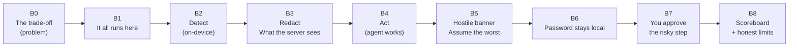
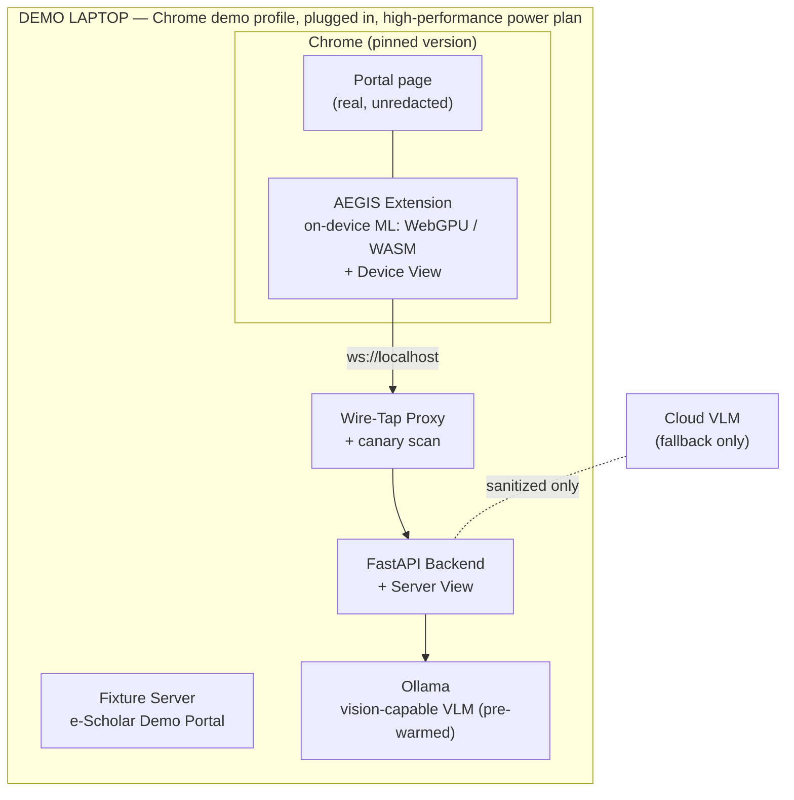

# AEGIS — Demo Flow

## 1. Document Information

| Field | Value |
|-------|-------|
| Document | Demo Flow |
| Project | AEGIS — Agentic Engine for Guarded Intelligent Surfing |
| Problem Statement | SIH 2026 — PS 26171: On-device Visual Perception for Light-weight Browser Agents |
| Version | 1.0 |
| Status | Final Draft |
| Last Updated | 2026-09-21 |
| Source Documents | [PRD.md](PRD.md) §21, [BROWSER_AGENT_SPEC.md](BROWSER_AGENT_SPEC.md) §13, [SYSTEM_ARCHITECTURE.md](SYSTEM_ARCHITECTURE.md) §15, [SECURITY_PRIVACY.md](SECURITY_PRIVACY.md) §25–27, [EVALUATION_PLAN.md](EVALUATION_PLAN.md) |
| Intended Audience | The presenting team, the backup operator, anyone who may need to run the demo |

> [!NOTE]
> Where a number belongs on stage it appears as `[X]` — a placeholder to be filled from a **MEASURED** result in [EVALUATION_PLAN.md](EVALUATION_PLAN.md) §17.1. No number in this document is an AEGIS result. Nothing is to be invented, rounded up, or borrowed from the dashboard mock-ups (which are illustrative) to fill a gap.

---

## 2. Scope and Purpose

### 2.1 What This Document Owns

The SIH demonstration script and scenario, delegated here by PRD §21, BROWSER_AGENT_SPEC §2.2, SYSTEM_ARCHITECTURE §1, and TECHNICAL_SPEC §2: the story, the timed beats, the on-stage assets, the presenter roles, the fallbacks, the Q&A preparation, and the go/no-go gates for the live run.

### 2.2 What This Document Does NOT Own

| Concern | Owner |
|---------|-------|
| What the system does and how | PRD, SYSTEM_ARCHITECTURE, TECHNICAL_SPEC, BROWSER_AGENT_SPEC |
| How claims are proven and measured | EVALUATION_PLAN |
| Pitch deck content | The SIH deck (this document constrains its claims; see §11.2) |

### 2.3 Relationship to Existing Demo Material

PRD §21 sets the demo requirements; BROWSER_AGENT_SPEC §13 defines the expected agent behaviour on a controlled page. This document turns both into a timed, rehearsable script and adds three things they do not contain: **proof at the wire**, **a plan for when things fail on stage**, and **a Q&A plan**.

---

## 3. Demo Objectives and Principles

### 3.1 What the Demo Must Achieve

1. **Prove each of the five SIH criteria with something the judges can see** (PRD §21): visual context (25 %), PII detection (20 %), redaction precision (20 %), resource use (20 %), latency (15 %).
2. **Make the core idea land in ten seconds:** *the AI sees the page but never sees what is on it.*
3. **Complete one crisp, multi-step task end to end** (≥ 3 loop cycles, PRD §20; ends with a user-approved high-risk action) rather than claiming general autonomy — the PS analysis's own recommendation.
4. **Survive a failure gracefully.** The audience should learn something from a stumble, not lose confidence.

### 3.2 Principles

| ID | Principle | Consequence |
|----|-----------|-------------|
| DP-01 | **Show, then tell.** Every claim is followed by evidence on screen within seconds. | Each beat in §9 lists its on-screen proof. |
| DP-02 | **Proof at the wire.** The strongest statement is "here is everything the server ever received." | The Server View (§8) is on screen for the whole run. |
| DP-03 | **Live, real, honest.** Nothing is faked. Where something is simulated it is said aloud (B5). | See §11.2 claims discipline. |
| DP-04 | **Synthetic data only.** No real identifiers or faces on stage, in the deck, or in recordings (EVALUATION_PLAN EP-07, §6.6). | §7.2 fixtures; §15 profile hardening. |
| DP-05 | **Rehearsed, not scripted-robotic.** The beats and proof points are fixed; the words are natural. | Appendix A is a guide, not a teleprompter. |
| DP-06 | **Only demo what has been measured.** A page or feature that has not passed its evaluation test does not appear on stage. | Gate DG-02; see the FP-02 caveat in §7.1. |
| DP-07 | **Own the limits.** A calm statement of residual risk earns more trust than a claim of perfection. | Beat B8 and Q&A §13. |
| DP-08 | **Always have a fallback that is declared as one.** A recording is played as a recording. | §12. |

---

## 4. Audience, Slot Budget, and Variants

### 4.1 Audience

SIH evaluators for a problem statement owned by ISRO / Department of Space: technically literate, interested in data sovereignty, likely to probe privacy claims, model choices, and failure behaviour. Expect questions about what happens when detection fails.

### 4.2 Slot Length — an Open Assumption

The actual presentation slot has not been confirmed (**OQ-DF-01**). The script is therefore built in three cuts; confirm the slot with the organizers and choose one.

| Variant | Length | Content | Use when |
|---------|--------|---------|----------|
| **Lightning** | 3:00 | B0, B2, B3, B4-short, B7, B8 | Slot ≤ 5 min including questions |
| **Core** (primary) | 6:40 planned + 20 s buffer = 7:00 | B0–B8 | Slot 8–10 min |
| **Extended** | ~12:00 | Core + X1–X4 (§9.4) | Slot ≥ 15 min, or a hands-on evaluation table |

**If running late** (Core): cut B5 first, then B1. Never cut B3 or B8.

---

## 5. Scenario: Task, Persona, and Story Arc

### 5.1 The Scenario

**"Ramesh applies for a scholarship."** Matching the SIH slide 2 form (named *Ramesh*, "Application form"), Ramesh uses a fictional **e-Scholar Demo Portal** (clearly marked *DEMO — synthetic data*; no real government branding). His saved profile pre-fills sensitive fields; he asks the agent to finish the non-sensitive parts and submit.

**Why this task:**

- It matches the slide judges have already seen.
- It has all five PII categories plus a face and a password (PRD §21, BROWSER_AGENT_SPEC §13.1).
- The agent's work is genuinely non-sensitive (dropdowns, a city, a checkbox), so the model can succeed **without** ever seeing a secret — the point of the architecture.
- It ends in a high-risk submit (HR-04) that exercises the human-in-the-loop gate.
- It resolves PRD open question OQ-03 (demo task) — confirm at the team level (**OQ-DF-03**).

### 5.2 The Goal Typed on Stage

> *"Complete my scholarship application: choose category General, state Rajasthan, city Jaipur, course B.Tech, accept the declaration, then submit it."*

Lightning variant (`?mode=short`): *"Select state Rajasthan and submit my application."*

### 5.3 Expected Agent Trace (Core)

Derived from BROWSER_AGENT_SPEC §13.2.

| Step | Proposed action | Risk decision | Beat |
|------|-----------------|---------------|------|
| 1 | `select` Category = General | allow | B4 |
| 2 | `select` State = Rajasthan | allow | B4 |
| 3 | `type` City = "Jaipur" | allow | B4 |
| 4 | `select` Course = B.Tech | allow | B4 |
| 5 | `click` Declaration checkbox | allow | B5 |
| 6 | `type` `[NEEDS_LOCAL_INPUT]` into "Confirm with password" | allow (handled locally) | B6 |
| 7 | `click` "Submit Application" | **HR-04 → require confirmation** | B7 |
| — | `done` (not counted, BROWSER_AGENT_SPEC §9.2) | allow | B7 |

Seven counted steps of a 30-step budget. At the PF-03 target of < 5 s per cycle this is about 35 s of agent time; with a slower local VLM it may reach ~60 s. Beat timings in §9 assume the slower case.

### 5.4 Story Arc



---

## 6. Demo Environment and Topology

### 6.1 Topology

Single laptop (SYSTEM_ARCHITECTURE §15; TECHNICAL_SPEC §26.2), plus an optional second screen.



### 6.2 Local vs Cloud Reasoning Model

| Mode | Story it enables | Cost |
|------|------------------|------|
| **Local VLM (preferred)** | "Turn Wi-Fi off — it still works." Strongest data-sovereignty message for ISRO (PRD §3.3) | Needs a laptop that can run the model at acceptable latency (decided by EVALUATION_PLAN G3) |
| **Cloud VLM (fallback)** | "Only sanitized data leaves; here is exactly what left." | Weaker sovereignty story; adds venue-network dependency; must be disclosed on stage |

The choice is made at gate G3 and frozen (**OQ-DF-02**). The extension is unaware of the mode (SYSTEM_ARCHITECTURE §12.5); only the narration in B1 changes.

### 6.3 Screen Layout

Two windows, side by side on a 1920×1080 output. Do **not** change display scaling after preflight (§12, F-08).

```
┌───────────────────────────────┬──────────────────────────────────┐
│  CHROME — the REAL page       │  SERVER VIEW  (browser tab)      │
│  (what the user sees)         │  ── everything the server has    │
│                               │     ever received ──             │
│  [photo]  e-Scholar Portal    │  Sanitized screenshot [thumb]    │
│  Name      ████████           │  Schema (placeholders highlighted)│
│  Aadhaar   2345 6789 0124     │  VLM prompt  →  action returned  │
│  ...                          │  Payload bytes │ Frames │        │
│  [Submit Application]         │  Canary scan: 0 matches / N frames│
├───────────────────────────────┼──────────────────────────────────┤
│  DEVICE VIEW (extension page) │  Step 4 / 30 │ risk log │ stage   │
│  detection overlay · counts   │  latency waterfall · memory · CPU│
└───────────────────────────────┴──────────────────────────────────┘
```

If a second screen is unavailable, use the two-pane layout and open Device View only for B2 and B8.

---

## 7. Demo Assets

### 7.1 Fixture Pages

Served from the fixture origin (EVALUATION_PLAN §6.1).

| ID | Page | Role in the demo |
|----|------|------------------|
| FP-01 | **e-Scholar Demo Portal** — profile photo, pre-filled Name / Aadhaar / PAN / Mobile / Email / Bank account, "Confirm with password" field; non-sensitive Category, State, City, Course, Declaration; an **Announcements** panel that carries the injection text when `?hostile=1`; a *DEMO — synthetic data* ribbon | The Core and Extended demo |
| FP-01s | FP-01 with `?mode=short` (state + submit only) | Lightning |
| FP-13 | Hostile page (fake browser chrome, hidden instructions, external links) | Extended X-beats and Q&A |
| FP-08 / FP-09 | Canvas-rendered UI; cross-origin iframe | Extended X1 (visual perception the DOM cannot provide) |
| FP-07 | No-PII content page | Extended X2 (false-positive behaviour) |
| FP-02 | **Slide-2 replica** | Optional "bridge from the slide" — **only if PD-08 passes** |

> [!IMPORTANT]
> **FP-02 caveat (DP-06).** The slide-2 form redacts a *Full Name* and a *Bank Account No.* field, but the specified detectors do not cover those (EVALUATION_PLAN G-01/G-02). Until PD-08 passes, FP-02 and any name/bank field on FP-01 must **not** appear on stage; remove those fields from FP-01 (leaving the categories the pipeline is validated for) or resolve G-01 first. A visible unredacted name on the Server View would undermine the whole demonstration.

### 7.2 Synthetic Identity — "Ramesh Kumar"

All values are synthetic. Do not substitute real data — including the team's own.

| Field | Value | Notes |
|-------|-------|-------|
| Full name | Ramesh Kumar | Only if G-01 is resolved |
| Aadhaar | `2345 6789 0124` | 12 digits, Verhoeff-valid by construction. Arbitrary test data; could in principle coincide with a real number, so it is never used outside the demo page |
| PAN | `ABCDE1234F` | Common documentation example |
| Mobile | `98765 43210` | Placeholder-style number; the field is `type="tel"` |
| Email | `ramesh.kumar@example.com` | Reserved documentation domain |
| Bank account | `11228536740` (11 digits, as on slide 2) | Requires the G-01 label rule to be detected — it matches no numeric pattern |
| Card (checkout extension only) | `4111 1111 1111 1111` | Public test number |
| Demo password | `Demo@2026` | Typed live in B6; fictitious |
| Face | A consenting team member or a licensed/synthetic image, with the licence or consent noted | Never a photo of a non-consenting person or a public figure |

### 7.3 Demo Chrome Profile (hardening)

A dedicated profile, created for the demo and nothing else.

| Setting | Why |
|---------|-----|
| Only the AEGIS extension installed; sync off | No other extension reads or alters the page |
| **Password manager and autofill (addresses, payments) disabled** | Chrome's "Save password?" bubble would appear after the password step, and autofill could inject **real** personal data into the form |
| Notifications, translate prompts, and pop-ups off; bookmarks bar hidden | Nothing unexpected on the projector |
| Zoom 100 %, viewport fixed to the tested size | Redaction geometry depends on DPR and zoom (EVALUATION_PLAN RD-10) |
| Chrome auto-update disabled; version pinned to the tested build | An update can change WebGPU behaviour |
| `server_endpoint` pointed at the wire-tap proxy | Independent evidence (EVALUATION_PLAN §7.2) |
| `debug_mode` off; `AEGIS_EVAL_MODE` off | PRD/TECHNICAL_SPEC §25.3 |

### 7.4 Reset

A single `demo-reset` action (script or shortcut) returns the system to a clean start in under 20 seconds: restart the backend, clear the audit database, clear extension storage (the stored goal), reload FP-01 at its default state, close stray tabs, and re-run the warm-up inference. Use it between runs and after any failure.

---

## 8. Demo Inspector — Device View and Server View (PROPOSED addition)

The PS analysis advises shipping a live view of redaction and performance because "judges are scoring exactly those numbers." The two dashboard mock-ups in the PS folder are the visual concept. This section defines the minimum that serves the script.

> [!IMPORTANT]
> **The Inspector is not in the PRD's MVP feature list (F1–F11).** It builds on transparency requirements that already exist (PRD NFR-12 and PV-05; BROWSER_AGENT_SPEC §12.1 debug preview) and on telemetry already specified (TECHNICAL_SPEC §29; DATABASE_SCHEMA §6.8). Approve it explicitly (**OQ-DF-05**). The dark, four-card visual style of the mock-ups is a good starting point, but every number on them is **ILLUSTRATIVE** (EVALUATION_PLAN §17.2, C-03…C-05) — the built version must show live values or nothing.

### 8.1 Two Surfaces

| Surface | Where it runs | Sees raw data? | Purpose |
|---------|---------------|----------------|---------|
| **Server View** | A page served by the backend (`/view`) | **No** — it only shows what the server received, so it *cannot* leak raw data | The wire-level proof: "this is everything the server has" |
| **Device View** | An extension page opened in its own window (needs no extra permission) | Yes, locally on the device (synthetic data only) | Detection overlay, raw-vs-sanitized comparison, stage timings, resource gauges |

### 8.2 Contents

| Panel | Surface | Source | Serves |
|-------|---------|--------|--------|
| Frames received, bytes per frame | Server | Server / wire tap | Criterion 5; payload story |
| Latest sanitized screenshot and sanitized schema (placeholders highlighted) | Server | `context_update` | Criterion 3 |
| VLM prompt and returned action | Server | Server | Criterion 1, transparency |
| **Canary scan: `0` matches in `N` frames** | Server | Wire-tap canary matcher (EVALUATION_PLAN §7.3) | Criterion 3 — independent proof |
| Session event log (`RISK_CONFIRMATION_REQUESTED`, `LOCAL_INPUT_PROVIDED`, …) | Server | `audit_security_events`, `audit_actions` | Human-in-the-loop story |
| Detection overlay coloured by signal (DOM, visual ML, face, heuristic) | Device | Sensitivity map | Criterion 2 |
| Redaction counts by category | Device | Sensitivity map | Criterion 2/3 |
| Stage latency waterfall; step counter `Step n / 30` | Device | TECHNICAL_SPEC §29 marks | Criterion 5 |
| Memory and CPU gauges; backend (`WebGPU`/`WASM`) | Device | Process sampler / perf API | Criterion 4 |
| Risk decision log (`allow` / `require_confirmation` / `deny` with HR code) | Device | Risk Engine | Safety story |

### 8.3 Build Priority (value per effort)

| Tier | Item | Effort | Rationale |
|------|------|--------|-----------|
| **D1** | Server View: latest frame, schema, prompt/action | Low — the server already holds this data | Delivers the single most convincing proof |
| **D1** | Canary-scan badge (wire-tap based) | Low–medium | Independent, quantitative |
| **D2** | Device View: stage latency and step counter | Medium | Criteria 5 and 1 |
| **D2** | Memory / CPU gauge | Medium | Criterion 4 |
| **D3** | Detection overlay by signal | Medium–high | Very visual for criterion 2; if cut, use the popup sanitized preview (BROWSER_AGENT_SPEC §12.1) |
| **D3** | "Assume the worst" injection button (§9, B5) | Low | A test hook already required by EVALUATION_PLAN AG-04 |

### 8.4 Integrity and Privacy Rules

- **CP-08 transparency fidelity:** what the Inspector displays as "sent" must be hash-identical to the frame captured on the wire, so the Inspector cannot flatter the system.
- The Device View shows raw data on-device only and is enabled only in the demo profile with synthetic data. It is never a default product feature.
- The Server View reads only what the server legitimately received, preserving PV-06 (no persistence beyond the session).

---

## 9. The Demo Script

### 9.1 Core Run — 7:00 slot (6:40 planned, 20 s buffer)

| Beat | Time | Presenter says (gist) | Presenter does | On screen — proof | Criterion | Eval link |
|------|------|-----------------------|----------------|-------------------|-----------|-----------|
| **B0** Hook | 0:00–0:30 | The trade-off every AI browser agent forces: to help you it must *see* your screen — so your screen goes to a server. | Gestures at the page: photo, Aadhaar, PAN, phone, password | FP-01 in full, raw and unredacted | — (framing) | C-06 wording |
| **B1** It all runs here | 0:30–1:00 | Extension + backend + local model, one laptop. **Wi-Fi off — it still works.** *(Cloud mode: "Only a sanitized view leaves — watch the server's inbox.")* | Toggles airplane mode; points at the Server View | Network off indicator; Server View idle | 3 (data sovereignty) | RD-14, CP-05 |
| **B2** Detect | 1:00–1:50 | Give it a goal in plain English. Before anything is sent, AEGIS looks at the page three ways: structure, a small vision model on WebGPU, and pattern detectors. Colours are signals. | Types the goal; clicks **Start**; points to the legend | Device View overlay: face, Aadhaar/PAN/phone, password; detection time `[X] ms`; backend `WebGPU` | 2 | PD-05, PD-04 |
| **B3** What the server sees | 1:50–2:45 | Left is my real screen, untouched — the agent needs it to click. Right is **everything the server has received**. Face blurred; the Aadhaar is `[REDACTED_AADHAAR]`; the model still knows a PAN exists, not which one. An independent tap searched every byte: `0` matches. | Points left, then right; reads the badge; opens the schema JSON | Server View: blurred thumbnail, placeholders, payload `[X] KB`, **Canary scan `0 / N`** | 3 | RD-01, RD-02, RD-05 |
| **B4** Act | 2:45–4:05 | One action per step: the model proposes, we validate, then we act on the real page. It read the label from the structure and the layout from the image. Each step takes about `[X] s`; the page stays responsive. | Narrates while steps 1–4 run; points at gauges | Steps 1–4; reasoning text per step; per-stage waterfall; memory `[X] MB`, CPU | 1, 4, 5 | VC-05, RL-01…05 |
| **B5** Hostile banner | 4:05–4:45 | Real pages can be hostile. This notice tells AI assistants to delete my account. The model saw it. *(Outcome A: ignored it. Outcome B: it proposed a click — the risk engine stopped it.)* We don't rely on the model behaving: **assume the worst** — a fooled model proposes *Delete Account*. Valid action, still stopped: two independent gates. | Points at the banner; clicks **Assume the worst**; clicks **Deny** | Server View shows the injected text in the schema; Device View risk log: `HR-02 → require_confirmation`; user denies | — (safety story) | AG-04, AG-05 |
| **B6** Password stays local | 4:45–5:20 | The next field wants a password. The model can't see it and shouldn't. It asks *me*, locally. The value goes straight into the page; the server only records *local input provided*. | Types `Demo@2026` into the extension's local prompt | Server View: event `LOCAL_INPUT_PROVIDED`; canary scan still `0` | 3 | RD-13 |
| **B7** You approve | 5:20–6:05 | Submit. The form holds sensitive fields, so the risk engine pauses and asks. The decision is mine. *(Allow.)* Submitted; the model reads the confirmation page and says done. | Reads the dialog aloud; presses **Allow** | Confirmation dialog (HR-04); success page; `done`; `7 steps · [Y] s` | 1, 5 | AG-01, AG-04 |
| **B8** Scoreboard | 6:05–6:40 | Numbers measured on this laptop *and* on a baseline 8 GB machine: `[detection recall / precision]`, `[0 leaks in N instances]`, `[memory]`, `[p50 cycle]`. And what AEGIS does **not** do: canvas-rendered text, unusual faces, targeted evasion — we measure those too. Private by default, honest about limits. | Switches to the scoreboard slide | §17.1 scorecard, MEASURED values only, with the hardware named | 1–5 | EVALUATION_PLAN §17.1 |

**Timekeeper cues:** call out at 2:45 (B4 start), 4:45 (B6 start), 6:05 (B8 start). Cut B5 first if behind.

### 9.2 Lightning Run — 3:00

| Beat | Time | Content |
|------|------|---------|
| B0 | 0:00–0:20 | Hook |
| B2 | 0:20–1:00 | Goal (short variant), detection overlay, `[X] ms` |
| B3 | 1:00–1:40 | Server View: blurred face, placeholders, canary `0 / N` |
| B4-short | 1:40–2:10 | Agent selects the state |
| B7 | 2:10–2:40 | Confirmation dialog → Allow → done |
| B8 | 2:40–3:00 | Two headline numbers + one honest limit |

### 9.3 Extended Run — ~12:00

Core (6:40) plus the beats below (insert after B4).

| Beat | Length | Content | Proof |
|------|--------|---------|-------|
| **X1** Visual perception the DOM cannot give | 75 s | FP-08 canvas UI and FP-09 cross-origin iframe: the visual model localizes controls the DOM cannot see; the agent completes a step | VC-04 |
| **X2** No false alarm | 45 s | FP-07 (long numbers, order IDs): little or nothing redacted; "we don't blur the whole world" | RD-04, PD-01 precision |
| **X3** WebGPU vs WASM live | 60 s | Toggle to WASM; show the latency and memory difference; agent still works | RL-06, RL-08 |
| **X4** Degraded mode, out loud | 90 s | Disable face detection: user warning appears, `perception_status` shows it in the Server View; state the residual risk and the rule (G-06) | RD-09 |

### 9.4 On-Stage Gestures and Phrases

- Always say **"the server"** for the reasoning backend and **"your screen"** for the real page — the left/right split is the story.
- Use the phrase **"everything the server has received"** — it is literally true because the Server View is fed by the same stream.
- After the canary badge, say the number and the count: "**zero matches in `N` frames**" — not "perfectly safe."

---

## 10. Roles and Choreography

Assumes a team of about six (TECHNICAL_SPEC §2). Names go here once assigned.

| Role | Responsibility | Speaks? |
|------|---------------|---------|
| **P1 — Presenter/Driver** | Narrates and operates the laptop | Yes (main voice) |
| **P2 — Ops** | Watches the Server View and process health; executes fallbacks (§12); owns `demo-reset` | Only when asked or during a failure |
| **P3 — ML lead** | Answers perception, model, and accuracy questions | Q&A |
| **P4 — Security lead** | Answers privacy, threat-model, and evaluation-method questions | Q&A |
| **P5 — Timekeeper/Recorder** | Cues time; starts the backup recording; holds the golden-run video | Cues only |
| **P6 — Reserve** | Second operator (bus factor); holds printed backup screenshots | No |

**Handover rule:** P1 never touches the terminal during the run; P2 never touches the browser unless P1 hands over.

---

## 11. Criteria-to-Evidence Map and Claims Discipline

### 11.1 Criteria → Live Evidence

| SIH criterion (weight) | What the judges see | The line |
|------------------------|--------------------|----------|
| Visual context (25 %) | Agent completes steps by reading layout and labels from a sanitized view; canvas/iframe page in Extended | "It works from the structure and the picture — not from your secrets." |
| PII detection (20 %) | Overlay with four signal colours; measured recall/precision on the scoreboard | "Four independent signals; if one misses, another may catch it." |
| Redaction (20 %) | Raw vs Server View, `0 / N` canary badge | "This is what the server has. Every byte of it." |
| Resource (20 %) | Memory/CPU gauge; baseline-machine numbers | "Measured on an ordinary 8 GB machine, not just this one." |
| Latency (15 %) | Per-step waterfall; total task time | "Most of the time is the reasoning model — perception is `[X] ms`." |

### 11.2 Say / Don't Say

Grounded in the claims register (EVALUATION_PLAN §17.2).

| Don't say | Say instead |
|-----------|-------------|
| "Guaranteed private" / "100 % safe" / "zero risk" | "Privacy is enforced by the architecture; we measured `0` leaks in `N` instances (95 % upper bound `x` %)." |
| "Works on any website" | "Works on standard web pages in Chrome and Edge." |
| "Cryptographic tokens protect actions" | "Actions pass a schema check and a rule-based risk engine; cryptographic capability tokens are on the roadmap." |
| "Every risky action is blocked" | "Actions in our defined high-risk categories need your approval." |
| "Reduces server load by 75 %" / "~19× faster" / "0.753 mAP" / "18 ms" | Only measured numbers from the scoreboard; cite outside figures as *cited from*, never as ours |
| "Zero API cost" | "No per-call fees when self-hosted." |
| "It detects everything" | "It detects what we specify and test, and we tell you what it does not cover." |

---

## 12. Failure Modes and Fallbacks

**Rule:** any recovery must start within 10 seconds of noticing, and the presenter says what happened in one calm sentence. Recordings are announced as recordings.

| ID | Symptom | Likely cause | Immediate action (P2) | What P1 says |
|----|---------|--------------|-----------------------|--------------|
| F-01 | VLM takes > 10 s per step | Model not warm, thermal throttling, cloud latency | Confirm keep-alive; switch to the alternate VLM configuration if pre-staged | "The reasoning model is swappable — same client, same protocol." |
| F-02 | Model proposes a wrong but safe action | Normal VLM error | Let re-planning run (AG-06); if it loops, stuck detection ends it at 3 — then `demo-reset` | "That's the guardrail: the agent doesn't repeat a failure blindly." |
| F-03 | First cycle very slow | Cold start | Prevented by warm-up in preflight; if it happens, continue B1 narration | "First run compiles GPU shaders; subsequent cycles are the real number." |
| F-04 | WebGPU unavailable | Driver/flag | Automatic WASM fallback | "Graceful fallback to WASM — slower, same privacy." |
| F-05 | WebSocket drops | Server hiccup | Wait for backoff reconnect (≤ ~10 s), else restart backend; agent resumes via `session_resume` | "Connection loss pauses the agent; nothing is queued or sent unsanitized." |
| F-06 | Service worker suspended | MV3 lifecycle | Reopen popup / restart agent | "MV3 workers sleep; the agent reloads state." |
| F-07 | Confirmation dialog not visible | Popup closed | Open the popup — the pending state persists (BROWSER_AGENT_SPEC §8.4) | "Closing the window doesn't approve anything." |
| F-08 | Blur misaligned or wrong scale | Display scaling changed | Stop; restore the validated display configuration; `demo-reset` | "Scaling changed mid-run — geometry is one of the things we test." |
| F-09 | **Unexpected visible PII on the Server View** | Detection or geometry miss | **Cancel Agent immediately.** Do not argue with it | "That's a miss. It's exactly what we measure and it's why the risk section exists — here is the audit for this run." Then show the recording |
| F-10 | Venue network down | Cloud VLM mode only | Fall back to local VLM or recording | (Local mode is unaffected — a benefit) |
| F-11 | Ollama crash / out of memory | Model too large | Restart with keep-alive; smaller pre-tested model | "Smaller model, same pipeline." |
| F-12 | Laptop throttles / fans loud | Thermals, power plan | Confirm plugged in; cooling pad | Narrate over the delay |
| F-13 | Projector changes resolution | Mirroring reset | Preflight dry run prevents this; restore the validated resolution | — |
| F-14 | Nothing works | Multiple failures | Play the **golden-run recording**, announced as a recording, with live narration | "Here is the same run recorded earlier on this laptop." |
| F-15 | A judge asks to try their own page or a real login | — | Offer the safe test page or a neutral public page in the demo profile; decline real accounts | "We'll keep real accounts out of a live demo — try this page instead." |

---

## 13. Q&A Preparation

Answers are short; each points to evidence. P3/P4 lead.

| # | Likely question | Answer (gist) | Evidence |
|---|-----------------|---------------|----------|
| 1 | What if detection misses something? | Four independent signals, fail-safe over-redaction, and a post-sanitization verifier. We measured recall and list what is not covered: canvas text, split fields, unusual faces. | PD-05, PD-07, SECURITY §25 |
| 2 | Why send a screenshot at all? | Layout, canvas, and cross-origin frames aren't visible from the DOM. We send a *sanitized* picture, and we measured how much usefulness it retains. | VC-04, VC-05 |
| 3 | Why not run the whole model on the device? | Models that can plan multi-step tasks are still too large for in-browser use; we put perception and privacy on the device and keep reasoning swappable and self-hostable. | AD-04, RL-06 |
| 4 | How is this different from a blur extension or OCR-plus-regex? | Multi-signal fusion, fail-safe rules, and an agent loop with validation. We compared against DOM-regex-only and blanket blur. | AB-02 |
| 5 | What does the server store? | Nothing about your page after the session; only metadata (steps, latencies, risk decisions), never goal text or values. | RD-12, DATABASE_SCHEMA §3.4 |
| 6 | Can a malicious website hijack the agent? | It can try. The model output is limited to eight actions, must pass a schema check and a risk engine, and risky steps need approval. We report how often the model is influenced and how often the gates contain it. | AG-05, AG-04 |
| 7 | Your slide mentions cryptographic tokens. | That's the roadmap. Today the control is a rule-based closed-vocabulary risk engine on the client. | C-08, PRD NG7 |
| 8 | What about names and bank account numbers? | *(If G-01 is resolved)* Covered by a label-driven rule and tested. *(If not)* Not in the current build; here is how we would add it and we don't show those fields. | G-01, PD-08 |
| 9 | What if a user types personal data into the goal? | *(If G-04 is resolved)* The goal is scanned locally and the user is warned. *(If not)* Documented gap; goals are meant to be non-sensitive. | G-04, PD-09 |
| 10 | What is the latency? | `[p50 cycle]`; perception `[X] ms`; most of the remainder is the reasoning model. | RL-03, RL-05 |
| 11 | What hardware is needed? | Measured on an 8 GB integrated-GPU machine and with WebGPU disabled. | RL-08, RL-06 |
| 12 | Hindi or other-language pages? | Indian PII formats and Unicode digits are handled; keyword-based risk detection is English-first with Hindi coverage as measured. | PD-02, AG-02, G-15 |
| 13 | Is this DPDP-compliant? | It is designed for data minimization; compliance is an organizational determination, so we don't claim it. | PRD §2.4, SECURITY §3 |
| 14 | How did you evaluate? | Synthetic pages with unique canary values, an independent wire tap, image OCR on what was actually sent, and constrained-hardware runs. Zero-leak results carry the sample size and an upper bound. | EVALUATION_PLAN §3, §15 |
| 15 | How does this fit ISRO/defence use? | The server and model can run entirely inside the organization's network — Wi-Fi-off is the proof. | RD-14 |
| 16 | Model licences? | Recorded per model and dataset. | CP-04 |
| 17 | Video, webcam, PDFs? | Out of scope; the agent operates on the active tab's standard web page. | PRD NG3, BN-07 |
| 18 | What are the limits? | Canvas-rendered text, occluded or tiny faces, targeted evasion by a hostile page, a compromised host or extension, and prompt injection as a residual risk. | SECURITY §25 |

---

## 14. Demo Readiness Gates and Rehearsal Plan

### 14.1 Gates (all must pass to go live)

| ID | Gate | Verified by |
|----|------|-------------|
| DG-01 | ≥ 9 of 10 consecutive complete Core runs on the final build and demo hardware | EVALUATION_PLAN AG-01 |
| DG-02 | **0 canary hits** across all rehearsal runs (≥ 20 cumulative) on the demo pages, and no unredacted synthetic value seen on the Server View | RD-01, RD-02 |
| DG-03 | Three consecutive timed Core runs finish within 6:40 | Timekeeper |
| DG-04 | Failure-injection rehearsed: F-01, F-05, F-07, F-09 each executed, recovery ≤ 30 s | Rehearsal log |
| DG-05 | Golden-run video recorded on the final build, stored on two devices | P5 |
| DG-06 | Airplane-mode run passes (if B1 uses it) | RD-14 |
| DG-07 | Display dry run on the same or identical projector and resolution; blur alignment verified visually and by coverage check | RD-03, RD-10 |
| DG-08 | Claims register reconciled; scoreboard slide contains MEASURED values only | EVALUATION_PLAN §17.2 |
| DG-09 | Code and configuration frozen 24 h before; Chrome and OS updates paused | Team lead |
| DG-10 | At least two people can run the entire demo | P6 walk-through |

### 14.2 Rehearsal Schedule

| Run | Purpose | Audience | Notes |
|-----|---------|----------|-------|
| R1 | Functional dry run of the Core script | Team | Note every wobble |
| R2 | Timed run against the clock | Team + timekeeper | DG-03 |
| R3 | **Failure-injection run** — kill Ollama, drop the WebSocket mid-run, close the popup during confirmation, seed a synthetic leak | Team | DG-04; practise the F-09 sentence aloud |
| R4 | Cold-audience run — someone outside the team plays judge and asks the §13 questions | 2–3 outsiders | Refine answers |
| R5 | Full dress on the venue display (or identical) | Team | DG-07 |
| R6 | Final golden-run recording after freeze | P5 | DG-05 |

---

## 15. Setup and Preflight Checklists

### 15.1 Timeline

| When | Actions |
|------|---------|
| **T-24 h** | Freeze code and config; pin Chrome and models; record the golden run; copy assets and recording to two devices; charge everything; print backup screenshots of B3, B5, B7 |
| **T-60 min** | Plug in, high-performance power plan, battery saver off; close other apps; enable Focus/Do-Not-Disturb; launch the demo Chrome profile; set the display resolution and scaling and **leave them alone**; pull and warm the model in Ollama |
| **T-15 min** | Run the preflight (§15.2); one full dry cycle; airplane-mode test if used; `demo-reset` |
| **T-2 min** | Reset; open FP-01, Server View, Device View; confirm the canary badge reads `0`; start the backup screen recording; silence phones |

### 15.2 Preflight Checks

| ID | Check | Pass |
|----|-------|------|
| PC-01 | Extension loaded, expected version and hash | Match |
| PC-02 | `chrome://gpu` shows WebGPU available | Yes (else the WASM path is expected and noted) |
| PC-03 | On-device models loaded and warmed | First-cycle latency within the warm range |
| PC-04 | Backend `/health` OK; endpoint routes through the wire-tap proxy | Yes |
| PC-05 | VLM loaded in memory; one test prompt answers within the budget | Yes |
| PC-06 | One complete dry cycle on FP-01 | Server View shows placeholders and a blurred face |
| PC-07 | Canary scan reads `0 / N` after the dry run | `0` |
| PC-08 | Password manager and autofill are off | Verified |
| PC-09 | Display scaling and resolution match the validated configuration | Match |
| PC-10 | Airplane-mode run completes (if B1 uses it) | Yes |
| PC-11 | Backup recording running; backup video playable | Yes |
| PC-12 | Disk space, battery, and thermals normal | Yes |

---

## 16. Traceability

### 16.1 PRD §21 Demo Flow → Beats

| PRD §21 step | Beat |
|--------------|------|
| 1. Page with visible PII | B0 |
| 2. Activate the agent with a goal | B2 |
| 3. Show multi-signal detection | B2 |
| 4. Show the sanitized screenshot and schema sent to the server | B3 |
| 5. Show the VLM receiving sanitized context and deciding | B3, B4 |
| 6. Show the two-stage action validation | B5, B7 |
| 7. Show the action executed on the real page | B4 |
| 8. Loop continues for multiple steps | B4–B7 |
| 9. Confirmation on the final high-risk submit | B7 |

### 16.2 BROWSER_AGENT_SPEC §13.3 Demo Success Criteria → Beats

| Criterion | Beat / proof |
|-----------|--------------|
| PII detected and redacted before the server sees it | B2, B3 (canary `0 / N`) |
| Agent types only non-sensitive values | B4, B6 (Server View action log) |
| High-risk submit triggers confirmation | B7 |
| Multi-step loop ≥ 3 cycles | B4–B7 (7 steps) |
| Browser remains responsive | B4 (gauges), RL-02 |

### 16.3 Success Criteria and SIH Metrics

| Item | Beat |
|------|------|
| SC-01 visual context | B4 |
| SC-02 PII detection | B2 |
| SC-03 redaction | B3 |
| SC-04 resource use | B4, B8 |
| SC-05 latency | B4, B8 |
| SC-06 multi-step task completed | B7 |

---

## 17. Open Demo Decisions

| ID | Decision | Options | Needed by |
|----|----------|---------|-----------|
| OQ-DF-01 | Actual presentation slot and format (stage, table, hands-on) | Confirm with the organizers; choose Lightning / Core / Extended | Day 1 |
| OQ-DF-02 | Local or cloud reasoning model on stage | Local preferred; cloud as a declared fallback | Gate G3 |
| OQ-DF-03 | Confirm the scholarship-portal scenario (resolves PRD OQ-03) | Scholarship (recommended, matches slide 2) / checkout / other | Day 2 |
| OQ-DF-04 | Local input prompt for B6 implemented, or fall back to the presenter typing on the page while the agent waits (BROWSER_AGENT_SPEC §6.1 item 4, OAD-AG-03) | Full / fallback | Gate G4 |
| OQ-DF-05 | Scope of the Inspector (§8) | D1 only / D1+D2 / all | Day 2 |
| OQ-DF-06 | Hostile banner live in B5, or simulation only | Decide at R3 by how the chosen VLM reacts; if it often derails the run, keep the simulation | R3 |
| OQ-DF-07 | Face image source and consent/licence record | Consenting team member / licensed / synthetic | Day 2 |
| OQ-DF-08 | Narration language | English; optional Hindi opening line | Day 5 |
| OQ-DF-09 | Bring a baseline (8 GB, integrated-GPU) machine for the scoreboard, or quote its numbers only | Bring / quote | Gate G3 |
| OQ-DF-10 | Policy when a judge wants to try the tool live | Safe page only (recommended) | Day 5 |

---

## Appendix A — Narration Guide (Core Run)

A guide, not a script. Keep the sentences short; pause on the proof.

**B0 — Hook (0:30).** "Every AI browser agent today asks you to make a trade. To help you, it has to see your screen — so your screen goes to a server. Look at this page: a photo, an Aadhaar number, a PAN, a phone number, a password. All of it would go out in one screenshot. AEGIS makes a different deal: the AI sees the page, but never sees what's on it."

**B1 — It all runs here (0:30).** "This whole system is on this laptop: the AEGIS extension in Chrome, a small backend, and a locally hosted vision-language model. I'm turning Wi-Fi off — and everything you're about to see still works, because perception, redaction and reasoning are all happening here." *(Cloud mode: "The extension does all perception and redaction on the device. Only a sanitized view goes to the reasoning server — and we'll watch that server's inbox live.")*

**B2 — Detect (0:50).** "I give it a goal in plain English. Before anything is sent, AEGIS looks at the page three ways: the page structure, a small vision model running in the browser, and pattern detectors. Each colour is a different signal — blue, the face; orange, Aadhaar, PAN, phone; red, the password field. When any one of them fires, the region is marked. Detection took `[X]` milliseconds."

**B3 — What the server sees (0:55).** "The left is my real screen, untouched — the agent needs it to click. The right is everything the server has received. The face is blurred. In the structure it got, the Aadhaar is `[REDACTED_AADHAAR]`, the PAN is `[REDACTED_PAN]` — the model knows a PAN exists, not which one. And this counter isn't our code marking its own homework: a separate tap on the wire searched every byte of every message for these values. Zero matches in `N` frames."

**B4 — Act (1:20).** "Now the agent works. One action per step: the model proposes, we validate, then it acts on the real page. It read the label from the structure and the layout from the image. Step two, the state. Step three, the city. Each step takes about `[X]` seconds end to end — and look at the gauges: `[X]` megabytes, the browser is still responsive."

**B5 — Hostile banner (0:40).** "Real pages can be hostile. This notice is aimed at AI assistants — it tells them to delete my account. The model saw it; you can see it in the server's view. *(It ignored it. / It proposed the click and was stopped.)* But we don't rely on the model behaving. So let me assume the worst — the model is fooled. It proposes 'Delete Account'. That's a perfectly valid action — and the risk engine still stops it and asks me. Deny. Two independent gates before anything irreversible."

**B6 — Password stays local (0:35).** "The next field needs a password. The model can't see it, and shouldn't. So it asks me, locally. I type it here — it goes straight into the page from the extension. Check the server's view: it recorded only that local input was provided. The password never crossed the wire."

**B7 — You approve (0:45).** "Finally, submit. This form has sensitive fields, so the risk engine pauses and asks. That decision is mine. Allow. Submitted — the model reads the confirmation page and says done. Seven steps, `[Y]` seconds, no sensitive value sent."

**B8 — Scoreboard (0:35).** "These numbers were measured — on this laptop and on a baseline 8-gigabyte machine. *(Read four numbers with their sample sizes.)* And here is what AEGIS does not do: text drawn inside a canvas, unusual faces, and a page built to evade us are documented limits — and we measure them too. Private by default, honest about the limits. Thank you."

---

## Appendix B — Presenter Cue Card

```
BEFORE GO:  canary badge = 0 · Wi-Fi on · Server View + Device View visible · recording ON
B0  Hook           0:00   "AI sees the page, never what's on it."
B1  Runs here      0:30   Airplane mode ON.  (cloud: skip)
B2  Detect         1:00   Type goal → Start → point at legend → say [X] ms
B3  Server sees    1:50   LEFT real · RIGHT server · say "0 matches in N frames"
B4  Act            2:45   steps 1–4 · point at gauges         ← cue at 2:45
B5  Hostile        4:05   Assume the worst → DENY              (cut first if late)
B6  Local input    4:45   type Demo@2026 in extension prompt   ← cue at 4:45
B7  Approve        5:20   read dialog → ALLOW → done
B8  Scoreboard     6:05   4 numbers + 1 limit → thanks         ← cue at 6:05
FAIL:  F-09 leak → CANCEL AGENT first, then speak.  Recording = say "recording".
NEVER SAY:  guaranteed · any website · cryptographic tokens (today) · 75% · 19x · 0.753 · 18 ms
```
