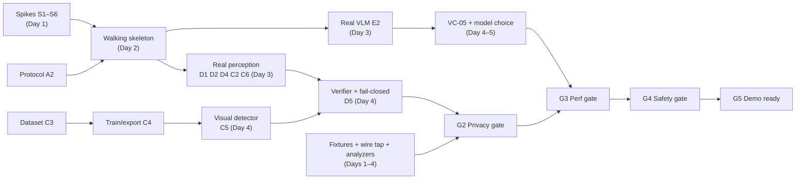

# AEGIS — Implementation Plan

> [!NOTE]
> **CURRENT PROJECT STATE:**
> - Phases A, B, and C are **COMPLETE**.
> - Phase D is **IMPLEMENTED AND TESTED** (`pnpm verify` and privacy tests PASS).
> - **Phase E is the CURRENT ACTIVE IMPLEMENTATION PHASE.**
> 
> *The "Build Workflow at a Glance" and "Day-by-Day Schedule" sections below reflect the original full-project Day 1 to Day 7 plan and are preserved as historical context.*

## Build Workflow at a Glance

*One page: how the application is built, in order. The frontend is the browser extension; the backend is the FastAPI server. Detail for each step is in §7 (work packages) and §9 (schedule).*

1. **Set up the project and shared contracts** — one repo (extension, server, tests) and one shared message format, so both sides always agree. *(Day 1)*
2. **Run the risk-removal experiments** — five half-day tests: AI models in the browser, offline face detection, AI speed on your laptop, screen alignment, keep-alive. Each ends in a go / no-go. *(Day 1)*
3. **Set up the database** — a small SQLite audit log on the server (sessions, actions, timings, safety events). Metadata only — never page content or goal text. *(Days 2–3)*
4. **Draft the backend** — FastAPI WebSocket server with a *scripted stand-in AI* that replies with fixed actions. *(Days 1–2, in parallel with Step 5)*
5. **Draft the frontend** — the extension: goal popup, page reader (screenshot + page structure) and an action runner (click, type, scroll, select). *(Days 1–2, in parallel with Step 4)*
6. **Integrate frontend and backend (walking skeleton)** — type a goal → capture → server → stand-in AI → click on a test page, looping for 3 steps. From here on there is always a working demo. *(Day 2)*
7. **Add on-device perception** — page-structure rules, PII pattern finder (Aadhaar, PAN, card, email, phone), face detector and the small vision model. *(Days 2–4)*
8. **Add the privacy layer** — merge the detector results, blur / mask the screenshot, replace private text with tags, and send nothing if anything fails. *(Days 3–4)*
9. **Connect the real AI** — swap the stand-in for a local vision-language model (Ollama); choose the model by testing. *(Days 3–5)*
10. **Add safety controls** — allowed-action check, risk rules, approval pop-up, local password entry, step limits, cancel button. *(Days 4–6)*
11. **Test and measure** — test pages with fake personal data, a separate wire-tap that watches all traffic, speed and memory runs on a weaker laptop. *(alongside Steps 4–10)*
12. **Polish, rehearse and freeze** — “what the server sees” panel, one-click demo setup, rehearsals, backup recording, code freeze. *(Days 6–7)*

**Rule of thumb:** from Step 6 onward, never break the working loop — each later step upgrades one part of it.

---

## 1. Document Information

| Field | Value |
|-------|-------|
| Document | Implementation Plan |
| Project | AEGIS — Agentic Engine for Guarded Intelligent Surfing |
| Version | 1.0 |
| Status | **Draft for Team Approval** — it contains decisions and spec changes that need a yes/no (§3, §15) |
| Last Updated | 2026-09-21 |
| Team assumption | ~6 people, ~7 working days (TECHNICAL_SPEC §2) → ≈ 42 person-days. Windows 11 development machines. |
| Intended Audience | The whole team; each track owner reads their track (§7) and the shared sections |

> [!IMPORTANT]
> **Capacity check.** The P0 scope in §7 sums to about **50 person-days** against about **42 available**. That is a ~20 % overrun. §11 lists an ordered cut list that recovers about 7.75 pd, which leaves roughly 0.75 pd (under a day) still uncovered — so either add about one day, add a helper, or take one more cut. §9 starts with a walking skeleton so that cuts never leave you without a working system. Confirm real availability before Day 1.

---

## 2. Purpose, Scope, Ownership

### 2.1 What This Document Does

Turns the eight specifications into a buildable plan: technology decisions, repository layout, module-to-spec mapping, work packages with acceptance tests, a day-by-day schedule aligned to the evaluation gates (G0–G5), risk mitigations, and the changes to the specs that implementation will force.

### 2.2 What It Does Not Do

It does not restate the specifications. **The specs remain the source of truth**; where this plan proposes a change, it is recorded as a *spec delta* (§10) and must be approved and reflected in the spec through an ADR before code depends on it.

### 2.3 Conventions

Priorities: **P0** (must, for the demo), **P1** (should), **P2** (stretch). Effort in person-days (pd), PROPOSED. Roles, not names: **R1** Lead/platform, **R2** Browser engineer, **R3** ML engineer, **R4** Privacy/security engineer, **R5** Server/agent engineer, **R6** Evaluation/demo owner.

---

## 3. Key Technical Decisions (ADR Summary)

Each row resolves an open decision from the specs, or fixes a choice the specs left generic. Verified external facts are cited in §3.1.

| ADR | Decision | Rationale | Fallback | Spec item |
|-----|----------|-----------|----------|-----------|
| **ADR-01** | Monorepo: **pnpm workspaces**, TypeScript `strict`, **Vite** multi-entry build for the extension; Python 3.11 + FastAPI + pytest for the server; Vitest, Playwright | One repo, shared types, fast rebuilds; Windows-friendly | npm workspaces | TECHNICAL_SPEC §26.1 |
| **ADR-02** | **Runtime topology:** the service worker (SW) is a thin orchestrator that owns tabs, capture, the Loop Controller, and the WebSocket. An **offscreen document** hosts all ML, canvas work, and screenshot sanitization. Content script does DOM extraction, DOM analysis, heuristics, and execution. | ONNX Runtime Web cannot run in a service worker (dynamic `import()` is disallowed there); the offscreen document is the documented pattern and also gives canvas/WebGPU access | If offscreen proves unstable: run inference in a dedicated worker inside the popup-hosted page (worse) — decided by Spike S1 | OAD-09, AI_ML §7.8 |
| **ADR-03** | **WebSocket lives in the SW**; loop state is persisted to `chrome.storage.session` after every phase; reconnect uses the existing `session_resume` and `ping` messages | The spec forbids assuming the socket keeps the SW alive; the API already has resume | Move the socket to the offscreen document | TECHNICAL_SPEC §3, API_SPEC §7.3/7.7 |
| **ADR-04** | **Privacy by type system:** a branded `Sanitized<T>` type can only be produced by the sanitizer module; the WebSocket client's `send()` accepts only `Sanitized<…>` | Makes "no code path transmits unsanitized data" (PI-03) a **compile-time** property, not a review comment | Lint rule + runtime assertion | PI-03, SEC-03 |
| **ADR-05** | **DOM analysis and heuristic PII run in the content script and strip known-sensitive raw values at the source** before anything is messaged to the SW | Raw values for password/OTP/PII-pattern fields never leave the page's isolated world (PI-05) | Strip in the SW (spec default) | TECHNICAL_SPEC §7.4 |
| **ADR-06** | **Visual model:** fine-tune a small YOLO-class detector on an **auto-generated, DOM-labelled screenshot dataset** (§8); export to ONNX; run via ONNX Runtime Web (WebGPU → WASM). **Licence flag:** Ultralytics/YOLOv8-based detectors, including OmniParser's `icon_detect`, are **AGPL-3.0** | Cheap ground truth (EVALUATION_PLAN §6.3), fully controllable classes, meets the PS's "on-device vision model" requirement | Off-the-shelf pretrained UI detector; a permissively-licensed detector family (verify licence per CP-04) | OAD-01, OAD-ML-01 |
| **ADR-07** | **Face detection:** MediaPipe Tasks Vision `FaceDetector`, short-range model, with the WASM runtime and `.tflite` **bundled inside the extension** (its defaults load from jsDelivr and Google Cloud Storage) | Removes third-party egress (G-11) and satisfies MV3's no-remote-code rule | An ONNX face detector run through the same ORT pipeline | OAD-ML-02, G-11 |
| **ADR-08** | **VLM:** Ollama with a **vision model**, using the `format` JSON-schema parameter for the action object, temperature 0, `keep_alive` set. Candidates benchmarked in VC-05: `qwen3-vl:4b`, `qwen3-vl:8b`, `gemma3` (multimodal size), `qwen2.5vl:3b/7b` | Ollama's structured outputs accept image input; the qwen3-vl 2B/4B/8B builds need Ollama ≥ 0.12.7 | Cloud provider behind the same interface (`vlm_provider=cloud`) | OAD-02 / OAD-AG-01 |
| **ADR-09** | **Single protocol source:** JSON Schemas in `packages/protocol`, code-generated to TypeScript and Pydantic; golden messages from API_SPEC §18 are contract tests | No drift between client and server; validation on both sides for free | Hand-written mirrored types | API_SPEC §20 |
| **ADR-10** | **Redaction rendering:** solid mask for text PII with the category label drawn on it (e.g. `AADHAAR`), **pixelate + blur** for faces, 5 px padding, applied at full resolution, then downscale and encode WebP (~q75) | Masks are irreversible; the drawn label matches the schema placeholder for VLM consistency (spatial consistency, RD-06) | Blur-only (weaker, must pass RD-02) | TECHNICAL_SPEC §10.1 |
| **ADR-11** | **Demo-grade auth:** server binds `127.0.0.1` by default; a pre-shared token from the environment is checked at `session_init`; production auth stays out of scope | OSD-01 is unresolved; localhost binding removes most exposure. The spec's default `0.0.0.0` bind is unsafe on shared venue Wi-Fi | — | OSD-01, TECHNICAL_SPEC §25.2 |
| **ADR-12** | **Safe logging by construction:** all logging goes through `slog` (TS and Python) that accepts only whitelisted field names; `console.*` and `print` are lint-banned | PI-06 enforced at the interface (SECURITY §20) | Code review | PI-06 |

### 3.1 External Facts Verified for This Plan

| Fact | Consequence | Source |
|------|-------------|--------|
| Dynamic `import()` is disallowed in service workers, so ONNX Runtime Web's WebGPU/WASM backends fail there; the working pattern is an offscreen document exchanging messages with the SW | ADR-02; the `offscreen` permission is needed (G-08) | [onnxruntime issue #20876](https://github.com/microsoft/onnxruntime/issues/20876), [Medium write-up](https://medium.com/@GenerationAI/transformers-js-onnx-runtime-webgpu-in-chrome-extension-13b563933ca9) |
| WASM assets must be pointed at extension URLs (`chrome.runtime.getURL`) rather than fetched | Bundle `.wasm` files; set `ort.env.wasm.wasmPaths` | [onnxruntime discussion #23063](https://github.com/microsoft/onnxruntime/discussions/23063) |
| MediaPipe's documented examples load WASM from jsDelivr and the model from `storage.googleapis.com`; self-hosting means downloading both and bundling | ADR-07; egress test CP-05 | [MediaPipe face detector guide](https://developers.google.com/mediapipe/solutions/vision/face_detector) |
| Ollama's `format` JSON-schema parameter works with vision models | ADR-08 | [Ollama structured outputs](https://docs.ollama.com/capabilities/structured-outputs) |
| `qwen3-vl` is on Ollama in 2B (1.9 GB), 4B (3.3 GB), 8B (6.1 GB) and larger sizes; requires Ollama 0.12.7 | Candidate VLMs; resolves the "Qwen3 is text-only" worry (G-10) if the `-vl` build is used | [Ollama library: qwen3-vl](https://ollama.com/library/qwen3-vl) |
| OmniParser v2's `icon_detect` is YOLOv8-based and **AGPL**; `icon_caption` is MIT | Licence flag on ADR-06; record in CP-04 | [OmniParser-v2.0 model card](https://huggingface.co/microsoft/OmniParser-v2.0) |

---

## 4. Repository Layout

```
Aegis/
├── docs/                      # specs + adr/ (new: one file per accepted decision)
├── packages/
│   ├── protocol/              # JSON Schemas + generated TS types + generated Pydantic models
│   ├── shared/                # Sanitized<T> brand, slog, constants (placeholders, error codes, risk keywords)
│   └── core/                  # PURE TypeScript, no chrome.* APIs → fast unit tests
│       ├── heuristics/        #   Aadhaar/PAN/Card/Email/Phone, normalization, Verhoeff, Luhn
│       ├── dom-rules/         #   sensitive-field rules (incl. label-driven, spec delta SD-01)
│       ├── fusion/            #   normalization, IoU merge, priority, fail-safe
│       ├── schema-sanitizer/  #   placeholders, URL normalization, verifier
│       ├── risk-engine/       #   HR-01…07, blocked rules, keyword matcher
│       └── validation/        #   action schema validation, stuck detection
├── extension/
│   ├── manifest.ts            # generated manifest; permission list is one constant (CP-01 diff test)
│   ├── src/background/        # sw.ts, loop-controller.ts, capture.ts, ws-client.ts, session-store.ts, bus.ts
│   ├── src/content/           # extractor.ts, id-registry.ts, executor.ts, observer.ts, analyze.ts
│   ├── src/offscreen/         # runtime.ts, model-manager.ts, visual.ts, face.ts, screenshot-sanitizer.ts, pipeline.ts
│   ├── src/ui/                # popup/, confirm/, local-input/, device-view/
│   └── assets/                # models/*.onnx, mediapipe/*.wasm + *.tflite, hashes.json (never fetched at runtime)
├── server/
│   ├── aegis_server/          # main.py, ws_gateway.py, session.py, orchestrator.py, actions.py,
│   │                          #   providers/{ollama,cloud,mock}.py, audit_db.py, view/ (Server View)
│   │                          #   prompts/system_v1.txt (verbatim BROWSER_AGENT_SPEC §4.2)
│   └── tests/
├── ml/                        # dataset generator, training, ONNX export, quantize, benchmark
├── fixtures/                  # FP-xx pages, ground truth JSON (EVALUATION_PLAN §6)
├── eval/                      # harness, wire-tap proxy, analyzers, runs/ (EVALUATION_PLAN §7.5)
├── demo/                      # Chrome demo-profile setup, reset, preflight, recording notes
└── scripts/                   # verify, build-assets, manifest-audit, secret-scan
```

**Why `packages/core` is pure:** heuristics, fusion, risk engine, sanitization logic, and validation contain the privacy-critical decisions. Keeping them free of `chrome.*` and DOM APIs means they can be tested in milliseconds with plain Vitest, including property-based and fuzz tests (AG-03, PD-01, PD-02).

---

## 5. Architecture-to-Code Map

| Spec component | Code location | Runs in | Notes |
|----------------|---------------|---------|-------|
| Loop Controller (§TECH 3; §AGENT 3.2, 9) | `background/loop-controller.ts` | SW | Phase state machine; state persisted after each phase; owns step counter, stuck/failure detection, termination |
| Screenshot Capture | `background/capture.ts` | SW | `captureVisibleTab`; returns raw bitmap **only** to the offscreen doc; records DPR, zoom |
| DOM Extractor | `content/extractor.ts` | Content | Filtering per TECH §7.3; same-origin iframe recursion with offsets; open shadow roots; stable IDs via `id-registry.ts` |
| DOM Analyzer + Heuristic PII | `content/analyze.ts` → `core/dom-rules`, `core/heuristics` | Content | Strips raw values of flagged fields at source (ADR-05) |
| MutationObserver | `content/observer.ts` | Content | 200 ms debounce, attribute filter, agent-action suppression window |
| Visual ML Engine | `offscreen/visual.ts` | Offscreen | Letterbox → ORT session → NMS → inverse transform |
| Face Detector | `offscreen/face.ts` | Offscreen | Bundled MediaPipe; normalized → pixel coords |
| Local Fusion | `core/fusion` (called from `offscreen/pipeline.ts`) | Offscreen | Deterministic; IoU merge; fail-safe |
| Screenshot Sanitizer | `offscreen/screenshot-sanitizer.ts` | Offscreen | `OffscreenCanvas`; works on a copy |
| Schema Sanitizer + verifier | `core/schema-sanitizer` | Offscreen | Placeholders, URL normalization, `[SANITIZATION_ERROR]` verifier |
| Context Builder | `offscreen/pipeline.ts` | Offscreen | The **only** producer of `Sanitized<ContextUpdate>` |
| WebSocket Client | `background/ws-client.ts` | SW | Accepts only `Sanitized<…>`; backoff, resume, ping |
| Schema Validator, Risk Engine | `core/validation`, `core/risk-engine` | SW | Risk needs per-form sensitivity summaries, kept locally (§9.4) |
| Confirmation UI, Local Input | `ui/confirm`, `ui/local-input` | Extension pages | Pending state owned by the SW, not the popup (AGENT §8.4) |
| Action Executor | `content/executor.ts` | Content | Native value setters, event dispatch, stale-ID handling |
| Popup UI | `ui/popup` | Extension page | Goal (with goal scan, SD-02), status, step n/30, cancel |
| Device View | `ui/device-view` | Extension page | D2/D3 Inspector tier (DEMO_FLOW §8) |
| WS Gateway, Session Manager | `server/ws_gateway.py`, `session.py` | Server | In-memory sessions; step-number correlation; size limits |
| VLM Orchestrator, Action Generator | `orchestrator.py`, `actions.py` | Server | Prompt file + `format` schema; retry once; fail action |
| Audit DB | `audit_db.py` | Server | Tables from DATABASE_SCHEMA §6.6–6.9; metadata only |
| Server View | `server/aegis_server/view/` | Server | Read-only feed of received frames (Inspector D1) |

---

## 6. Core Contracts (Condensed)

Only the types whose misuse creates privacy defects. Everything else is generated from `packages/protocol`.

```ts
// packages/shared — the compile-time privacy boundary (ADR-04)
declare const SANITIZED: unique symbol;
export type Sanitized<T> = T & { readonly [SANITIZED]: true };
// Only screenshot-sanitizer + schema-sanitizer + pipeline.ts may call this.
export function markSanitized<T>(value: T, proof: SanitizationProof): Sanitized<T>;

// ws-client.ts
send(msg: Sanitized<ContextUpdate> | ControlMessage): void;   // raw types do not compile

// packages/core — fusion input/output (AI_ML §10–12)
type Rect = { x: number; y: number; w: number; h: number };    // screenshot pixel space
interface NormalizedSignal {
  source: 'DOM_ANALYSIS' | 'VISUAL_ML' | 'FACE_DETECTION' | 'HEURISTIC_PII';
  elementId: string | null; box: Rect; category: SensitivityCategory;
  confidence: number; evidence: string;                          // evidence never contains raw values
}
interface SensitivityRegion {
  regionId: string; box: Rect; elementId: string | null; category: SensitivityCategory;
  confidence: number; sources: SignalSource[]; action: SanitizationAction; failSafe: boolean;
}

// Local-only, never serialized to the wire (API_SPEC §4.2)
interface FormSensitivity { formId: string; flaggedCount: number; categories: SensitivityCategory[] }
```

`SanitizationProof` is produced only when the verifier passes (TECHNICAL_SPEC §10.4), so `markSanitized` cannot be called on an unverified payload.

---

## 7. Work Packages

Effort is PROPOSED. **Deliverable** is what a reviewer can run; **Accept** ties to an [EVALUATION_PLAN](EVALUATION_PLAN.md) test.

### 7.1 Track A — Foundation and Contracts (R1)

| WP | Work | Deliverable | Accept | pd | Pri |
|----|------|-------------|--------|----|-----|
| A1 | Monorepo scaffold: pnpm workspace, strict TS, ESLint (ban `eval`, `new Function`, `console.*` except `slog`), Prettier, Vitest, Playwright, Python `pyproject` + ruff + pytest | `pnpm verify` runs green on an empty project | CP-02 baseline | 1 | P0 |
| A2 | Protocol package: JSON Schemas for every message in API_SPEC §5–10, Action schema, placeholder enum, error codes; codegen to TS and Pydantic; golden-message contract tests from API_SPEC §18 | `packages/protocol` builds; both sides import generated types | AG-03/07 inputs | 1.5 | P0 |
| A3 | `slog` in TS and Python with whitelisted fields | Logging API + lint ban | RD-11 | 0.5 | P0 |
| A4 | Extension build: Vite multi-entry (SW, content, offscreen, popup, confirm, local-input, device-view); `manifest.ts`; asset copy for models and WASM; CSP with `wasm-unsafe-eval` for extension pages | Loadable unpacked extension | CP-01, CP-02 | 1 | P0 |
| A5 | `scripts/verify`: lint, typecheck, unit tests, manifest-permission diff, bundle secret scan, "no remote URL in bundle" grep | One command gate before push | CP-01…03 | 0.5 | P0 |
| A6 | ADR log; apply approved spec deltas to the docs (§10) | `docs/adr/*.md`, doc PRs | G-14 | 0.5 | P1 |

### 7.2 Track B — Extension Core (R2)

| WP | Work | Deliverable | Accept | pd | Pri |
|----|------|-------------|--------|----|-----|
| B1 | SW skeleton, typed message bus, config store (`server_endpoint`, `max_steps=30`, thresholds, `debug_mode`) | Popup ↔ SW ↔ content messaging works | — | 0.5 | P0 |
| B2 | **DOM extractor**: element filtering, label resolution (`label`, `aria-*`, `placeholder`), visibility, bbox, `parentFormId`, same-origin iframes with offsets, open shadow DOM, cross-origin iframe stub node, stable ID registry (`WeakMap`, no attributes added to the page) | `extractDom()` returns the TECH §7.2 fields | VC-02 | 2 | P0 |
| B3 | MutationObserver (200 ms debounce, attribute filter), navigation events, agent-change suppression window (~300 ms) | Externally-caused changes trigger capture; self-caused do not | VC-06 | 0.5 | P0 |
| B4 | **Capture**: `captureVisibleTab`, DPR/zoom metadata, active-tab and unsupported-page checks (`E-GEN-01`), **post-capture bbox re-read** (SD-06) | Capture + geometry metadata | VC-03, RD-10 | 1 | P0 |
| B5 | **Loop Controller**: phase state machine (AGENT §3.2), persisted state, step counter, SHA-256 stuck detection (3), failure limit (3), timeouts (VLM 30 s, exec 5 s), cancel within 1 s | Full loop with termination reasons | AG-06, AG-09 | 2 | P0 |
| B6 | **Action Executor**: click, type, scroll, select, hover, wait; native value setter + `input`/`change` events; `scrollIntoView`; `E-EXEC-01/02/03` | All eight actions on FP-01 | AG-01 | 1.5 | P0 |
| B7 | Popup: goal input (runs goal scan), status, `Step n / 30`, last action + reasoning, cancel | Usable popup | AG-01, HL-01/02 | 1.5 | P0 |
| B8 | Confirmation and local-input flows; pending state in SW; small extension window as fallback if the popup is closed | HR-04 dialog; `[NEEDS_LOCAL_INPUT]` prompt | AG-04, RD-13 | 1 | P0 |

### 7.3 Track C — Perception ML (R3)

| WP | Work | Deliverable | Accept | pd | Pri |
|----|------|-------------|--------|----|-----|
| C1 | **Offscreen runtime** (after Spike S1): document lifecycle, model manager (load, warm-up, unload), backend selection WebGPU → WASM-MT → WASM, timeouts, degraded flags (`perception_status`) | Offscreen doc runs any ONNX model on both backends | RL-04, RL-06 | 1.5 | P0 |
| C2 | **MediaPipe face detector**, fully bundled (after Spike S2); confidence thresholds; coordinate denormalization | `FaceSignal[]` with zero network calls | PD-04, CP-05 | 1 | P0 |
| C3 | **Dataset generator** (`ml/`): Playwright renders templates × randomized themes, fonts, sizes, DPRs; labels derived from DOM boxes; hard negatives; **split by template, not by image** | ≥ 3 k labelled screenshots + a held-out template set | VC-01 | 2 | P0 |
| C4 | **Train and export**: fine-tune the nano-class detector; ONNX export; check op support on WebGPU and WASM; FP32 first, then FP16/INT8 with accuracy check | Candidate `.onnx` files + a benchmark table | VC-01, RL-06 | 2 | P0 |
| C5 | **Visual pipeline**: letterbox, ORT session, decode, confidence filter, NMS, inverse transform (AI_ML §5.5) | `VisualSignal[]` in screenshot space | VC-01 | 1.5 | P0 |
| C6 | **Fusion** in `core/fusion`: normalization, IoU merge, category priority, fail-safe inclusion, DOM association, thresholds from config; **property tests** for determinism and fail-safe | `SensitivityMap` | PD-05, PD-06 | 1.5 | P0 |
| C7 | Model-selection benchmark script feeding gate G1 | Comparison report | VC-01, RL-06 | 0.5 | P1 |

### 7.4 Track D — Sanitization and Privacy (R4)

| WP | Work | Deliverable | Accept | pd | Pri |
|----|------|-------------|--------|----|-----|
| D1 | **Heuristic PII**: five patterns, normalization (Unicode digits, separators, prefixes), Luhn, Verhoeff, confidences per AI_ML §9; **invalid-checksum control vectors must still be redacted** (G-03) | `core/heuristics` + vector corpus | PD-01, PD-02 | 1.5 | P0 |
| D2 | **DOM sensitive-field rules** including label/`autocomplete`-driven rules for name, account, IFSC, CVV, OTP, toggled passwords (SD-01) | `core/dom-rules` | PD-03, PD-08 | 1 | P0 |
| D3 | **Schema sanitizer**: placeholder vocabulary (API_SPEC §4.3), URL → origin + path, scan of `title`/`label`/`attributes.*` (SD-05), value stripping | Sanitized schema | RD-05 | 1.5 | P0 |
| D4 | **Screenshot sanitizer** (ADR-10): mask + label, pixelate + blur, padding, DPR scaling, downscale, WebP encode | Sanitized screenshot | RD-02, RD-03 | 1.5 | P0 |
| D5 | **Verifier and fail-closed builder**: `Sanitized<T>` production, TECH §10.4 verifier, `[SANITIZATION_ERROR]`, any exception ⇒ no send, user notified (`E-SAN-01`) | Context Builder | RD-07, RD-08 | 1 | P0 |
| D6 | **Goal scanner** (SD-02): heuristics over the goal text in the popup; warn/scrub before send | Goal check | PD-09 | 0.5 | P0 |
| D7 | **Face-unavailable and iframe policies** (SD-03): when the face detector is unavailable, blur every image-like region ≥ 64×64 px and notify; configurable cross-origin iframe policy (`pass`/`blur`) | Policy code | RD-09 | 0.5 | P0 |

### 7.5 Track E — Server and Agent (R5)

> [!NOTE]
> **Phase E is the current active phase.** The historical E1–E7 summary has been replaced by the definitive **Phase E Detailed Implementation Plan** in §18. Please refer to §18 for the canonical E1–E9 work packages.

| WP | Work | Deliverable | Accept | pd | Pri |
|----|------|-------------|--------|----|-----|
| E1–E9 | **See canonical breakdown in §18** | Full agent loop | All E tests | 11.5 | P0/P1 |

### 7.6 Track F — Fixtures, Evaluation, and Demo (R6)

| WP | Work | Deliverable | Accept | pd | Pri |
|----|------|-------------|--------|----|-----|
| F1 | **Fixtures** in priority order: FP-01 (+ `?mode=short`, `?hostile=1`), FP-04, FP-06, FP-07, FP-14, FP-05, FP-13, then FP-02/03/08/09/10/11/12/15/16; ground-truth JSON alongside | Served pages | EVAL §6.1 | 3 | P0 |
| F2 | **PII/canary generator** with per-run unique canaries and Verhoeff/Luhn-valid values | `eval/generators` | PD-01 | 1 | P0 |
| F3 | **Wire-tap proxy + canary matcher + eval-mode guards** (fixture-origin allowlist, `AEGIS_EVAL_MODE`) | Independent evidence source | RD-01 | 1.5 | P0 |
| F4 | **Playwright harness**: headed Chrome with the extension, run manifests, telemetry collectors (CDP, process sampler) | `eval/harness` | All suites | 2 | P0 |
| F5 | **Analyzers**: region matcher, OCR residual audit, independent face-check, pixel-coverage, log/disk grep | `eval/analyzers` | RD-01…04, RD-11/12 | 2 | P0 |
| F6 | Report generator and scorecard | `eval/runs/*/report.md` | EVAL §17 | 0.5 | P1 |
| F7 | **Device View** (D2/D3): stage latency, gauges, detection overlay by signal | Inspector panels | DEMO §8 | 1 | P1 |
| F8 | **Demo ops**: hardened Chrome profile, `demo-reset`, preflight checks PC-01…12, recording setup | `demo/` scripts | DEMO §14–15 | 1 | P0 |

### 7.7 Effort Summary

| Track | P0 (pd) | P1 (pd) |
|-------|---------|---------|
| A Foundation | 4.5 | 0.5 |
| B Extension core | 10 | 0 |
| C Perception ML | 9.5 | 0.5 |
| D Sanitization | 7.5 | 0 |
| E Server and agent | 10.5 | 1 |
| F Eval and demo | 10.5 | 1.5 |
| **Total** | **52.5** | **3.5** |

---

## 8. De-Risking Spikes (Day 1, before feature work)

Each spike is time-boxed to half a day and ends in a written go/no-go. They decide ADR-02, -03, -06, -07, -08 and the open decisions OAD-01, OAD-09, OAD-02.

| Spike | Owner | Question | Go criterion | If no-go |
|-------|-------|----------|--------------|----------|
| **S1** ML runtime | R3 | Can ONNX Runtime Web run a small model in an MV3 **offscreen document** on WebGPU **and** WASM, with bundled `.wasm` and `wasm-unsafe-eval`? | Inference completes on both backends; warm-up measured | Reduce to WASM-only; if that fails, reassess runtime (Transformers.js has the same constraints) |
| **S2** Face offline | R3 | Does MediaPipe `FaceDetector` run from bundled files with zero network calls? | DevTools shows no external requests; detects a test face | Use an ONNX face detector through the S1 runtime |
| **S3** VLM latency | R5 | On the demo laptop, what are p50/p95 for `qwen3-vl:4b/8b`, `gemma3`, `qwen2.5vl` with a 1280×720 image plus JSON-schema `format`? | p50 ≤ ~4 s per step with valid JSON ≥ 95 % | Smaller model/image; or cloud provider and re-plan DEMO_FLOW OQ-DF-02 |
| **S4** Geometry | R2 | Do DOM boxes map to screenshot pixels within 2 px at DPR 1, 1.25, 1.5 and zoom 100–150 %? | ≤ 2 px mean error (VC-03) | Add explicit DPR/zoom compensation; treat the mismatch as a fail-closed condition |
| **S5** SW lifetime | R1 | Does the loop survive SW termination using `storage.session` + `session_resume`? | Kill the SW mid-step; the session resumes | Move the socket and loop host to the offscreen document (ADR-03 fallback) |
| **S6** Skeleton scaffold | R1 | Repo, protocol codegen, and loadable extension exist | `pnpm verify` green; extension loads | — |

---

## 9. Schedule and Milestones

### 9.1 Principle: Walking Skeleton First

By the **end of Day 2** a crude end-to-end loop must exist — goal → capture → trivial sanitize → WebSocket → **mock** VLM → validate → execute on FP-01 — with the wire tap already recording. Every later change is an improvement to a working system, and every cut leaves something demonstrable.

### 9.2 Day-by-Day

| Day | Milestone | Track focus | Gate |
|-----|-----------|-------------|------|
| **1** | **M0 Foundations** | R1: S5, S6, A1–A4. R2: B1, S4. R3: S1, S2 (then C1). R4: D1 start. R5: S3, E1 start. R6: F1 (FP-01), F2 | Spikes decided; ADRs recorded |
| **2** | **M1 Walking skeleton** | R2: B2, B4, B5 (basic), B6. R5: E1, E3 (mock provider). R1: A2, integration. R6: F3 wire tap. R4: D3 (basic placeholders). R3: C3 dataset start | **G0**: RD-01 runs end to end on FP-01 (may fail) |
| **3** | **M2 Real perception** | R4: D1, D2, D4. R3: C2, C6, C5 (with an interim pretrained detector), C4 training. R5: E2 (Ollama), E4. R2: B3, B7. R6: F4, F1 continues | PD-01 results; first RD-01/02 numbers |
| **4** | **M3 Safe and selective** | R3: C4/C5 integrate the fine-tuned model. R4: D5 (verifier, fail-closed), D6, D7. R2: B8 (confirmation), risk engine wiring. R5: E5 (Server View), E6 (VC-05 runs). R6: F5 analyzers | **G1** model chosen; **G2** privacy gate attempted |
| **5** | **M4 Robust and measured** | R2: local input, stuck/failure paths, perf. R3: quantization, thresholds (PD-06). R6: RL suites. R5: prompt tuning, VLM choice frozen. R4: RD-07/09/10/11/12 | **G3** performance gate; OAD-02 resolved |
| **6** | **M5 Safety and rehearsal** | R4/R5: AG-02/04/05/06/08/09. R6: F8, rehearsals R1–R3. R1: bug triage, doc updates. Everyone: defect burn-down | **G4** safety gate |
| **7** | **M6 Freeze and demo** | Code freeze; R4–R6 rehearsals; golden-run recording; evidence pack; scoreboard filled with MEASURED values | **G5** DEMO_FLOW §14 gates |

### 9.3 Dependency Overview



**Critical path:** S1 → C1 → C5 → D5 → G2 → G3 → G5, with the model-training chain (C3 → C4) as the longest single dependency. Start C3 on Day 2 and keep an interim pretrained detector so that C4's outcome cannot block integration.

---

## 10. Spec Deltas Implementation Will Force

Implementing the specs as written would knowingly reproduce the gaps in [EVALUATION_PLAN §18](EVALUATION_PLAN.md). These are the proposed changes; each needs a yes/no and an ADR, then a doc edit.

| Delta | Change | Closes | Cost | Default |
|-------|--------|--------|------|---------|
| **SD-01** | Add label/`autocomplete`/`name`-driven DOM rules for name, bank account, IFSC, CVV, DOB, OTP (any `type`), and toggled passwords; map to `GENERIC_PII` or existing categories | G-01, G-02, G-05 | ~1 pd inside D2 | **Adopt** |
| **SD-02** | Scan the goal text locally in the popup; warn or scrub before it can be sent | G-04 | 0.5 pd (D6) | **Adopt** |
| **SD-03** | If the face detector is unavailable, blur all image-like regions ≥ 64×64 px and notify (instead of proceeding with faces exposed) | G-06 | 0.5 pd (D7) | **Adopt** |
| **SD-04** | Bundle all model and WASM assets; forbid runtime CDN fetches; enforce with CP-05 and a bundle grep | G-11 | Included in A4/A5 | **Adopt** |
| **SD-05** | Schema `url` = origin + path only; run heuristics over `title`, `label`, `attributes.*` | G-12 | Included in D3 | **Adopt** |
| **SD-06** | Re-read bounding boxes after capture; if any moved > 2 px, retry or fail closed | G-13 | Included in B4 | **Adopt** |
| **SD-07** | Accept the `offscreen` permission (required by ADR-02); avoid `webNavigation` (use `tabs.onUpdated`); update SE-02, SAC-11, OSD-03 | G-08 | Doc change | **Adopt** |
| **SD-08** | Server binds `127.0.0.1` by default (spec says `0.0.0.0`) | ADR-11 | Trivial | **Adopt** |
| **SD-09** | Risk keywords: whole-word matching for short tokens, add `aria-label`/`title` and Hindi terms | G-15 | ~0.5 pd in risk engine | **Adopt** (P1 for Hindi) |
| **SD-10** | Documentation clean-up (OAD numbering, stale checklist items, `max_steps`) and correct G-10 to "confirm the `-vl` build" | G-10, G-14 | 0.5 pd (A6) | **Adopt** |

---

## 11. Scope Management

### 11.1 Ordered Cut List (against an ~8.5 pd overrun; all nine cuts recover ~7.75 pd)

Apply from the top until the plan fits confirmed capacity. Each keeps the demo intact. Taking all nine still leaves ~0.75 pd, so plan for one extra day or one extra person-day of help.

| # | Cut | Saves | Consequence |
|---|-----|-------|-------------|
| 1 | Train on a smaller dataset; start from a pretrained detector; skip INT8 | ~2 pd | Lower mAP; report honestly (VC-01) |
| 2 | Trim fixtures to FP-01, FP-04, FP-06, FP-07, FP-14 (+ FP-13 for injection) | ~1 pd | Fewer PD-07 variants |
| 3 | Audit DB (E4) to P1: log to the Server View only | ~1 pd | RD-12 checks fewer tables |
| 4 | Analyzers: keep region matcher, OCR residual, pixel coverage; drop the independent face-check | ~1 pd | RD-02 face proof weaker |
| 5 | Popup minimal; no styling | ~0.5 pd | — |
| 6 | VC-05 on ~20 states instead of 40 | ~0.5 pd | Wider intervals |
| 7 | Skip Device View entirely; rely on Server View + popup preview | ~1 pd (F7) | Weaker criterion-2/4 visuals |
| 8 | Local-input prompt → fallback (presenter types on the page) | ~0.5 pd | DEMO B6 changes (OQ-DF-04) |
| 9 | Hostile-banner live behaviour → "assume the worst" simulation only | ~0.25 pd | DEMO B5 changes (OQ-DF-06) |

### 11.2 What Must Never Be Cut

Wire-tap audit (F3), fail-closed behaviour (D5), the `Sanitized<T>` boundary (ADR-04), the confirmation gate (B8), the mock-provider walking skeleton (E3), and the demo hardening (F8). These are what make the claims true and the demo safe.

### 11.3 If Only N Days Are Available

| Days | Ship |
|------|------|
| 4 | Skeleton + DOM/heuristic/face sanitization + real VLM + confirmation + wire audit. Visual detector = a pretrained model, unfine-tuned. |
| 5–6 | Add the fine-tuned detector, fail-closed verification suite, local input, Server View. |
| 7 | Everything above plus Device View, full suites, rehearsals. |

---

## 12. Implementation Notes and Pitfalls

Design detail that the specs leave open and that commonly costs days.

### 12.1 Geometry

- DOM boxes are CSS pixels relative to the viewport; the capture is in **device pixels**. Multiply by DPR, and account for browser zoom. Validate with S4 markers before anything else.
- Take DOM boxes **after** the screenshot resolves and compare with the pre-capture read (SD-06); mismatch → retry, else fail closed.
- Redact at **full resolution first**, then downscale for transmission. Downscaling before redaction lets boxes drift.
- Cross-origin iframes: emit a node with the iframe's own box; content is visible only to the visual model. Provide the `iframe_policy` switch (D7).

### 12.2 Element IDs and the Page

- Keep an `id-registry` mapping `el-N` → `WeakRef<Element>` in the content script. **Do not write attributes onto the page** — pages can detect and tamper with them.
- On every extraction, generate a new snapshot version; an action that names an ID from an older version returns `E-EXEC-01` rather than acting on the wrong element.
- Extract text nodes for heuristics but attribute matches to the **nearest interactive or block ancestor's** box; the schema and screenshot are then redacted at element granularity (AI_ML §9.5).

### 12.3 Executing Actions

- Frameworks such as React ignore a plain `el.value = x`. Use the native setter from `HTMLInputElement.prototype`, then dispatch bubbling `input` and `change` events.
- `element.click()` is untrusted and skips some pointer events. It suffices for fixtures; note the limitation for real sites.
- `hover` dispatches mouse events but cannot trigger the CSS `:hover` state — record as a known limit.
- Always `scrollIntoView` and re-check visibility and `disabled` before acting.

### 12.4 Perception Pipeline

- Run visual ML and face detection concurrently with a per-signal timeout (3 s proposed). A timeout returns an empty signal array and sets `perception_status` (AI_ML §16).
- Warm up every model at load with a dummy input (WebGPU shader compilation) and **do not** count it in latency stats.
- Prefer FP32 first; FP16 on WebGPU needs adapter support and INT8 can cost accuracy — quantize only after VC-01 is measured on the float model.
- MV3: keep the offscreen document alive for the whole session; reload models on demand after a browser restart, and report the cold-start cost.

### 12.5 Sanitization

- Draw the category label on each mask (e.g. `PAN`) so the image and the schema placeholder agree.
- Faces: pixelate with blocks proportional to the face box, then blur; verify with the independent detector (RD-02).
- The verifier walks the finished schema against the sensitivity map and replaces any surviving flagged value with `[SANITIZATION_ERROR]`; if any replacement was needed, treat the cycle as a defect signal in eval mode.
- Any thrown exception anywhere between capture and `markSanitized` ⇒ **no transmission** and a user-visible message.

### 12.6 Risk Engine Needs Local Context

HR-04 and HR-05 depend on how many sensitive fields sit in the form being submitted. The sensitivity map lives in the offscreen document, but validation runs in the SW. So each cycle the pipeline also returns a local-only `FormSensitivity[]` summary (§6) that the SW keeps for the next validation. It is **never** put in a wire payload (API_SPEC §4.2 lists the sensitivity map as prohibited).

### 12.7 Server and Prompting

- Store the system prompt as a versioned file; load it verbatim so BROWSER_AGENT_SPEC §4.2 stays the single source.
- Pass the action JSON schema as Ollama's `format`, and also include it in the prompt text; temperature 0; cap `num_predict`.
- Enforce server-side: step-number correlation (reject stale), payload size, one action per response, `fail` fallback after one retry.
- The server must treat page text as untrusted: never interpolate it into the system prompt; it appears only inside the structured schema block.
- Keep the model warm (`keep_alive`), and make the first request part of preflight.

### 12.8 Local Input and Confirmation UI

- The popup closes when it loses focus, so neither flow may live only there. The SW owns pending state; use `chrome.action.openPopup()` where permitted, otherwise a small `chrome.windows.create({type:'popup'})` window.
- The resolved local value exists only in the content script's execution closure; it is written to the field and dropped. Never in history, logs, or messages (PI-02, RD-13).

---

## 13. Environment and Model Pipeline

### 13.1 Prerequisites (Windows 11)

Node 20+, pnpm, Python 3.11 with `uv` or `venv`, Git, a **pinned** Chrome build (auto-update off for the demo profile), a recent GPU driver, and Ollama ≥ 0.12.7 (for the `qwen3-vl` builds). A GPU for training the detector is optional if a hosted notebook is available.

### 13.2 First-Day Commands (after A1/A4 exist)

```powershell
pnpm install
pnpm verify
pnpm --filter extension build     # then load extension/dist as an unpacked extension
uv venv; uv pip install -e server
uv run uvicorn aegis_server.main:app --host 127.0.0.1 --port 8000
ollama pull qwen3-vl:4b
```

### 13.3 Detector Pipeline (`ml/`)

| Step | Detail |
|------|--------|
| 1 Generate | Playwright renders template pages with randomized theme, font, density, DPR; boxes come from the DOM; class set: `button`, `input_field`, `text_region`, `link`, `image`, `icon`, `dropdown`, `checkbox`, `radio` |
| 2 Split | **By template**, so the held-out set tests generalization, not memorization |
| 3 Train | Fine-tune a nano-class detector from a pretrained checkpoint; record the licence |
| 4 Export | ONNX; verify with `ort.InferenceSession.create` on WebGPU and WASM inside the extension (not only in Node) |
| 5 Evaluate | VC-01 on the held-out templates and on hand-labelled real-structure pages |
| 6 Freeze | SHA-256 into `assets/models/hashes.json`; the extension refuses to load a mismatching file (SEC-13) |

Datasets such as WebPII (cited in the PPT) are optional stretch material; check licence before use (CP-04, OED-03).

---

## 14. Testing and Quality Gates

| Layer | Tooling | What it covers |
|-------|---------|----------------|
| Unit / property | Vitest (`packages/core`), pytest | Heuristics vectors, fusion determinism and fail-safe, risk classification, validator fuzz (AG-03), stuck detection |
| Contract | Generated types + golden messages | Client/server agreement (API_SPEC §18) |
| Integration | Playwright + real extension on FP pages, **mock VLM** | Full loop deterministically, including failure injection (RD-07) |
| Evaluation | `eval/` harness | All suites in EVALUATION_PLAN |
| Static | ESLint (no eval, no `console`), manifest diff, bundle secret and remote-URL scan | CP-01…03 |

**Pre-push gate (`pnpm verify`):** lint, types, unit, manifest-permission diff, bundle scan.
**Privacy regression gate:** an RD-01 smoke run on FP-01 with the mock VLM on every merge to the main branch. **A single canary hit blocks the merge.**

**Definition of Done for any WP:** code + tests + safe-logging compliance + no new permission + acceptance test named in the table passes + the relevant spec item updated or a delta recorded.

---

## 15. Risk Register

| # | Risk | L | I | Mitigation | Trigger → fallback |
|---|------|---|---|-----------|--------------------|
| R-01 | ONNX Runtime Web fails in the offscreen doc (WebGPU or WASM) | M | H | Spike S1 on Day 1; bundle WASM; CSP `wasm-unsafe-eval` | S1 fails → WASM-only; then reassess runtime |
| R-02 | Fine-tuned detector is weak or late | M | H | Interim pretrained model; DOM-labelled data; timebox C4 at 2 pd | mAP < target at Day 4 → ship interim model, report honestly |
| R-03 | VLM too slow on demo laptop | M | H | Spike S3; smaller model/image; `keep_alive`; cloud provider ready | p50 > ~4 s → cloud VLM or smaller model (DEMO OQ-DF-02) |
| R-04 | Redaction misaligned at non-100 % scaling | M | H | S4 first; RD-10 matrix; SD-06 re-read; fail closed | Any misalignment → block until fixed |
| R-05 | A missed PII category appears on stage | M | H | SD-01…03; only validated pages on stage (DEMO DP-06); DG-02 | Any hit in rehearsal → fix or remove the field from the page |
| R-06 | SW terminates mid-session | M | M | ADR-03; state persisted; resume; S5 | Frequent → move socket/loop to offscreen |
| R-07 | Scope overrun (~20 % over capacity) | H | H | §11 cut list; walking skeleton first; daily burndown | Day 4 behind → apply cuts 1–5 immediately |
| R-08 | Licence problem (AGPL detector, model terms) | M | M | Record per model (CP-04); prefer permissive if cost is low | Reviewer objection → swap detector family |
| R-09 | Chrome update changes behaviour before demo | L | H | Pin Chrome; disable auto-update; DG-09 | — |
| R-10 | Prompt injection derails the live demo | M | M | Simulation fallback (DEMO OQ-DF-06); rehearse R3 | Model follows the banner → simulation only |
| R-11 | Debug logging leaks a value | L | H | `slog` whitelist + lint ban; RD-11 | Any hit → P0 defect |
| R-12 | Single person owns a critical piece | M | M | Pair on ADR-02/03 pieces; DG-10 two-operator rule | — |

(L = likelihood, I = impact; H/M/L.)

---

## 16. Traceability

| Requirement group | Work packages |
|-------------------|---------------|
| FR-01…03 capture, DOM, debounce | B2, B3, B4 |
| FR-04…06 visual ML, faces | C1–C5 |
| FR-07…09 DOM rules, heuristics, fusion | D1, D2, C6 |
| FR-10…13 redaction, transmission, WebSocket | D3, D4, D5, E1, ADR-03/04 |
| FR-14…16 server VLM, action schema | E1–E3, A2 |
| FR-17…18 validation, risk, confirmation | Core `risk-engine`/`validation`, B8 |
| FR-19…23 execution, loop, failure | B5, B6 |
| FR-24 local or cloud VLM | E3 |
| NFR-01/02, PV-01…08, SEC-01…04 | ADR-04/05, D3–D5 |
| NFR-06/07, PF-01…09 | C1, C5, D4 (encode/downscale), RL suites |
| SE-01/02/07, SEC-13 | A1, A4, A5, C4 hashes |
| Evaluation suites | F1–F6 |
| Demo Inspector, demo ops | E5, F7, F8 |

---

## 17. Decisions Needed From the Team

| # | Decision | Recommended |
|---|----------|-------------|
| 1 | Confirm capacity (people × days) and role assignment R1–R6 | Do before Day 1 |
| 2 | Approve ADR-02 (offscreen ML) and ADR-03 (socket in SW) | Approve; validated by S1/S5 |
| 3 | Approve spec deltas SD-01…SD-10 (§10) | Approve all; SD-09 Hindi terms as P1 |
| 4 | Detector strategy and licence stance (ADR-06): accept AGPL for the prototype, or require a permissive family | Accept for the prototype, record in CP-04, prefer permissive if trivial |
| 5 | Local vs cloud VLM (DEMO OQ-DF-02) | Decide at S3 from measured latency |
| 6 | Build the Inspector? (DEMO OQ-DF-05) | Server View (E5) yes; Device View only if capacity allows |
| 7 | Adopt the cut list order in §11.1 | Yes, agree it now rather than under pressure |

---

---

## 18. Phase E — Detailed Implementation Plan (Server / Agent / Decision / Safe-Action)

### 18.1 Phase E Objective

Phase E turns the sanitized browser context produced by Phases A–D into a controlled agent loop. The server receives `Sanitized<ContextUpdate>` over WebSocket, invokes a VLM provider (starting with the deterministic Mock VLM), validates the proposed action, evaluates risk, and returns a schema-valid action for client-side execution.

**VLM is UNTRUSTED.** The VLM proposes actions; deterministic server-side validation, schema checking, and safety policy remain authoritative.

```
Extension → Sanitized Context → WebSocket → Session Manager → Agent Orchestrator
→ VLM Provider → Proposed Action → Schema Validation → Target / State Validation
→ Risk & Safety Validation → Approved Action → WebSocket → Extension → Action Result → Next Cycle
```

### 18.2 Phase E — Privacy Boundary Map

Phase E code operates entirely on the server side of the privacy boundary. All data arriving at the server has already passed through the `Sanitized<T>` gate (ADR-04). The following are **prohibited from ever being present on the server**:

| Prohibited Data | Enforcement |
|----------------|-------------|
| Raw DOM | Never transmitted by client (PI-01). Server protocol models have no field for it. |
| Raw screenshot | Never transmitted. Server sees only `sanitized_screenshot` (base64 WebP, regions destroyed). |
| Raw PII values (Aadhaar, PAN, card, email, phone) | Replaced by `[REDACTED_*]` placeholders in `sanitized_schema` before transmission (PI-02). |
| Passwords and OTPs | Replaced by `[REDACTED_PASSWORD]` / `[REDACTED_OTP]` (PI-02). |
| Credentials, auth tokens, cookies | Never collected or transmitted (PI-06). |
| `localStorage` / `sessionStorage` | Not transmitted (TECHNICAL_SPEC §11.2). |
| Raw SensitivityMap | Local-only. Never serialized to the wire (API_SPEC §4.2). |
| `[NEEDS_LOCAL_INPUT]` resolved values | Never transmitted. Only `LOCAL_INPUT_PROVIDED` status crosses the boundary. |

**Server-side enforcement points:**
- `protocol.py` Pydantic models: only accept `SanitizedSchema` / `sanitized_screenshot` fields — no raw data fields exist in the schema.
- `slog.py`: whitelisted fields only. No raw content can appear in logs.
- `audit_db.py` (if enabled): `action_value_safe` is never raw PII. `vlm_reasoning` is untrusted metadata — never executable, never contains PII.
- VLM prompt construction: page text is placed inside a structured schema block, never interpolated into the system prompt. Reasoning text is never treated as executable instructions.

### 18.3 Dependency Graph

```
E1 (Gateway Hardening)
 │
 ├──→ E2 (Session Management)
 │     │
 │     ├──→ E3 (VLM Provider / Mock)
 │     │     │
 │     │     └──→ E4 (Agent Orchestrator)
 │     │           │
 │     │           ├──→ E5 (Action Validation)
 │     │           │     │
 │     │           │     └──→ E6 (Risk / Safety Engine)
 │     │           │
 │     │           └──→ E7 (Audit Persistence) [optional, parallel with E5/E6]
 │     │
 │     └──→ E8 (Server View) [parallel with E4–E6]
 │
 └──→ E9 (Evaluation Harness) [after E3–E6]
```

**Implementable sequence:** E1 → E2 → E3 → E4 → E5 → E6 → E7 (optional) / E8 (parallel) → E9

### 18.4 Work Packages

---

#### WP E1 — Server / WebSocket Gateway Hardening

| Field | Value |
|-------|-------|
| **ID** | E1 |
| **Name** | Server / WebSocket Gateway Hardening |
| **Objective** | Harden the existing FastAPI WebSocket gateway with proper protocol validation, size limits, timeouts, error codes, demo-grade token auth, and safe disconnect handling. |
| **Dependencies** | None (builds on existing Phase A skeleton) |

**Existing files/components reused:**
- [`server/aegis_server/main.py`](file:///c:/Users/ishan/OneDrive/Desktop/Aegis/server/aegis_server/main.py) — FastAPI app
- [`server/aegis_server/ws_gateway.py`](file:///c:/Users/ishan/OneDrive/Desktop/Aegis/server/aegis_server/ws_gateway.py) — WebSocket handler
- [`server/aegis_server/protocol.py`](file:///c:/Users/ishan/OneDrive/Desktop/Aegis/server/aegis_server/protocol.py) — Pydantic models
- [`server/aegis_server/slog.py`](file:///c:/Users/ishan/OneDrive/Desktop/Aegis/server/aegis_server/slog.py) — Safe logging
- [`packages/shared/src/constants.ts`](file:///c:/Users/ishan/OneDrive/Desktop/Aegis/packages/shared/src/constants.ts) — `E-SRV-*` error codes

**Files expected to be created/modified:**
- `server/aegis_server/ws_gateway.py` — major hardening
- `server/aegis_server/main.py` — `127.0.0.1` bind enforcement, Sec-WebSocket-Protocol
- `server/aegis_server/protocol.py` — add `session_resume` handling validation
- `server/tests/test_ws_gateway.py` — expanded test suite

**Implementation tasks:**
1. **Message size limit:** reject WebSocket text frames exceeding ~2 MB with `E-SRV-03` error and close the socket cleanly.
2. **Envelope validation:** validate every inbound message against `BaseEnvelope` before type dispatch. Reject malformed envelopes with `E-PROTO-01`.
3. **Unknown message types:** silently discard with a `slog.warn` (no raw content logged), per API_SPEC §5.2.
4. **`session_resume` handling:** implement `session_resume` → `session_resumed` flow. If the session exists and is in `DISCONNECTED_GRACE` state, resume. If expired or unknown, return `session_error`.
5. **Step-number correlation:** reject `context_update` if `payload.step_number` does not equal `session.current_step` (server-side defense-in-depth). Return `E-SRV-05`.
6. **Demo-grade token auth (ADR-11):** read `AEGIS_AUTH_TOKEN` from environment. If set, validate against the token provided via the approved transport mechanism (e.g., query parameter or auth header). The auth token must never be logged, persisted in the audit DB, exposed in Server View, or included in VLM prompts. If not set, skip auth (localhost demo mode). `127.0.0.1` bind by default.
7. **Connection lifecycle timeouts:** idle connection timeout (no messages for 120 s → close). VLM timeout at `context_update` processing (30 s default → `E-SRV-06`).
8. **Ping/pong keep-alive:** existing implementation works; add heartbeat timeout tracking to session state.
9. **Graceful disconnect/reconnect:** on `WebSocketDisconnect`, transition session to `DISCONNECTED_GRACE` state. Start a reconnect grace timer (60 s configurable). If reconnect arrives, resume. If timer expires, terminate session and release all session data.
10. **Error code standardization:** use `E-SRV-01` through `E-SRV-08` per `packages/shared/src/constants.ts`. Ensure all error responses use `SessionErrorMessage`.

**Protocol/API changes:** None. Uses existing message types. `session_resume` handler is new server-side logic for an already-defined protocol message.

**Privacy/security requirements:**
- Error messages must never include raw payload content. Use error codes and safe descriptions only.
- `slog` for all logging — no `print()` or `logging.getLogger()`.
- Bind `127.0.0.1` by default (ADR-11, SD-08).

**Tests required:**
| Test | Type | Description |
|------|------|-------------|
| `test_malformed_json_rejected` | Unit | Send non-JSON text → expect `E-PROTO-01` error |
| `test_unknown_message_type_discarded` | Unit | Send `{"type":"invented"}` → no crash, no response |
| `test_oversized_message_rejected` | Unit | Send >2 MB text frame → expect `E-SRV-03` or socket close |
| `test_missing_envelope_fields` | Unit | Omit `type`/`timestamp` → expect `E-PROTO-01` |
| `test_step_number_correlation` | Unit | Send `context_update` with wrong step_number → expect `E-SRV-05` |
| `test_session_resume_valid` | Integration | Disconnect, reconnect with `session_resume`, verify session resumes |
| `test_session_resume_expired` | Unit | Resume unknown session → expect `session_error` |
| `test_idle_timeout` | Integration | Connect without sending → expect disconnect after timeout |
| `test_ping_pong` | Unit | Send `ping` → receive `pong` with matching session_id |
| `test_auth_token_when_configured` | Unit | Set `AEGIS_AUTH_TOKEN`, send init without token → reject |
| `test_existing_walking_skeleton_regression` | Regression | Existing `test_websocket_walking_skeleton_cycles` still passes |

**Acceptance criteria:**
- All `E-SRV-*` error codes are exercised in tests.
- Oversized, malformed, and invalid messages never crash the server.
- `session_resume` works for disconnected sessions within grace period.
- Walking skeleton test (Phase A) remains green.
- Server binds `127.0.0.1` by default.

**Verification commands:**
```powershell
cd c:\Users\ishan\OneDrive\Desktop\Aegis
python -m pytest server/tests/test_ws_gateway.py -v
pnpm verify
```

**Definition of Done:** All gateway tests pass. No `print()` statements. All logging through `slog`. Existing A–D tests remain green. Server binds `127.0.0.1`. Oversized/malformed messages handled gracefully.

---

#### WP E2 — Session Management

| Field | Value |
|-------|-------|
| **ID** | E2 |
| **Name** | Session Management |
| **Objective** | Extend the existing `SessionManager` with full lifecycle, state machine, isolation, reconnect semantics, and privacy constraints. |
| **Dependencies** | E1 |

**Existing files/components reused:**
- [`server/aegis_server/session.py`](file:///c:/Users/ishan/OneDrive/Desktop/Aegis/server/aegis_server/session.py) — `Session` and `SessionManager`

**Files expected to be created/modified:**
- `server/aegis_server/session.py` — major expansion
- `server/tests/test_session.py` — new test file

**Implementation tasks:**
1. **Session state machine:** Add `state` field: `INIT → ACTIVE → WAITING_CONTEXT → INFERRING → DISCONNECTED_GRACE → TERMINATED`. Enforce valid state transitions.
2. **Session isolation:** Each session has its own `goal`, `action_history`, `current_step`, `max_steps`. No cross-session data access.
3. **Action history window:** Implement a FIFO deque of the last 5 `ActionHistoryItem` objects per session (per DATABASE_SCHEMA §6.5). Include `step_number`, `action_type`, `target`, `value` (safe only — `[LOCAL_INPUT_PROVIDED]` for sensitive), `reasoning`, `execution_success`, `error_code`.
4. **Step counting:** Enforce server-side `max_steps` (min of client and server). Reject `context_update` if `step_number > max_steps`. Return `session_error` with termination signal.
5. **Reconnect grace:** Store `disconnect_time`. Allow reconnection within grace period (60 s default, configurable). On reconnect, verify `last_known_step` vs `session.current_step`. Respond with `session_resumed`.
6. **Session termination:** On `session_end`, transition to `TERMINATED`, clear `action_history`, clear `latest_context` (sanitized screenshot/schema). Session data must not persist after termination.
7. **Latest context buffer:** Store the most recent `sanitized_screenshot` and `sanitized_schema` per session (for VLM prompt assembly). Replace on every `context_update`. Purge on session close.
8. **Concurrent sessions:** Support multiple simultaneous sessions (keyed by `session_id`). No global state shared between sessions.
9. **Session cleanup:** Background cleanup of stale `DISCONNECTED_GRACE` sessions after grace period expires.
10. **Privacy invariant:** `Session` must never store raw PII, passwords, raw DOM, raw screenshots. Only sanitized data arrives at the server.

**Protocol/API changes:** None. Implements behavior for existing protocol messages.

**Privacy/security requirements:**
- `action_history` must record `[LOCAL_INPUT_PROVIDED]` instead of sensitive values.
- `goal` text is stored in memory only while session is active. Cleared on termination.
- All session data is in-memory only. No disk persistence of session state.

**Tests required:**
| Test | Type | Description |
|------|------|-------------|
| `test_session_state_transitions` | Unit | Verify valid state transitions; reject invalid ones |
| `test_session_isolation` | Unit | Create two sessions; verify no cross-session data leakage |
| `test_action_history_fifo` | Unit | Record >5 actions; verify window slides correctly |
| `test_max_steps_enforcement` | Unit | Session at max_steps rejects further context_updates |
| `test_session_termination_cleanup` | Unit | After `terminate()`, action_history and context are cleared |
| `test_reconnect_within_grace` | Unit | Disconnect and reconnect within 60 s → resumed |
| `test_reconnect_after_grace_expired` | Unit | Disconnect and attempt reconnect after 61 s → rejected |
| `test_concurrent_sessions` | Unit | Create/interact with two sessions simultaneously |
| `test_action_history_sensitive_value_redacted` | Privacy | Store action with `[NEEDS_LOCAL_INPUT]` → value stored as `[LOCAL_INPUT_PROVIDED]` |

**Acceptance criteria:**
- Session state machine enforced. Invalid transitions raise errors.
- Terminated sessions release all data.
- Action history window size ≤ 5.
- Concurrent sessions do not interfere.

**Verification commands:**
```powershell
python -m pytest server/tests/test_session.py -v
pnpm verify
```

**Definition of Done:** Session lifecycle fully managed. State transitions enforced. Action history window operational. Concurrent sessions isolated. All session tests pass. A–D tests remain green.

---

#### WP E3 — VLM Provider / Mock Provider

| Field | Value |
|-------|-------|
| **ID** | E3 |
| **Name** | VLM Provider Abstraction and Mock Provider |
| **Objective** | Define a formal provider interface (abstract base class), harden the Mock VLM for deterministic testing with configurable scripted action sequences, and harden the Ollama provider with proper timeout/error/retry behavior. |
| **Dependencies** | E2 |

**Existing files/components reused:**
- [`server/aegis_server/providers/mock.py`](file:///c:/Users/ishan/OneDrive/Desktop/Aegis/server/aegis_server/providers/mock.py) — MockVLMProvider
- [`server/aegis_server/providers/ollama.py`](file:///c:/Users/ishan/OneDrive/Desktop/Aegis/server/aegis_server/providers/ollama.py) — OllamaProvider
- [`server/aegis_server/providers/__init__.py`](file:///c:/Users/ishan/OneDrive/Desktop/Aegis/server/aegis_server/providers/__init__.py)
- [`server/aegis_server/prompts/system_v1.txt`](file:///c:/Users/ishan/OneDrive/Desktop/Aegis/server/aegis_server/prompts/system_v1.txt)

**Files expected to be created/modified:**
- `server/aegis_server/providers/base.py` — new abstract base class
- `server/aegis_server/providers/mock.py` — enhance with scripted action lists
- `server/aegis_server/providers/ollama.py` — harden with retry, structured `format` schema, proper timeout
- `server/aegis_server/providers/__init__.py` — export base class
- `server/tests/test_mock_provider.py` — expanded tests
- `server/tests/test_providers.py` — new provider interface tests

**Implementation tasks:**
1. **Abstract base class (`VLMProvider`):** Define `generate_action(context, goal, action_history) → ActionObject` as an abstract method. All providers inherit from this.
2. **Mock provider enhancement:** Accept a scripted `List[ActionObject]` in constructor. Return actions in sequence by step number. When script is exhausted, return `done`. Support multiple configurable scripts for different test scenarios (FP-01 flow, failure scenario, stuck scenario).
3. **Provider interface contract:** `generate_action` receives only sanitized data (`ContextUpdatePayload`). Provider must never see raw data (enforced by type system — the orchestrator only passes sanitized payloads).
4. **Ollama provider hardening:**
   a. Use Ollama's `format` parameter with the ActionObject JSON schema (not just `"json"`).
   b. Set `temperature: 0`, `keep_alive: "5m"`, `num_predict: 2048`.
   c. Timeout: 30 s (configurable). On timeout → one retry. On second timeout → return `ActionObject(action_type="fail", reasoning="VLM timeout")`.
   d. Output normalization: lowercase `action_type`, trim `target`/`value`/`reasoning`, null-ify empty strings.
   e. Parse failure → one retry with re-sent context. Second failure → `fail` action.
5. **Cloud provider stub:** Add `server/aegis_server/providers/cloud.py` — OpenAI-compatible endpoint. Key from `VLM_API_KEY` env var. Same interface, same timeout/retry behavior. **Not required for Phase E completion** — stub with `NotImplementedError` is acceptable.
6. **Provider selection:** `VLM_PROVIDER` env var → `mock` (default), `ollama`, `cloud`. Factory function in `providers/__init__.py`.
7. **Safe handling of untrusted VLM output (Fail Closed):** All VLM responses are treated as untrusted. Output is strictly validated. Malformed output, unexpected fields, invalid action types, and schema violations are explicitly REJECTED (fail-closed) and never partially trusted. Reasoning text is untrusted metadata and NEVER executable. After a single retry failure, return the defined `fail` action.
8. **Per-cycle prompt template:** Implement the prompt template from BROWSER_AGENT_SPEC §4.3 in the Ollama provider. Include `max_steps`, action history (last 5), and previous action result.

**Protocol/API changes:** None.

**Privacy/security requirements:**
- Provider never receives raw PII — only `ContextUpdatePayload` (which contains sanitized data).
- VLM reasoning is untrusted metadata — never persisted as executable.
- Ollama API key (if any) and Cloud API key live only in server environment variables, never logged.
- System prompt loaded from file (`system_v1.txt`) — not dynamically generated.

**Tests required:**
| Test | Type | Description |
|------|------|-------------|
| `test_mock_scripted_sequence` | Unit | Provide a 3-action script → returns actions in order → then `done` |
| `test_mock_deterministic` | Unit | Same inputs → same outputs (existing test preserved) |
| `test_provider_interface_contract` | Unit | All providers implement `VLMProvider` ABC |
| `test_ollama_timeout_returns_fail` | Unit (mocked HTTP) | Simulate Ollama timeout → fail action returned |
| `test_ollama_parse_failure_retry` | Unit (mocked HTTP) | First response invalid → retry → valid response accepted |
| `test_ollama_double_failure_returns_fail` | Unit (mocked HTTP) | Two parse failures → fail action returned |
| `test_output_normalization` | Unit | Action with uppercase type, untrimmed strings → normalized |
| `test_invalid_action_type_from_vlm` | Unit | VLM returns `"execute_script"` → reject → fail action |
| `test_provider_factory` | Unit | `VLM_PROVIDER=mock` → MockVLMProvider; `VLM_PROVIDER=ollama` → OllamaProvider |

**Acceptance criteria:**
- Mock provider supports configurable scripted action lists.
- Ollama provider handles timeout, retry, parse failure gracefully.
- All providers conform to the abstract `VLMProvider` interface.
- Provider swap by environment variable.
- Existing walking skeleton test remains green with mock provider.

**Verification commands:**
```powershell
python -m pytest server/tests/test_mock_provider.py server/tests/test_providers.py -v
pnpm verify
```

**Definition of Done:** Provider abstraction established. Mock provider supports scripted scenarios. Ollama provider handles errors gracefully. Cloud provider stubbed. All provider tests pass. A–D tests remain green.

---

#### WP E4 — Agent Orchestrator

| Field | Value |
|-------|-------|
| **ID** | E4 |
| **Name** | Agent Orchestrator |
| **Objective** | Build the complete agent orchestration loop: receive sanitized context, construct the VLM prompt, invoke the provider, handle the action/result cycle, and enforce termination conditions. |
| **Dependencies** | E2, E3 |

**Existing files/components reused:**
- [`server/aegis_server/orchestrator.py`](file:///c:/Users/ishan/OneDrive/Desktop/Aegis/server/aegis_server/orchestrator.py) — existing skeleton
- [`server/aegis_server/prompts/system_v1.txt`](file:///c:/Users/ishan/OneDrive/Desktop/Aegis/server/aegis_server/prompts/system_v1.txt)

**Files expected to be created/modified:**
- `server/aegis_server/orchestrator.py` — major expansion
- `server/aegis_server/prompt_builder.py` — new module for prompt construction
- `server/tests/test_orchestrator.py` — new test file

**Implementation tasks:**
1. **Prompt construction (`prompt_builder.py`):**
   a. Load system prompt from `prompts/system_v1.txt` (verbatim, per ADR, §12.7).
   b. Build per-cycle user prompt per BROWSER_AGENT_SPEC §4.3 template: goal, current step, max_steps, action history (last 5 formatted), previous action result, sanitized schema JSON.
   c. **Page text as data, not instructions:** sanitized_schema is serialized as a JSON block. Never interpolated into the system prompt text.
   d. Action history privacy: replace any `[NEEDS_LOCAL_INPUT]` resolved values with `[LOCAL_INPUT_PROVIDED]`.
2. **Orchestrator loop:**
   a. Receive `ContextUpdatePayload` + `Session`.
   b. Validate step number against session state.
   c. Build prompt from session context + action history.
   d. Invoke `VLMProvider.generate_action()`.
   e. Receive `ActionObject` from provider.
   f. Return action to gateway for validation pipeline (E5/E6) before sending to client.
3. **Action history recording:** After provider returns an action, record it in `session.action_history` (FIFO window of 5).
4. **VLM invocation timing:** Record `vlm_latency_ms` for audit/metrics (if audit is enabled).
5. **Termination signal handling:** If VLM returns `done` or `fail`, the orchestrator marks the action appropriately. The gateway sends it and expects `session_end` from client.
6. **Max-step enforcement (server-side):** If `context.step_number >= session.max_steps`, return `fail` action with reasoning "Maximum step limit reached" instead of invoking the VLM.
7. **Error handling:** If the VLM provider raises an unexpected exception, catch it, log via `slog`, and return `ActionObject(action_type="fail", reasoning="Internal server error")`.

**Protocol/API changes:** None. The orchestrator produces `ActionObject` which is already part of the existing `ActionMessage` schema.

**Privacy/security requirements:**
- Orchestrator only handles sanitized data (it receives `ContextUpdatePayload` which is already sanitized).
- Prompt builder never includes raw PII — it works with placeholder values.
- VLM reasoning text is never executed or interpolated into the system prompt.
- Timing data (latency) is safe metadata — no PII.

**Tests required:**
| Test | Type | Description |
|------|------|-------------|
| `test_prompt_builder_template` | Unit | Verify prompt includes goal, step, max_steps, schema, history |
| `test_prompt_builder_action_history_format` | Unit | Verify last-5 history formatted correctly |
| `test_prompt_builder_sensitive_value_redacted` | Privacy | Action with local_input → history shows `[LOCAL_INPUT_PROVIDED]` |
| `test_orchestrator_invokes_provider` | Unit | Context → provider called → action returned |
| `test_orchestrator_records_action_history` | Unit | After decide_next_action, session.action_history updated |
| `test_orchestrator_max_steps_returns_fail` | Unit | Step at max → fail action without VLM call |
| `test_orchestrator_provider_exception_returns_fail` | Unit | Provider raises → fail action returned |
| `test_orchestrator_vlm_latency_recorded` | Unit | Latency measurement stored (if audit enabled) |
| `test_full_3_step_cycle_with_mock` | Integration | 3-step walking skeleton through orchestrator with mock VLM |

**Acceptance criteria:**
- Prompt matches BROWSER_AGENT_SPEC §4.3 template.
- Action history window of last 5 actions populated correctly.
- Max-steps enforced server-side.
- Provider exceptions handled gracefully.
- Walking skeleton test passes end-to-end.

**Verification commands:**
```powershell
python -m pytest server/tests/test_orchestrator.py -v
python -m pytest server/tests/ -v
pnpm verify
```

**Definition of Done:** Orchestrator builds correct prompts, invokes provider, records history, enforces max-steps. All orchestrator tests pass. Walking skeleton regression green. A–D tests remain green.

---

#### WP E5 — Action Validation (Server-Side)

| Field | Value |
|-------|-------|
| **ID** | E5 |
| **Name** | Server-Side Action Validation |
| **Objective** | Validate every VLM-proposed action on the server side before sending to the client: closed vocabulary, schema validation, target validation, and rejection of malformed VLM output. |
| **Dependencies** | E4 |

**Existing files/components reused:**
- [`packages/core/src/validation/index.ts`](file:///c:/Users/ishan/OneDrive/Desktop/Aegis/packages/core/src/validation/index.ts) — TS-side validation (reference implementation for parity)
- [`packages/protocol/src/index.ts`](file:///c:/Users/ishan/OneDrive/Desktop/Aegis/packages/protocol/src/index.ts) — `validateActionObject()`
- [`server/aegis_server/protocol.py`](file:///c:/Users/ishan/OneDrive/Desktop/Aegis/server/aegis_server/protocol.py) — `ActionObject` Pydantic model

**Files expected to be created/modified:**
- `server/aegis_server/action_validator.py` — new module
- `server/aegis_server/orchestrator.py` — integrate validation after VLM response
- `server/tests/test_action_validator.py` — new test file

**Implementation tasks:**
1. **Server vs. Client Authority:**
   - **SERVER-SIDE (E5):** Enforces closed action vocabulary, structural validation, rejection of malformed output, schema adherence, and that the target existed in the *latest sanitized schema*. Provides safety defense-in-depth.
   - **CLIENT-SIDE (Executor):** Remains authoritative for actual browser execution, live-DOM validation, stale element detection, visibility/actionability, and disabled-state checks. Server-side validation does NOT prove the live DOM is still valid.
2. **Closed action vocabulary:** Validate `action_type` is one of the 8 allowed types: `click`, `type`, `scroll`, `select`, `hover`, `wait`, `done`, `fail`. Reject all others.
3. **Per-action-type field requirements (mirror TS validation):**
   - `click`, `hover`: require non-empty `target`.
   - `type`: require non-empty `target` and `value` (string).
   - `scroll`: require `value` in `{"up", "down"}`.
   - `select`: require non-empty `target` and `value`.
   - `wait`, `done`, `fail`: no required fields.
4. **Target validation against schema:** If action has a `target`, verify the target element ID exists in the current `sanitized_schema.elements`. If target is stale/missing → reject with `E-VAL-02`.
5. **Value safety check:** Reject `type` actions whose `value` contains script-injection patterns: `javascript:`, `<script`, `eval(`, `onclick=`, `onerror=`. These are blocked patterns (BROWSER_AGENT_SPEC §7.2).
6. **Reasoning text safety:** Reasoning is untrusted metadata. It must never be executed. Truncate to 1000 chars. Log only via `slog` safe fields.
7. **No arbitrary code execution:** The server must never `eval()`, `exec()`, or otherwise execute any string from the VLM response.
8. **Validation result:** Return `ValidationResult(valid, error_code, error_message)`. On validation failure, the orchestrator returns `ActionObject(action_type="fail", reasoning="Action validation failed: {error}")`.
9. **Integration with orchestrator:** After VLM returns an action, run it through `validate_action()` before returning to the gateway.

**Protocol/API changes:** None. Validation is internal server logic.

**Privacy/security requirements:**
- Validation error messages must not include raw PII or payload content.
- No code execution of VLM output — ever.
- Reasoning text is never interpreted as executable instructions.

**Tests required:**
| Test | Type | Description |
|------|------|-------------|
| `test_valid_click_action` | Unit | Valid click with existing target → passes |
| `test_click_missing_target` | Unit | Click with no target → rejected |
| `test_invalid_action_type` | Unit | `action_type="execute_script"` → rejected |
| `test_type_requires_value` | Unit | Type action without value → rejected |
| `test_scroll_value_restriction` | Unit | Scroll with value="left" → rejected |
| `test_target_not_in_schema` | Unit | Click on `el-99` when schema has `el-1` only → `E-VAL-02` |
| `test_script_injection_blocked` | Unit | Type value containing `javascript:` → rejected |
| `test_reasoning_truncated` | Unit | 2000-char reasoning → truncated to 1000 |
| `test_valid_done_action` | Unit | Done with no target/value → passes |
| `test_valid_fail_action` | Unit | Fail with reasoning → passes |
| `test_select_requires_target_and_value` | Unit | Select without value → rejected |

**Acceptance criteria:**
- All 8 action types validated per their field requirements.
- Target validated against current schema elements.
- Script injection patterns blocked.
- Invalid VLM output never reaches the client.
- Parity with TS-side `validateActionObject()` logic.

**Verification commands:**
```powershell
python -m pytest server/tests/test_action_validator.py -v
pnpm verify
```

**Definition of Done:** All action validation tests pass. Invalid actions never returned to client. Walking skeleton regression green. A–D tests remain green.

---

#### WP E6 — Risk / Safety Engine (Server-Side)

| Field | Value |
|-------|-------|
| **ID** | E6 |
| **Name** | Server-Side Risk / Safety Engine |
| **Objective** | Implement deterministic risk classification on the server side, mirroring the client-side risk engine. Classify actions as `safe`, `high_risk` (require_confirmation), or `blocked` per BROWSER_AGENT_SPEC §7. Tag actions with risk metadata for the client-side confirmation flow. |
| **Dependencies** | E5 |

**Existing files/components reused:**
- [`packages/core/src/risk-engine/index.ts`](file:///c:/Users/ishan/OneDrive/Desktop/Aegis/packages/core/src/risk-engine/index.ts) — client-side reference implementation
- [`packages/shared/src/constants.ts`](file:///c:/Users/ishan/OneDrive/Desktop/Aegis/packages/shared/src/constants.ts) — `RISK_CATEGORIES`, `HR-01` through `HR-07`

**Files expected to be created/modified:**
- `server/aegis_server/risk_engine.py` — new module
- `server/aegis_server/orchestrator.py` — integrate risk evaluation
- `server/aegis_server/protocol.py` — add `risk_assessment` field to `ActionPayload` (optional metadata)
- `server/tests/test_risk_engine.py` — new test file

**Implementation tasks:**
1. **Blocked actions (deny):**
   a. External navigation: `click` on `<a>` with `href` to a different domain → `blocked`.
   b. Script injection patterns in `value`: `javascript:`, `<script`, `eval(`, `onclick=` → `blocked`. (Also enforced by E5, defense-in-depth.)
2. **High-risk actions (require_confirmation) — HR-01 through HR-07:**
   a. HR-01 Payment: keyword match on target element label/text/value.
   b. HR-02 Account deletion: keyword match.
   c. HR-03 Irreversible data action: keyword match on submit-type buttons.
   d. HR-04 Financial form submission: click submit in a form containing sensitive fields (inferred from `[REDACTED_*]` placeholders in the sanitized schema — the server cannot see the SensitivityMap, but CAN see placeholders).
   e. HR-05 Sensitive form submission: click submit in a form with ≥3 fields containing `[REDACTED_*]` placeholders.
   f. HR-06 Password/credential action: keyword match.
   g. HR-07 Download initiation: `download` attribute, common download extensions, keyword match.
3. **Keyword matching:** Case-insensitive. Check element `label`, `text`, `value`, `id`, and `attributes` (where present in sanitized schema). Use whole-word matching for short tokens (per SD-09).
4. **Conflict resolution:** Blocked > High-risk > Safe (BROWSER_AGENT_SPEC §7.7).
5. **Risk metadata in action response:** Add an optional `risk_assessment` field to `ActionPayload`: `{ level: "safe"|"high_risk"|"blocked", category: "HR-01"|null, reason: string|null }`. This tells the client which confirmation flow to trigger.
6. **Protocol/Contract Change:** Adding `risk_assessment` is a formal protocol change. It requires updating `ActionPayload` JSON schema in `packages/protocol`, updating generated TS/Pydantic types, and adding contract tests.
7. **Risk Engine Parity:** The server-side Python risk engine must have strict parity with the TS risk engine. Implementation must use shared/golden risk vectors. Same input → same classification across both implementations. If they disagree, tests must fail.
8. **Fail-closed behavior:** Any error during risk evaluation → treat as `blocked`. VLM cannot override safety policy — risk engine decision is authoritative.
9. **Deterministic policy enforcement:** Risk classification is purely deterministic. No ML, no VLM involvement. Same input → same classification.

**Protocol/API changes:**
- **Protocol change required:** `ActionPayload` gains an optional `risk_assessment` object. Must update JSON Schemas, TS/Pydantic contracts, and add contract tests.

**Privacy/security requirements:**
- Risk engine operates on sanitized schema only — it sees `[REDACTED_*]` placeholders, not raw values.
- Risk evaluation results contain only HR-XX codes and safe descriptions — no PII.
- VLM cannot override or bypass risk policy.

**Tests required:**
| Test | Type | Description |
|------|------|-------------|
| `test_safe_scroll_action` | Unit | Scroll → always `safe` |
| `test_safe_wait_action` | Unit | Wait → always `safe` |
| `test_blocked_external_link` | Unit | Click on `<a>` with external `href` → `blocked` |
| `test_blocked_script_injection` | Unit | Type with `javascript:` value → `blocked` |
| `test_hr01_payment_keyword` | Unit | Click on "Pay Now" button → `high_risk`, category `HR-01` |
| `test_hr02_deletion_keyword` | Unit | Click on "Delete Account" → `high_risk`, category `HR-02` |
| `test_hr04_financial_form` | Unit | Submit form with `[REDACTED_AADHAAR]` field → `high_risk` |
| `test_hr05_sensitive_form_threshold` | Unit | Form with ≥3 redacted fields → `high_risk` |
| `test_hr07_download` | Unit | Click element with `download` attribute → `high_risk` |
| `test_blocked_overrides_high_risk` | Unit | Action matching both blocked and high-risk → `blocked` |
| `test_fail_closed_on_error` | Unit | Risk engine exception → `blocked` |
| `test_deterministic_classification` | Property | Same input twice → same output |
| `test_type_with_local_input_safe` | Unit | Type with `[NEEDS_LOCAL_INPUT]` → `safe` |

**Acceptance criteria:**
- All HR-01 through HR-07 categories implemented and tested.
- Blocked actions never reach the client for execution.
- High-risk actions tagged with `risk_assessment` for client confirmation.
- Fail-closed behavior on errors.
- Risk engine is deterministic.

**Verification commands:**
```powershell
python -m pytest server/tests/test_risk_engine.py -v
pnpm verify
```

**Definition of Done:** All risk categories implemented. All risk tests pass. Integration with orchestrator complete — risk assessment attached to action messages. Walking skeleton regression green. A–D tests remain green.

---

#### WP E7 — Audit Persistence (Optional SQLite)

| Field | Value |
|-------|-------|
| **ID** | E7 |
| **Name** | Optional Audit Persistence |
| **Objective** | Implement optional SQLite audit logging per DATABASE_SCHEMA §6.6–6.9. Privacy-minimized metadata only. System must function without audit enabled. |
| **Dependencies** | E4 (records actions from orchestrator). Can be implemented in parallel with E5/E6. |

**Existing files/components reused:**
- [`docs/DATABASE_SCHEMA.md`](file:///c:/Users/ishan/OneDrive/Desktop/Aegis/docs/DATABASE_SCHEMA.md) §6.6–6.10 — table definitions

**Files expected to be created/modified:**
- `server/aegis_server/audit_db.py` — new module
- `server/aegis_server/orchestrator.py` — optional audit recording calls
- `server/aegis_server/ws_gateway.py` — audit session start/end
- `server/data/.gitkeep` — directory for SQLite file
- `server/tests/test_audit_db.py` — new test file

**Implementation tasks:**
1. **Feature flag:** `AUDIT_DB_ENABLED` env var (default: `false`). When disabled, no SQLite file is created, no audit calls execute.
2. **Database initialization:** Create tables `audit_sessions`, `audit_actions`, `audit_metrics`, `audit_security_events`, `schema_migrations` per DATABASE_SCHEMA §6.6–6.10 DDL.
3. **WAL mode:** Configure SQLite in WAL mode for async safety.
4. **Session audit:** On `session_init` → insert `audit_sessions` row. On `session_end` → update `end_time`, `total_steps`, `termination_reason`, `is_success`.
5. **Action audit:** On each `context_update` → insert `audit_actions` row with: `step_number`, `action_type`, `target_element_id`, `sanitized_target_role`, `value_classification`, `action_value_safe`, `vlm_reasoning` (truncated), `risk_category`, `confirmation_required`, `execution_status`, `error_code`.
6. **Metrics audit:** Record `vlm_latency_ms`, `screenshot_payload_bytes`, `schema_payload_bytes`, `dom_elements_total` per step.
7. **Security events:** Record risk confirmations, denials, blocked actions, malformed messages.
8. **Retention/lifecycle:** Configurable retention period (default: 7 days). Background cleanup of old records.
9. **No-audit baseline:** All core functionality works identically with `AUDIT_DB_ENABLED=false`.

**Protocol/API changes:** None.

**Privacy/security requirements:**
- **No raw PII in audit tables.** `action_value_safe` stores only non-sensitive text or `[LOCAL_INPUT_PROVIDED]`.
- **No raw DOM.** No raw screenshots. No raw SensitivityMap.
- **No goal text** in `audit_sessions` unless explicitly permitted by an approved debug configuration.
- **No OTP/password values** anywhere in audit tables.
- **No credentials, cookies, or auth tokens** in audit tables.
- **VLM reasoning privacy:** `vlm_reasoning` must NOT be persisted by default. It may only be persisted if explicitly controlled by an approved debug/evaluation configuration, and even then, only as sanitized/privacy-minimized metadata. It is never executable.
- Database file lives at `server/data/aegis_audit.db`, excluded from version control.

**Tests required:**
| Test | Type | Description |
|------|------|-------------|
| `test_audit_disabled_no_db_created` | Unit | `AUDIT_DB_ENABLED=false` → no SQLite file |
| `test_audit_session_lifecycle` | Unit | Create session → record actions → terminate → verify rows |
| `test_audit_action_privacy` | Privacy | Action with sensitive value → stored as `[LOCAL_INPUT_PROVIDED]` |
| `test_audit_no_goal_text` | Privacy | Session row does not contain goal text |
| `test_audit_no_raw_pii` | Privacy | Insert action → verify no `[REDACTED_*]` raw values stored |
| `test_audit_metrics_recorded` | Unit | Record metrics → verify latency and count columns |
| `test_audit_security_event` | Unit | Record risk event → verify row |
| `test_audit_retention_cleanup` | Unit | Insert old records → cleanup removes them |
| `test_core_function_without_audit` | Integration | Full walking skeleton with `AUDIT_DB_ENABLED=false` → works |

**Acceptance criteria:**
- Audit DB created only when `AUDIT_DB_ENABLED=true`.
- All four tables populated with privacy-minimized metadata.
- No PII/raw data in any audit table.
- System works without audit.

**Verification commands:**
```powershell
python -m pytest server/tests/test_audit_db.py -v
pnpm verify
```

**Definition of Done:** Audit DB optional and functional. Privacy constraints enforced. No-audit baseline tested. All audit tests pass. A–D tests remain green.

---

#### WP E8 — Server View / Operational Visibility

| Field | Value |
|-------|-------|
| **ID** | E8 |
| **Name** | Server View (Operational Visibility) |
| **Objective** | Provide a read-only HTTP endpoint (`/view`) that shows privacy-safe operational state: active sessions, action lifecycle, agent state, errors. This is the Inspector D1 tier from DEMO_FLOW §8. |
| **Dependencies** | E2 (sessions), can be implemented in parallel with E4–E6. |

**Existing files/components reused:**
- [`server/aegis_server/main.py`](file:///c:/Users/ishan/OneDrive/Desktop/Aegis/server/aegis_server/main.py) — FastAPI app
- [`server/aegis_server/session.py`](file:///c:/Users/ishan/OneDrive/Desktop/Aegis/server/aegis_server/session.py) — session state

**Files expected to be created/modified:**
- `server/aegis_server/view.py` — new module
- `server/aegis_server/main.py` — register view routes
- `server/tests/test_view.py` — new test file

**Implementation tasks:**
1. **`GET /view/sessions`:** List active sessions with: `session_id`, `state`, `current_step`, `max_steps`, `created_at`, `goal_present` (boolean indicator, NO raw goal text).
2. **`GET /view/sessions/{session_id}`:** Session detail: state, current step, action history (last 5), latest action type, latest risk assessment, timestamp.
3. **`GET /view/sessions/{session_id}/latest-context`:** Show the latest sanitized schema (with `[REDACTED_*]` placeholders highlighted), screenshot payload size in bytes, element count, form count. **Never expose the raw screenshot image** in the view — show only metadata (size, format, dimensions if available).
4. **Privacy-safe response:** All `/view` responses contain only operational metadata. Never expose:
   - Raw screenshots (even sanitized ones)
   - Raw DOM
   - Raw PII, passwords, OTPs, credentials, local input values, secrets
   - Raw SensitivityMap
   - Goal text (use boolean `goal_present` or safe identifiers instead)
5. **HTML view (optional):** Simple HTML page at `/view` that renders session list with auto-refresh. Low priority — JSON API is sufficient for Phase E.
6. **Canary badge slot:** Reserve a UI element/field for the evaluation wire-tap canary badge (Phase F integration point).

**Protocol/API changes:** New HTTP endpoints (not WebSocket). Internal to the server.

**Privacy/security requirements:**
- View endpoint is read-only and bound to localhost/demo security assumptions.
- Never expose raw sensitive data, goal text, or secrets.
- Do not serve the sanitized screenshot image via HTTP.

**Tests required:**
| Test | Type | Description |
|------|------|-------------|
| `test_view_sessions_empty` | Unit | No sessions → empty list |
| `test_view_sessions_active` | Integration | Create session via WS → `/view/sessions` shows it |
| `test_view_session_detail` | Integration | Active session → detail endpoint returns state/step |
| `test_view_goal_truncated` | Privacy | Long goal → view shows first 50 chars only |
| `test_view_no_screenshot_image` | Privacy | Latest-context endpoint never returns base64 image data |
| `test_view_unknown_session` | Unit | Request unknown session_id → 404 |

**Acceptance criteria:**
- `/view/sessions` lists active sessions with safe metadata.
- Session detail shows action lifecycle.
- No raw sensitive data exposed.
- Goal text is not exposed (boolean indicator used instead).

**Verification commands:**
```powershell
python -m pytest server/tests/test_view.py -v
pnpm verify
```

**Definition of Done:** View endpoints operational. Privacy-safe metadata only. All view tests pass. A–D tests remain green.

---

#### WP E9 — Server-Side Integration and Scenario Harness

| Field | Value |
|-------|-------|
| **ID** | E9 |
| **Name** | Server-Side Integration and Scenario Harness |
| **Objective** | Create a deterministic server integration harness for testing the agent orchestrator with the mock VLM: scripted scenarios, action validation test cases, failure injection, and latency/step metrics. **This is NOT the Phase F evaluation suite.** It provides deterministic server integration scenarios to prove the Phase E core works independently of real VLM access. |
| **Dependencies** | E3 (mock VLM), E5 (validation), E6 (risk engine) |

**Existing files/components reused:**
- Mock VLM provider (E3)
- Action validator (E5)
- Risk engine (E6)
- Test fixtures: [`fixtures/fp_01.html`](file:///c:/Users/ishan/OneDrive/Desktop/Aegis/fixtures/fp_01.html)

**Files expected to be created/modified:**
- `server/tests/test_eval_harness.py` — new comprehensive test file
- `server/tests/scenarios/` — new directory with JSON scenario definitions
- `server/tests/scenarios/fp01_happy_path.json` — scripted 3-step FP-01 scenario
- `server/tests/scenarios/validation_failures.json` — invalid VLM output scenarios
- `server/tests/scenarios/risk_blocked.json` — risk-blocked scenarios
- `server/tests/scenarios/stuck_detection.json` — repeated identical context scenario

**Implementation tasks:**
1. **Scenario format:** JSON files defining a sequence of `(context_update, expected_action, expected_validation, expected_risk)` tuples. Each scenario has a name, description, and expected outcome.
2. **Happy path scenario (FP-01):** 3-step flow: type → click → done. Uses mock VLM with scripted actions. Validates the full pipeline: gateway → session → orchestrator → validator → risk engine → response.
3. **Malformed VLM output scenario:** Mock provider returns invalid action types, missing targets, script injection values. Verify the validator catches all.
4. **Risk-blocked scenario:** Mock provider returns a "click delete account" action. Verify risk engine blocks or flags it.
5. **Stale target scenario:** Mock provider returns an action targeting `el-99` when schema only has `el-1`. Verify `E-VAL-02`.
6. **Max-steps scenario:** Run a mock session to step 30. Verify orchestrator returns `fail` at step 31.
7. **Session lifecycle scenario:** Init → 3 context_updates → session_end. Verify all state transitions.
8. **Disconnect/reconnect scenario:** Init → 1 context_update → disconnect → resume → continue.
9. **Latency measurement:** Record per-step timing in test harness. Report p50/p95 for mock VLM (baseline for comparison with real VLM in Phase F).
10. **Phase F Boundary:** Full model comparison, large benchmark suites, scoring, wire-tap evaluation, analyzers, and final evaluation remain strictly Phase F responsibilities.
11. **Regression gate:** All existing Phase A–D tests must pass alongside E9 tests.

**Protocol/API changes:** None.

**Privacy/security requirements:**
- Test scenarios use only synthetic data (no real PII).
- Scenarios use `[REDACTED_*]` placeholders in sanitized schemas (consistent with real data flow).

**Tests required:**
| Test | Type | Description |
|------|------|-------------|
| `test_scenario_fp01_happy_path` | Integration | Full 3-step FP-01 flow end-to-end |
| `test_scenario_invalid_vlm_output` | Integration | Invalid action types caught by validator |
| `test_scenario_risk_blocked_action` | Integration | High-risk action blocked by risk engine |
| `test_scenario_stale_target` | Integration | Target not in schema → E-VAL-02 |
| `test_scenario_max_steps_reached` | Integration | Step 31 → fail action |
| `test_scenario_session_lifecycle` | Integration | Full session lifecycle with clean termination |
| `test_scenario_disconnect_reconnect` | Integration | Disconnect and resume within grace period |
| `test_latency_baseline` | Benchmark | Record and report mock VLM p50/p95 latency |
| `test_all_phase_ad_regression` | Regression | Existing test suites still pass |

**Acceptance criteria:**
- All scenario tests pass deterministically.
- Scenario files provide reusable test fixtures for Phase F.
- Latency baseline recorded.
- All A–D tests remain green.

**Verification commands:**
```powershell
python -m pytest server/tests/test_eval_harness.py -v
python -m pytest server/tests/ -v
pnpm verify
```

**Definition of Done:** Evaluation harness complete with ≥5 deterministic scenarios. All scenario tests pass. Latency baseline recorded. Regression suite green. A–D tests remain green.

---

### 18.5 Phase E Effort Summary

| WP | Name | Estimated pd | Priority |
|----|------|:---:|:---:|
| E1 | Gateway Hardening | 1.5 | P0 |
| E2 | Session Management | 1.5 | P0 |
| E3 | VLM Provider / Mock | 1.5 | P0 |
| E4 | Agent Orchestrator | 1.5 | P0 |
| E5 | Action Validation | 1.0 | P0 |
| E6 | Risk / Safety Engine | 1.5 | P0 |
| E7 | Audit Persistence | 1.0 | P1 |
| E8 | Server View | 1.0 | P0 |
| E9 | Server-Side Integration Scenarios | 1.0 | P0 |
| **Total** | | **11.5** | |

### 18.6 Phase E Test Strategy Summary

| Category | Coverage | Tool |
|----------|----------|------|
| **Unit tests** | Action validation, risk classification, session lifecycle, provider interface, prompt building, audit DB | `pytest` |
| **Integration tests** | Full WebSocket walking skeleton, multi-step scenarios, disconnect/reconnect, view endpoints | `pytest` + `TestClient` |
| **Privacy tests** | No PII in audit, sensitive value redaction in history, goal truncation in view, no raw screenshot exposure | `pytest` (dedicated privacy test markers) |
| **Regression tests** | All Phase A–D tests remain green | `pnpm verify` + `pytest` |
| **Property tests** | Risk engine determinism, action validation completeness | `pytest` + `hypothesis` (optional) |
| **Scenario tests** | FP-01 happy path, malformed VLM, risk-blocked, stale target, max-steps, stuck, disconnect/reconnect | JSON scenario files + `pytest` |

**Pre-push gate:** `pnpm verify` (TS lint + typecheck + unit tests + manifest diff + bundle scan) + `python -m pytest server/tests/ -v` (all Python tests).

**Privacy regression gate:** Every test run verifies that no `[REDACTED_*]` raw values, passwords, OTPs, or raw PII appear in audit tables, log output, or view endpoints.

---

*This plan is authoritative for build sequencing, technology choices not fixed by the specs, and proposed spec deltas. It creates no requirements of its own: every work package traces to a requirement or a gap in the specifications.*
