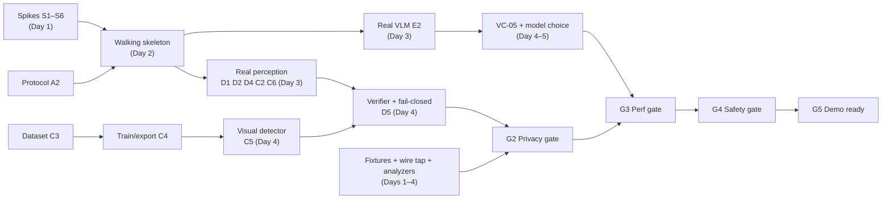

# AEGIS — Implementation Plan

## Build Workflow at a Glance

*One page: how the application is built, in order. The frontend is the browser extension; the backend is the FastAPI server. Detail for each step is in §7 (work packages) and §9 (schedule).*

1. **Set up the project and shared contracts** — one repo (extension, server, tests) and one shared message format, so both sides always agree. *(Day 1)*
2. **Run the risk-removal experiments** — five half-day tests: AI models in the browser, offline face detection, AI speed on your laptop, screen alignment, keep-alive. Each ends in a go / no-go. *(Day 1)*
3. **Set up the database** — a small SQLite audit log on the server (sessions, actions, timings, safety events). Metadata only — never page content or goal text. *(Days 2–3)*
4. **Draft the backend** — FastAPI WebSocket server with a *scripted stand-in AI* that replies with fixed actions. *(Days 1–2, in parallel with Step 5)*
5. **Draft the frontend** — the extension: goal popup, page reader (screenshot + page structure) and an action runner (click, type, scroll, select). *(Days 1–2, in parallel with Step 4)*
6. **Integrate frontend and backend (walking skeleton)** — type a goal → capture → server → stand-in AI → click on a test page, looping for 3 steps. From here on there is always a working demo. *(Day 2)*
7. **Add on-device perception** — page-structure rules, PII pattern finder (Aadhaar, PAN, card, email, phone), face detector and the small vision model. *(Days 2–4)*
8. **Add the privacy layer** — merge the detector results, blur / mask the screenshot, replace private text with tags, and send nothing if anything fails. *(Days 3–4)*
9. **Connect the real AI** — swap the stand-in for a local vision-language model (Ollama); choose the model by testing. *(Days 3–5)*
10. **Add safety controls** — allowed-action check, risk rules, approval pop-up, local password entry, step limits, cancel button. *(Days 4–6)*
11. **Test and measure** — test pages with fake personal data, a separate wire-tap that watches all traffic, speed and memory runs on a weaker laptop. *(alongside Steps 4–10)*
12. **Polish, rehearse and freeze** — “what the server sees” panel, one-click demo setup, rehearsals, backup recording, code freeze. *(Days 6–7)*

**Rule of thumb:** from Step 6 onward, never break the working loop — each later step upgrades one part of it.

---

## 1. Document Information

| Field | Value |
|-------|-------|
| Document | Implementation Plan |
| Project | AEGIS — Agentic Engine for Guarded Intelligent Surfing |
| Version | 1.0 |
| Status | **Draft for Team Approval** — it contains decisions and spec changes that need a yes/no (§3, §15) |
| Last Updated | 2026-09-21 |
| Team assumption | ~6 people, ~7 working days (TECHNICAL_SPEC §2) → ≈ 42 person-days. Windows 11 development machines. |
| Intended Audience | The whole team; each track owner reads their track (§7) and the shared sections |

> [!IMPORTANT]
> **Capacity check.** The P0 scope in §7 sums to about **50 person-days** against about **42 available**. That is a ~20 % overrun. §11 lists an ordered cut list that recovers about 7.75 pd, which leaves roughly 0.75 pd (under a day) still uncovered — so either add about one day, add a helper, or take one more cut. §9 starts with a walking skeleton so that cuts never leave you without a working system. Confirm real availability before Day 1.

---

## 2. Purpose, Scope, Ownership

### 2.1 What This Document Does

Turns the eight specifications into a buildable plan: technology decisions, repository layout, module-to-spec mapping, work packages with acceptance tests, a day-by-day schedule aligned to the evaluation gates (G0–G5), risk mitigations, and the changes to the specs that implementation will force.

### 2.2 What It Does Not Do

It does not restate the specifications. **The specs remain the source of truth**; where this plan proposes a change, it is recorded as a *spec delta* (§10) and must be approved and reflected in the spec through an ADR before code depends on it.

### 2.3 Conventions

Priorities: **P0** (must, for the demo), **P1** (should), **P2** (stretch). Effort in person-days (pd), PROPOSED. Roles, not names: **R1** Lead/platform, **R2** Browser engineer, **R3** ML engineer, **R4** Privacy/security engineer, **R5** Server/agent engineer, **R6** Evaluation/demo owner.

---

## 3. Key Technical Decisions (ADR Summary)

Each row resolves an open decision from the specs, or fixes a choice the specs left generic. Verified external facts are cited in §3.1.

| ADR | Decision | Rationale | Fallback | Spec item |
|-----|----------|-----------|----------|-----------|
| **ADR-01** | Monorepo: **pnpm workspaces**, TypeScript `strict`, **Vite** multi-entry build for the extension; Python 3.11 + FastAPI + pytest for the server; Vitest, Playwright | One repo, shared types, fast rebuilds; Windows-friendly | npm workspaces | TECHNICAL_SPEC §26.1 |
| **ADR-02** | **Runtime topology:** the service worker (SW) is a thin orchestrator that owns tabs, capture, the Loop Controller, and the WebSocket. An **offscreen document** hosts all ML, canvas work, and screenshot sanitization. Content script does DOM extraction, DOM analysis, heuristics, and execution. | ONNX Runtime Web cannot run in a service worker (dynamic `import()` is disallowed there); the offscreen document is the documented pattern and also gives canvas/WebGPU access | If offscreen proves unstable: run inference in a dedicated worker inside the popup-hosted page (worse) — decided by Spike S1 | OAD-09, AI_ML §7.8 |
| **ADR-03** | **WebSocket lives in the SW**; loop state is persisted to `chrome.storage.session` after every phase; reconnect uses the existing `session_resume` and `ping` messages | The spec forbids assuming the socket keeps the SW alive; the API already has resume | Move the socket to the offscreen document | TECHNICAL_SPEC §3, API_SPEC §7.3/7.7 |
| **ADR-04** | **Privacy by type system:** a branded `Sanitized<T>` type can only be produced by the sanitizer module; the WebSocket client's `send()` accepts only `Sanitized<…>` | Makes "no code path transmits unsanitized data" (PI-03) a **compile-time** property, not a review comment | Lint rule + runtime assertion | PI-03, SEC-03 |
| **ADR-05** | **DOM analysis and heuristic PII run in the content script and strip known-sensitive raw values at the source** before anything is messaged to the SW | Raw values for password/OTP/PII-pattern fields never leave the page's isolated world (PI-05) | Strip in the SW (spec default) | TECHNICAL_SPEC §7.4 |
| **ADR-06** | **Visual model:** fine-tune a small YOLO-class detector on an **auto-generated, DOM-labelled screenshot dataset** (§8); export to ONNX; run via ONNX Runtime Web (WebGPU → WASM). **Licence flag:** Ultralytics/YOLOv8-based detectors, including OmniParser's `icon_detect`, are **AGPL-3.0** | Cheap ground truth (EVALUATION_PLAN §6.3), fully controllable classes, meets the PS's "on-device vision model" requirement | Off-the-shelf pretrained UI detector; a permissively-licensed detector family (verify licence per CP-04) | OAD-01, OAD-ML-01 |
| **ADR-07** | **Face detection:** MediaPipe Tasks Vision `FaceDetector`, short-range model, with the WASM runtime and `.tflite` **bundled inside the extension** (its defaults load from jsDelivr and Google Cloud Storage) | Removes third-party egress (G-11) and satisfies MV3's no-remote-code rule | An ONNX face detector run through the same ORT pipeline | OAD-ML-02, G-11 |
| **ADR-08** | **VLM:** Ollama with a **vision model**, using the `format` JSON-schema parameter for the action object, temperature 0, `keep_alive` set. Candidates benchmarked in VC-05: `qwen3-vl:4b`, `qwen3-vl:8b`, `gemma3` (multimodal size), `qwen2.5vl:3b/7b` | Ollama's structured outputs accept image input; the qwen3-vl 2B/4B/8B builds need Ollama ≥ 0.12.7 | Cloud provider behind the same interface (`vlm_provider=cloud`) | OAD-02 / OAD-AG-01 |
| **ADR-09** | **Single protocol source:** JSON Schemas in `packages/protocol`, code-generated to TypeScript and Pydantic; golden messages from API_SPEC §18 are contract tests | No drift between client and server; validation on both sides for free | Hand-written mirrored types | API_SPEC §20 |
| **ADR-10** | **Redaction rendering:** solid mask for text PII with the category label drawn on it (e.g. `AADHAAR`), **pixelate + blur** for faces, 5 px padding, applied at full resolution, then downscale and encode WebP (~q75) | Masks are irreversible; the drawn label matches the schema placeholder for VLM consistency (spatial consistency, RD-06) | Blur-only (weaker, must pass RD-02) | TECHNICAL_SPEC §10.1 |
| **ADR-11** | **Demo-grade auth:** server binds `127.0.0.1` by default; a pre-shared token from the environment is checked at `session_init`; production auth stays out of scope | OSD-01 is unresolved; localhost binding removes most exposure. The spec's default `0.0.0.0` bind is unsafe on shared venue Wi-Fi | — | OSD-01, TECHNICAL_SPEC §25.2 |
| **ADR-12** | **Safe logging by construction:** all logging goes through `slog` (TS and Python) that accepts only whitelisted field names; `console.*` and `print` are lint-banned | PI-06 enforced at the interface (SECURITY §20) | Code review | PI-06 |

### 3.1 External Facts Verified for This Plan

| Fact | Consequence | Source |
|------|-------------|--------|
| Dynamic `import()` is disallowed in service workers, so ONNX Runtime Web's WebGPU/WASM backends fail there; the working pattern is an offscreen document exchanging messages with the SW | ADR-02; the `offscreen` permission is needed (G-08) | [onnxruntime issue #20876](https://github.com/microsoft/onnxruntime/issues/20876), [Medium write-up](https://medium.com/@GenerationAI/transformers-js-onnx-runtime-webgpu-in-chrome-extension-13b563933ca9) |
| WASM assets must be pointed at extension URLs (`chrome.runtime.getURL`) rather than fetched | Bundle `.wasm` files; set `ort.env.wasm.wasmPaths` | [onnxruntime discussion #23063](https://github.com/microsoft/onnxruntime/discussions/23063) |
| MediaPipe's documented examples load WASM from jsDelivr and the model from `storage.googleapis.com`; self-hosting means downloading both and bundling | ADR-07; egress test CP-05 | [MediaPipe face detector guide](https://developers.google.com/mediapipe/solutions/vision/face_detector) |
| Ollama's `format` JSON-schema parameter works with vision models | ADR-08 | [Ollama structured outputs](https://docs.ollama.com/capabilities/structured-outputs) |
| `qwen3-vl` is on Ollama in 2B (1.9 GB), 4B (3.3 GB), 8B (6.1 GB) and larger sizes; requires Ollama 0.12.7 | Candidate VLMs; resolves the "Qwen3 is text-only" worry (G-10) if the `-vl` build is used | [Ollama library: qwen3-vl](https://ollama.com/library/qwen3-vl) |
| OmniParser v2's `icon_detect` is YOLOv8-based and **AGPL**; `icon_caption` is MIT | Licence flag on ADR-06; record in CP-04 | [OmniParser-v2.0 model card](https://huggingface.co/microsoft/OmniParser-v2.0) |

---

## 4. Repository Layout

```
Aegis/
├── docs/                      # specs + adr/ (new: one file per accepted decision)
├── packages/
│   ├── protocol/              # JSON Schemas + generated TS types + generated Pydantic models
│   ├── shared/                # Sanitized<T> brand, slog, constants (placeholders, error codes, risk keywords)
│   └── core/                  # PURE TypeScript, no chrome.* APIs → fast unit tests
│       ├── heuristics/        #   Aadhaar/PAN/Card/Email/Phone, normalization, Verhoeff, Luhn
│       ├── dom-rules/         #   sensitive-field rules (incl. label-driven, spec delta SD-01)
│       ├── fusion/            #   normalization, IoU merge, priority, fail-safe
│       ├── schema-sanitizer/  #   placeholders, URL normalization, verifier
│       ├── risk-engine/       #   HR-01…07, blocked rules, keyword matcher
│       └── validation/        #   action schema validation, stuck detection
├── extension/
│   ├── manifest.ts            # generated manifest; permission list is one constant (CP-01 diff test)
│   ├── src/background/        # sw.ts, loop-controller.ts, capture.ts, ws-client.ts, session-store.ts, bus.ts
│   ├── src/content/           # extractor.ts, id-registry.ts, executor.ts, observer.ts, analyze.ts
│   ├── src/offscreen/         # runtime.ts, model-manager.ts, visual.ts, face.ts, screenshot-sanitizer.ts, pipeline.ts
│   ├── src/ui/                # popup/, confirm/, local-input/, device-view/
│   └── assets/                # models/*.onnx, mediapipe/*.wasm + *.tflite, hashes.json (never fetched at runtime)
├── server/
│   ├── aegis_server/          # main.py, ws_gateway.py, session.py, orchestrator.py, actions.py,
│   │                          #   providers/{ollama,cloud,mock}.py, audit_db.py, view/ (Server View)
│   │                          #   prompts/system_v1.txt (verbatim BROWSER_AGENT_SPEC §4.2)
│   └── tests/
├── ml/                        # dataset generator, training, ONNX export, quantize, benchmark
├── fixtures/                  # FP-xx pages, ground truth JSON (EVALUATION_PLAN §6)
├── eval/                      # harness, wire-tap proxy, analyzers, runs/ (EVALUATION_PLAN §7.5)
├── demo/                      # Chrome demo-profile setup, reset, preflight, recording notes
└── scripts/                   # verify, build-assets, manifest-audit, secret-scan
```

**Why `packages/core` is pure:** heuristics, fusion, risk engine, sanitization logic, and validation contain the privacy-critical decisions. Keeping them free of `chrome.*` and DOM APIs means they can be tested in milliseconds with plain Vitest, including property-based and fuzz tests (AG-03, PD-01, PD-02).

---

## 5. Architecture-to-Code Map

| Spec component | Code location | Runs in | Notes |
|----------------|---------------|---------|-------|
| Loop Controller (§TECH 3; §AGENT 3.2, 9) | `background/loop-controller.ts` | SW | Phase state machine; state persisted after each phase; owns step counter, stuck/failure detection, termination |
| Screenshot Capture | `background/capture.ts` | SW | `captureVisibleTab`; returns raw bitmap **only** to the offscreen doc; records DPR, zoom |
| DOM Extractor | `content/extractor.ts` | Content | Filtering per TECH §7.3; same-origin iframe recursion with offsets; open shadow roots; stable IDs via `id-registry.ts` |
| DOM Analyzer + Heuristic PII | `content/analyze.ts` → `core/dom-rules`, `core/heuristics` | Content | Strips raw values of flagged fields at source (ADR-05) |
| MutationObserver | `content/observer.ts` | Content | 200 ms debounce, attribute filter, agent-action suppression window |
| Visual ML Engine | `offscreen/visual.ts` | Offscreen | Letterbox → ORT session → NMS → inverse transform |
| Face Detector | `offscreen/face.ts` | Offscreen | Bundled MediaPipe; normalized → pixel coords |
| Local Fusion | `core/fusion` (called from `offscreen/pipeline.ts`) | Offscreen | Deterministic; IoU merge; fail-safe |
| Screenshot Sanitizer | `offscreen/screenshot-sanitizer.ts` | Offscreen | `OffscreenCanvas`; works on a copy |
| Schema Sanitizer + verifier | `core/schema-sanitizer` | Offscreen | Placeholders, URL normalization, `[SANITIZATION_ERROR]` verifier |
| Context Builder | `offscreen/pipeline.ts` | Offscreen | The **only** producer of `Sanitized<ContextUpdate>` |
| WebSocket Client | `background/ws-client.ts` | SW | Accepts only `Sanitized<…>`; backoff, resume, ping |
| Schema Validator, Risk Engine | `core/validation`, `core/risk-engine` | SW | Risk needs per-form sensitivity summaries, kept locally (§9.4) |
| Confirmation UI, Local Input | `ui/confirm`, `ui/local-input` | Extension pages | Pending state owned by the SW, not the popup (AGENT §8.4) |
| Action Executor | `content/executor.ts` | Content | Native value setters, event dispatch, stale-ID handling |
| Popup UI | `ui/popup` | Extension page | Goal (with goal scan, SD-02), status, step n/30, cancel |
| Device View | `ui/device-view` | Extension page | D2/D3 Inspector tier (DEMO_FLOW §8) |
| WS Gateway, Session Manager | `server/ws_gateway.py`, `session.py` | Server | In-memory sessions; step-number correlation; size limits |
| VLM Orchestrator, Action Generator | `orchestrator.py`, `actions.py` | Server | Prompt file + `format` schema; retry once; fail action |
| Audit DB | `audit_db.py` | Server | Tables from DATABASE_SCHEMA §6.6–6.9; metadata only |
| Server View | `server/aegis_server/view/` | Server | Read-only feed of received frames (Inspector D1) |

---

## 6. Core Contracts (Condensed)

Only the types whose misuse creates privacy defects. Everything else is generated from `packages/protocol`.

```ts
// packages/shared — the compile-time privacy boundary (ADR-04)
declare const SANITIZED: unique symbol;
export type Sanitized<T> = T & { readonly [SANITIZED]: true };
// Only screenshot-sanitizer + schema-sanitizer + pipeline.ts may call this.
export function markSanitized<T>(value: T, proof: SanitizationProof): Sanitized<T>;

// ws-client.ts
send(msg: Sanitized<ContextUpdate> | ControlMessage): void;   // raw types do not compile

// packages/core — fusion input/output (AI_ML §10–12)
type Rect = { x: number; y: number; w: number; h: number };    // screenshot pixel space
interface NormalizedSignal {
  source: 'DOM_ANALYSIS' | 'VISUAL_ML' | 'FACE_DETECTION' | 'HEURISTIC_PII';
  elementId: string | null; box: Rect; category: SensitivityCategory;
  confidence: number; evidence: string;                          // evidence never contains raw values
}
interface SensitivityRegion {
  regionId: string; box: Rect; elementId: string | null; category: SensitivityCategory;
  confidence: number; sources: SignalSource[]; action: SanitizationAction; failSafe: boolean;
}

// Local-only, never serialized to the wire (API_SPEC §4.2)
interface FormSensitivity { formId: string; flaggedCount: number; categories: SensitivityCategory[] }
```

`SanitizationProof` is produced only when the verifier passes (TECHNICAL_SPEC §10.4), so `markSanitized` cannot be called on an unverified payload.

---

## 7. Work Packages

Effort is PROPOSED. **Deliverable** is what a reviewer can run; **Accept** ties to an [EVALUATION_PLAN](EVALUATION_PLAN.md) test.

### 7.1 Track A — Foundation and Contracts (R1)

| WP | Work | Deliverable | Accept | pd | Pri |
|----|------|-------------|--------|----|-----|
| A1 | Monorepo scaffold: pnpm workspace, strict TS, ESLint (ban `eval`, `new Function`, `console.*` except `slog`), Prettier, Vitest, Playwright, Python `pyproject` + ruff + pytest | `pnpm verify` runs green on an empty project | CP-02 baseline | 1 | P0 |
| A2 | Protocol package: JSON Schemas for every message in API_SPEC §5–10, Action schema, placeholder enum, error codes; codegen to TS and Pydantic; golden-message contract tests from API_SPEC §18 | `packages/protocol` builds; both sides import generated types | AG-03/07 inputs | 1.5 | P0 |
| A3 | `slog` in TS and Python with whitelisted fields | Logging API + lint ban | RD-11 | 0.5 | P0 |
| A4 | Extension build: Vite multi-entry (SW, content, offscreen, popup, confirm, local-input, device-view); `manifest.ts`; asset copy for models and WASM; CSP with `wasm-unsafe-eval` for extension pages | Loadable unpacked extension | CP-01, CP-02 | 1 | P0 |
| A5 | `scripts/verify`: lint, typecheck, unit tests, manifest-permission diff, bundle secret scan, "no remote URL in bundle" grep | One command gate before push | CP-01…03 | 0.5 | P0 |
| A6 | ADR log; apply approved spec deltas to the docs (§10) | `docs/adr/*.md`, doc PRs | G-14 | 0.5 | P1 |

### 7.2 Track B — Extension Core (R2)

| WP | Work | Deliverable | Accept | pd | Pri |
|----|------|-------------|--------|----|-----|
| B1 | SW skeleton, typed message bus, config store (`server_endpoint`, `max_steps=30`, thresholds, `debug_mode`) | Popup ↔ SW ↔ content messaging works | — | 0.5 | P0 |
| B2 | **DOM extractor**: element filtering, label resolution (`label`, `aria-*`, `placeholder`), visibility, bbox, `parentFormId`, same-origin iframes with offsets, open shadow DOM, cross-origin iframe stub node, stable ID registry (`WeakMap`, no attributes added to the page) | `extractDom()` returns the TECH §7.2 fields | VC-02 | 2 | P0 |
| B3 | MutationObserver (200 ms debounce, attribute filter), navigation events, agent-change suppression window (~300 ms) | Externally-caused changes trigger capture; self-caused do not | VC-06 | 0.5 | P0 |
| B4 | **Capture**: `captureVisibleTab`, DPR/zoom metadata, active-tab and unsupported-page checks (`E-GEN-01`), **post-capture bbox re-read** (SD-06) | Capture + geometry metadata | VC-03, RD-10 | 1 | P0 |
| B5 | **Loop Controller**: phase state machine (AGENT §3.2), persisted state, step counter, SHA-256 stuck detection (3), failure limit (3), timeouts (VLM 30 s, exec 5 s), cancel within 1 s | Full loop with termination reasons | AG-06, AG-09 | 2 | P0 |
| B6 | **Action Executor**: click, type, scroll, select, hover, wait; native value setter + `input`/`change` events; `scrollIntoView`; `E-EXEC-01/02/03` | All eight actions on FP-01 | AG-01 | 1.5 | P0 |
| B7 | Popup: goal input (runs goal scan), status, `Step n / 30`, last action + reasoning, cancel | Usable popup | AG-01, HL-01/02 | 1.5 | P0 |
| B8 | Confirmation and local-input flows; pending state in SW; small extension window as fallback if the popup is closed | HR-04 dialog; `[NEEDS_LOCAL_INPUT]` prompt | AG-04, RD-13 | 1 | P0 |

### 7.3 Track C — Perception ML (R3)

| WP | Work | Deliverable | Accept | pd | Pri |
|----|------|-------------|--------|----|-----|
| C1 | **Offscreen runtime** (after Spike S1): document lifecycle, model manager (load, warm-up, unload), backend selection WebGPU → WASM-MT → WASM, timeouts, degraded flags (`perception_status`) | Offscreen doc runs any ONNX model on both backends | RL-04, RL-06 | 1.5 | P0 |
| C2 | **MediaPipe face detector**, fully bundled (after Spike S2); confidence thresholds; coordinate denormalization | `FaceSignal[]` with zero network calls | PD-04, CP-05 | 1 | P0 |
| C3 | **Dataset generator** (`ml/`): Playwright renders templates × randomized themes, fonts, sizes, DPRs; labels derived from DOM boxes; hard negatives; **split by template, not by image** | ≥ 3 k labelled screenshots + a held-out template set | VC-01 | 2 | P0 |
| C4 | **Train and export**: fine-tune the nano-class detector; ONNX export; check op support on WebGPU and WASM; FP32 first, then FP16/INT8 with accuracy check | Candidate `.onnx` files + a benchmark table | VC-01, RL-06 | 2 | P0 |
| C5 | **Visual pipeline**: letterbox, ORT session, decode, confidence filter, NMS, inverse transform (AI_ML §5.5) | `VisualSignal[]` in screenshot space | VC-01 | 1.5 | P0 |
| C6 | **Fusion** in `core/fusion`: normalization, IoU merge, category priority, fail-safe inclusion, DOM association, thresholds from config; **property tests** for determinism and fail-safe | `SensitivityMap` | PD-05, PD-06 | 1.5 | P0 |
| C7 | Model-selection benchmark script feeding gate G1 | Comparison report | VC-01, RL-06 | 0.5 | P1 |

### 7.4 Track D — Sanitization and Privacy (R4)

| WP | Work | Deliverable | Accept | pd | Pri |
|----|------|-------------|--------|----|-----|
| D1 | **Heuristic PII**: five patterns, normalization (Unicode digits, separators, prefixes), Luhn, Verhoeff, confidences per AI_ML §9; **invalid-checksum control vectors must still be redacted** (G-03) | `core/heuristics` + vector corpus | PD-01, PD-02 | 1.5 | P0 |
| D2 | **DOM sensitive-field rules** including label/`autocomplete`-driven rules for name, account, IFSC, CVV, OTP, toggled passwords (SD-01) | `core/dom-rules` | PD-03, PD-08 | 1 | P0 |
| D3 | **Schema sanitizer**: placeholder vocabulary (API_SPEC §4.3), URL → origin + path, scan of `title`/`label`/`attributes.*` (SD-05), value stripping | Sanitized schema | RD-05 | 1.5 | P0 |
| D4 | **Screenshot sanitizer** (ADR-10): mask + label, pixelate + blur, padding, DPR scaling, downscale, WebP encode | Sanitized screenshot | RD-02, RD-03 | 1.5 | P0 |
| D5 | **Verifier and fail-closed builder**: `Sanitized<T>` production, TECH §10.4 verifier, `[SANITIZATION_ERROR]`, any exception ⇒ no send, user notified (`E-SAN-01`) | Context Builder | RD-07, RD-08 | 1 | P0 |
| D6 | **Goal scanner** (SD-02): heuristics over the goal text in the popup; warn/scrub before send | Goal check | PD-09 | 0.5 | P0 |
| D7 | **Face-unavailable and iframe policies** (SD-03): when the face detector is unavailable, blur every image-like region ≥ 64×64 px and notify; configurable cross-origin iframe policy (`pass`/`blur`) | Policy code | RD-09 | 0.5 | P0 |

### 7.5 Track E — Server and Agent (R5)

| WP | Work | Deliverable | Accept | pd | Pri |
|----|------|-------------|--------|----|-----|
| E1 | **FastAPI gateway**: WS endpoint, envelope + payload validation (generated Pydantic), in-memory sessions, step-number correlation, size limit (~2 MB), `ping`/`pong`, `session_resume`, demo-grade token, `127.0.0.1` bind, error codes `E-SRV-*` | Server passes contract tests | AG-07 | 2 | P0 |
| E2 | **VLM orchestrator**: system prompt file (verbatim BROWSER_AGENT_SPEC §4.2), per-cycle template, last-5 action history, image encoding, Ollama client with `format` schema, temperature 0, `keep_alive`, timeout, one retry, output normalization, `fail` on parse failure | Real action from a real VLM | AG-10, VC-05 | 2 | P0 |
| E3 | **Provider abstraction**: `ollama`, `cloud` (OpenAI-compatible URL; key only in server env), and a **`mock` provider that replays a scripted action list** — needed for the walking skeleton and deterministic tests | Swap by config | RL-05 | 1 | P0 |
| E4 | **Audit DB**: SQLite tables from DATABASE_SCHEMA §6.6–6.9, metadata only (no goal text), pruning | Rows per step | RD-12, CP-06 | 1 | P0 |
| E5 | **Server View** (`/view`): live feed of received frames, schema with placeholders highlighted, prompt/action, bytes; canary badge slot | Inspector D1 | CP-08 | 1 | P0 |
| E6 | **VC-05 harness**: ≥ 40 labelled states; compare candidate VLMs on sanitized vs raw (offline, local-only) | Model choice + utility retention | VC-05 | 1.5 | P0 |
| E7 | Server tests: stale actions, malformed messages, concurrent sessions, oversize payloads | pytest suite | SAC-07/08/09 | 1 | P1 |

### 7.6 Track F — Fixtures, Evaluation, and Demo (R6)

| WP | Work | Deliverable | Accept | pd | Pri |
|----|------|-------------|--------|----|-----|
| F1 | **Fixtures** in priority order: FP-01 (+ `?mode=short`, `?hostile=1`), FP-04, FP-06, FP-07, FP-14, FP-05, FP-13, then FP-02/03/08/09/10/11/12/15/16; ground-truth JSON alongside | Served pages | EVAL §6.1 | 3 | P0 |
| F2 | **PII/canary generator** with per-run unique canaries and Verhoeff/Luhn-valid values | `eval/generators` | PD-01 | 1 | P0 |
| F3 | **Wire-tap proxy + canary matcher + eval-mode guards** (fixture-origin allowlist, `AEGIS_EVAL_MODE`) | Independent evidence source | RD-01 | 1.5 | P0 |
| F4 | **Playwright harness**: headed Chrome with the extension, run manifests, telemetry collectors (CDP, process sampler) | `eval/harness` | All suites | 2 | P0 |
| F5 | **Analyzers**: region matcher, OCR residual audit, independent face-check, pixel-coverage, log/disk grep | `eval/analyzers` | RD-01…04, RD-11/12 | 2 | P0 |
| F6 | Report generator and scorecard | `eval/runs/*/report.md` | EVAL §17 | 0.5 | P1 |
| F7 | **Device View** (D2/D3): stage latency, gauges, detection overlay by signal | Inspector panels | DEMO §8 | 1 | P1 |
| F8 | **Demo ops**: hardened Chrome profile, `demo-reset`, preflight checks PC-01…12, recording setup | `demo/` scripts | DEMO §14–15 | 1 | P0 |

### 7.7 Effort Summary

| Track | P0 (pd) | P1 (pd) |
|-------|---------|---------|
| A Foundation | 4.5 | 0.5 |
| B Extension core | 10 | 0 |
| C Perception ML | 9.5 | 0.5 |
| D Sanitization | 7.5 | 0 |
| E Server and agent | 8.5 | 1 |
| F Eval and demo | 10.5 | 1.5 |
| **Total** | **50.5** | **3.5** |

---

## 8. De-Risking Spikes (Day 1, before feature work)

Each spike is time-boxed to half a day and ends in a written go/no-go. They decide ADR-02, -03, -06, -07, -08 and the open decisions OAD-01, OAD-09, OAD-02.

| Spike | Owner | Question | Go criterion | If no-go |
|-------|-------|----------|--------------|----------|
| **S1** ML runtime | R3 | Can ONNX Runtime Web run a small model in an MV3 **offscreen document** on WebGPU **and** WASM, with bundled `.wasm` and `wasm-unsafe-eval`? | Inference completes on both backends; warm-up measured | Reduce to WASM-only; if that fails, reassess runtime (Transformers.js has the same constraints) |
| **S2** Face offline | R3 | Does MediaPipe `FaceDetector` run from bundled files with zero network calls? | DevTools shows no external requests; detects a test face | Use an ONNX face detector through the S1 runtime |
| **S3** VLM latency | R5 | On the demo laptop, what are p50/p95 for `qwen3-vl:4b/8b`, `gemma3`, `qwen2.5vl` with a 1280×720 image plus JSON-schema `format`? | p50 ≤ ~4 s per step with valid JSON ≥ 95 % | Smaller model/image; or cloud provider and re-plan DEMO_FLOW OQ-DF-02 |
| **S4** Geometry | R2 | Do DOM boxes map to screenshot pixels within 2 px at DPR 1, 1.25, 1.5 and zoom 100–150 %? | ≤ 2 px mean error (VC-03) | Add explicit DPR/zoom compensation; treat the mismatch as a fail-closed condition |
| **S5** SW lifetime | R1 | Does the loop survive SW termination using `storage.session` + `session_resume`? | Kill the SW mid-step; the session resumes | Move the socket and loop host to the offscreen document (ADR-03 fallback) |
| **S6** Skeleton scaffold | R1 | Repo, protocol codegen, and loadable extension exist | `pnpm verify` green; extension loads | — |

---

## 9. Schedule and Milestones

### 9.1 Principle: Walking Skeleton First

By the **end of Day 2** a crude end-to-end loop must exist — goal → capture → trivial sanitize → WebSocket → **mock** VLM → validate → execute on FP-01 — with the wire tap already recording. Every later change is an improvement to a working system, and every cut leaves something demonstrable.

### 9.2 Day-by-Day

| Day | Milestone | Track focus | Gate |
|-----|-----------|-------------|------|
| **1** | **M0 Foundations** | R1: S5, S6, A1–A4. R2: B1, S4. R3: S1, S2 (then C1). R4: D1 start. R5: S3, E1 start. R6: F1 (FP-01), F2 | Spikes decided; ADRs recorded |
| **2** | **M1 Walking skeleton** | R2: B2, B4, B5 (basic), B6. R5: E1, E3 (mock provider). R1: A2, integration. R6: F3 wire tap. R4: D3 (basic placeholders). R3: C3 dataset start | **G0**: RD-01 runs end to end on FP-01 (may fail) |
| **3** | **M2 Real perception** | R4: D1, D2, D4. R3: C2, C6, C5 (with an interim pretrained detector), C4 training. R5: E2 (Ollama), E4. R2: B3, B7. R6: F4, F1 continues | PD-01 results; first RD-01/02 numbers |
| **4** | **M3 Safe and selective** | R3: C4/C5 integrate the fine-tuned model. R4: D5 (verifier, fail-closed), D6, D7. R2: B8 (confirmation), risk engine wiring. R5: E5 (Server View), E6 (VC-05 runs). R6: F5 analyzers | **G1** model chosen; **G2** privacy gate attempted |
| **5** | **M4 Robust and measured** | R2: local input, stuck/failure paths, perf. R3: quantization, thresholds (PD-06). R6: RL suites. R5: prompt tuning, VLM choice frozen. R4: RD-07/09/10/11/12 | **G3** performance gate; OAD-02 resolved |
| **6** | **M5 Safety and rehearsal** | R4/R5: AG-02/04/05/06/08/09. R6: F8, rehearsals R1–R3. R1: bug triage, doc updates. Everyone: defect burn-down | **G4** safety gate |
| **7** | **M6 Freeze and demo** | Code freeze; R4–R6 rehearsals; golden-run recording; evidence pack; scoreboard filled with MEASURED values | **G5** DEMO_FLOW §14 gates |

### 9.3 Dependency Overview



**Critical path:** S1 → C1 → C5 → D5 → G2 → G3 → G5, with the model-training chain (C3 → C4) as the longest single dependency. Start C3 on Day 2 and keep an interim pretrained detector so that C4's outcome cannot block integration.

---

## 10. Spec Deltas Implementation Will Force

Implementing the specs as written would knowingly reproduce the gaps in [EVALUATION_PLAN §18](EVALUATION_PLAN.md). These are the proposed changes; each needs a yes/no and an ADR, then a doc edit.

| Delta | Change | Closes | Cost | Default |
|-------|--------|--------|------|---------|
| **SD-01** | Add label/`autocomplete`/`name`-driven DOM rules for name, bank account, IFSC, CVV, DOB, OTP (any `type`), and toggled passwords; map to `GENERIC_PII` or existing categories | G-01, G-02, G-05 | ~1 pd inside D2 | **Adopt** |
| **SD-02** | Scan the goal text locally in the popup; warn or scrub before it can be sent | G-04 | 0.5 pd (D6) | **Adopt** |
| **SD-03** | If the face detector is unavailable, blur all image-like regions ≥ 64×64 px and notify (instead of proceeding with faces exposed) | G-06 | 0.5 pd (D7) | **Adopt** |
| **SD-04** | Bundle all model and WASM assets; forbid runtime CDN fetches; enforce with CP-05 and a bundle grep | G-11 | Included in A4/A5 | **Adopt** |
| **SD-05** | Schema `url` = origin + path only; run heuristics over `title`, `label`, `attributes.*` | G-12 | Included in D3 | **Adopt** |
| **SD-06** | Re-read bounding boxes after capture; if any moved > 2 px, retry or fail closed | G-13 | Included in B4 | **Adopt** |
| **SD-07** | Accept the `offscreen` permission (required by ADR-02); avoid `webNavigation` (use `tabs.onUpdated`); update SE-02, SAC-11, OSD-03 | G-08 | Doc change | **Adopt** |
| **SD-08** | Server binds `127.0.0.1` by default (spec says `0.0.0.0`) | ADR-11 | Trivial | **Adopt** |
| **SD-09** | Risk keywords: whole-word matching for short tokens, add `aria-label`/`title` and Hindi terms | G-15 | ~0.5 pd in risk engine | **Adopt** (P1 for Hindi) |
| **SD-10** | Documentation clean-up (OAD numbering, stale checklist items, `max_steps`) and correct G-10 to "confirm the `-vl` build" | G-10, G-14 | 0.5 pd (A6) | **Adopt** |

---

## 11. Scope Management

### 11.1 Ordered Cut List (against an ~8.5 pd overrun; all nine cuts recover ~7.75 pd)

Apply from the top until the plan fits confirmed capacity. Each keeps the demo intact. Taking all nine still leaves ~0.75 pd, so plan for one extra day or one extra person-day of help.

| # | Cut | Saves | Consequence |
|---|-----|-------|-------------|
| 1 | Train on a smaller dataset; start from a pretrained detector; skip INT8 | ~2 pd | Lower mAP; report honestly (VC-01) |
| 2 | Trim fixtures to FP-01, FP-04, FP-06, FP-07, FP-14 (+ FP-13 for injection) | ~1 pd | Fewer PD-07 variants |
| 3 | Audit DB (E4) to P1: log to the Server View only | ~1 pd | RD-12 checks fewer tables |
| 4 | Analyzers: keep region matcher, OCR residual, pixel coverage; drop the independent face-check | ~1 pd | RD-02 face proof weaker |
| 5 | Popup minimal; no styling | ~0.5 pd | — |
| 6 | VC-05 on ~20 states instead of 40 | ~0.5 pd | Wider intervals |
| 7 | Skip Device View entirely; rely on Server View + popup preview | ~1 pd (F7) | Weaker criterion-2/4 visuals |
| 8 | Local-input prompt → fallback (presenter types on the page) | ~0.5 pd | DEMO B6 changes (OQ-DF-04) |
| 9 | Hostile-banner live behaviour → "assume the worst" simulation only | ~0.25 pd | DEMO B5 changes (OQ-DF-06) |

### 11.2 What Must Never Be Cut

Wire-tap audit (F3), fail-closed behaviour (D5), the `Sanitized<T>` boundary (ADR-04), the confirmation gate (B8), the mock-provider walking skeleton (E3), and the demo hardening (F8). These are what make the claims true and the demo safe.

### 11.3 If Only N Days Are Available

| Days | Ship |
|------|------|
| 4 | Skeleton + DOM/heuristic/face sanitization + real VLM + confirmation + wire audit. Visual detector = a pretrained model, unfine-tuned. |
| 5–6 | Add the fine-tuned detector, fail-closed verification suite, local input, Server View. |
| 7 | Everything above plus Device View, full suites, rehearsals. |

---

## 12. Implementation Notes and Pitfalls

Design detail that the specs leave open and that commonly costs days.

### 12.1 Geometry

- DOM boxes are CSS pixels relative to the viewport; the capture is in **device pixels**. Multiply by DPR, and account for browser zoom. Validate with S4 markers before anything else.
- Take DOM boxes **after** the screenshot resolves and compare with the pre-capture read (SD-06); mismatch → retry, else fail closed.
- Redact at **full resolution first**, then downscale for transmission. Downscaling before redaction lets boxes drift.
- Cross-origin iframes: emit a node with the iframe's own box; content is visible only to the visual model. Provide the `iframe_policy` switch (D7).

### 12.2 Element IDs and the Page

- Keep an `id-registry` mapping `el-N` → `WeakRef<Element>` in the content script. **Do not write attributes onto the page** — pages can detect and tamper with them.
- On every extraction, generate a new snapshot version; an action that names an ID from an older version returns `E-EXEC-01` rather than acting on the wrong element.
- Extract text nodes for heuristics but attribute matches to the **nearest interactive or block ancestor's** box; the schema and screenshot are then redacted at element granularity (AI_ML §9.5).

### 12.3 Executing Actions

- Frameworks such as React ignore a plain `el.value = x`. Use the native setter from `HTMLInputElement.prototype`, then dispatch bubbling `input` and `change` events.
- `element.click()` is untrusted and skips some pointer events. It suffices for fixtures; note the limitation for real sites.
- `hover` dispatches mouse events but cannot trigger the CSS `:hover` state — record as a known limit.
- Always `scrollIntoView` and re-check visibility and `disabled` before acting.

### 12.4 Perception Pipeline

- Run visual ML and face detection concurrently with a per-signal timeout (3 s proposed). A timeout returns an empty signal array and sets `perception_status` (AI_ML §16).
- Warm up every model at load with a dummy input (WebGPU shader compilation) and **do not** count it in latency stats.
- Prefer FP32 first; FP16 on WebGPU needs adapter support and INT8 can cost accuracy — quantize only after VC-01 is measured on the float model.
- MV3: keep the offscreen document alive for the whole session; reload models on demand after a browser restart, and report the cold-start cost.

### 12.5 Sanitization

- Draw the category label on each mask (e.g. `PAN`) so the image and the schema placeholder agree.
- Faces: pixelate with blocks proportional to the face box, then blur; verify with the independent detector (RD-02).
- The verifier walks the finished schema against the sensitivity map and replaces any surviving flagged value with `[SANITIZATION_ERROR]`; if any replacement was needed, treat the cycle as a defect signal in eval mode.
- Any thrown exception anywhere between capture and `markSanitized` ⇒ **no transmission** and a user-visible message.

### 12.6 Risk Engine Needs Local Context

HR-04 and HR-05 depend on how many sensitive fields sit in the form being submitted. The sensitivity map lives in the offscreen document, but validation runs in the SW. So each cycle the pipeline also returns a local-only `FormSensitivity[]` summary (§6) that the SW keeps for the next validation. It is **never** put in a wire payload (API_SPEC §4.2 lists the sensitivity map as prohibited).

### 12.7 Server and Prompting

- Store the system prompt as a versioned file; load it verbatim so BROWSER_AGENT_SPEC §4.2 stays the single source.
- Pass the action JSON schema as Ollama's `format`, and also include it in the prompt text; temperature 0; cap `num_predict`.
- Enforce server-side: step-number correlation (reject stale), payload size, one action per response, `fail` fallback after one retry.
- The server must treat page text as untrusted: never interpolate it into the system prompt; it appears only inside the structured schema block.
- Keep the model warm (`keep_alive`), and make the first request part of preflight.

### 12.8 Local Input and Confirmation UI

- The popup closes when it loses focus, so neither flow may live only there. The SW owns pending state; use `chrome.action.openPopup()` where permitted, otherwise a small `chrome.windows.create({type:'popup'})` window.
- The resolved local value exists only in the content script's execution closure; it is written to the field and dropped. Never in history, logs, or messages (PI-02, RD-13).

---

## 13. Environment and Model Pipeline

### 13.1 Prerequisites (Windows 11)

Node 20+, pnpm, Python 3.11 with `uv` or `venv`, Git, a **pinned** Chrome build (auto-update off for the demo profile), a recent GPU driver, and Ollama ≥ 0.12.7 (for the `qwen3-vl` builds). A GPU for training the detector is optional if a hosted notebook is available.

### 13.2 First-Day Commands (after A1/A4 exist)

```powershell
pnpm install
pnpm verify
pnpm --filter extension build     # then load extension/dist as an unpacked extension
uv venv; uv pip install -e server
uv run uvicorn aegis_server.main:app --host 127.0.0.1 --port 8000
ollama pull qwen3-vl:4b
```

### 13.3 Detector Pipeline (`ml/`)

| Step | Detail |
|------|--------|
| 1 Generate | Playwright renders template pages with randomized theme, font, density, DPR; boxes come from the DOM; class set: `button`, `input_field`, `text_region`, `link`, `image`, `icon`, `dropdown`, `checkbox`, `radio` |
| 2 Split | **By template**, so the held-out set tests generalization, not memorization |
| 3 Train | Fine-tune a nano-class detector from a pretrained checkpoint; record the licence |
| 4 Export | ONNX; verify with `ort.InferenceSession.create` on WebGPU and WASM inside the extension (not only in Node) |
| 5 Evaluate | VC-01 on the held-out templates and on hand-labelled real-structure pages |
| 6 Freeze | SHA-256 into `assets/models/hashes.json`; the extension refuses to load a mismatching file (SEC-13) |

Datasets such as WebPII (cited in the PPT) are optional stretch material; check licence before use (CP-04, OED-03).

---

## 14. Testing and Quality Gates

| Layer | Tooling | What it covers |
|-------|---------|----------------|
| Unit / property | Vitest (`packages/core`), pytest | Heuristics vectors, fusion determinism and fail-safe, risk classification, validator fuzz (AG-03), stuck detection |
| Contract | Generated types + golden messages | Client/server agreement (API_SPEC §18) |
| Integration | Playwright + real extension on FP pages, **mock VLM** | Full loop deterministically, including failure injection (RD-07) |
| Evaluation | `eval/` harness | All suites in EVALUATION_PLAN |
| Static | ESLint (no eval, no `console`), manifest diff, bundle secret and remote-URL scan | CP-01…03 |

**Pre-push gate (`pnpm verify`):** lint, types, unit, manifest-permission diff, bundle scan.
**Privacy regression gate:** an RD-01 smoke run on FP-01 with the mock VLM on every merge to the main branch. **A single canary hit blocks the merge.**

**Definition of Done for any WP:** code + tests + safe-logging compliance + no new permission + acceptance test named in the table passes + the relevant spec item updated or a delta recorded.

---

## 15. Risk Register

| # | Risk | L | I | Mitigation | Trigger → fallback |
|---|------|---|---|-----------|--------------------|
| R-01 | ONNX Runtime Web fails in the offscreen doc (WebGPU or WASM) | M | H | Spike S1 on Day 1; bundle WASM; CSP `wasm-unsafe-eval` | S1 fails → WASM-only; then reassess runtime |
| R-02 | Fine-tuned detector is weak or late | M | H | Interim pretrained model; DOM-labelled data; timebox C4 at 2 pd | mAP < target at Day 4 → ship interim model, report honestly |
| R-03 | VLM too slow on demo laptop | M | H | Spike S3; smaller model/image; `keep_alive`; cloud provider ready | p50 > ~4 s → cloud VLM or smaller model (DEMO OQ-DF-02) |
| R-04 | Redaction misaligned at non-100 % scaling | M | H | S4 first; RD-10 matrix; SD-06 re-read; fail closed | Any misalignment → block until fixed |
| R-05 | A missed PII category appears on stage | M | H | SD-01…03; only validated pages on stage (DEMO DP-06); DG-02 | Any hit in rehearsal → fix or remove the field from the page |
| R-06 | SW terminates mid-session | M | M | ADR-03; state persisted; resume; S5 | Frequent → move socket/loop to offscreen |
| R-07 | Scope overrun (~20 % over capacity) | H | H | §11 cut list; walking skeleton first; daily burndown | Day 4 behind → apply cuts 1–5 immediately |
| R-08 | Licence problem (AGPL detector, model terms) | M | M | Record per model (CP-04); prefer permissive if cost is low | Reviewer objection → swap detector family |
| R-09 | Chrome update changes behaviour before demo | L | H | Pin Chrome; disable auto-update; DG-09 | — |
| R-10 | Prompt injection derails the live demo | M | M | Simulation fallback (DEMO OQ-DF-06); rehearse R3 | Model follows the banner → simulation only |
| R-11 | Debug logging leaks a value | L | H | `slog` whitelist + lint ban; RD-11 | Any hit → P0 defect |
| R-12 | Single person owns a critical piece | M | M | Pair on ADR-02/03 pieces; DG-10 two-operator rule | — |

(L = likelihood, I = impact; H/M/L.)

---

## 16. Traceability

| Requirement group | Work packages |
|-------------------|---------------|
| FR-01…03 capture, DOM, debounce | B2, B3, B4 |
| FR-04…06 visual ML, faces | C1–C5 |
| FR-07…09 DOM rules, heuristics, fusion | D1, D2, C6 |
| FR-10…13 redaction, transmission, WebSocket | D3, D4, D5, E1, ADR-03/04 |
| FR-14…16 server VLM, action schema | E1–E3, A2 |
| FR-17…18 validation, risk, confirmation | Core `risk-engine`/`validation`, B8 |
| FR-19…23 execution, loop, failure | B5, B6 |
| FR-24 local or cloud VLM | E3 |
| NFR-01/02, PV-01…08, SEC-01…04 | ADR-04/05, D3–D5 |
| NFR-06/07, PF-01…09 | C1, C5, D4 (encode/downscale), RL suites |
| SE-01/02/07, SEC-13 | A1, A4, A5, C4 hashes |
| Evaluation suites | F1–F6 |
| Demo Inspector, demo ops | E5, F7, F8 |

---

## 17. Decisions Needed From the Team

| # | Decision | Recommended |
|---|----------|-------------|
| 1 | Confirm capacity (people × days) and role assignment R1–R6 | Do before Day 1 |
| 2 | Approve ADR-02 (offscreen ML) and ADR-03 (socket in SW) | Approve; validated by S1/S5 |
| 3 | Approve spec deltas SD-01…SD-10 (§10) | Approve all; SD-09 Hindi terms as P1 |
| 4 | Detector strategy and licence stance (ADR-06): accept AGPL for the prototype, or require a permissive family | Accept for the prototype, record in CP-04, prefer permissive if trivial |
| 5 | Local vs cloud VLM (DEMO OQ-DF-02) | Decide at S3 from measured latency |
| 6 | Build the Inspector? (DEMO OQ-DF-05) | Server View (E5) yes; Device View only if capacity allows |
| 7 | Adopt the cut list order in §11.1 | Yes, agree it now rather than under pressure |

---

*This plan is authoritative for build sequencing, technology choices not fixed by the specs, and proposed spec deltas. It creates no requirements of its own: every work package traces to a requirement or a gap in the specifications.*
