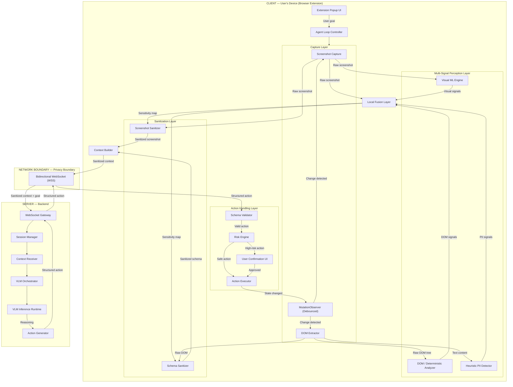
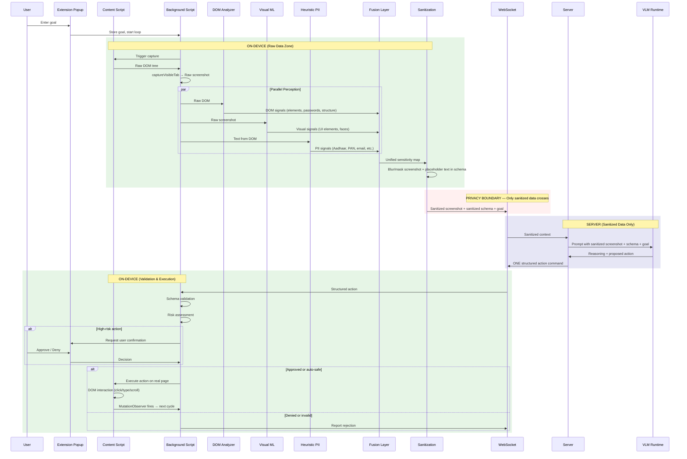
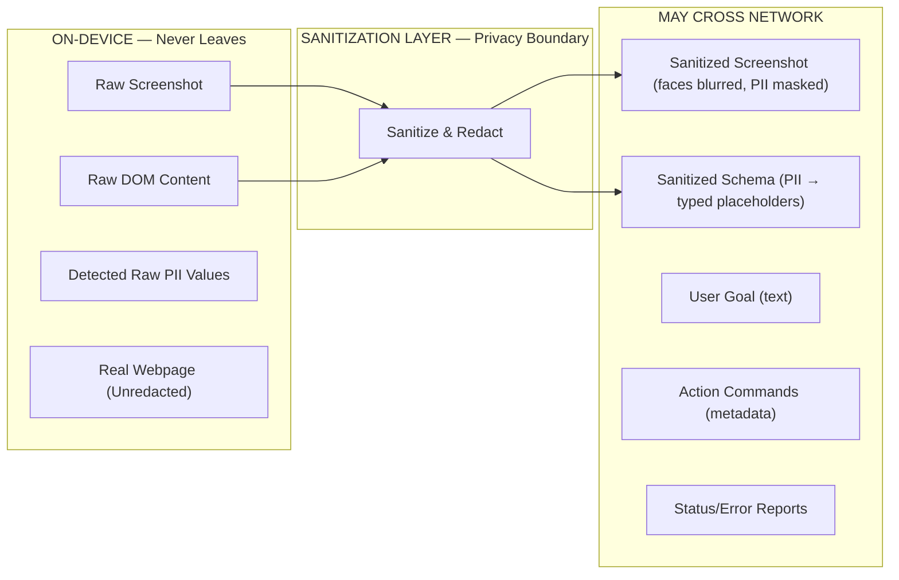
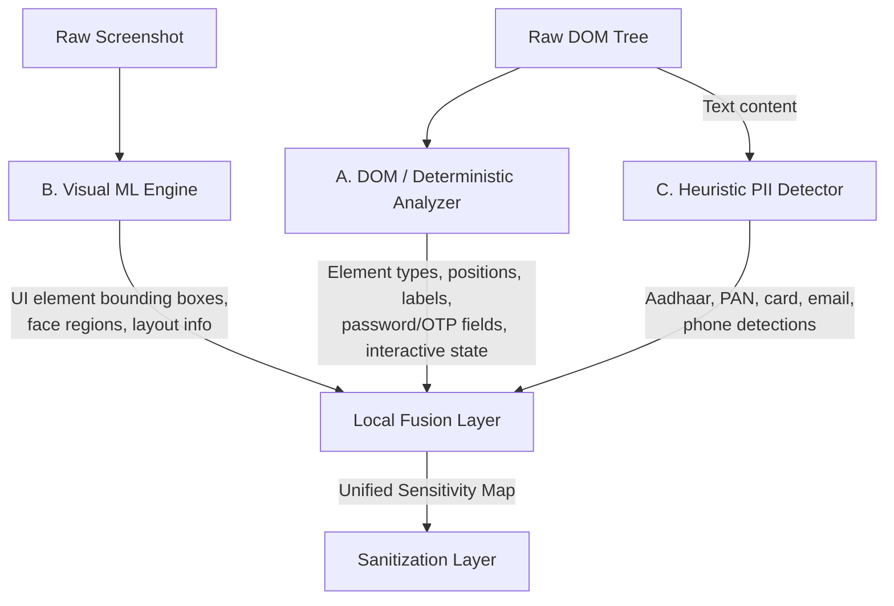
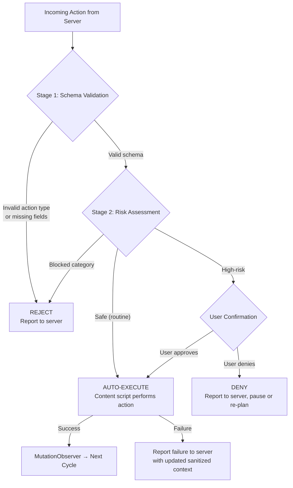
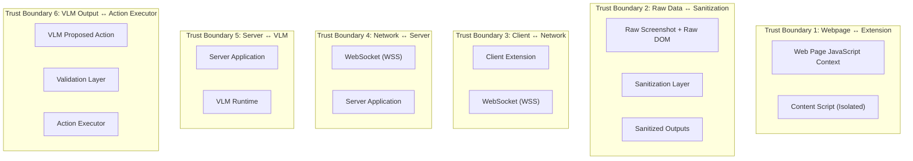

# AEGIS — System Architecture

## 1. Document Information

| Field | Value |
|-------|-------|
| Version | 1.0 |
| Status | Final Draft |
| Last Updated | 2026-09-18 |
| Source of Truth | [docs/PRD.md](file:///d:/Aegis/docs/PRD.md) v1.1 |
| Relationship to PRD | This document describes HOW the AEGIS system is structured. All product requirements, feature definitions, and scope decisions are defined in the PRD and are not repeated here except by reference. This document must not contradict the PRD. |

**Related documents (planned):**

| Document | Purpose |
|----------|---------|
| TECHNICAL_SPEC.md | Low-level implementation details, APIs, data structures |
| AI_ML_PIPELINE.md | Model selection, inference pipeline, benchmarking |
| SECURITY_PRIVACY.md | Detailed privacy threat model, security controls |
| BROWSER_AGENT_SPEC.md | Agent behavior specification, prompt engineering |
| API_SPEC.md | WebSocket message schema, server API contract |
| EVALUATION_PLAN.md | Testing strategy against SIH evaluation metrics |
| DEMO_FLOW.md | SIH demonstration script and scenario |

---

## 2. Architecture Overview

AEGIS is a two-tier, privacy-preserving browser-agent system. The client tier is a Manifest V3 browser extension that performs all visual perception, PII detection, and data sanitization on-device. The server tier hosts a Vision-Language Model that performs task reasoning over sanitized data only.

The fundamental architectural invariant is the **privacy boundary**: raw screenshots and raw PII exist only on the client device and are never transmitted across the network. The server receives only sanitized representations — a redacted screenshot and a sanitized structured schema — and returns a single structured action command. The client validates and executes that command against the real, unredacted webpage.

The system operates as a continuous loop:

**Capture → Perceive → Detect → Fuse → Sanitize → Transmit → Reason → Validate → Execute → Repeat**

This loop runs until the user's goal is completed, the user cancels, or the agent determines it cannot proceed.

---

## 3. Architectural Principles

| Principle | Description |
|-----------|-------------|
| **Privacy by Design** | The architecture structurally prevents raw sensitive data from leaving the device. Privacy is an architectural property, not a policy. |
| **Local-First Perception** | All perception — DOM analysis, visual ML, PII detection — happens on the user's device. The server never perceives the raw page. |
| **Raw-Data Locality** | Raw screenshots, raw DOM content, and raw PII remain in client-side memory only. They are never persisted, transmitted, or exposed to web page scripts. |
| **Least Privilege** | The extension requests only the permissions necessary for operation. The server receives only the minimum data required for reasoning. |
| **Defense in Depth** | PII detection uses three independent signal sources (DOM analysis, visual ML, heuristic patterns). Failure of one signal source does not eliminate all protection. |
| **Deterministic Execution** | The agent executes only predefined action types from a closed vocabulary. No arbitrary code execution on the webpage. |
| **Bounded Agent Actions** | The VLM proposes exactly one action per cycle. The agent does not batch, queue, or speculatively execute actions. |
| **Human Confirmation for Risk** | High-risk actions pause and require explicit user approval before execution. |
| **Fail-Safe Behavior** | When in doubt — low-confidence PII detection, uncertain action safety — the system errs on the side of caution: over-redact rather than under-redact, reject rather than execute. |
| **Separation of Concerns** | Perception, sanitization, reasoning, validation, and execution are distinct architectural layers with clear interfaces. |

---

## 4. High-Level System Architecture



### 4.1 Client-Side Components

All components below run within the browser extension on the user's device.

| Component | Responsibility | Handles Raw Data? |
|-----------|---------------|-------------------|
| **Extension Popup UI** | Accepts user goal, displays agent status, provides cancel control, shows sanitization preview. | No (displays status only) |
| **Agent Loop Controller** | Orchestrates the capture → perceive → sanitize → transmit → receive → validate → execute cycle. Enforces maximum step count, detects stuck states, manages termination. | Coordinates components; does not directly process page data. |
| **Screenshot Capture** | Uses `chrome.tabs.captureVisibleTab` to capture a bitmap of the active tab's visible viewport. | **Yes — raw screenshot.** |
| **DOM Extractor** | Traverses the active tab's DOM via content script to extract element types, input types, labels, positions, text content, interactive state, structural relationships. | **Yes — raw DOM content.** |
| **MutationObserver (Debounced)** | Watches the DOM for meaningful changes and triggers capture when the page state updates. Debounced at ~200ms to avoid excessive captures. | Monitors changes only; does not store data. |
| **DOM / Deterministic Analyzer** | Processes extracted DOM to identify element structure, password/OTP fields (by HTML attributes), interactive state, labels, and positional information. Produces DOM-derived signals. | **Yes — raw DOM content.** |
| **Visual ML Engine** | Runs lightweight vision model(s) (ViT/YOLO-class, face detection) on the raw screenshot via WebGPU/WASM. Identifies visual UI elements, layout, faces, and visual content not represented by DOM. | **Yes — raw screenshot.** |
| **Heuristic PII Detector** | Runs deterministic pattern matchers (regex, Luhn validation) on text extracted from the DOM. Detects Aadhaar, PAN, card numbers, email, phone patterns. | **Yes — raw text content.** |
| **Local Fusion Layer** | Combines signals from all three perception sources into a unified sensitivity map: which regions/fields/text are sensitive and require sanitization. | Receives processed signals; produces sensitivity decisions. |
| **Screenshot Sanitizer** | Applies visual redaction (blur, black-box) to sensitive regions identified in the sensitivity map. Produces a sanitized screenshot. | **Yes — receives raw screenshot, produces sanitized screenshot.** |
| **Schema Sanitizer** | Replaces sensitive text with typed placeholders (e.g., `[REDACTED_AADHAAR]`) in the structured DOM representation. Produces a sanitized schema. | **Yes — receives raw DOM representation, produces sanitized schema.** |
| **Context Builder** | Packages the sanitized screenshot and sanitized schema into a transmission-ready context payload. | No — handles only sanitized data. |
| **Schema Validator** | Validates incoming action commands from the server against the closed-vocabulary action schema. Rejects malformed or out-of-schema actions. | No — handles action metadata only. |
| **Risk Engine** | Evaluates valid actions for safety/risk level. Classifies actions as safe (auto-execute) or high-risk (requires confirmation). | No — handles action metadata only. |
| **User Confirmation UI** | Presents high-risk actions to the user for explicit approval or denial. | No — displays action description only. |
| **Action Executor** | Executes validated, approved actions on the real, unredacted webpage via content script DOM APIs. | **Yes — interacts with the real webpage.** |

### 4.2 Server-Side Components

All components below run on the backend server. They never receive raw data.

| Component | Responsibility | Handles Raw Data? |
|-----------|---------------|-------------------|
| **WebSocket Gateway** | Manages persistent bidirectional WebSocket connections with client extensions. Routes messages between clients and internal server components. | **No — receives sanitized data only.** |
| **Session Manager** | Manages per-client session state: current goal, conversation history, step count. | No — sanitized context only. |
| **Context Receiver** | Receives and validates the sanitized context payload (sanitized screenshot + sanitized schema + user goal). | No — sanitized data only. |
| **VLM Orchestrator** | Constructs the prompt for the VLM, combining sanitized context with user goal and conversation history. Manages inference configuration. | No — sanitized data only. |
| **VLM Inference Runtime** | Runs the open-weight Vision-Language Model (via Ollama locally or cloud API). Performs reasoning over the sanitized context. | No — sanitized data only. |
| **Action Generator** | Parses VLM output into a structured action command conforming to the closed-vocabulary schema. Handles VLM output validation on the server side. | No — produces action metadata. |

---

## 5. Component Architecture

### 5.1 Capture Layer

| Attribute | Detail |
|-----------|--------|
| **Purpose** | Acquire the current visual and structural state of the active tab. |
| **Inputs** | Active tab reference; MutationObserver change event. |
| **Processing** | Screenshot via `chrome.tabs.captureVisibleTab` (background script). DOM traversal via content script. MutationObserver debounced at ~200ms. |
| **Outputs** | Raw screenshot (bitmap/data URL). Raw DOM tree (structured object). |
| **Trust Boundary** | Operates within the extension's isolated execution context. Content script is isolated from web page JavaScript. |
| **Data Classification** | **Raw.** Outputs contain unredacted page content including any PII visible on screen. |

### 5.2 DOM / Deterministic Analyzer

| Attribute | Detail |
|-----------|--------|
| **Purpose** | Extract structured, deterministic information from the DOM that does not require ML inference. |
| **Inputs** | Raw DOM tree from the Capture Layer. |
| **Processing** | Traverses DOM nodes. Classifies element types (button, input, link, select, image, text). Reads input `type` attributes to identify password, email, tel, and OTP fields. Extracts labels, placeholder text, ARIA attributes, positions, dimensions, interactive state (disabled, readonly, hidden), and structural parent-child relationships. |
| **Outputs** | Structured DOM signals: element inventory with types, positions, labels, interactive state. Password/OTP field identifications. |
| **Trust Boundary** | Runs in the extension's content script context, isolated from web page JavaScript by the browser's content script isolation model. |
| **Data Classification** | **Raw.** Contains unredacted text content from the page. |

### 5.3 Visual ML Engine

| Attribute | Detail |
|-----------|--------|
| **Purpose** | Perceive visual information from the screenshot that DOM analysis cannot capture: visual layout, UI element bounding boxes, faces, canvas-rendered content, cross-origin iframe content visible in the screenshot. |
| **Inputs** | Raw screenshot from the Capture Layer. |
| **Processing** | Runs lightweight vision model(s) via WebGPU (with WASM fallback). Candidate model classes: ViT-class, YOLO-class for UI element detection; MediaPipe for face detection. Produces bounding boxes with class labels and confidence scores. |
| **Outputs** | Visual signals: list of detected visual elements (type, bounding box, confidence), detected face regions (bounding box, confidence). |
| **Trust Boundary** | Runs entirely within the extension's execution context. No network access. |
| **Data Classification** | **Raw input, processed output.** Receives raw screenshot; outputs are derived signals (bounding boxes, labels), not raw pixel data. |

### 5.4 Heuristic PII Detector

| Attribute | Detail |
|-----------|--------|
| **Purpose** | Detect structured PII patterns in text content extracted from the DOM. |
| **Inputs** | Text content from the DOM Extractor (raw text strings associated with DOM elements). |
| **Processing** | Applies deterministic pattern matchers: Aadhaar (12-digit), PAN (alphanumeric format), credit/debit card numbers (13–19 digits, Luhn validation), email addresses (RFC-compliant regex), phone numbers (Indian + common international formats). |
| **Outputs** | PII signals: list of detected PII instances (type, matched text or text region, associated DOM element, confidence — typically binary for deterministic patterns). |
| **Trust Boundary** | Runs in the extension's content script context. No network access. |
| **Data Classification** | **Raw input, processed output.** Receives raw text; outputs are detection flags and element references. |

### 5.5 Local Fusion Layer

| Attribute | Detail |
|-----------|--------|
| **Purpose** | Combine signals from all three perception sources into a single, unified sensitivity map that drives sanitization decisions. |
| **Inputs** | DOM signals (element types, password/OTP identifications). Visual signals (UI element bounding boxes, face bounding boxes). PII signals (detected PII instances, types, locations). |
| **Processing** | Merges signals. Resolves overlaps (e.g., a text region flagged by both heuristic PII and visual ML). Applies fail-safe logic: if any signal source flags a region as sensitive, it is marked for redaction. Low-confidence visual detections in potentially sensitive areas are also marked for redaction (PV-08). Produces the final sensitivity map. |
| **Outputs** | Unified sensitivity map: a complete list of regions/elements/text that must be sanitized, with redaction type (blur, mask, placeholder replacement) and associated metadata. |
| **Trust Boundary** | Internal to the extension. No external interfaces. |
| **Data Classification** | **Processed.** Contains classification decisions, not raw content. |

### 5.6 Sanitization Layer

Consists of two sub-components operating from the same sensitivity map:

#### 5.6.1 Screenshot Sanitizer

| Attribute | Detail |
|-----------|--------|
| **Purpose** | Produce a sanitized screenshot by visually redacting sensitive regions. |
| **Inputs** | Raw screenshot. Sensitivity map (regions to redact with bounding boxes). |
| **Processing** | For each sensitive visual region: applies blur, black-box, or pixel-fill over the bounding box coordinates on a copy of the raw screenshot. Does not modify the original raw screenshot in memory (it is needed by the Action Executor to interact with the real page). |
| **Outputs** | Sanitized screenshot (bitmap with sensitive regions visually destroyed). |
| **Trust Boundary** | Internal to the extension. Output crosses the privacy boundary. |
| **Data Classification** | **Output is sanitized.** No recoverable PII in redacted regions. |

#### 5.6.2 Schema Sanitizer

| Attribute | Detail |
|-----------|--------|
| **Purpose** | Produce a sanitized structured schema by replacing sensitive text with typed placeholders. |
| **Inputs** | Raw structured DOM representation. Sensitivity map (elements/text to redact). |
| **Processing** | For each sensitive text element: replaces the text content with a typed placeholder (e.g., `[REDACTED_AADHAAR]`, `[REDACTED_EMAIL]`, `[REDACTED_FACE_REGION]`). Preserves non-sensitive structural information: element types, positions, labels (if non-sensitive), interactive state, redaction markers. |
| **Outputs** | Sanitized structured schema (JSON). |
| **Trust Boundary** | Internal to the extension. Output crosses the privacy boundary. |
| **Data Classification** | **Output is sanitized.** PII text is replaced; structural context is preserved. |

### 5.7 Context Builder

| Attribute | Detail |
|-----------|--------|
| **Purpose** | Package sanitized outputs for transmission to the server. |
| **Inputs** | Sanitized screenshot. Sanitized structured schema. User goal. Session metadata (step count, etc.). |
| **Processing** | Compresses the sanitized screenshot. Assembles the transmission payload. |
| **Outputs** | Transmission-ready context payload containing: sanitized screenshot, sanitized schema, user goal, session metadata. |
| **Trust Boundary** | Output is transmitted across the network (privacy boundary crossing). Only sanitized data. |
| **Data Classification** | **Sanitized.** |

### 5.8 Action Validation Layer

#### 5.8.1 Schema Validator

| Attribute | Detail |
|-----------|--------|
| **Purpose** | Verify that the action received from the server conforms to the closed-vocabulary action schema. |
| **Inputs** | Structured action command from the server. |
| **Processing** | Checks that `action_type` is one of: click, type, scroll, select, hover, wait, done, fail. Validates required fields (target element identifier, input value for type actions). Rejects malformed or out-of-schema commands. |
| **Outputs** | Validated action (passed to Risk Engine) or rejection signal (reported to server with error context). |
| **Trust Boundary** | Enforces the contract between server output and client execution. |
| **Data Classification** | Action metadata only. No page content. |

#### 5.8.2 Risk Engine

| Attribute | Detail |
|-----------|--------|
| **Purpose** | Evaluate whether a schema-valid action is safe to execute automatically or requires user confirmation. |
| **Inputs** | Validated action from Schema Validator. Current page context (element type, associated labels, action semantics). |
| **Processing** | Classifies the action's risk level based on defined risk categories (e.g., payment submission, account deletion, form submission involving financial data). Safe actions proceed to execution. High-risk actions are routed to the User Confirmation UI. |
| **Outputs** | Execution clearance (auto-execute) or confirmation request (routed to user). |
| **Trust Boundary** | Last automated gate before action execution. |
| **Data Classification** | Action metadata and page context. |

> **Note:** The specific risk categories and their definitions are a specification-level decision to be detailed in BROWSER_AGENT_SPEC.md. The PRD establishes the principle (FR-18, HL-03) and provides examples (payment, deletion, financial submission).

### 5.9 Action Executor

| Attribute | Detail |
|-----------|--------|
| **Purpose** | Execute the validated, approved action on the real, unredacted webpage. |
| **Inputs** | Cleared action command (action type, target element, optional input value). |
| **Processing** | Locates the target element in the real DOM. Performs the action via DOM APIs (click, set value + dispatch events, scroll, select option, hover). Reports success or failure. |
| **Outputs** | Execution result (success/failure). On success, the page state changes, triggering MutationObserver. On failure, an error report is sent to the server with updated sanitized context. |
| **Trust Boundary** | Content script interacting with the web page's DOM. Isolated from page JavaScript by the browser's content script isolation. |
| **Data Classification** | **Interacts with raw page.** This is intentional and necessary — the agent must act on the real page. Redaction was only ever applied to the transmitted representation, never to the local page. |

### 5.10 Server-Side Components

#### VLM Orchestrator

| Attribute | Detail |
|-----------|--------|
| **Purpose** | Prepare input for the VLM and parse its output into a structured action. |
| **Inputs** | Sanitized screenshot, sanitized schema, user goal, session history. |
| **Processing** | Constructs a structured prompt combining visual context, schema context, goal, and conversation history. Sends to VLM Inference Runtime. Parses VLM natural-language output into a structured action conforming to the closed-vocabulary schema. |
| **Outputs** | One structured action command: `{action_type, target, value?, reasoning?}`. |
| **Trust Boundary** | Server-internal. Handles only sanitized data. |
| **Data Classification** | **Sanitized input, action metadata output.** |

#### VLM Inference Runtime

| Attribute | Detail |
|-----------|--------|
| **Purpose** | Run the open-weight VLM that reasons about the sanitized page state and user goal. |
| **Inputs** | Structured prompt from VLM Orchestrator (includes sanitized screenshot, sanitized schema, user goal). |
| **Processing** | Inference on an open-weight Vision-Language Model. For the SIH demo: local inference via Ollama is the primary deployment. Cloud-hosted inference of the same open-weight model is supported as a configurable alternative. |
| **Outputs** | VLM response (natural language reasoning + proposed action). |
| **Trust Boundary** | If Ollama: runs on the same server machine. If cloud API: data crosses to the cloud provider — but only sanitized data. |
| **Data Classification** | **Sanitized.** The VLM never receives raw screenshots or raw PII. |

---

## 6. End-to-End Data Flow



### Data Classification at Each Stage

| Stage | Data State | Location |
|-------|-----------|----------|
| Screenshot capture | **Raw** — unredacted pixel data | Client memory only |
| DOM extraction | **Raw** — full text content, attributes | Client memory only |
| DOM analysis output | **Processed** — structural signals, field classifications | Client memory only |
| Visual ML output | **Processed** — bounding boxes, labels, confidence | Client memory only |
| Heuristic PII output | **Processed** — detection flags, matched patterns | Client memory only |
| Fusion output | **Processed** — sensitivity map | Client memory only |
| Sanitized screenshot | **Sanitized** — sensitive regions visually destroyed | Client → Server |
| Sanitized schema | **Sanitized** — PII replaced with typed placeholders | Client → Server |
| VLM input | **Sanitized** — no raw PII | Server only |
| Action command | **Metadata** — action type, target, value | Server → Client |
| Action execution | **Raw** — operates on the real, unredacted webpage | Client only |

---

## 7. Privacy Boundary Architecture

The privacy boundary is the most critical architectural element of AEGIS. It is a hard line between what stays local and what may be transmitted.



### 7.1 What Data Exists Locally Only

- Raw screenshot bitmap from `captureVisibleTab`
- Raw DOM tree including all text content, attribute values, form field values
- Detected PII values (the actual Aadhaar number, email address, etc.)
- Face image data (raw pixel regions)
- Password/OTP field contents
- The real, unredacted webpage in the browser tab
- All intermediate perception signals (DOM signals, visual signals, PII signals)
- The sensitivity map

### 7.2 What Data May Leave the Device

- Sanitized screenshot (sensitive visual regions blurred/masked beyond recovery)
- Sanitized structured schema (sensitive text replaced with typed placeholders like `[REDACTED_AADHAAR]`)
- User goal (plain text entered by the user)
- Session metadata (step count, agent state)
- Action execution results (success/failure status)
- Error reports (with updated sanitized context, not raw context)

### 7.3 What Data MUST NEVER Leave the Device

- Raw, unredacted screenshots
- Raw PII text values (actual Aadhaar numbers, PAN numbers, card numbers, email addresses, phone numbers)
- Raw face image regions
- Password or OTP field contents
- Authentication tokens or cookies
- Browsing history
- Any data from tabs other than the active tab

### 7.4 Why the Server Cannot Access Raw PII

The server has no mechanism to request or receive raw data. The communication protocol transmits only the output of the sanitization layer. The sanitization is performed locally before the WebSocket message is constructed. There is no server-initiated capture, no raw data endpoint, and no bypass path. The server-side VLM reasons over the sanitized representation exactly as a human would reason over a redacted document.

This is an **architectural enforcement** — not a policy promise. However, it is not a mathematical guarantee. The effectiveness depends on the accuracy of PII detection and redaction. False negatives in PII detection remain the primary residual risk (see Section 16).

### 7.5 Why the Agent Can Still Interact with the Real Webpage

Redaction applies exclusively to the **transmitted representation** — the copies of the screenshot and schema that are sent to the server. The real webpage in the user's browser tab is never modified by the sanitization process. The content script's Action Executor operates on the real, unredacted DOM, which is why it can click buttons, fill fields, and scroll the actual page. The extension has full access to the real page because it runs locally — the same device where the raw data exists.

---

## 8. Perception Architecture

AEGIS uses a multi-signal perception system rather than a single AI model. This is a deliberate architectural choice driven by three considerations:

1. **Coverage:** No single model can reliably detect all categories of sensitive content. DOM analysis catches password fields and structured input types that visual models would have to infer. Heuristic patterns catch text-based PII (Aadhaar, PAN) that visual models are not trained on. Visual ML catches faces and layout information that DOM cannot represent.

2. **Reliability:** Defense in depth. If the visual model fails to detect a face, the heuristic detector may still catch PII text in the same region. If DOM analysis misses a dynamically-generated input, visual ML may still identify it.

3. **Efficiency:** DOM analysis and heuristic patterns are computationally cheap (deterministic string matching, DOM traversal). Only visual perception requires ML inference. This reduces the overall resource burden compared to running a large model that handles everything.

### Perception Signal Sources



### Signal Source A: DOM / Deterministic Analyzer

- **Input:** Raw DOM tree.
- **Detects:** Element types, input types (`password`, `email`, `tel`, `number`), labels, positions, dimensions, interactive state (disabled, readonly, hidden, visible), structural relationships (parent forms, fieldsets, labels), ARIA attributes.
- **Sensitive content identified:** Password fields, OTP fields — deterministically by HTML attributes, not by visual appearance.
- **Strengths:** Fast, deterministic, zero ML overhead, reliable for structured HTML.
- **Limitations:** Cannot perceive canvas content, cross-origin iframes (browser same-origin policy), or visual layout that differs from DOM structure.

### Signal Source B: Visual ML Engine

- **Input:** Raw screenshot.
- **Detects:** Visual UI elements (buttons, inputs, links, text regions) with bounding boxes. Face regions. Visual layout and spatial relationships. Content visible in the screenshot but not accessible via DOM (canvas, cross-origin iframes, complex CSS-rendered visuals).
- **Strengths:** Perceives the page as rendered, catches what DOM misses.
- **Limitations:** Requires ML inference (latency, resource cost). Accuracy depends on model quality. Cannot read text with the precision of DOM extraction.

### Signal Source C: Heuristic PII Detector

- **Input:** Text content extracted from DOM.
- **Detects:** Aadhaar numbers (12-digit pattern), PAN numbers (alphanumeric format), credit/debit card numbers (13–19 digits, Luhn validation), email addresses, phone numbers.
- **Strengths:** Fast, deterministic, high precision for well-defined patterns.
- **Limitations:** Cannot detect visual PII (faces, images of ID cards). Limited to explicitly configured patterns. Locale-specific.

### Local Fusion

The fusion layer produces the unified sensitivity map by combining all signals:

- If **any** signal source flags a region/element as sensitive, it is marked for redaction.
- Low-confidence visual ML detections in potentially sensitive areas are also marked (fail-safe per PV-08).
- Overlapping signals from multiple sources reinforce confidence.
- The fusion output is a flat list of redaction directives: region bounding boxes (for screenshot sanitization) and element/text references (for schema sanitization).

---

## 9. Sanitization Architecture

Sanitization is the process of transforming raw captured data into a representation that is safe to transmit. It operates from the unified sensitivity map produced by the fusion layer.

### 9.1 Screenshot Sanitization

- **Input:** Raw screenshot + sensitivity map (visual region bounding boxes).
- **Process:** For each sensitive bounding box, apply irreversible visual redaction on a **copy** of the raw screenshot:
  - **Faces:** Gaussian blur or pixelation over the bounding box.
  - **PII text regions:** Black-box fill or heavy blur.
  - **General sensitive regions:** Solid fill or blur.
- **Output:** Sanitized screenshot. Sensitive regions are visually destroyed and unrecoverable.
- **Key constraint:** The original raw screenshot is not modified. The sanitized version is a separate copy.

### 9.2 Structured Schema Sanitization

- **Input:** Raw structured DOM representation + sensitivity map (element/text references).
- **Process:** For each sensitive element or text span:
  - Replace the text content with a typed placeholder: `[REDACTED_AADHAAR]`, `[REDACTED_PAN]`, `[REDACTED_CARD]`, `[REDACTED_EMAIL]`, `[REDACTED_PHONE]`, `[REDACTED_PASSWORD]`, `[REDACTED_FACE_REGION]`.
  - Preserve non-sensitive structural information: element type, position, dimensions, label (if the label itself is not sensitive), interactive state, redaction markers.
- **Output:** Sanitized schema (JSON). The VLM can understand page structure and reason about actions without seeing actual PII.

### 9.3 Placeholder Strategy

Typed placeholders serve a dual purpose:
1. **Privacy:** The actual value is removed.
2. **Context preservation:** The VLM knows *what kind* of data was there (e.g., "this field contains an Aadhaar number") even though it cannot see the actual value. This enables correct reasoning (e.g., "skip this field — it's already filled").

### 9.4 Uncertainty Handling

When the fusion layer produces low-confidence sensitivity flags:

- **Principle:** LOW CONFIDENCE → PREFER REDACTION.
- A false positive (over-redaction) reduces VLM context but does not compromise privacy.
- A false negative (under-redaction) leaks PII — unacceptable.
- Therefore, the system defaults to redacting uncertain regions.

### 9.5 Fail-Safe Behavior

If the sanitization process itself encounters an error (e.g., canvas rendering failure, memory pressure):
- The affected region is treated as sensitive and fully redacted.
- If sanitization cannot complete at all, the context is not transmitted. The agent reports the failure to the user.

---

## 10. Browser Agent Architecture

### 10.1 Goal Handling

- The user enters a natural-language goal via the extension popup (e.g., "Fill out this form," "Book a ticket to Delhi").
- The goal is stored in `chrome.storage` and persisted for the duration of the agent session.
- The goal is transmitted to the server alongside every sanitized context payload so the VLM can reference it.

### 10.2 Context Generation

Each cycle, the client generates a fresh sanitized context:
- Sanitized screenshot (current visible viewport after sanitization).
- Sanitized schema (current DOM state after sanitization).
- User goal.
- Step count and agent state metadata.

### 10.3 Action Generation (Server)

The VLM produces one proposed action per cycle. The action conforms to the closed-vocabulary schema:

| Action Type | Parameters | Description |
|-------------|-----------|-------------|
| `click` | `target` (element selector/identifier) | Click a specific element. |
| `type` | `target`, `value` (text to type) | Enter text into a field. |
| `scroll` | `direction` (up/down), optional `amount` | Scroll the page. |
| `select` | `target`, `value` (option to select) | Select a dropdown option. |
| `hover` | `target` | Hover over an element. |
| `wait` | optional `duration` | Wait for page state to stabilize. |
| `done` | optional `reasoning` | Signal that the goal is achieved. |
| `fail` | `reasoning` | Signal that the agent cannot proceed. |

### 10.4 One-Action-Per-Cycle Constraint

The VLM returns exactly one action. The client executes exactly one action. This constraint:
- Prevents cascading errors from chained actions.
- Ensures the agent re-perceives the page state after every interaction.
- Keeps the human-in-the-loop mechanism effective (the user can intervene between any two actions).

### 10.5 Local Action Execution

The content script executes the action via standard DOM APIs:
- `element.click()` for click actions.
- `element.value = value` + input/change event dispatch for type actions.
- `window.scrollBy()` for scroll actions.
- Setting `selectedIndex` or option `selected` attribute for select actions.

No arbitrary JavaScript is injected. Only the predefined action types are executed.

### 10.6 State Refresh

After execution, the MutationObserver detects the resulting DOM change (debounced ~200ms), triggering the next capture cycle. If the action causes a navigation (page load), the content script in the new page activates and the loop continues.

### 10.7 Termination Conditions

The agent loop terminates when:
1. The VLM returns a `done` action (goal achieved).
2. The VLM returns a `fail` action (cannot proceed).
3. The user cancels via the popup UI.
4. The maximum step count is reached.
5. Consecutive failure count exceeds the threshold (stuck detection per BA-08).

---

## 11. Action Validation & Risk Architecture

Action validation is a two-stage process. A structurally valid action is not automatically a safe action.



### Stage 1: Schema Validation

- Is `action_type` one of: click, type, scroll, select, hover, wait, done, fail?
- Are required parameters present (e.g., `target` for click, `target` + `value` for type)?
- Is the data well-formed (valid JSON, expected types)?

If any check fails → **reject**. Report the malformed action to the server.

### Stage 2: Safety / Risk Assessment

- Does the action target an element associated with a high-risk category (payment, deletion, sensitive submission)?
- Does the action type combined with the target context represent a potentially irreversible or sensitive operation?

Risk classification:
- **Safe (auto-execute):** Scrolling, clicking navigation links, typing in search fields, hovering.
- **High-risk (requires confirmation):** Submitting payment forms, clicking delete/deactivate buttons, submitting forms containing financial or identity data.
- **Blocked:** Actions that violate architectural constraints (e.g., navigating to an external URL not in current context — per SE-06).

> **Specification note:** The detailed risk categories and classification rules are a later specification decision (BROWSER_AGENT_SPEC.md). The architecture establishes the two-stage validation structure and the confirmation mechanism.

---

## 12. Server-Side VLM Architecture

### 12.1 WebSocket Session Lifecycle

1. Client opens a WebSocket connection to the server.
2. Server creates a session (goal, step history, conversation context).
3. Each cycle: client sends sanitized context → server responds with one action.
4. Session ends when the agent terminates (done, fail, cancel, max steps).
5. Server discards all session data upon disconnection (PV-06).

### 12.2 Sanitized Context Ingestion

The server receives per cycle:
- Sanitized screenshot (compressed image, sensitive regions visually destroyed).
- Sanitized structured schema (JSON, PII replaced with typed placeholders).
- User goal (text).
- Step count and agent state metadata.

The server does not receive and cannot request: raw screenshots, raw DOM, raw PII, cookies, or authentication tokens.

### 12.3 VLM Orchestration

The VLM Orchestrator constructs a prompt that includes:
- System instruction: the VLM's role, the closed-vocabulary action schema, one-action-per-cycle constraint, the meaning of redaction placeholders.
- Sanitized screenshot (as image input to the VLM).
- Sanitized schema (as structured text context).
- User goal.
- Recent action history (what the agent has done in previous steps).
- Any failure reports from the previous cycle.

### 12.4 Structured Action Generation

The VLM responds with natural language reasoning and a proposed action. The Action Generator on the server parses this output into the structured action format:

```
{
  "action_type": "click" | "type" | "scroll" | "select" | "hover" | "wait" | "done" | "fail",
  "target": "<element identifier from schema>",
  "value": "<optional: text to type, option to select, scroll direction>",
  "reasoning": "<optional: VLM's explanation>"
}
```

If the VLM output cannot be parsed into a valid action, the server returns a `fail` action with an appropriate error message.

### 12.5 VLM Deployment Model

The architecture supports a configurable VLM deployment:

| Mode | Runtime | Use Case |
|------|---------|----------|
| **Local inference** | Ollama running an open-weight VLM (e.g., Qwen-VL, Gemma, LLaVA, PaliGemma) | SIH demo on team hardware. No external API dependency. |
| **Cloud inference** | Cloud-hosted API serving the same open-weight model (e.g., Together AI, Groq, HuggingFace Inference) | When local hardware cannot run the VLM at acceptable latency. |

Selection is a server-side configuration setting. The client is unaware of which deployment mode is active — it sends the same sanitized context and receives the same structured action format regardless.

---

## 13. Communication Architecture

### 13.1 Protocol

Persistent bidirectional WebSocket connection. WSS (WebSocket Secure) is required for any non-localhost deployment (NFR-03).

### 13.2 Message Flow

| Direction | Message Type | Content |
|-----------|-------------|---------|
| Client → Server | **context_update** | Sanitized screenshot, sanitized schema, user goal, step count, session metadata. |
| Client → Server | **action_result** | Execution result (success/failure), failure details if applicable. |
| Client → Server | **cancel** | User cancellation signal. |
| Server → Client | **action** | Structured action command (action_type, target, value, reasoning). |
| Server → Client | **error** | Server-side error (VLM failure, parsing error). |

### 13.3 Session Lifecycle

1. **Connect:** Client opens WebSocket on agent activation.
2. **Goal:** First message includes the user goal.
3. **Loop:** Alternating context_update (client) → action (server) messages, with action_result (client) following each execution.
4. **Terminate:** On done/fail/cancel/max-steps, client sends termination signal, server cleans up session.
5. **Disconnect:** WebSocket is closed. Server discards session data.

### 13.4 Failure Reporting

When an action fails to execute (element not found, element not interactable):
- The client sends an `action_result` with failure details.
- The client immediately captures a new sanitized context and sends it as a `context_update`.
- The server re-evaluates the situation with the updated context.

> **Note:** The specific message schemas (field names, encoding, compression) are deferred to API_SPEC.md.

---

## 14. Trust Boundaries



| Boundary | Threat | Control |
|----------|--------|---------|
| **Webpage ↔ Extension** | Malicious page JavaScript attempts to access captured data or influence agent actions. | MV3 content script isolation. Content scripts run in an isolated world — page scripts cannot access extension variables, functions, or DOM modifications made by the content script. |
| **Raw Data ↔ Sanitization** | Raw PII could be included in the transmitted context if sanitization is bypassed or incomplete. | Sanitization is a mandatory step in the pipeline. No code path transmits data without passing through the sanitization layer. Fail-safe: uncertain regions are redacted. |
| **Client ↔ Network** | Eavesdropping or man-in-the-middle on the WebSocket connection. | WSS (TLS) for non-localhost deployments. Only sanitized data is transmitted regardless of transport security. |
| **Network ↔ Server** | Unauthorized clients sending commands to the server. | Client-server authentication (implementation deferred to SECURITY_PRIVACY.md). |
| **Server ↔ VLM** | VLM processes and potentially stores/logs input data. | For local Ollama: VLM runs on the same server machine; no additional network exposure. For cloud API: only sanitized data is sent; API provider sees no raw PII. Server does not persist data beyond the session (PV-06). |
| **VLM Output ↔ Action Executor** | VLM proposes a malicious, malformed, or unsafe action (hallucination, prompt injection via page content). | Two-stage validation: schema validation rejects malformed actions; risk engine blocks or flags unsafe actions. Closed-vocabulary action set prevents arbitrary code execution. User confirmation for high-risk actions. |

---

## 15. Deployment Architecture

### SIH Demo Deployment

The expected deployment for the SIH demonstration is a single-machine or two-machine setup:

```
┌──────────────────────────────────────────────────────┐
│                   USER'S LAPTOP                      │
│                                                      │
│  ┌──────────────────────────────────────────┐        │
│  │         CHROME / EDGE BROWSER            │        │
│  │                                          │        │
│  │  ┌────────────────────────────────────┐  │        │
│  │  │    AEGIS Browser Extension (MV3)   │  │        │
│  │  │                                    │  │        │
│  │  │  - Popup UI                        │  │        │
│  │  │  - Background Service Worker       │  │        │
│  │  │  - Content Script                  │  │        │
│  │  │  - On-device ML (WebGPU/WASM)      │  │        │
│  │  │  - MediaPipe Face Detection        │  │        │
│  │  │  - Heuristic PII Detectors         │  │        │
│  │  │  - Sanitization Engine             │  │        │
│  │  └──────────────┬─────────────────────┘  │        │
│  │                 │ WebSocket (localhost)   │        │
│  └─────────────────┼────────────────────────┘        │
│                    │                                  │
│  ┌─────────────────┼────────────────────────┐        │
│  │  BACKEND SERVER │ (Python FastAPI)        │        │
│  │                 │                         │        │
│  │  - WebSocket Gateway                      │        │
│  │  - Session Manager                        │        │
│  │  - VLM Orchestrator                       │        │
│  │  - Ollama (local VLM inference)           │        │
│  │    └── Open-weight VLM                    │        │
│  └───────────────────────────────────────────┘        │
└──────────────────────────────────────────────────────┘
```

**Alternative: Cloud VLM deployment**

If the demo laptop cannot run the VLM at acceptable latency, the backend server configuration is changed to route VLM inference to a cloud-hosted API serving the same open-weight model. The extension and server code remain identical — only the VLM runtime configuration changes.

### Deployment Components

| Component | Technology | Runs On |
|-----------|-----------|---------|
| Browser Extension | TypeScript, Manifest V3, ONNX Runtime Web, WebGPU/WASM, MediaPipe | User's browser |
| Backend Server | Python, FastAPI, WebSocket | Same machine (localhost) or LAN server |
| VLM Runtime (local) | Ollama + open-weight VLM | Same machine as backend server |
| VLM Runtime (cloud) | Cloud API (configurable) | Cloud provider infrastructure |

---

## 16. Failure & Recovery Architecture

| Failure Scenario | Detection | Recovery | Fail-Safe Behavior |
|-----------------|-----------|----------|-------------------|
| **Perception failure** (ML model crash, inference error) | Exception in Visual ML Engine. | Skip visual ML signals for this cycle. DOM analysis and heuristic PII detection continue. Warn user that visual perception is degraded. | Over-redact: treat unanalyzed visual regions as potentially sensitive. |
| **PII detection uncertainty** (low-confidence detections) | Confidence scores below threshold. | Fusion layer marks low-confidence regions for redaction. | Prefer redaction over disclosure (PV-08). |
| **Sanitization failure** (rendering error, memory pressure) | Exception in sanitization process. | Do not transmit context. Inform user that the current cycle cannot proceed. Retry on next page state change. | Never transmit unsanitized data. |
| **WebSocket disconnection** | Connection close event, timeout. | Attempt reconnection with exponential backoff. Inform user of connectivity issue. On-device perception continues to function. | Agent pauses. No data is queued for deferred transmission. |
| **VLM failure** (model crash, timeout, rate limit) | Server returns error message or no response within timeout. | Report to user: "AI reasoning service temporarily unavailable." Pause agent. | Agent does not guess or act without VLM instruction. |
| **Malformed action** (VLM output cannot be parsed) | Server-side Action Generator fails to parse. | Server returns `fail` action with error context. Client re-sends updated sanitized context. | No action executed. |
| **Invalid action** (fails schema validation) | Schema Validator rejects. | Report rejection to server with reason. Server re-evaluates. | No action executed. |
| **Unsafe action** (fails risk check, user denies) | Risk Engine flags; user clicks deny. | Report denial to server. Server may re-plan with different approach. | No action executed without user consent for high-risk operations. |
| **Action execution failure** (element not found, not interactable) | Content script exception or DOM query returns null. | Report failure to server with updated sanitized context. Server re-evaluates. | Agent does not retry the same failed action blindly. |
| **Timeout** (any stage exceeds expected duration) | Timer-based monitoring. | Cancel the current operation. Inform user. | Agent pauses rather than hanging indefinitely. |
| **Maximum step count reached** | Step counter exceeds configured limit. | Terminate agent loop. Inform user that the step limit was reached. | Agent stops. Prevents infinite resource consumption. |
| **Stuck detection** (repeated identical states) | Compare consecutive sanitized states. After N identical cycles, trigger. | Pause agent. Inform user. Offer options: retry, adjust goal, or cancel. | Agent does not loop indefinitely. |

---

## 17. Performance Architecture

All numerical targets below are **proposed engineering targets** derived from the PRD. They are not official SIH requirements. The SIH evaluation allocates 20% to client-side resource utilization and 15% to end-to-end latency, but does not specify exact thresholds.

### Performance Budget Per Cycle

| Phase | Proposed Target | Notes |
|-------|----------------|-------|
| Screenshot capture | < 100ms | `captureVisibleTab` is fast. |
| DOM extraction | < 200ms | Dependent on page complexity. |
| DOM analysis | < 50ms | Deterministic, no ML. |
| Visual ML inference | < 1000ms | The most expensive client-side operation. WebGPU significantly faster than WASM. |
| Heuristic PII detection | < 50ms | Regex/pattern matching is fast. |
| Fusion | < 50ms | Signal merging, no ML. |
| Sanitization | < 200ms | Image processing (blur/mask) + JSON manipulation. |
| **Total on-device** | **< 2 seconds** | Proposed target (PF-01). |
| Network round-trip | < 100ms | Localhost or LAN for demo. |
| VLM reasoning | < 3 seconds | Proposed target (PF-02). Highly dependent on model size and hardware. |
| Validation + execution | < 100ms | Fast, deterministic. |
| **Total end-to-end** | **< 5 seconds** | Proposed target (PF-03). |

### Resource Budget

| Resource | Proposed Target | Notes |
|----------|----------------|-------|
| Extension active memory | < 500MB | During ML inference. PF-04. |
| Extension idle memory | < 100MB | When no task is active. PF-05. |
| ML model cold-start | < 10 seconds | First-time model loading. PF-09. |
| MutationObserver debounce | ~200ms | PF-08. |

### Optimization Levers

- **WebGPU vs. WASM:** WebGPU provides significant speedup for ML inference on machines with compatible GPUs. WASM is the fallback.
- **Model quantization:** Smaller quantized models (INT8, INT4) reduce inference latency and memory.
- **Screenshot compression:** Compress the sanitized screenshot before transmission to reduce payload size and network latency.
- **Debounce tuning:** Adjusting the MutationObserver debounce interval trades responsiveness for resource efficiency.

---

## 18. Scalability & Extensibility

The AEGIS architecture is designed to support future evolution without restructuring the core pipeline. Each extension point is a layer boundary.

| Extension | How the Architecture Supports It | Scope |
|-----------|--------------------------------|-------|
| **Stronger visual models** | The Visual ML Engine is a replaceable component. Swapping a ViT for a more capable model requires only changing the model artifact and inference configuration, not the pipeline. | Future |
| **Better PII detectors** | Additional heuristic patterns can be added to the Heuristic PII Detector. New visual PII categories (QR codes, ID card images) can be added to the Visual ML Engine. The fusion layer accepts signals from any number of sources. | Future |
| **Cryptographic capability tokens** | The Risk Engine is the natural integration point. In v2, the Risk Engine would verify a cryptographic token rather than (or in addition to) a rule-based risk lookup. No other component changes. | Future (v2) |
| **Additional browsers** | The architecture uses standard browser APIs (MutationObserver, DOM APIs, WebGPU). Firefox MV3 compatibility requires testing and potential API adaptation, but the pipeline structure is browser-agnostic. | Future |
| **Richer privacy policies** | The Fusion Layer's sensitivity map can be driven by configurable policies (user-defined, organization-defined) rather than hardcoded rules. | Future |
| **Multi-tab workflows** | The Agent Loop Controller currently operates on one tab. Multi-tab support would require a tab coordination layer above the loop controller, but the per-tab pipeline remains the same. | Future |
| **Improved VLM models** | The VLM Inference Runtime is behind the VLM Orchestrator. Swapping the model or provider is a configuration change. The prompt format may need adjustment. | Ongoing |
| **Action vocabulary expansion** | New action types can be added to the schema. The Schema Validator and Action Executor are the only components that need updating. | Future |

---

## 19. Technology Mapping

| Architectural Component | Candidate Technology | Source |
|------------------------|---------------------|--------|
| Extension framework | Manifest V3 (Chrome/Edge) | PRD, finalized design |
| Extension language | TypeScript | Finalized design |
| DOM change detection | MutationObserver (debounced ~200ms) | PRD FR-03, finalized design |
| Screenshot capture | `chrome.tabs.captureVisibleTab` | PRD FR-01 |
| DOM extraction | Content script + DOM APIs | PRD FR-02 |
| Visual ML inference runtime | ONNX Runtime Web / Transformers.js | Finalized design |
| Visual ML compute backend | WebGPU (primary), WASM (fallback) | PRD, finalized design |
| Face detection | MediaPipe Face Detection | Finalized design |
| Visual UI detection models | ViT-class / YOLO-class (specific model TBD after benchmarking) | Finalized design, OQ-01 |
| Heuristic PII detection | Deterministic regex/pattern matchers (TypeScript) | PRD FR-08 |
| Client ↔ Server communication | Bidirectional WebSocket (WSS) | PRD FR-13 |
| Server framework | Python FastAPI | Finalized design |
| VLM inference (local) | Ollama | Finalized design |
| VLM model candidates | Gemma 3, Qwen-VL, LLaVA, PaliGemma (specific model TBD after benchmarking) | PRD, finalized design, OQ-02 |
| VLM inference (cloud fallback) | Cloud-hosted API of open-weight model (configurable) | PRD FR-24 |
| Goal storage | `chrome.storage` | Finalized design |
| Action execution | Content script + DOM APIs (`chrome.scripting`) | PRD FR-19 |

> **Note:** Specific model selections (visual ML model, server-side VLM) are not locked. They require benchmarking as documented in OQ-01 and OQ-02 of the PRD.

---

## 20. Architecture Decisions & Rationale

| # | Decision | Choice | Rationale | Scope |
|---|----------|--------|-----------|-------|
| AD-01 | Privacy enforcement mechanism | Architectural (local sanitization before transmission) | Policy-based privacy can be bypassed. Architectural enforcement means the server structurally cannot receive raw data. | v1 (MVP) |
| AD-02 | Perception approach | Multi-signal (DOM + visual ML + heuristic PII) | No single model covers all detection needs. DOM catches structured fields; visual ML catches faces and layout; heuristics catch text patterns. Defense in depth. | v1 (MVP) |
| AD-03 | Transmitted data | Both sanitized screenshot + sanitized schema | The VLM needs visual context for layout understanding and structural context for element identification. Either alone is insufficient. | v1 (MVP) |
| AD-04 | VLM location | Server-side (not on-device) | Current VLMs capable of multi-step task reasoning are too large for in-browser inference. Splitting perception (local) from reasoning (remote) is the practical trade-off. | v1 (MVP) |
| AD-05 | Action vocabulary | Closed vocabulary (8 action types) | Prevents arbitrary code execution. Makes validation deterministic. Covers common web interaction patterns. | v1 (MVP) |
| AD-06 | Actions per cycle | Exactly one | Prevents cascading errors. Ensures fresh perception after every action. Keeps human-in-the-loop effective. | v1 (MVP) |
| AD-07 | Action validation | Two-stage (schema + risk) | A valid action is not necessarily a safe action. Separating structural and safety validation provides defense in depth. | v1 (MVP) |
| AD-08 | High-risk action handling | User confirmation dialog | Irreversible actions (payment, deletion) must have human approval. Aligns with PRD HL-03. | v1 (MVP) |
| AD-09 | Action security model | Rule-based closed vocabulary | Simple, auditable, sufficient for SIH prototype. | v1 (MVP) |
| AD-10 | Action security model (future) | Cryptographic capability tokens | Tamper-proof, non-forgeable. Replaces trust-based check with cryptographic proof. | Future (v2) |
| AD-11 | VLM deployment | Configurable: Ollama (local) or cloud API | Local Ollama for SIH demo (privacy, no cost). Cloud API when local hardware is insufficient. Same open-weight model in both cases. | v1 (MVP) |
| AD-12 | Agent scope | Active tab only | Reduces complexity and attack surface. Multi-tab is future scope (NG8). | v1 (MVP) |
| AD-13 | Uncertainty handling | Fail-safe over-redaction | Over-redacting is preferable to leaking PII. Aligns with PV-08. | v1 (MVP) |
| AD-14 | Extension framework | Manifest V3 | Required by modern Chrome/Edge. Provides security sandboxing, Content Security Policy, no remote code execution. | v1 (MVP) |

---

## 21. Architecture Constraints

| Constraint | Source | Impact |
|-----------|--------|--------|
| Raw screenshots and raw PII must never cross the network boundary. | PRD PV-01, PV-02, PV-04, NFR-01, NFR-02. | All sanitization must complete before any network transmission. |
| Manifest V3 is mandatory. | PRD NFR-04, SE-01. | No `eval()`, no remote code execution, strict CSP, service worker (not persistent background page). |
| Active tab only. | PRD NG8, BA-05. | No multi-tab coordination, no browser UI automation. |
| Lightweight local inference. | PRD NFR-06, G4. | On-device ML models must be small enough to run without crashing the browser on 8GB RAM machines. |
| Network dependency for VLM reasoning. | Architecture (VLM is server-side). | Agent cannot reason without server connectivity. On-device perception and sanitization function independently. |
| Cross-origin iframe limitation. | Browser same-origin policy. | DOM analysis cannot access cross-origin iframe content. Visual ML can perceive it from the screenshot. |
| Closed action vocabulary (v1). | PRD FR-16, BA-02, BA-06. | Only 8 predefined action types. No arbitrary JavaScript execution. |
| `captureVisibleTab` captures visible viewport only. | Chrome API limitation. | Cannot capture below-the-fold content without scrolling. Agent must scroll to perceive hidden content. |
| No data persistence on server beyond session. | PRD PV-06. | Server discards all data when WebSocket disconnects. |
| Minimum permissions. | PRD SE-02. | Extension requests only: `activeTab`, `scripting`, `storage`, `tabs`. |

---

## 22. Traceability to PRD

| Architecture Component | PRD Requirements |
|-----------------------|-----------------|
| Screenshot Capture | FR-01 |
| DOM Extractor | FR-02 |
| MutationObserver (Debounced) | FR-03 |
| Visual ML Engine | FR-04, FR-05, FR-06 |
| DOM / Deterministic Analyzer | FR-02, FR-07 |
| Heuristic PII Detector | FR-08 |
| Local Fusion Layer | FR-09 |
| Screenshot Sanitizer | FR-10 |
| Schema Sanitizer | FR-11 |
| Context Builder / Transmission | FR-12, FR-13 |
| WebSocket Communication | FR-13, NFR-03 |
| VLM Reasoning | FR-14, FR-15 |
| Schema Validator | FR-16, FR-17 |
| Risk Engine | FR-17, FR-18 |
| User Confirmation | FR-18, HL-03 |
| Action Executor | FR-19 |
| Agent Loop Controller | FR-20, FR-22 |
| Extension Popup UI | FR-21 |
| Termination Logic | FR-22 |
| Failure Handling | FR-23 |
| VLM Deployment Config | FR-24 |
| Privacy Boundary | PV-01 through PV-08, NFR-01, NFR-02 |
| Security Controls | SE-01 through SE-07 |
| Performance Targets | PF-01 through PF-09 |

---

## 23. Open Architectural Decisions

These are genuinely unresolved architecture-level questions inherited from the PRD's open questions. Decisions already finalized in the PRD or this document are not repeated here.

| # | Decision | Options Under Consideration | Blocking? | Resolution Path |
|---|----------|-----------------------------|-----------|----------------|
| OAD-01 | Specific on-device visual ML model for UI element detection. | YOLOv8-nano, small ViT variants, MobileNet-based detectors. | Not blocking architecture (component interface is stable). Blocks implementation. | Benchmarking in AI_ML_PIPELINE.md. |
| OAD-02 | Specific face detection model. | MediaPipe Face Detection (strong candidate), ONNX face detection models. | Not blocking architecture. Blocks implementation. | Benchmarking in AI_ML_PIPELINE.md. |
| OAD-03 | Specific server-side VLM for SIH demo. | Qwen-VL, Gemma 3, LLaVA, PaliGemma — local via Ollama or cloud API. | Not blocking architecture. Affects demo latency/quality. | Benchmarking and hardware assessment. |
| OAD-04 | High-risk action category definitions. | To be specified: which element types/labels/contexts trigger user confirmation. | Not blocking architecture. Blocks Risk Engine implementation. | BROWSER_AGENT_SPEC.md. |
| OAD-05 | Maximum agent step count. | Proposed range: 20–50 steps. Depends on target demo task complexity. | Not blocking architecture. | BROWSER_AGENT_SPEC.md. |
| OAD-06 | ML model loading strategy. | Pre-load on extension install, lazy-load on first agent activation, progressive loading. | Not blocking architecture. Affects cold-start UX. | TECHNICAL_SPEC.md. |
| OAD-07 | Sanitized screenshot compression format and quality. | PNG (lossless, larger), JPEG (lossy, smaller), WebP (good balance). | Not blocking architecture. Affects payload size (PF-07). | TECHNICAL_SPEC.md. |
