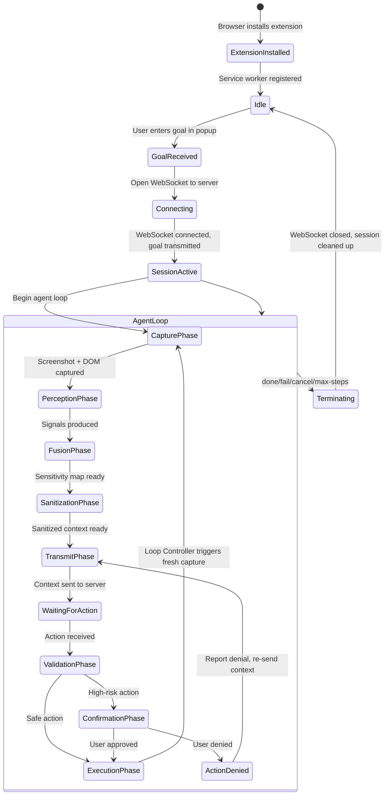
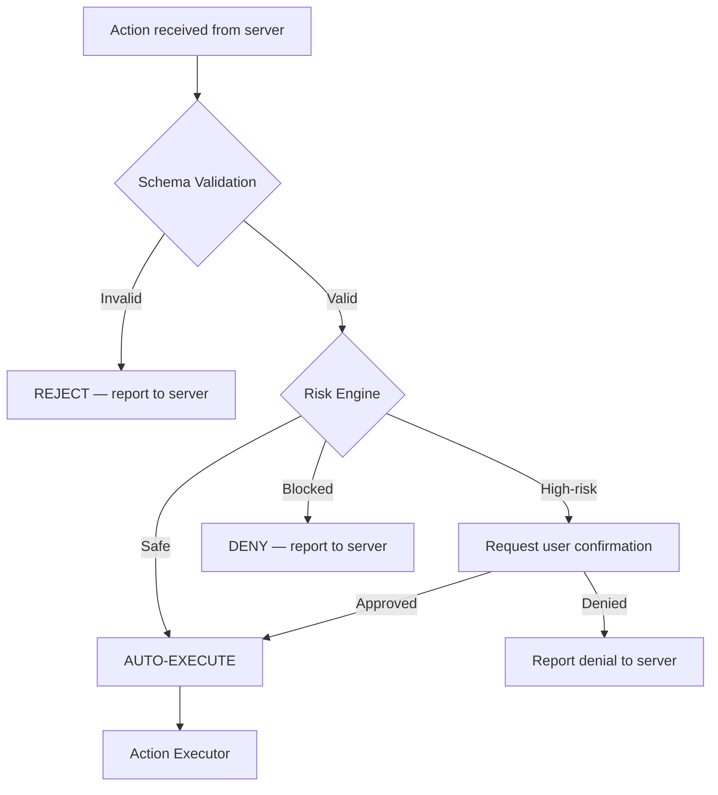

# AEGIS — Technical Specification

## 1. Document Information

| Field | Value |
|-------|-------|
| Document | Technical Specification |
| Project | AEGIS — Agentic Engine for Guarded Intelligent Surfing |
| Problem Statement | SIH 2026 — PS 26171: On-device Visual Perception for Light-weight Browser Agents |
| Version | 1.0 |
| Status | Final Draft |
| Last Updated | 2026-09-18 |
| Source Documents | [PRD.md](file:///d:/Aegis/docs/PRD.md) v1.1, [SYSTEM_ARCHITECTURE.md](file:///d:/Aegis/docs/SYSTEM_ARCHITECTURE.md) v1.0 |
| Intended Audience | Development team, technical reviewers, SIH evaluators |

---

## 2. Technical Scope

### What This Document Specifies

This document defines the implementation-level technical contracts for AEGIS: module responsibilities, data structures, runtime behavior, interfaces between components, error handling, and implementation constraints. It translates the product requirements (PRD) and system architecture (SYSTEM_ARCHITECTURE) into specifications precise enough to guide implementation.

### What This Document Does NOT Specify

| Concern | Owner Document |
|---------|---------------|
| Product requirements, goals, user flows, scope | PRD.md |
| System-level component architecture, trust boundaries, privacy boundary rationale | SYSTEM_ARCHITECTURE.md |
| Specific ML model selection, training, benchmarking | AI_ML_PIPELINE.md (planned) |
| Detailed threat model, privacy analysis | SECURITY_PRIVACY.md (planned) |
| Detailed agent behavior, prompt engineering, agent policies | BROWSER_AGENT_SPEC.md (planned) |
| Authoritative WebSocket wire-level message schemas | API_SPEC.md (planned) |
| Testing methodology, evaluation against SIH metrics | EVALUATION_PLAN.md (planned) |
| SIH demonstration script | DEMO_FLOW.md (planned) |

### Implementation Assumptions

- The development team consists of approximately 6 people.
- The SIH prototype timeline is approximately one week.
- The target browsers are Chrome 116+ and Edge 116+ (WebGPU support baseline).
- The server will run on the team's own hardware (laptop or LAN server) for the SIH demo.
- Pre-trained open-weight models are used; no custom model training.
- The system does not require a persistent database. State is maintained in active WebSocket sessions and extension storage.

### MVP Boundary

The technical specification covers the v1/SIH MVP scope. Features explicitly marked as future scope in the PRD (cryptographic capability tokens, multi-tab workflows, Firefox support, configurable privacy policies) are not specified here except where the architecture must accommodate future extensibility.

---

## 3. Runtime Model

### 3.1 Lifecycle Overview



### 3.2 Synchronous vs. Asynchronous Operations

| Operation | Execution Model | Rationale |
|-----------|----------------|-----------|
| MutationObserver callback | Asynchronous, event-driven | Browser fires on DOM changes. |
| Screenshot capture (`captureVisibleTab`) | Asynchronous (Promise-based) | Chrome API is async. |
| DOM extraction | Asynchronous (message-passing between background and content script) | Cross-context communication is async. |
| DOM analysis | Synchronous within content script | Deterministic traversal, fast. |
| Visual ML inference | Asynchronous | GPU/WASM inference is non-blocking. |
| Face detection (MediaPipe) | Asynchronous | ML inference. |
| Heuristic PII detection | Synchronous | Regex/pattern matching, fast. |
| Fusion | Synchronous | Deterministic merging, fast. |
| Sanitization | Synchronous | Canvas/image manipulation + JSON editing. |
| WebSocket send/receive | Asynchronous, event-driven | Network I/O. |
| VLM inference (server) | Asynchronous | Inference latency. |
| Action validation | Synchronous | Deterministic checks, fast. |
| Risk assessment | Synchronous | Rule-based lookup. |
| User confirmation | Asynchronous, event-driven | Waits for user input. |
| Action execution | Asynchronous | DOM interactions may trigger page events. |

### 3.3 Loop Ownership

The **background service worker** owns the agent loop. It coordinates all phases by:
1. Initiating screenshot capture and DOM extraction (on loop start, after each action execution, or on external change detection).
2. Dispatching perception tasks.
3. Collecting signals and running fusion.
4. Running sanitization.
5. Sending sanitized context via WebSocket.
6. Receiving the action from the server.
7. Running validation.
8. Dispatching execution to the content script.
9. On successful execution: the Loop Controller **explicitly triggers a fresh capture cycle** (back to step 1). This is not dependent on MutationObserver.
10. MutationObserver events serve as an **additional** trigger for externally-caused page changes (e.g., server-pushed content, timers, third-party scripts) that occur outside the agent's own actions.

### 3.4 Session Lifecycle

1. **Initialization:** User enters goal in popup → popup stores goal in `chrome.storage.local` → popup sends `START_AGENT` message to background service worker.
2. **Connection:** Background opens WebSocket to server → server creates session → background sends initial goal message.
3. **Active loop:** Repeating cycles of capture → perceive → sanitize → transmit → receive → validate → execute → Loop Controller explicitly triggers next capture.
4. **Termination triggers:**
   - VLM returns `done` action.
   - VLM returns `fail` action.
   - User clicks cancel in popup.
   - Step counter reaches maximum (TBD — Open Decision, see OQ-05 in PRD).
   - Consecutive failure threshold exceeded.
5. **Cleanup:** Background sends termination message to server → WebSocket closed → session state cleared → UI updated to idle.

### 3.5 Cancellation

The user can cancel at any point. Cancellation:
- Immediately stops the current loop iteration.
- Does not execute any pending action.
- Sends a `cancel` message to the server (best-effort).
- Closes the WebSocket.
- Resets UI to idle.

If the agent is in the middle of an async operation (e.g., waiting for VLM response), the cancellation flag is checked before proceeding to the next phase. The pending async operation may complete in the background but its result is discarded.

### 3.6 Timeout Behavior

| Phase | Proposed Timeout | On Timeout |
|-------|-----------------|------------|
| WebSocket connection | 10 seconds | Report connection failure to user. |
| VLM response | 30 seconds (proposed) | Report timeout to user. Retry once, then pause agent. |
| User confirmation dialog | No auto-timeout (user must decide) | Agent waits indefinitely. User can cancel. |
| Action execution | 5 seconds (proposed) | Report execution failure. Send updated context to server. |

---

## 4. Browser Extension Technical Design

### 4.1 Manifest V3 Structure

The extension consists of three execution contexts:

| Context | File(s) | Lifecycle | Capabilities |
|---------|---------|-----------|-------------|
| **Background Service Worker** | `background.ts` | Event-driven, may be suspended/woken by browser. | `chrome.tabs`, `chrome.storage`, `chrome.scripting`, WebSocket client, ML inference orchestration. |
| **Content Script** | `content.ts` | Per-tab, injected into web pages. | DOM access, MutationObserver, DOM extraction, action execution. Cannot access `chrome.tabs`. |
| **Popup UI** | `popup.html`, `popup.ts` | Ephemeral, open while popup is visible. | Goal input, status display, cancel control. Communicates with background via `chrome.runtime.sendMessage`. |

### 4.2 Manifest Permissions

```
{
  "manifest_version": 3,
  "permissions": ["activeTab", "scripting", "storage", "tabs"],
  "host_permissions": []
}
```

> **Note:** `host_permissions` are intentionally empty. `activeTab` grants temporary access to the current tab when the user activates the extension. This follows the least-privilege principle (SE-02).

### 4.3 Component Specification

| Component | Responsibility | Input | Output | Runs In | Security Considerations |
|-----------|---------------|-------|--------|---------|------------------------|
| **Loop Controller** | Orchestrates the agent cycle. Tracks step count. Detects stuck states. Manages termination. | Goal, MutationObserver events, action results. | Phase dispatch commands. | Background | No raw data access — coordinates other components. |
| **Screenshot Capture** | Captures visible tab bitmap. | Tab ID. | Raw screenshot (data URL or Blob). | Background (`chrome.tabs.captureVisibleTab`) | Raw screenshot stays in background context memory. Never transmitted raw. |
| **DOM Extractor** | Traverses live DOM and produces structured representation. | Page DOM (live). | Raw DOM tree (serializable object). | Content Script | Runs in isolated world. Cannot be accessed by page JS. |
| **DOM Analyzer** | Processes raw DOM tree to produce structural signals. Identifies password/OTP fields deterministically. | Raw DOM tree. | DOM signals (element inventory, field classifications). | Content Script or Background (after message passing) | Deterministic. No network access. |
| **Visual ML Engine** | Runs lightweight vision model on raw screenshot. | Raw screenshot (ImageData/Tensor). | Visual signals (bounding boxes, labels, confidence scores). | Background (via ONNX Runtime Web / Transformers.js) | Model runs locally. No network calls. WebGPU/WASM only. |
| **Face Detector** | Runs MediaPipe Face Detection on raw screenshot. | Raw screenshot (ImageData). | Face regions (bounding boxes, confidence). | Background | MediaPipe runs locally. No network calls. |
| **Heuristic PII Detector** | Scans text content for PII patterns. | Text strings from DOM extraction. | PII signals (matched patterns, types, element references). | Content Script or Background | Deterministic regex. No network. |
| **Fusion Module** | Combines all perception signals into unified sensitivity map. | DOM signals, visual signals, face signals, PII signals. | Sensitivity map. | Background | No raw content — receives processed signals. |
| **Screenshot Sanitizer** | Applies visual redaction to a copy of the raw screenshot. | Raw screenshot, sensitivity map (visual bounding boxes). | Sanitized screenshot. | Background | Operates on an in-memory copy. Original raw screenshot is not modified. |
| **Schema Sanitizer** | Replaces sensitive text with typed placeholders in the DOM representation. | Raw DOM representation, sensitivity map (element references). | Sanitized schema (JSON). | Background | Removes PII values. Preserves structural context. |
| **Context Builder** | Packages sanitized outputs for transmission. | Sanitized screenshot, sanitized schema, user goal, step metadata. | Transmission-ready payload. | Background | Handles only sanitized data. |
| **WebSocket Client** | Manages persistent connection to server. Sends context, receives actions. | Outgoing: sanitized context payloads. Incoming: action commands. | Messages to/from server. | Background | WSS for non-localhost. Only sanitized data transmitted. |
| **Schema Validator** | Validates action command structure against closed vocabulary. | Raw action command from server. | Validated action or rejection. | Background | Rejects malformed/out-of-schema commands. |
| **Risk Engine** | Assesses action safety. Classifies as safe, high-risk, or blocked. | Validated action, page context. | Risk classification. | Background | Rule-based. No network. |
| **Confirmation Handler** | Presents high-risk actions to user. Collects approval/denial. | High-risk action description. | User decision (approve/deny). | Popup or injected UI overlay | Shows only action description, not raw page data. |
| **Action Executor** | Performs the validated action on the real DOM. | Cleared action command. | Execution result (success/failure). | Content Script | Operates on the real, unredacted page. Isolated from page JS. |

### 4.4 Inter-Context Communication

| Sender | Receiver | Mechanism | Message Types |
|--------|----------|-----------|--------------|
| Popup → Background | `chrome.runtime.sendMessage` | `START_AGENT`, `CANCEL_AGENT`, `CONFIRM_ACTION`, `DENY_ACTION` |
| Background → Popup | `chrome.runtime.sendMessage` | `STATUS_UPDATE`, `REQUEST_CONFIRMATION`, `AGENT_TERMINATED` |
| Background → Content Script | `chrome.tabs.sendMessage` | `EXTRACT_DOM`, `EXECUTE_ACTION` |
| Content Script → Background | `chrome.runtime.sendMessage` | `DOM_DATA`, `MUTATION_DETECTED`, `PAGE_READY`, `ACTION_RESULT` |

---

## 5. Browser Event and Change Detection

### 5.1 MutationObserver Configuration

The content script registers a `MutationObserver` on `document.body` (or `document.documentElement`) with the following configuration:

| Option | Value | Rationale |
|--------|-------|-----------|
| `childList` | `true` | Detect added/removed elements (new forms, modals, page sections). |
| `subtree` | `true` | Observe entire document tree, not just direct children. |
| `attributes` | `true` | Detect attribute changes (disabled→enabled, hidden→visible, class changes). |
| `attributeFilter` | `["class", "style", "hidden", "disabled", "aria-hidden", "type", "value"]` (proposed) | Reduce noise by filtering to commonly meaningful attribute changes. |
| `characterData` | `false` (proposed) | Text content changes within existing nodes are less likely to indicate meaningful state changes. May be enabled if needed. |

### 5.2 Debouncing

- **Proposed interval:** ~200ms (per PRD FR-03, proposed engineering target).
- **Mechanism:** On each MutationObserver callback, reset a timer. When the timer fires (no new mutations for 200ms), send `MUTATION_DETECTED` to the background.
- **Effect:** Coalesces rapid DOM changes (e.g., loading spinners, progressive rendering) into a single capture trigger.

### 5.3 Meaningful vs. Irrelevant Mutations

Not all mutations warrant a new perception cycle. The following heuristic filtering is proposed:

| Mutation Type | Meaningful? | Rationale |
|--------------|-------------|-----------|
| New form, modal, dialog, or page section added | Yes | New interactive content to perceive. |
| Input field value change | Depends | Self-caused (by the agent) → ignore (prevents infinite loop). User-caused → capture. |
| CSS animation/transition class changes | No | Visual-only, no structural change. |
| Loading spinner added/removed | No (debounce handles) | Transient state. |
| Page navigation (`popstate`, `hashchange`) | Yes | New page state. |
| `iframe` content loaded (same-origin) | Yes | New accessible content. |

### 5.4 Agent-Initiated Change Suppression

After the Action Executor performs an action, the Loop Controller waits a short stabilization period (~300ms proposed) to allow the page to settle, then **explicitly triggers a fresh capture cycle**. During this stabilization window, MutationObserver callbacks are suppressed to avoid duplicate captures.

The fresh capture is initiated by the Loop Controller, not by MutationObserver. MutationObserver remains active as a supplementary trigger for externally-caused page changes that occur between agent-driven cycles (e.g., server-pushed updates, timer-based DOM changes, third-party script activity).

### 5.5 Initial Page Capture

When the agent loop starts, the first capture is triggered immediately by the Loop Controller (no MutationObserver event required). The background service worker explicitly requests DOM extraction and screenshot capture on loop initialization.

### 5.6 Post-Action Capture vs. MutationObserver

To avoid ambiguity:

| Trigger | Source | When |
|---------|--------|------|
| **Explicit fresh capture** | Loop Controller | After every successful action execution (primary mechanism). |
| **Initial capture** | Loop Controller | On agent loop start. |
| **MutationObserver** | Content script (event-driven) | External page changes not caused by the agent. Supplementary. |
| **Navigation** | Content script / `chrome.webNavigation` | Page load, SPA navigation, full navigation. |

### 5.7 Navigation Detection

- **Same-page navigation (SPA):** `popstate` and `hashchange` event listeners in the content script trigger a capture.
- **Full navigation:** The content script in the new page activates and sends an initial `PAGE_READY` message to the background. The background re-injects the content script if necessary via `chrome.scripting.executeScript`. The Loop Controller then explicitly triggers a fresh capture.
- **Tab change:** The agent operates on one tab. If the user switches tabs, the agent pauses observation (no capture of the new tab). When the user returns to the original tab, observation resumes.

---

## 6. Screenshot Capture Specification

### 6.1 Capture Trigger

The background service worker calls `chrome.tabs.captureVisibleTab` when:
1. The Loop Controller explicitly initiates a new cycle (first capture, post-action fresh capture, or post-navigation capture). This is the **primary** trigger.
2. A `MUTATION_DETECTED` message is received from the content script (debounced). This is a **supplementary** trigger for externally-caused page changes.

### 6.2 Capture Scope

- Captures the **visible viewport** of the active tab only.
- Does not capture below-the-fold content (browser API limitation).
- Does not capture browser chrome (address bar, tabs, bookmarks).
- Does not capture other windows or monitors.

### 6.3 Image Format Considerations

| Option | Format | Pros | Cons | Recommendation |
|--------|--------|------|------|---------------|
| Raw capture | PNG (data URL from `captureVisibleTab`) | Lossless, accurate. | Large size (~2–5MB for 1080p). | Use as the raw capture format. |
| Sanitized transmission | JPEG or WebP (compressed) | Smaller payload, faster transmission. | Lossy — but PII regions are already destroyed. | **Proposed:** Compress sanitized screenshot to WebP or JPEG before transmission. Exact format TBD. |

### 6.4 Resolution

- The capture resolution matches the browser's visible viewport at the current device pixel ratio.
- No downscaling is applied before perception (the ML model needs sufficient resolution to detect UI elements and faces).
- Downscaling may be applied to the sanitized screenshot before transmission to reduce payload size (proposed optimization, not required for MVP).

### 6.5 Raw Screenshot Lifecycle

```
captureVisibleTab()
  → raw screenshot stored in background service worker memory
  → passed to Visual ML Engine (inference)
  → passed to Face Detector (inference)
  → passed to Screenshot Sanitizer (produces sanitized copy)
  → raw screenshot is dereferenced / garbage-collected
```

The raw screenshot is:
- Never written to `chrome.storage`, IndexedDB, or the filesystem.
- Never passed to the content script (content script doesn't need it).
- Never transmitted via WebSocket.
- Held in memory only for the duration of the current perception cycle.

### 6.6 Failure Handling

| Failure | Detection | Recovery |
|---------|-----------|----------|
| `captureVisibleTab` throws or rejects | Promise rejection | Log error. Skip this cycle. Loop Controller retries on the next trigger (explicit post-action or MutationObserver). Inform user if repeated failures. |
| Tab is not active or not accessible | Permission error | Pause agent. Inform user. |
| Memory pressure during capture | Browser may throttle/fail | Retry once. If persistent, pause agent. |

---

## 7. DOM Extraction Specification

### 7.1 Structured DOM Representation

The content script traverses the DOM and produces a structured representation for each relevant element. The representation is serializable (JSON-compatible) for message-passing to the background.

### 7.2 Extracted Fields Per Element

| Field | Type | Description | Source |
|-------|------|-------------|--------|
| `id` | string | Unique identifier for this extraction (generated by content script, e.g., incremental index or hash). | Generated |
| `tagName` | string | HTML tag (e.g., `button`, `input`, `a`, `div`). | `element.tagName` |
| `type` | string \| null | Input type attribute (e.g., `text`, `password`, `email`, `tel`, `number`, `submit`). | `element.type` |
| `role` | string \| null | ARIA role. | `element.getAttribute("role")` |
| `label` | string \| null | Associated label text (from `<label>`, `aria-label`, `aria-labelledby`, `placeholder`). | Resolved from DOM relationships |
| `text` | string \| null | Visible text content (trimmed, truncated to reasonable length). | `element.innerText` or `textContent` |
| `value` | string \| null | Current field value. **SENSITIVE — see Section 7.4 and 7.6 for lifecycle constraints.** | `element.value` |
| `boundingBox` | `{x, y, width, height}` | Position and dimensions relative to viewport. | `element.getBoundingClientRect()` |
| `isVisible` | boolean | Whether the element is visible (not `display:none`, not `visibility:hidden`, not zero-size). | Computed styles + dimensions |
| `isDisabled` | boolean | Whether the element is disabled. | `element.disabled` |
| `isReadOnly` | boolean | Whether the element is read-only. | `element.readOnly` |
| `isInteractive` | boolean | Whether the element is clickable/focusable/typeable. | Derived from tag, role, tabindex |
| `parentFormId` | string \| null | ID of the parent `<form>`, if any. | DOM traversal |
| `childCount` | number | Number of meaningful child elements. | DOM traversal |
| `attributes` | object | Selected non-sensitive attributes (`name`, `placeholder`, `autocomplete`, `data-*` identifiers). | `element.getAttribute()` |

### 7.3 Element Filtering

Not all DOM nodes are extracted. The extractor filters to elements that are:
- Interactive (buttons, inputs, links, selects, textareas).
- Structurally significant (forms, fieldsets, headings, sections, lists).
- Visible (skip `display:none` or zero-dimension elements unless they are hidden inputs).

Text-only nodes (paragraphs, spans) are extracted for their text content but not as individually actionable elements.

### 7.4 Sensitive Value Handling (Raw DOM → Sanitized Schema)

> [!IMPORTANT]
> The `value` field is the most sensitive part of the DOM extraction. It may contain passwords, PII text, financial data, or OTP codes. This field exists in the **raw** DOM representation only and MUST be processed by the sanitization pipeline before inclusion in any transmitted data.

**Raw DOM representation:** Contains actual `value` for all fields.

**Sanitized schema:** The Schema Sanitizer processes `value` fields as follows:

| Condition | Sanitized `value` |
|-----------|-------------------|
| Field is a password or OTP type (`type="password"`, detected OTP) | `"[REDACTED_PASSWORD]"` or `"[REDACTED_OTP]"` |
| Field value matches a PII pattern (Aadhaar, PAN, card, email, phone) | `"[REDACTED_<TYPE>]"` |
| Field value contains a face or is flagged by visual ML | Value is cleared; bounding box is marked as redacted in screenshot. |
| Field value is non-sensitive (e.g., a search query, a city name) | **Preserved as-is** in the sanitized schema. |

### 7.6 Raw Sensitive Value Lifecycle

> [!CAUTION]
> Raw sensitive field values (passwords, OTPs, Aadhaar numbers, PAN numbers, card numbers, and any other values flagged as sensitive) have a strictly constrained lifecycle.

Raw sensitive values:

| Constraint | Rationale |
|------------|----------|
| Exist only temporarily in local memory when absolutely required for detection and sanitization. | Minimizes exposure window. |
| MUST NOT be written to logs at any log level (including DEBUG). | Prevents accidental persistence of PII in log files. |
| MUST NOT appear in error messages, exception strings, or stack traces. | Prevents PII leakage through error reporting. |
| MUST NOT be included in session state, step history, or agent context objects. | Session state may be inspected or serialized. |
| MUST NOT be serialized into `chrome.storage`, IndexedDB, localStorage, or any persistent storage. | Prevents PII persistence beyond the active cycle. |
| MUST NOT be included in `ActionResult` objects, debug payloads, or diagnostic data. | Prevents accidental transmission or exposure. |
| MUST NOT be transmitted to the server in any form (context payload, error reports, or debug messages). | Privacy invariant PI-02. |
| MUST be dereferenced and eligible for garbage collection as soon as local processing (detection + sanitization) no longer requires them. | Minimizes memory residence time. |

**Lifecycle:**

```
DOM Extractor reads element.value
  → value held in raw DOM representation (local memory only)
  → Heuristic PII Detector scans value for patterns
  → Schema Sanitizer replaces sensitive values with typed placeholders
  → raw DOM representation is dereferenced
  → raw sensitive values are no longer accessible
```

Error messages related to sensitive fields should reference the field by its `elementId`, `tagName`, and sensitivity category — never by its actual value.

### 7.5 Cross-Origin Iframe Limitation

Content scripts cannot access the DOM of cross-origin iframes (browser same-origin policy). The DOM Extractor:
- Extracts an `iframe` element node with its `src` attribute and bounding box.
- Does **not** extract any internal DOM content of cross-origin iframes.
- The Visual ML Engine can still perceive the iframe content from the screenshot.

---

## 8. Multi-Signal Perception Specification

### 8.1 Interface Definition

Each perception signal source produces a standardized output that the Fusion Module can consume.

#### Signal A: DOM / Deterministic Analysis

| Property | Detail |
|----------|--------|
| **Input** | Raw DOM tree (structured representation from DOM Extractor). |
| **Output** | `DOMSignal[]` — array of classified elements. |
| **Per-element output** | `{ elementId, tagName, type, role, label, boundingBox, isInteractive, isVisible, isSensitiveField, sensitivityReason, confidence: 1.0 }` |
| **Sensitivity detection** | Password fields (`type="password"`), OTP fields (heuristic name/label matching for "otp", "verification", "code"), email fields (`type="email"`), tel fields (`type="tel"`). |
| **Confidence** | Always `1.0` for deterministic detections. |
| **Failure behavior** | If DOM extraction fails, returns empty signal array. Does not block other signal sources. |

#### Signal B: Visual ML

| Property | Detail |
|----------|--------|
| **Input** | Raw screenshot (ImageData or Tensor). |
| **Output** | `VisualSignal[]` — array of detected visual regions. |
| **Per-region output** | `{ boundingBox, label, confidence, sourceModel }` |
| **Labels** | UI element classes: `button`, `input_field`, `text_region`, `link`, `image`, `icon`, `dropdown`, `checkbox`, `radio`, `other_interactive`. |
| **Confidence** | `0.0–1.0` from model inference. |
| **Failure behavior** | If model inference fails or times out, returns empty signal array. Logs error. Does not block other signal sources. |

#### Signal C: Face Detection (MediaPipe)

| Property | Detail |
|----------|--------|
| **Input** | Raw screenshot (ImageData). |
| **Output** | `FaceSignal[]` — array of detected face regions. |
| **Per-face output** | `{ boundingBox, confidence }` |
| **Confidence** | `0.0–1.0` from MediaPipe. |
| **Failure behavior** | If MediaPipe fails, returns empty signal array. Logs error. Does not block other signal sources. |

#### Signal D: Heuristic PII Detection

| Property | Detail |
|----------|--------|
| **Input** | Text strings associated with DOM elements (extracted from raw DOM). |
| **Output** | `PIISignal[]` — array of detected PII instances. |
| **Per-instance output** | `{ elementId, patternType, matchedRegion, confidence }` |
| **Pattern types** | `AADHAAR`, `PAN`, `CARD_NUMBER`, `EMAIL`, `PHONE`. |
| **Confidence** | `1.0` for strong pattern matches (valid checksum). `0.8–0.9` (proposed) for partial/uncertain matches. |
| **Failure behavior** | Pattern matching is deterministic and unlikely to fail. If text extraction is empty, returns empty signal array. |

### 8.2 Signal Independence

Each signal source operates independently. They do not depend on each other's output. This enables:
- Parallel execution (visual ML and heuristic PII run concurrently).
- Graceful degradation (if one source fails, others continue).
- Clear responsibility boundaries (DOM catches structured fields; visual ML catches visual content; heuristics catch text patterns).

---

## 9. Sensitivity Map Specification

### 9.1 Data Structure (Conceptual)

The sensitivity map is the output of the Fusion Module. It is a list of sensitivity regions, each describing what must be sanitized and how.

```
SensitivityMap = SensitivityRegion[]

SensitivityRegion:
  regionId:          string           // Unique identifier
  boundingBox:       {x, y, w, h}     // Visual coordinates (for screenshot sanitization)
  elementId:         string | null     // Associated DOM element ID (for schema sanitization)
  category:          SensitivityCategory
  confidence:        number (0.0–1.0)
  sources:           SignalSource[]    // Which signal(s) detected this region
  sanitizationAction: SanitizationAction

SensitivityCategory:
  FACE | PASSWORD | OTP | AADHAAR | PAN | CARD_NUMBER | EMAIL | PHONE | GENERIC_PII

SignalSource:
  DOM_ANALYSIS | VISUAL_ML | FACE_DETECTION | HEURISTIC_PII

SanitizationAction:
  BLUR_VISUAL      // Blur bounding box in screenshot
  MASK_VISUAL       // Black-box fill in screenshot
  REPLACE_TEXT      // Replace text with typed placeholder in schema
  BLUR_AND_REPLACE  // Both visual and text sanitization
```

### 9.2 Example

```
Region: r-001
  boundingBox: {x: 120, y: 340, w: 200, h: 30}
  elementId: "el-17"
  category: AADHAAR
  confidence: 1.0
  sources: [HEURISTIC_PII, DOM_ANALYSIS]
  sanitizationAction: BLUR_AND_REPLACE

Region: r-002
  boundingBox: {x: 50, y: 80, w: 100, h: 120}
  elementId: null
  category: FACE
  confidence: 0.92
  sources: [FACE_DETECTION]
  sanitizationAction: BLUR_VISUAL

Region: r-003
  boundingBox: {x: 300, y: 400, w: 180, h: 25}
  elementId: "el-22"
  category: PASSWORD
  confidence: 1.0
  sources: [DOM_ANALYSIS]
  sanitizationAction: BLUR_AND_REPLACE
```

### 9.3 Overlap Handling

When multiple signals flag overlapping or identical regions:
- The region is merged (union of bounding boxes).
- The highest sensitivity category takes precedence.
- Confidence is set to the maximum among overlapping signals.
- All contributing sources are recorded.

### 9.4 Uncertainty Handling

- If confidence < configurable threshold (proposed: `0.5`) and the region is from a single low-confidence source: still mark for redaction (fail-safe per PV-08).
- **Principle:** LOW CONFIDENCE → PREFER REDACTION. A false positive (over-redaction) is preferable to a false negative (PII leakage).

---

## 10. Local Sanitization Specification

### 10.1 Screenshot Sanitization Pipeline

```
Raw Screenshot (bitmap)
  → for each SensitivityRegion with BLUR_VISUAL or MASK_VISUAL or BLUR_AND_REPLACE:
      → apply redaction to bounding box on a COPY of the raw screenshot
        → BLUR_VISUAL: Gaussian blur (kernel size sufficient to destroy recognizable features)
        → MASK_VISUAL: Solid color fill (black or mid-gray)
  → output: Sanitized Screenshot
```

**Key constraints:**
- The original raw screenshot is NOT modified. Sanitization operates on a copy.
- The blur kernel must be strong enough that the underlying content is unrecoverable (not merely "softened"). Proposed: kernel radius ≥ 15px at 1080p.
- Bounding boxes should include a small padding margin (proposed: 5px) to account for detection imprecision.

### 10.2 Schema Sanitization Pipeline

```
Raw DOM Representation (JSON)
  → for each SensitivityRegion with REPLACE_TEXT or BLUR_AND_REPLACE:
      → find the associated element by elementId
      → replace element.value (if present) with placeholder:
          PASSWORD  → "[REDACTED_PASSWORD]"
          OTP       → "[REDACTED_OTP]"
          AADHAAR   → "[REDACTED_AADHAAR]"
          PAN       → "[REDACTED_PAN]"
          CARD      → "[REDACTED_CARD]"
          EMAIL     → "[REDACTED_EMAIL]"
          PHONE     → "[REDACTED_PHONE]"
          FACE      → (no text replacement needed, visual only)
          GENERIC   → "[REDACTED]"
      → replace element.text (if it contains the sensitive content) with the same placeholder
  → output: Sanitized Schema
```

### 10.3 Consistency Between Screenshot and Schema

If a region is marked `BLUR_AND_REPLACE`:
- The bounding box is blurred in the screenshot.
- The corresponding text is replaced in the schema.
- Both sanitized outputs agree: the VLM sees a blurred region in the image and a typed placeholder in the schema at the same location.

### 10.4 Verification Before Transmission

Before the Context Builder constructs the transmission payload, a post-sanitization check (proposed):
- Walk the sanitized schema and verify that no raw value remains for any element flagged in the sensitivity map.
- If a flagged element still contains a raw value (sanitization bug), replace it with `"[SANITIZATION_ERROR]"` and log the error.
- This is a defense-in-depth measure — if sanitization fails silently, the fallback catches it.

### 10.5 Fail-Safe Behavior

If the sanitization process itself encounters an error (canvas API failure, memory pressure):
- **Do not transmit the context.** Skip this cycle.
- Log the error (without including any raw sensitive values in the log message).
- The Loop Controller will trigger the next capture on the next available trigger (explicit post-action cycle or MutationObserver event).
- If persistent, inform the user.

**Invariant:** Unsanitized data is never transmitted. The system fails closed.

---

## 11. Sanitized Context Contract

### 11.1 What the Server Receives

The sanitized context payload consists of:

| Field | Type | Description |
|-------|------|-------------|
| `sanitized_screenshot` | binary (compressed image) | Screenshot with sensitive visual regions blurred/masked. |
| `sanitized_schema` | JSON object | Structured DOM representation with sensitive text replaced by typed placeholders. |
| `goal` | string | User's stated goal (plain text). |
| `step_number` | integer | Current step in the agent loop. |
| `session_id` | string | Session identifier. |
| `previous_action_result` | object \| null | Result of the last executed action (success/failure/denial), if applicable. |

### 11.2 What the Server MUST NOT Receive

| Excluded Data | Rationale |
|---------------|-----------|
| Raw screenshots | Privacy invariant PI-01. |
| Raw PII text values (actual Aadhaar numbers, passwords, etc.) | Privacy invariant PI-02. |
| Raw form field values for sensitive fields | Privacy invariant PI-02. |
| Cookies | Privacy invariant PI-06. |
| Authentication tokens | Privacy invariant PI-06. |
| Browsing history | Privacy invariant PI-06, PRD PV-07. |
| `localStorage`/`sessionStorage` contents | Not required for agent reasoning. |
| Content from non-active tabs | Active-tab scope constraint. |

### 11.3 Payload Size Considerations

- The sanitized screenshot should be compressed (proposed: WebP or JPEG, quality 70–85%) to reduce transmission size.
- The sanitized schema should be compact: only include elements relevant to the page's interactive and structural layout, not every DOM node.
- Proposed maximum payload size: configurable, default ~2MB (proposed engineering target). This accommodates a compressed screenshot (~500KB–1MB) plus schema (~50–200KB).

> **Note:** The authoritative wire-level payload format is defined in API_SPEC.md.

---

## 12. Visual ML Runtime Specification

### 12.1 Model Loading and Initialization

| Phase | Behavior |
|-------|----------|
| **Cold start** | Model weights are loaded from extension assets (bundled with the extension) or fetched from a CDN on first use. Loaded into WebGPU/WASM runtime. Proposed target: < 10 seconds (PF-09). |
| **Warm state** | Model remains in memory as long as the extension is active. Subsequent inferences use the already-loaded model. |
| **Suspension** | MV3 service workers may be suspended by the browser. If suspended, the model must be re-loaded on next activation. Mitigation: use `chrome.alarms` or keepalive techniques during an active agent session. |

### 12.2 Model Loading Strategy

> **Open Decision (OAD-06):** The specific strategy (pre-load on install, lazy-load on first agent activation, progressive loading) is TBD. See PRD OQ-06.

### 12.3 Inference Lifecycle

```
Raw screenshot
  → preprocess (resize to model input dimensions, normalize pixel values)
  → run inference (WebGPU or WASM backend)
  → postprocess (decode bounding boxes, apply NMS, filter by confidence threshold)
  → output: VisualSignal[]
```

### 12.4 Compute Backend Selection

| Backend | Condition | Performance |
|---------|-----------|------------|
| **WebGPU** | Browser supports WebGPU and GPU is available. | Fastest. Preferred. |
| **WASM** | WebGPU not available (older GPU, driver issues, browser flag disabled). | Slower but functional. Fallback. |

Backend selection is performed at model initialization. The runtime checks WebGPU availability and falls back to WASM automatically.

### 12.5 Memory Management

- The model weights are the primary memory consumer (proposed: < 50–100MB for a lightweight model).
- Inference input/output tensors are allocated per-cycle and freed after the cycle completes.
- Total ML-related memory usage (model weights + inference buffers) should remain within the active memory budget (< 500MB, PF-04).
- If the browser reports memory pressure, the model can be unloaded and the agent paused.

### 12.6 Model Selection

> **Open Decision (OAD-01):** The specific visual ML model is TBD. Candidate model classes include YOLOv8-nano, small ViT variants, and MobileNet-based detectors. Final selection requires benchmarking. See AI_ML_PIPELINE.md.

### 12.7 Failure Handling

| Failure | Detection | Recovery |
|---------|-----------|----------|
| Model fails to load | Promise rejection on load | Inform user. Agent can operate with DOM-only perception (degraded mode). |
| Inference throws/times out | Exception or timeout | Return empty VisualSignal[]. Log error. Cycle continues with DOM + heuristic signals only. |
| WebGPU initialization fails | Runtime exception | Fall back to WASM. If WASM also fails, operate in DOM-only mode. |

---

## 13. MediaPipe Integration

### 13.1 Role

MediaPipe Face Detection is used as a dedicated face detection component within the Visual ML signal source. It operates on the raw screenshot locally.

### 13.2 Input/Output

| Property | Detail |
|----------|--------|
| **Input** | Raw screenshot (ImageData, HTMLCanvasElement, or HTMLImageElement — as required by MediaPipe API). |
| **Output** | `FaceSignal[]`: array of `{ boundingBox: {x, y, w, h}, confidence: number }`. |
| **Coordinate system** | Bounding box coordinates relative to the screenshot dimensions. Must be mapped to the same coordinate space as visual ML and DOM bounding boxes. |

### 13.3 Confidence Handling

- MediaPipe provides a detection confidence per face.
- Proposed confidence threshold: `0.5` (faces with confidence ≥ 0.5 are flagged for redaction).
- Low-confidence detections (0.3–0.5 proposed) are included in the sensitivity map with the fail-safe redaction flag.

### 13.4 Processing Constraints

- MediaPipe runs entirely locally. No network calls.
- MediaPipe uses its own internal ML runtime (TFLite-based). It does not share the ONNX/Transformers.js runtime.
- Memory overhead for MediaPipe Face Detection is typically small (< 20MB model).

### 13.5 Failure Behavior

If MediaPipe fails to initialize or inference fails:
- Return empty `FaceSignal[]`.
- Log error.
- Other perception signals (DOM analysis, visual ML, heuristic PII) continue.
- **Risk:** Faces may not be detected this cycle. Mitigated by: face detection is only one signal. Visual ML may independently detect face-like regions if trained to do so.

---

## 14. Heuristic PII Detection

### 14.1 Supported Patterns

| PII Type | Detection Method | Validation |
|----------|-----------------|------------|
| **Aadhaar** | 12-digit numeric pattern, optionally formatted as `XXXX XXXX XXXX`. | Verhoeff checksum validation (the official Aadhaar checksum algorithm). If checksum validation is impractical for MVP, mark as proposed enhancement. |
| **PAN** | 10-character alphanumeric: `[A-Z]{5}[0-9]{4}[A-Z]{1}`. | Format validation (character class compliance). |
| **Credit/Debit Card** | 13–19 digit numeric, optionally formatted with spaces or dashes. | Luhn algorithm checksum. |
| **Email** | Standard email regex pattern. | Format validation. |
| **Phone** | Indian format: 10 digits starting with 6–9, optionally with `+91` or `0` prefix. International: `+<country_code> <number>` patterns for common formats. | Length and prefix validation. |

### 14.2 Text Source

The heuristic PII detector operates on text extracted from the DOM:
- `element.innerText` / `element.textContent` for visible text.
- `element.value` for form field values.
- `element.placeholder` for placeholder text (typically non-sensitive, but scanned for completeness).

### 14.3 Normalization

Before pattern matching, text is normalized:
- Remove common separators (spaces, dashes, dots) for numeric patterns.
- Trim whitespace.
- Normalize Unicode digits to ASCII digits.

### 14.4 Confidence/Decision Policy

| Condition | Confidence | Action |
|-----------|-----------|--------|
| Strong pattern match + valid checksum | `1.0` | Mark as PII. |
| Strong pattern match, no checksum available or checksum not validated | `0.9` (proposed) | Mark as PII. |
| Partial match (e.g., 12-digit number that fails Verhoeff) | `0.7` (proposed) | Mark as potential PII. Include in sensitivity map with fail-safe flag. |
| No match | N/A | Not flagged. |

### 14.5 False Positive Considerations

- Some 12-digit numbers are not Aadhaar numbers (invoice numbers, reference IDs).
- Some 10-character alphanumeric strings are not PAN numbers.
- The system accepts false positives (over-redaction) as preferable to false negatives (PII leakage) — per the fail-safe principle.

### 14.6 False Negative Handling

The heuristic detector will miss:
- PII in non-standard formats (OCR artifacts, custom separators).
- PII in images (handled by visual ML, not heuristics).
- PII in languages/scripts not covered by the patterns.
- Novel PII categories not explicitly configured.

Mitigation: heuristic PII detection is one of three signal sources. Visual ML and DOM analysis provide additional coverage.

---

## 15. Fusion Algorithm Specification

### 15.1 Algorithm Overview

The fusion layer is a deterministic, rule-based algorithm. It does not use ML.

```
Input: DOMSignal[], VisualSignal[], FaceSignal[], PIISignal[]
Output: SensitivityMap (SensitivityRegion[])
```

### 15.2 Processing Steps

1. **Enumerate all detections:** Collect all signals from all sources into a flat list.
2. **Classify each detection:** Map each signal to a `SensitivityCategory` and `SanitizationAction`.
3. **Merge overlapping regions:** If two regions overlap (IoU > 0.5 proposed), merge them:
   - Union bounding box.
   - Highest sensitivity category takes precedence.
   - Maximum confidence.
   - Union of sources.
4. **Associate DOM elements:** For each visual region, find the closest matching DOM element (by bounding box overlap). This enables both screenshot and schema sanitization for the same PII instance.
5. **Apply fail-safe:** For any region with `confidence < threshold`, still include it in the sensitivity map if the category is potentially sensitive.
6. **Output:** Final `SensitivityRegion[]`.

### 15.3 Category Priority (Highest to Lowest)

If overlapping regions have different categories:

1. `PASSWORD` / `OTP`
2. `AADHAAR` / `PAN` / `CARD_NUMBER`
3. `FACE`
4. `EMAIL` / `PHONE`
5. `GENERIC_PII`

Higher-priority categories are used for the merged region.

### 15.4 Deterministic Behavior

The fusion algorithm is deterministic: given the same input signals, it always produces the same sensitivity map. There is no randomness or learned component. This is intentional for MVP — it makes debugging, testing, and explaining the system's behavior straightforward.

---

## 16. Browser Agent Technical Specification

### 16.1 One Action Per Reasoning Cycle

The agent loop executes exactly one action per cycle. After execution:
- The page state is re-captured.
- A new sanitized context is constructed.
- The VLM re-evaluates from the updated state.

This prevents cascading errors and ensures fresh perception after every interaction.

### 16.2 Action Target Identification

The VLM's proposed action references a target element using an identifier from the sanitized schema (e.g., `elementId` assigned during DOM extraction). The Action Executor must:
1. Receive the target identifier.
2. Look up the corresponding real DOM element using the mapping maintained by the content script.
3. Verify the element still exists, is visible, and is interactable.
4. If the element cannot be found or has changed, report failure.

### 16.3 Stale Element Handling

Between VLM reasoning (which operates on a snapshot) and action execution (which operates on the live DOM), the page may have changed:
- The target element may have been removed.
- The element may have moved.
- The element may have become disabled or hidden.

**Policy:** Before execution, the Action Executor re-queries the DOM for the target element. If the element is not found or is not in an actionable state, the execution fails and the failure is reported to the server with an updated sanitized context.

### 16.4 Termination Conditions

| Condition | Trigger | Behavior |
|-----------|---------|----------|
| Goal achieved | VLM returns `done` action. | Agent stops. Inform user of success. |
| Cannot proceed | VLM returns `fail` action. | Agent stops. Show VLM's reasoning to user. |
| User cancel | User clicks cancel in popup. | Agent stops immediately. |
| Max steps reached | Step counter exceeds limit (TBD — Open Decision). | Agent stops. Inform user. |
| Stuck detection | N consecutive identical sanitized schemas (proposed: N=3). | Agent pauses. Inform user. |
| Repeated failures | M consecutive action execution failures (proposed: M=3). | Agent pauses. Inform user. |

### 16.5 Max Step Boundary

> **Open Decision (PRD OQ-05, Architecture OAD-05):** The maximum step count is TBD. Proposed range: 20–50 steps. Depends on the complexity of the target demo task.

---

## 17. Action Schema

### 17.1 Action Structure (Conceptual)

```
Action:
  action_type:  ActionType    // Required
  target:       string | null // Element ID from schema (required for click, type, select, hover)
  value:        string | null // Text for type, option for select, direction for scroll
  reasoning:    string | null // Optional: VLM's explanation
```

### 17.2 Action Types

| Action | Purpose | Required Fields | Optional Fields | Target Requirements | Validation | Execution | Possible Failures |
|--------|---------|----------------|-----------------|--------------------|-----------|-----------|--------------------|
| `click` | Click an element. | `target` | `reasoning` | Must be visible, interactable. | Target exists in schema. | `element.click()` | Target not found, not clickable. |
| `type` | Enter text into a field. | `target`, `value` | `reasoning` | Must be a text input, textarea, or contenteditable. | Target exists, is typeable. | Set `element.value`, dispatch `input`/`change` events. | Target not found, not editable. |
| `scroll` | Scroll the page. | `value` (`"up"` or `"down"`) | `reasoning` | None (scrolls viewport). | Direction is valid. | `window.scrollBy()` | Scroll has no effect (already at top/bottom). |
| `select` | Select a dropdown option. | `target`, `value` | `reasoning` | Must be a `<select>` element. | Target exists, option exists. | Set `selectedIndex`, dispatch `change`. | Target not found, option not found. |
| `hover` | Hover over an element. | `target` | `reasoning` | Must be visible. | Target exists. | Dispatch `mouseenter`/`mouseover` events. | Target not found. |
| `wait` | Wait for page to stabilize. | None | `reasoning` | None. | Always valid. | Pause for a short duration (proposed: 1–2 seconds), then Loop Controller triggers a fresh capture. | None (always succeeds). |
| `done` | Signal goal completion. | None | `reasoning` | None. | Always valid. | Terminate agent loop. Inform user of success. | None. |
| `fail` | Signal inability to proceed. | None | `reasoning` | None. | Always valid. | Terminate agent loop. Show reasoning to user. | None. |

### 17.3 Sensitive Input Value Handling

> [!WARNING]
> **Open Technical Decision:** The `type` action includes a `value` field. This value originates from the VLM on the server. Since the VLM only sees sanitized context, it cannot produce actual PII values — it might produce instructions like `"type 'Delhi' in the destination field"` (non-sensitive) but could not produce `"type '1234-5678-9012-3456' in the card field"` because the card number was redacted.
>
> However, there are scenarios where the user's goal might require typing sensitive values (e.g., "Log in with my credentials"). The VLM does not and should not know the credentials. These values must be supplied locally.
>
> **This distinction is not fully resolved in the current PRD or architecture.** The following options are documented for resolution in BROWSER_AGENT_SPEC.md:
>
> - **Option A:** The VLM generates `type` actions only for non-sensitive values. For sensitive fields (detected by the local risk engine), the agent prompts the user to enter the value directly via the extension UI.
> - **Option B:** The extension maintains a local, encrypted credential store. The VLM's `type` action can reference a local credential by type (e.g., `value: "[LOCAL_EMAIL]"`) and the Action Executor resolves it locally without the server ever seeing the actual value.
> - **Option C:** For MVP, sensitive fields are skipped by the agent. The user fills them manually. The agent resumes after the user completes the sensitive field.
>
> **Decision status: TBD.** This must be resolved before implementation.

---

## 18. Action Validation

### 18.1 Stage A: Schema Validation

Schema validation checks the structural correctness of the action command.

| Check | Validation | On Failure |
|-------|-----------|------------|
| `action_type` is valid | Must be one of: `click`, `type`, `scroll`, `select`, `hover`, `wait`, `done`, `fail`. | Reject. Report malformed action to server. |
| Required fields present | `target` is required for `click`, `type`, `select`, `hover`. `value` is required for `type`, `select`, `scroll`. | Reject. |
| Field types correct | `target` is string. `value` is string. `action_type` is string. | Reject. |
| `target` exists in schema | The referenced element ID must exist in the current sanitized schema. | Reject. Report "target not found." |
| `scroll` direction valid | `value` must be `"up"` or `"down"`. | Reject. |

### 18.2 Stage B: Safety / Risk Validation

Safety validation assesses whether a structurally valid action is safe to execute.

| Check | Assessment | On Risk |
|-------|-----------|---------|
| Target is a payment-related button | Heuristic: label/name contains "pay", "purchase", "checkout", "confirm payment". | **High-risk.** Require user confirmation. |
| Target is a delete/deactivate button | Heuristic: label/name contains "delete", "remove", "deactivate", "cancel account". | **High-risk.** Require user confirmation. |
| Target is a form submit button on a form containing financial/identity fields | Heuristic: parent form contains fields flagged as AADHAAR, PAN, CARD in sensitivity map. | **High-risk.** Require user confirmation. |
| Action navigates away from current domain | VLM proposes clicking a link with an external `href`. | **Blocked** (per SE-06) unless user approves. |
| Action is routine | Scrolling, clicking navigation links, typing in search fields, hovering. | **Safe.** Auto-execute. |

> **Open Decision (PRD OQ-04, Architecture OAD-04):** The detailed high-risk categories and their definitions are TBD. The examples above are proposed starting points. Final categorization is owned by BROWSER_AGENT_SPEC.md.

### 18.3 Validation Flow



---

## 19. Risk Engine

### 19.1 Interface

| Property | Detail |
|----------|--------|
| **Input** | Validated action (from Schema Validator), current page context (sensitivity map, DOM schema, active URL). |
| **Output** | `{ decision: "allow" \| "require_confirmation" \| "deny", reason: string }` |

### 19.2 Decision Logic

The Risk Engine applies a series of rule-based checks:

1. **Blocked actions:** If the action violates a hard constraint (e.g., navigation to external URL without approval), return `deny`.
2. **High-risk actions:** If the action matches any high-risk pattern, return `require_confirmation`.
3. **Default:** If no risk rule triggers, return `allow`.

### 19.3 High-Risk Category Definitions

> **Open Decision (PRD OQ-04):** The specific categories and matching rules are TBD. The proposed categories from the architecture are:
> - Payment submission
> - Account deletion/deactivation
> - Form submission containing financial/identity data
> - Additional categories to be defined in BROWSER_AGENT_SPEC.md.

### 19.4 Risk Context

The Risk Engine has access to:
- The proposed action (type, target, value).
- The sensitivity map for the current page (which fields are sensitive).
- The target element's metadata (tag, type, label, parent form, associated sensitivity).
- The current page URL.

It does NOT have access to raw PII values.

---

## 20. User Confirmation

### 20.1 Trigger Condition

User confirmation is triggered when the Risk Engine returns `require_confirmation`.

### 20.2 User-Visible Information

The confirmation dialog presents:
- **Action description:** "The agent wants to [action_type] on [element label/description]."
- **Risk reason:** "This action appears to involve [payment/deletion/sensitive submission]."
- **VLM reasoning:** (if provided by the VLM).

The dialog does NOT show raw PII, raw screenshots, or sensitive field values.

### 20.3 User Options

| Option | Effect |
|--------|--------|
| **Approve** | Action proceeds to execution. |
| **Deny** | Action is not executed. Denial is reported to server. VLM may re-plan. |
| **Cancel Agent** | Entire agent session terminates. |

### 20.4 Confirmation Timeout

- **No auto-timeout.** The agent waits indefinitely for the user's decision.
- The user can cancel the agent at any time instead of responding to the confirmation.
- Rationale: high-risk actions should never be auto-approved on timeout.

### 20.5 Confirmation UI

- Proposed implementation: a notification or overlay injected by the content script, or a message displayed in the popup.
- The confirmation UI must be clearly distinguishable from web page content to prevent spoofing by malicious pages.
- Implementation details deferred to BROWSER_AGENT_SPEC.md.

---

## 21. Action Execution

### 21.1 Execution Context

Actions are executed by the content script in the active tab. The content script has direct access to the real, unredacted DOM.

### 21.2 Target Revalidation

Before executing, the Action Executor:
1. Looks up the target element using the element ID → real DOM element mapping.
2. Verifies the element is still present in the DOM.
3. Verifies the element is visible (not `display:none`, not `visibility:hidden`, has non-zero dimensions).
4. Verifies the element is interactable (not disabled, not readonly for type actions).

If any check fails, the execution is aborted and a failure report is sent.

### 21.3 Execution Methods

| Action | DOM API |
|--------|---------|
| `click` | `element.click()`. If the element requires focus first, call `element.focus()` before click. |
| `type` | `element.focus()` → set `element.value` → dispatch `new Event('input', {bubbles: true})` → dispatch `new Event('change', {bubbles: true})`. |
| `scroll` | `window.scrollBy(0, amount)` where `amount` is positive (down) or negative (up). Proposed default: 300px. |
| `select` | Find the `<option>` by value or text. Set `option.selected = true`. Dispatch `change` event on the `<select>`. |
| `hover` | `element.dispatchEvent(new MouseEvent('mouseenter', {bubbles: true}))` → `element.dispatchEvent(new MouseEvent('mouseover', {bubbles: true}))`. |

### 21.4 Result Reporting

After execution, the content script reports back to the background:

```
ActionResult:
  success:    boolean
  error:      string | null   // Error message if failed (MUST NOT contain raw sensitive values)
  elementId:  string | null   // Target element (for logging/debugging)
  actionType: string          // What was attempted
```

> [!IMPORTANT]
> The `error` field in `ActionResult` MUST NOT contain raw sensitive values such as passwords, PII text, or field contents. Error descriptions should reference the element by ID, tag name, or sensitivity category — never by actual value. Example: `"Element el-17 (type=password) not interactable"` — not `"Could not type 'MyP@ssw0rd' into field"`.

### 21.4.1 Post-Execution Capture

After the Action Executor reports a result (success or failure), the Loop Controller:
1. Waits a short stabilization period (~300ms proposed) for the page to settle.
2. **Explicitly triggers a fresh capture cycle** (screenshot + DOM extraction → perception → sanitization → transmission).
3. This fresh capture is not dependent on MutationObserver firing. It is an explicit Loop Controller action.

### 21.5 No Arbitrary JavaScript

The Action Executor does NOT:
- Execute arbitrary JavaScript strings.
- Inject `<script>` elements.
- Call `eval()`.
- Use `Function()` constructor.
- Access `document.cookie`, `localStorage`, or `sessionStorage`.

Only the predefined action methods (Section 21.3) are supported.

### 21.7 Navigation Handling

If the action causes a page navigation:
- The current content script is destroyed (page unload).
- The background service worker detects the navigation via `chrome.webNavigation` or `chrome.tabs.onUpdated`.
- The background re-injects the content script into the new page.
- The new content script sends a `PAGE_READY` message to the background.
- The Loop Controller then explicitly triggers a fresh capture cycle on the new page.

---

## 22. WebSocket Technical Behavior

### 22.1 Connection Establishment

1. Background service worker constructs WebSocket URL from configured server endpoint.
2. Opens `WebSocket` (or `new WebSocket(url)` in service worker context).
3. On `open`: sends initial `session_init` message containing user goal and client metadata.
4. On `error` or connection refused: retry with exponential backoff (proposed: 1s, 2s, 4s, max 3 retries). If all retries fail, inform user.

### 22.2 Connection States

| State | Description | Agent Behavior |
|-------|-------------|---------------|
| `CONNECTING` | Attempting to establish connection. | Agent waits. UI shows "Connecting..." |
| `OPEN` | Connected. Ready for message exchange. | Agent loop active. |
| `CLOSING` | Graceful shutdown in progress. | Agent terminates. |
| `CLOSED` | Disconnected. | Agent is idle. |

### 22.3 Reconnection Behavior

If the WebSocket disconnects unexpectedly during an active session:
- Attempt reconnection with exponential backoff.
- If reconnected: send a `session_resume` message with session ID. If the server still has the session, resume. If not, restart the session with the same goal.
- If reconnection fails after max retries: inform user, pause agent.

### 22.4 Heartbeat / Keepalive

- **Proposed:** The client sends a `ping` message every 30 seconds to keep the connection alive and detect silent disconnects.
- The server responds with `pong`.
- If no `pong` is received within 10 seconds, the connection is considered dead. Reconnection is triggered.

### 22.5 Message Correlation

Each `context_update` message from the client includes the `step_number`. The server's `action` response includes the same `step_number` to correlate the action with the context it was generated from. If the step numbers don't match (stale response), the client discards the action and re-sends current context.

### 22.6 Malformed Messages

- Client receives a message that cannot be parsed as valid JSON: log error, discard message, continue waiting.
- Client receives a message with an unexpected type: log warning, discard.
- Client receives an action that fails schema validation: handled by Schema Validator (Section 18).

### 22.7 Clean Shutdown

On agent termination:
1. Client sends `session_end` message with termination reason.
2. Client closes WebSocket with code `1000` (normal closure).
3. Server cleans up session data.

> **Note:** The authoritative message schema (field names, types, encoding) is defined in API_SPEC.md.

---

## 23. Server Runtime Components

### 23.1 WebSocket Gateway

| Property | Detail |
|----------|--------|
| **Responsibility** | Accept WebSocket connections. Route messages. Manage connection lifecycle. |
| **Framework** | FastAPI with WebSocket support (`@app.websocket`). |
| **Concurrency** | Async. Handles multiple concurrent client connections. |
| **Authentication** | Proposed: token-based authentication on connection establishment. Details deferred to SECURITY_PRIVACY.md. |

### 23.2 Session Manager

| Property | Detail |
|----------|--------|
| **Responsibility** | Create, maintain, and destroy per-client session state. |
| **Session state** | Goal, step count, recent action history (last N actions for VLM context window), session ID, connection reference. |
| **Persistence** | In-memory only. No database. Session is destroyed on WebSocket disconnect (PV-06). |
| **Concurrency** | One session per WebSocket connection. |

### 23.3 Context Handler

| Property | Detail |
|----------|--------|
| **Responsibility** | Receive and validate incoming sanitized context from the client. |
| **Validation** | Verify payload structure. Verify sanitized screenshot is present. Verify sanitized schema is valid JSON. Verify step number is expected. |
| **Error handling** | If validation fails, send error response to client. Do not forward to VLM. |

### 23.4 VLM Adapter

The VLM Adapter is an abstraction layer that decouples the server logic from the specific VLM deployment.

| Property | Detail |
|----------|--------|
| **Responsibility** | Route VLM inference requests to the configured backend. |
| **Interface** | `infer(sanitized_screenshot, sanitized_schema, goal, action_history) → raw_vlm_response` |
| **Implementations** | `OllamaAdapter` (local), `CloudAPIAdapter` (cloud). Selected by server configuration. |

#### OllamaAdapter

| Property | Detail |
|----------|--------|
| **Backend** | Local Ollama instance. |
| **Communication** | HTTP to `localhost:11434` (default Ollama port). |
| **Model** | Configurable. Candidate: Qwen-VL, Gemma 3, LLaVA, PaliGemma. TBD (OQ-02). |

#### CloudAPIAdapter

| Property | Detail |
|----------|--------|
| **Backend** | Cloud-hosted API (Together AI, Groq, HuggingFace Inference, etc.). |
| **Communication** | HTTPS to API endpoint. |
| **Authentication** | API key stored in server environment variables (not in client code, per SE-07). |
| **Model** | Same open-weight model as local, hosted remotely. |

### 23.5 Action Generator

| Property | Detail |
|----------|--------|
| **Responsibility** | Parse VLM natural-language output into a structured action conforming to the closed-vocabulary schema. |
| **Processing** | Extract action type, target, value, reasoning from VLM response. Apply output format normalization. |
| **Fallback** | If parsing fails, generate a `fail` action with an appropriate error message. |
| **Output** | Structured action JSON sent to client. |

### 23.6 Server-Side Validation

The server performs basic validation on the action before sending it to the client:
- Action type is in the allowed vocabulary.
- Required fields are present.
- This is a sanity check; the authoritative validation is performed by the client (the client does not trust the server unconditionally).

---

## 24. VLM Interaction

### 24.1 Input

| Field | Source | Description |
|-------|--------|-------------|
| Sanitized screenshot | Client (transmitted) | Image with sensitive regions blurred/masked. |
| Sanitized schema | Client (transmitted) | JSON with PII replaced by typed placeholders. |
| User goal | Client (transmitted) | Natural-language task description. |
| Action vocabulary | Server (system prompt) | The list of allowed action types and their semantics. |
| Action history | Session Manager | Recent actions taken (last N steps) for context continuity. |
| Previous action result | Client (transmitted) | Success/failure of the last action, for re-planning. |

### 24.2 Output

Exactly one structured action per inference call:

```
{
  "action_type": "<click|type|scroll|select|hover|wait|done|fail>",
  "target": "<element ID from schema or null>",
  "value": "<text, option, direction, or null>",
  "reasoning": "<VLM's explanation or null>"
}
```

### 24.3 Output Parsing and Normalization

The VLM generates natural language. The Action Generator extracts the structured action from the VLM response. Strategies:
- **Structured output prompting:** The system prompt instructs the VLM to output a JSON block with the action.
- **Regex/parser extraction:** The Action Generator uses pattern matching to extract the JSON block from the VLM response.
- **Fallback:** If no valid action can be extracted, generate `{ "action_type": "fail", "reasoning": "Could not parse VLM output." }`.

### 24.4 Malformed Output Handling

| Condition | Handling |
|-----------|----------|
| VLM returns no response | Return `fail` action. Log timeout. |
| VLM response contains no parseable action | Return `fail` action. Log parsing error. |
| VLM returns multiple actions | Take only the first valid action. Log warning. |
| VLM references a target not in the schema | Pass to client. Client's Schema Validator will reject it. |
| VLM returns an action type not in the vocabulary | Return `fail` action. Log invalid action type. |

### 24.5 Retry Behavior

If the VLM returns a malformed or unparseable response:
- Retry once with the same input.
- If the retry also fails, send `fail` action to the client.
- Do not retry more than once per cycle to avoid excessive latency.

### 24.6 Prompt Engineering

The system prompt and prompt template for the VLM are detailed in BROWSER_AGENT_SPEC.md. This specification defines only the input/output contract.

---

## 25. Configuration

### 25.1 Client Configuration

| Setting | Default | Description | Stored In |
|---------|---------|-------------|-----------|
| `server_endpoint` | `ws://localhost:8000/ws` | WebSocket URL for the backend server. | `chrome.storage.local` |
| `debounce_interval_ms` | `200` | MutationObserver debounce interval. | Hardcoded (configurable in dev mode). |
| `pii_confidence_threshold` | `0.5` | Minimum confidence for PII detection to trigger redaction. | Hardcoded (configurable in dev mode). |
| `face_confidence_threshold` | `0.5` | Minimum confidence for face detection to trigger redaction. | Hardcoded (configurable in dev mode). |
| `max_steps` | TBD (Open Decision) | Maximum agent steps before auto-termination. | `chrome.storage.local` |
| `debug_mode` | `false` | Enable verbose logging and sanitized-context preview. | `chrome.storage.local` |

### 25.2 Server Configuration

| Setting | Default | Description | Stored In |
|---------|---------|-------------|-----------|
| `host` | `0.0.0.0` | Server bind address. | Environment variable or config file. |
| `port` | `8000` | Server port. | Environment variable or config file. |
| `vlm_provider` | `ollama` | VLM backend: `ollama` or `cloud`. | Environment variable or config file. |
| `ollama_url` | `http://localhost:11434` | Ollama API endpoint. | Environment variable or config file. |
| `ollama_model` | TBD (Open Decision) | Model name for Ollama. | Environment variable or config file. |
| `cloud_api_url` | None | Cloud API endpoint (if `vlm_provider=cloud`). | Environment variable or config file. |
| `cloud_api_key` | None | Cloud API key. **NOT stored in client code.** | Environment variable (secrets management). |
| `vlm_timeout_seconds` | `30` | VLM inference timeout. | Environment variable or config file. |
| `max_session_steps` | TBD (Open Decision) | Server-enforced maximum step count. | Config file. |
| `log_level` | `INFO` | Server logging level. | Environment variable or config file. |

### 25.3 Security Constraints on Configuration

- `cloud_api_key` MUST NOT be stored in the browser extension, client-side code, or version control.
- `debug_mode` MUST be `false` in demo/production deployments.
- The server endpoint in client configuration determines the trust boundary — `localhost` is assumed trusted for the SIH demo.

---

## 26. Environment and Deployment

### 26.1 Development Environment

| Component | Technology | Environment |
|-----------|-----------|-------------|
| Extension | TypeScript, compiled with Vite/webpack → loaded as unpacked extension in Chrome. | Developer's machine. |
| Server | Python FastAPI, run with `uvicorn`. | Developer's machine (localhost). |
| VLM | Ollama running locally. | Developer's machine (requires sufficient GPU/RAM). |

### 26.2 SIH Demo Environment

| Component | Deployment |
|-----------|-----------|
| Extension | Loaded as unpacked extension on demo laptop's Chrome/Edge. |
| Server | FastAPI running on same laptop or a LAN server. |
| VLM | Ollama on same machine (if hardware permits) OR cloud API. |
| Network | localhost or LAN. No public internet dependency for the agent loop (except if cloud VLM is used). |

### 26.3 Future Production Environment (Out of Scope for SIH)

| Component | Deployment |
|-----------|-----------|
| Extension | Published to Chrome Web Store. |
| Server | Cloud-hosted, scalable backend. |
| VLM | Managed inference service or dedicated GPU instances. |
| Security | WSS, authentication, rate limiting, monitoring. |

### 26.4 Inference Runtime Environment

| Runtime | Location | Backend |
|---------|----------|---------|
| ONNX Runtime Web / Transformers.js | Browser extension (background service worker or offscreen document). | WebGPU (primary), WASM (fallback). |
| MediaPipe | Browser extension. | Internal TFLite runtime. |
| Ollama | Server machine. | GPU (CUDA/ROCm) or CPU. |

> **Note on MV3 service worker limitations:** MV3 service workers do not have access to DOM APIs (`document`, `canvas`, etc.). If ML inference requires a canvas for image preprocessing, an **offscreen document** (`chrome.offscreen.createDocument`) may be needed to perform canvas-based operations. This is an implementation detail to be resolved during development.

---

## 27. Error Model

### 27.1 Error Taxonomy

| Category | ID | Cause | Detection | Recovery | User-Visible Behavior |
|----------|----|-------|-----------|----------|----------------------|
| **Capture** | E-CAP-01 | `captureVisibleTab` fails. | Promise rejection. | Skip cycle. Wait for next trigger. | "Unable to capture page. Retrying..." |
| **Capture** | E-CAP-02 | Tab not accessible (permissions). | Permission error. | Pause agent. | "Cannot access this page." |
| **DOM** | E-DOM-01 | Content script not injected / communication failure. | Message timeout. | Re-inject content script. Retry. | "Reconnecting to page..." |
| **DOM** | E-DOM-02 | DOM extraction timeout (extremely complex page). | Timer expiry. | Use partial extraction. | Degraded perception, agent continues. |
| **Perception** | E-PER-01 | Visual ML model fails to load. | Load rejection. | Operate without visual ML (DOM + heuristic only). | "Visual perception unavailable. Using text-only mode." |
| **Perception** | E-PER-02 | Visual ML inference fails/times out. | Exception / timeout. | Use DOM + heuristic signals only for this cycle. | Agent continues with degraded perception. |
| **Perception** | E-PER-03 | MediaPipe fails. | Exception. | Skip face detection this cycle. | Agent continues without face detection. |
| **Sanitization** | E-SAN-01 | Canvas/image processing fails. | Exception. | Do NOT transmit. Skip cycle. | "Unable to prepare data. Retrying..." |
| **WebSocket** | E-WS-01 | Connection refused / cannot establish. | Connection error. | Retry with backoff (max 3). | "Cannot connect to server." |
| **WebSocket** | E-WS-02 | Connection drops during session. | Close event. | Reconnect with backoff. Resume session if possible. | "Connection lost. Reconnecting..." |
| **VLM** | E-VLM-01 | VLM inference timeout. | Timer expiry (30s). | Retry once. If persistent, pause. | "AI reasoning is taking too long." |
| **VLM** | E-VLM-02 | VLM returns unparseable output. | Parsing failure. | Retry once. If persistent, send `fail`. | Agent pauses or retries. |
| **Validation** | E-VAL-01 | Action fails schema validation. | Schema Validator rejects. | Report to server. Wait for new action. | No user-visible effect (transparent retry). |
| **Risk** | E-RISK-01 | Action blocked by risk engine. | Risk Engine denies. | Report to server. | No user-visible effect (transparent re-plan). |
| **Confirmation** | E-CONF-01 | User denies high-risk action. | Denial response. | Report to server. VLM may re-plan. | Agent waits for VLM re-plan. |
| **Execution** | E-EXEC-01 | Target element not found. | DOM query returns null. | Report failure to server with updated context. | Agent re-perceives and re-plans. |
| **Execution** | E-EXEC-02 | Target not interactable (disabled, hidden). | Element state check fails. | Report failure. | Agent re-perceives and re-plans. |
| **Execution** | E-EXEC-03 | Page navigates/unloads during execution. | `beforeunload` or navigation event. | Re-inject content script on new page. Resume loop. | Agent adapts to new page. |
| **General** | E-GEN-01 | Unsupported page (`chrome://`, PDF, etc.). | URL check. | Inform user. Do not start agent. | "Agent cannot operate on this page." |
| **General** | E-GEN-02 | Cross-origin iframe limits DOM access. | iframe detected with different origin. | DOM analysis limited to same-origin. Visual ML covers iframe visually. | Partial perception (documented limitation). |
| **General** | E-GEN-03 | Max steps reached. | Step counter check. | Terminate agent. | "Step limit reached. Agent stopped." |

---

## 28. Logging and Observability

### 28.1 Safe Logging Policy

Logs MUST NOT contain:
- Raw screenshots or raw image data.
- Raw PII values (Aadhaar, PAN, card numbers, passwords, OTPs, emails, phone numbers).
- Sensitive form field values (including partial values or value lengths that could aid reconstruction).
- Raw sensitive values embedded in error messages, exception strings, or stack traces.
- Authentication tokens, cookies, API keys.

This constraint applies to ALL log levels including `DEBUG`. There is no log level at which raw sensitive values are permitted.

### 28.2 Permitted Log Fields

| Field | Example | Purpose |
|-------|---------|---------|
| Timestamp | `2026-09-18T12:34:56Z` | Chronological ordering. |
| Event type | `CYCLE_START`, `CAPTURE_COMPLETE`, `PERCEPTION_COMPLETE`, `SANITIZATION_COMPLETE`, `ACTION_RECEIVED`, `ACTION_EXECUTED` | Lifecycle tracking. |
| Step number | `5` | Progress tracking. |
| Session ID | `sess-abc123` | Session correlation. |
| Latency (ms) | `captureLatency: 85, perceptionLatency: 1200, vlmLatency: 2500` | Performance monitoring. |
| Detection counts | `facesDetected: 1, piiDetected: 3, domElements: 47` | Perception effectiveness. |
| Confidence summary | `avgPIIConfidence: 0.95, minFaceConfidence: 0.72` | Detection quality. |
| Action type | `click` | Action tracking (no target details that could reveal PII). |
| Validation result | `schema: PASS, risk: ALLOW` | Validation tracking. |
| Error category | `E-PER-02` | Error tracking. |
| Payload size | `screenshotBytes: 524288, schemaBytes: 12400` | Network efficiency. |

### 28.3 Log Levels

| Level | Usage |
|-------|-------|
| `ERROR` | Failures that interrupt the agent loop. |
| `WARN` | Degraded operation (e.g., visual ML failed, operating on DOM only). |
| `INFO` | Lifecycle events (cycle start/end, action executed). |
| `DEBUG` | Detailed signal counts, latency breakdowns, validation details. Only in development. |

---

## 29. Performance Instrumentation

### 29.1 Measurement Points

| Metric | When Measured | Proposed Target |
|--------|--------------|----------------|
| `capture_latency` | Start of `captureVisibleTab` to completion. | < 100ms |
| `dom_extraction_latency` | Content script DOM traversal start to completion. | < 200ms |
| `dom_analysis_latency` | DOM analysis start to signal output. | < 50ms |
| `visual_ml_latency` | Model inference start to signal output. | < 1000ms |
| `face_detection_latency` | MediaPipe inference start to signal output. | < 200ms |
| `heuristic_pii_latency` | Pattern matching start to signal output. | < 50ms |
| `fusion_latency` | Fusion start to sensitivity map output. | < 50ms |
| `sanitization_latency` | Sanitization start to sanitized outputs ready. | < 200ms |
| `payload_construction_latency` | Context building + compression. | < 100ms |
| `network_rtt` | WebSocket send to response received. | < 100ms (localhost) |
| `vlm_inference_latency` | Server receives context to action generated. | < 3000ms |
| `validation_latency` | Action received to validation complete. | < 10ms |
| `execution_latency` | Action dispatched to content script to result received. | < 100ms |
| `total_cycle_latency` | Capture start to execution complete. | < 5000ms |
| `memory_usage` | Periodic sampling (proposed: every cycle). | < 500MB active, < 100MB idle |

All targets are **proposed engineering targets**, not official SIH requirements.

### 29.2 Instrumentation Implementation

- Use `performance.now()` for high-resolution timing in the extension.
- Use `time.perf_counter()` or equivalent for server-side timing.
- Log latency metrics at `DEBUG` level per cycle.
- Aggregate metrics (mean, p95, max) for summary reporting.

---

## 30. Testing Hooks

### 30.1 Testability Design

The architecture is designed for testability through component isolation and message-passing interfaces.

| Test Category | Hook | Purpose |
|--------------|------|---------|
| **DOM fixtures** | Static HTML pages with known structure, known PII, known sensitive fields. | Test DOM extraction, DOM analysis, heuristic PII detection. |
| **Screenshot fixtures** | Pre-captured screenshots of test pages with known faces, known PII text, known UI elements. | Test visual ML, face detection, screenshot sanitization. |
| **PII fixtures** | Known Aadhaar, PAN, card, email, phone values embedded in test pages. | Measure PII detection recall and precision. |
| **Sensitivity map fixtures** | Pre-computed sensitivity maps for known pages. | Test sanitization in isolation. |
| **Sanitization verification** | Compare sanitized output against expected: verify PII is replaced, faces are blurred, non-sensitive content preserved. | Validate sanitization correctness. |
| **Malformed VLM actions** | Inject invalid/malformed action commands. | Test schema validation rejection. |
| **Risk engine cases** | Inject actions targeting known high-risk elements. | Test risk classification and confirmation flow. |
| **Stale DOM targets** | Inject actions referencing elements that have been removed. | Test stale-element handling. |
| **WebSocket failures** | Simulate disconnect, timeout, malformed messages. | Test reconnection, error handling. |
| **VLM timeout** | Simulate VLM non-response. | Test timeout handling. |
| **End-to-end cycles** | Full loop on a controlled test page. | Validate complete pipeline. |

> **Note:** The authoritative testing methodology and evaluation plan is defined in EVALUATION_PLAN.md.

---

## 31. Privacy Invariants

These invariants must never be violated by the implementation. They are derived from the PRD and architecture and represent non-negotiable constraints.

| ID | Invariant | Enforcement |
|----|-----------|-------------|
| **PI-01** | Raw screenshots remain local. They are never transmitted, persisted to disk, or exposed outside the extension's execution context. | No code path transmits raw screenshot data. Screenshot Sanitizer produces a separate copy. |
| **PI-02** | Raw sensitive values (PII text, passwords, OTPs, face image regions) must not intentionally be transmitted, persisted, logged, or included in error messages, session state, or diagnostic objects. They exist only temporarily in local memory for detection and sanitization, and must be discarded as soon as processing completes. | Schema Sanitizer replaces all flagged values with typed placeholders. Screenshot Sanitizer blurs/masks flagged visual regions. Raw sensitive value lifecycle is enforced per Section 7.6. |
| **PI-03** | Sanitization occurs before network transmission. There is no code path that transmits data without passing through the sanitization pipeline. | Context Builder only accepts sanitized inputs. WebSocket Client only sends Context Builder output. |
| **PI-04** | The server receives both a sanitized screenshot and a sanitized structured schema. No raw data accompanies them. | Sanitized Context Contract (Section 11) defines what the server receives and what it must not receive. |
| **PI-05** | Browser actions execute locally on the real, unredacted page. The extension has local access to the full page because it runs on the user's device. | Action Executor operates in the content script on the live DOM. |
| **PI-06** | The server does not receive cookies, authentication tokens, browsing history, or any session secrets. | Context Builder explicitly excludes these. No code path collects them. |
| **PI-07** | When detection confidence is low, the system defaults to redaction (over-redaction is preferred over potential PII leakage). | Fusion layer includes low-confidence regions in the sensitivity map with fail-safe flag (PV-08). |
| **PI-08** | Sensitive input values must not accidentally flow through the VLM. If the VLM generates a `type` action, the value should be non-sensitive (derived from sanitized context) or resolved locally. | Open Technical Decision (Section 17.3). Must be resolved before implementation to ensure this invariant is enforceable. |

---

## 32. Technical Security Constraints

| Constraint | Source | Enforcement |
|-----------|--------|-------------|
| Manifest V3 | PRD NFR-04, SE-01 | No `eval()`, no remote code execution, strict CSP, service worker architecture. |
| Least-privilege permissions | PRD SE-02 | Only `activeTab`, `scripting`, `storage`, `tabs`. No `<all_urls>`. |
| Content script isolation | PRD SE-03 | Content scripts run in an isolated world. Page JavaScript cannot access extension data. |
| Authenticated WebSocket | PRD SE-04 | Token-based auth on connection. Details in SECURITY_PRIVACY.md. |
| Strict action schema | PRD FR-16 | Only 8 allowed action types. Schema Validator rejects all others. |
| No arbitrary JS execution | PRD BA-06 | Action Executor uses only predefined DOM API calls. No `eval`, no `Function`, no `<script>` injection. |
| No unauthorized navigation | PRD SE-06 | External URL navigation requires user approval. |
| Server-side secret management | PRD SE-07 | API keys stored in server environment variables, never in extension code. |
| Input validation | Architecture Trust Boundary 6 | All server responses are validated before execution. |
| Output validation | Architecture Trust Boundary 2 | All data is sanitized before transmission. |
| Fail-safe behavior | Architecture Principle | On error, prefer inaction over unsafe action. |

---

## 33. Open Technical Decisions

| ID | Decision | Current State | Owner Document | Impact |
|----|----------|--------------|---------------|--------|
| OTD-01 | Specific on-device visual ML model. | TBD. Candidates: YOLOv8-nano, small ViT, MobileNet. | AI_ML_PIPELINE.md | Affects perception accuracy, latency, memory usage. |
| OTD-02 | Specific server-side VLM. | TBD. Candidates: Qwen-VL, Gemma 3, LLaVA, PaliGemma. | AI_ML_PIPELINE.md | Affects reasoning quality, latency, hardware requirements. |
| OTD-03 | SIH demo task/scenario. | TBD. Proposed: mock banking/government form. | DEMO_FLOW.md | Affects PII detection tuning and demo script. |
| OTD-04 | High-risk action categories. | Proposed examples (payment, deletion, financial form). Not finalized. | BROWSER_AGENT_SPEC.md | Affects Risk Engine implementation. |
| OTD-05 | Maximum agent step count. | TBD. Proposed: 20–50 steps. | BROWSER_AGENT_SPEC.md | Affects termination logic. |
| OTD-06 | ML model loading strategy. | TBD. Options: pre-load, lazy-load, progressive. | Implementation decision. | Affects cold-start UX (PF-09). |
| OTD-07 | Sanitized screenshot compression format. | Proposed: WebP or JPEG. Not finalized. | Implementation decision. | Affects payload size (PF-07). |
| OTD-08 | Sensitive input value handling (`type` action). | TBD. Options A/B/C documented in Section 17.3. | BROWSER_AGENT_SPEC.md | Affects privacy invariant PI-08. Critical decision. |
| OTD-09 | Offscreen document for ML inference. | Proposed if canvas is needed in background. Requires investigation. | Implementation decision. | Affects ML runtime architecture. |
| OTD-10 | Aadhaar checksum (Verhoeff algorithm) implementation. | Proposed enhancement. May use format-only validation for MVP. | Implementation decision. | Affects PII detection precision. |

---

## 34. Traceability

| PRD Requirement | Architecture Component | Technical Spec Section |
|----------------|----------------------|----------------------|
| FR-01 (Screenshot capture) | Capture Layer | §6 Screenshot Capture |
| FR-02 (DOM extraction) | DOM Extractor | §7 DOM Extraction |
| FR-03 (Debounced change detection) | MutationObserver | §5 Browser Event Detection |
| FR-04 (On-device visual ML) | Visual ML Engine | §8, §12 Visual ML Runtime |
| FR-05 (UI element detection) | Visual ML Engine | §8 Signal B |
| FR-06 (Face detection) | Face Detector | §13 MediaPipe Integration |
| FR-07 (Password/OTP detection) | DOM Analyzer | §8 Signal A |
| FR-08 (Heuristic PII detection) | Heuristic PII Detector | §14 Heuristic PII Detection |
| FR-09 (Signal fusion) | Fusion Module | §9, §15 Fusion Algorithm |
| FR-10 (Screenshot redaction) | Screenshot Sanitizer | §10.1 Screenshot Sanitization |
| FR-11 (Schema sanitization) | Schema Sanitizer | §10.2 Schema Sanitization |
| FR-12 (Transmit both sanitized outputs) | Context Builder, WebSocket Client | §11 Sanitized Context Contract |
| FR-13 (WebSocket communication) | WebSocket Client/Gateway | §22 WebSocket Technical Behavior |
| FR-14 (VLM reasoning) | VLM Orchestrator | §24 VLM Interaction |
| FR-15 (Structured action) | Action Generator | §17 Action Schema |
| FR-16 (Closed vocabulary) | Schema Validator | §17, §18.1 Schema Validation |
| FR-17 (Two-stage validation) | Schema Validator + Risk Engine | §18, §19 Validation + Risk |
| FR-18 (User confirmation) | Confirmation Handler | §20 User Confirmation |
| FR-19 (Local execution) | Action Executor | §21 Action Execution |
| FR-20 (Agent loop) | Loop Controller | §3 Runtime Model |
| FR-21 (Popup UI) | Popup | §4 Extension Design |
| FR-22 (Termination) | Loop Controller | §16.4 Termination Conditions |
| FR-23 (Failure handling) | Error handling throughout | §27 Error Model |
| FR-24 (Configurable VLM) | VLM Adapter | §23.4 VLM Adapter |
| PV-01–PV-08 | Privacy boundary | §31 Privacy Invariants |
| SE-01–SE-07 | Security controls | §32 Security Constraints |
| PF-01–PF-09 | Performance targets | §29 Performance Instrumentation |
| NFR-01–NFR-13 | Various | §31, §32, §27, §29 |

---

## 35. Implementation Readiness Checklist

| Area | Specified? | Notes |
|------|-----------|-------|
| Extension responsibilities | ✅ Yes | §4 Component specification table. |
| Runtime lifecycle | ✅ Yes | §3 State diagram and lifecycle. |
| Screenshot flow | ✅ Yes | §6 Capture → perception → redaction → sanitized screenshot. |
| DOM schema | ✅ Yes | §7 Extracted fields, sensitive value handling. |
| Perception interfaces | ✅ Yes | §8 Four signal sources with input/output contracts. |
| Sensitivity map | ✅ Yes | §9 Data structure, overlap handling, uncertainty. |
| Sanitization | ✅ Yes | §10 Screenshot + schema pipelines, fail-safe. |
| Sanitized context contract | ✅ Yes | §11 What server receives, what it must not receive. |
| ML runtime | ✅ Yes | §12 Loading, inference, backends, failure. |
| Action schema | ✅ Yes | §17 All 8 action types specified. |
| Action validation | ✅ Yes | §18 Two-stage: schema + risk. |
| Risk handling | ✅ Yes (interface) | §19 Interface defined. Categories TBD (OTD-04). |
| User confirmation | ✅ Yes | §20 Trigger, UI, options, timeout. |
| Action execution | ✅ Yes | §21 DOM APIs, target revalidation, no arbitrary JS. |
| WebSocket behavior | ✅ Yes | §22 Connection, reconnection, heartbeat, correlation. |
| Server VLM adapter | ✅ Yes | §23 Abstraction layer, Ollama + cloud implementations. |
| Configuration | ✅ Yes | §25 Client + server configuration tables. |
| Errors | ✅ Yes | §27 Full error taxonomy with recovery. |
| Observability | ✅ Yes | §28 Safe logging policy, permitted fields. |
| Performance instrumentation | ✅ Yes | §29 Measurement points with proposed targets. |
| Testing hooks | ✅ Yes | §30 Testability categories. |
| Privacy invariants | ✅ Yes | §31 Eight invariants with enforcement. |
| Open decisions | ✅ Yes | §33 Ten open decisions with owners. |
| **Unresolved items** | ⚠️ | OTD-01 (visual model), OTD-02 (VLM), OTD-04 (risk categories), OTD-05 (max steps), OTD-06 (model loading), OTD-08 (sensitive input handling — critical). |
